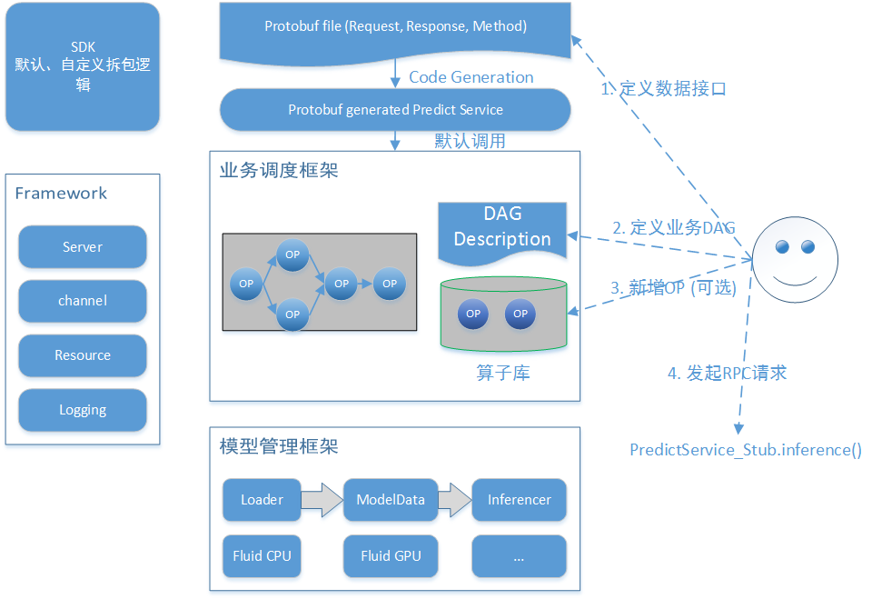

# 概述
PaddlePaddle是公司开源的机器学习框架，广泛支持各种深度学习模型的定制化开发; Paddle serving是Paddle的在线预测部分，与Paddle模型训练环节无缝衔接，提供机器学习预测云服务。

# 框架简介



- 基础框架：屏蔽一个RPC服务所需的所有元素，让用户只关注自己的业务算子的开发；
- 业务框架：基于Protobuf定制请求接口，基于有限DAG定制业务逻辑，并行化调度；
- 模型框架：CPU/FPGA/GPU等硬件异构，多模型间异步优先级调度，新引擎灵活扩展，配置化驱动；
- 用户接口：搭建服务=定义proto文件+实现/复用Op+撰写配置，支持sdk/http请求；

## 主要功能

Paddle serving框架为策略工程师提供以下三层面的功能性扩展：

### 模型
- 预测引擎：集成PaddlePaddle深度学习框架的预测Lib；
- 模型种类：支持Paddle Fluid模型格式；
- 用户接口：支持模型加载、重载的配置化驱动，不同种类模型的预测接口完全一致；
- 模型调度：支持基于异步线程模型的多模型预估调度，实现异构资源的优先级调度；

### 业务
- 预测流程：通过有限DAG图描述一次预测从Request到Response的业务流程，节点Node是一个最小逻辑单元——OP；
- 预测逻辑：框架封装常用预处理、预测计算、后处理等常用OP，用户通过自定义OP算子实现特化处理逻辑；

### 服务

- RPC：底层通过Baidu-rpc封装网络交互，Server端可配置化启动多个独立Service，框架会搜集Service粒度的详细业务指标，并按照BVar接口对接到Noah等监控平台；
- SDK：基于Baidu-rpc的client进行封装，提供多下游连接管理、可扩展路由策略、可定制参数实验、自动分包等机制，支持同步、半同步、纯异步等交互模式，以及多种兼容协议，所有连接策略均通过配置驱动

# 目录结构

```
.
|-- cmake                               # CMake文件
|   |-- external
|   `-- patch
|-- configure                           # Configure模块; Paddle Serving使用Protobuf格式的配置语言
|   |-- include
|   |-- proto
|   |-- src
|   `-- tests
|-- demo-client                         # Client端示例；包括如文本分类、图像分类等任务的例子
|   |-- conf                            # Client示例的conf目录
|   |-- data                            # Client示例的data目录
|   |   \-- images
|   `-- src                             # Client示例的src目录
|-- demo-serving                        # Serving示例。该目录下代码与libpdserving.a联编，产出一个可执行的serving二进制
|   |-- conf                            # Serving示例的Conf目录
|   |-- data                            # Serving示例的data目录
|   |   `-- model
|   |       `-- paddle
|   |           `-- fluid
|   |               |-- SE_ResNeXt50_32x4d
|   |               `-- text_classification_lstm
|   |-- op                              # Serving示例OP
|   |-- proto                           # Serving示例的proto文件
|   `-- scripts
|-- doc                                 # 文档
|-- inferencer-fluid-cpu                # 与PaddlePaddle CPU预测库的接口代码
|   |-- include
|   `-- src
|-- pdcodegen                           # pdcodegen插件；请用此插件编译用户定义的服务接口描述protobuf文件
|   |-- plugin
|   `-- src
|-- predictor                           # Serving端库: libpdserving.a
|   |-- common
|   |-- conf
|   |-- cts
|   |   `-- lib
|   |-- framework
|   |-- mempool
|   |-- op
|   |-- proto
|   |-- scripts
|   |   `-- images
|   |-- src
|   `-- unittest
|-- sdk-cpp                             # Client端库: libpdsdk-cpp.a
|   |-- include
|   |-- plugin
|   |-- proto
|   `-- src
`-- tools                               # CI工具
    `-- codestyle
```

# 文档

[设计文档](doc/DESIGN.md)

[从零开始写一个预测服务](doc/CREATING.md)

[编译安装](doc/INSTALL.md)

[FAQ](doc/FAQ.md)
