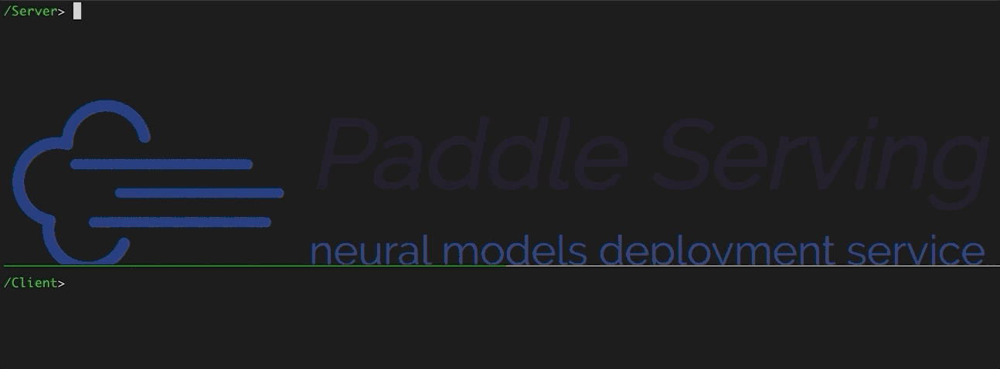

([简体中文](./README_CN.md)|English)

     

     

     
    <a href="https://travis-ci.com/PaddlePaddle/Serving">
        
        
        
        
        
        
        
        
        
    </a>
     

***

The goal of Paddle Serving is to provide high-performance, flexible and easy-to-use industrial-grade online inference services for machine learning developers and enterprises.Paddle Serving supports multiple protocols such as RESTful, gRPC, bRPC, and provides inference solutions under a variety of hardware and multiple operating system environments, and many famous pre-trained model examples.The core features are as follows:

- Integrate high-performance server-side inference engine paddle Inference and mobile-side engine paddle Lite. Models of other machine learning platforms (Caffe/TensorFlow/ONNX/PyTorch) can be migrated to paddle through [x2paddle](https://github.com/PaddlePaddle/X2Paddle).
- There are two frameworks, namely high-performance C++ Serving and high-easy-to-use Python pipeline.The C++ Serving is based on the bRPC network framework to create a high-throughput, low-latency inference service, and its performance indicators are ahead of competing products. The Python pipeline is based on the gRPC/gRPC-Gateway network framework and the Python language to build a highly easy-to-use and high-throughput inference service. How to choose which one please see [Techinical Selection]()
- Support multiple [protocols]() such as HTTP, gRPC, bRPC,  and provide C++, Python, Java language SDK.
- Design and implement a high-performance inference service framework for asynchronous pipelines based on directed acyclic graph (DAG), with features such as multi-model combination, asynchronous scheduling, concurrent inference, dynamic batch, multi-card multi-stream inference, etc.- Adapt to a variety of commonly used computing hardwares, such as x86 (Intel) CPU, ARM CPU, Nvidia GPU, Kunlun XPU, etc.; Integrate acceleration libraries of Intel MKLDNN and  Nvidia TensorRT, and low-precision and quantitative inference.
- Provide a model security deployment solution, including encryption model deployment, and authentication mechanism, HTTPs security gateway, which is used in practice.
- Support cloud deployment, provide a deployment case of Baidu Cloud Intelligent Cloud kubernetes cluster.
- Provide more than 40 classic pre-model deployment examples, such as PaddleOCR, PaddleClas, PaddleDetection, PaddleSeg, PaddleNLP, PaddleRec and other suites, and more models continue to expand.
- Supports distributed deployment of large-scale sparse parameter index models, with features such as multiple tables, multiple shards, multiple copies, local high-frequency cache, etc., and can be deployed on a single machine or clouds.

<h2 align="center">Tutorial</h2>

***

- AIStudio tutorial(Chinese) : [Paddle Serving服务化部署框架](https://www.paddlepaddle.org.cn/tutorials/projectdetail/1555945)

- Video tutorial(Chinese) : [深度学习服务化部署-以互联网应用为例](https://aistudio.baidu.com/aistudio/course/introduce/19084)

    

<h2 align="center">Documentation</h2>

***

> Set up

This chapter guides you through the installation and deployment steps. It is strongly recommended to use Docker to deploy Paddle Serving. If you do not use docker, ignore the docker-related steps. Paddle Serving can be deployed on cloud servers using Kubernetes, running on many commonly hardwares such as ARM CPU, Intel CPU, Nvidia GPU, Kunlun XPU. The latest development kit of the develop branch is compiled and generated every day for developers to use.

- [Install Paddle Serving using docker](doc/Install.md)
- [Build Paddle Serving from Source with Docker](doc/COMPILE.md)
- [Deploy Paddle Serving on Kubernetes](doc/PADDLE_SERVING_ON_KUBERNETES.md)
- [Deploy Paddle Serving with Security gateway](doc/SERVING_AUTH_DOCKER.md)
- [Deploy Paddle Serving on more hardwares](doc/BAIDU_KUNLUN_XPU_SERVING.md)
- [Latest Wheel packages](doc/LATEST_PACKAGES.md)(Update everyday on branch develop)

> Use

The first step is to call the model save interface to generate a model parameter configuration file (.prototxt), which will be used on the client and server. The second step, read the configuration and startup parameters and start the service. According to API documents and your case, the third step is to write client requests based on the SDK, and test the inference service.

- [Quick Start](doc/QuickStart.md)
- [Save a servable model](doc/SAVE.md)
- [Description of configuration and startup parameters](doc/SERVING_CONFIGURE.md)
- [Guide for RESTful/gRPC/bRPC APIs](doc/HTTP_SERVICE_CN.md)
- [Infer on quantizative models](doc/LOW_PRECISION_DEPLOYMENT_CN.md)
- [Data format of classic models](doc/PROCESS_DATA.md)
- [C++ Serving](doc/C++DESIGN_CN) 
  - [Hot loading models](doc/HOT_LOADING_IN_SERVING_CN.md)
  - [A/B Test](doc/ABTEST_IN_PADDLE_SERVING_CN.md)
  - [Analyze and optimize performance]()
- [Python Pipeline](doc/python_server/PIPELINE_SERVING_CN.md)
  - [Analyze and optimize performance]()
- [Client SDK]()
  - [Python SDK](doc/PYTHON_SDK_CN.md)
  - [JAVA SDK](doc/JAVA_SDK.md)
  - [C++ SDK](doc/C++_SDK_CN.md)
- [Large-scale sparse parameter server](doc/CUBE_LOCAL_CN.md)
- [FAQ](doc/FAQ.md)
 

> Developers

For Paddle Serving developers, we provide extended documents such as custom OP, level of detail(LOD) processing and performance indicators.
- [Custom Operators](doc/NEW_OPERATOR.md)
- [Processing LOD Data](doc/LOD_CN.md)
- [Benchmarks(Chinese)](doc/BENCHMARKING_GPU.md)

<h2 align="center">Model Zoo</h2>

***

Paddle Serving works closely with the Paddle model suite, and implements a large number of service deployment examples, including image classification, object detection, language and text recognition, Chinese part of speech, sentiment analysis, content recommendation and other types of examples,  for a total of 42 models.

| PaddleOCR | PaddleDetection | PaddleClas | PaddleSeg | PaddleRec | Paddle NLP | 
| :----:  | :----: | :----: | :----: | :----: | :----: | 
| 8 | 12 | 13 | 2 | 3 | 4 | 

For more model examples, read [Model Library](doc/Model_Zoo_CN.md)

   
  

<h2 align="center">Community</h2>

***

If you want to communicate with developers and other users? Welcome to join us, join the community through the following methods below.

### Wechat
- 微信用户请扫码

### QQ
- 飞桨推理部署交流群(Group No.：696965088)

### Slack

- [Slack channel](https://paddleserving.slack.com/archives/CUBPKHKMJ)

> Contribution

If you want to contribute code to Paddle Serving, please reference [Contribution Guidelines](doc/CONTRIBUTE.md)

- Special Thanks to [@BeyondYourself](https://github.com/BeyondYourself) in complementing the gRPC tutorial, updating the FAQ doc and modifying the mdkir command
- Special Thanks to [@mcl-stone](https://github.com/mcl-stone) in updating faster_rcnn benchmark
- Special Thanks to [@cg82616424](https://github.com/cg82616424) in updating the unet benchmark and modifying resize comment error
- Special Thanks to [@cuicheng01](https://github.com/cuicheng01) for providing 11 PaddleClas models

> Feedback

For any feedback or to report a bug, please propose a [GitHub Issue](https://github.com/PaddlePaddle/Serving/issues).

> License

[Apache 2.0 License](https://github.com/PaddlePaddle/Serving/blob/develop/LICENSE)
