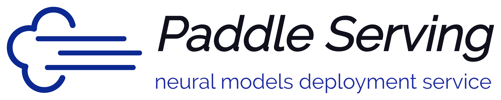

(简体中文|[English](./README.md))

     

     

     
    <a href="https://travis-ci.com/PaddlePaddle/Serving">
        
        
        
        
        
        
        
        
        
    </a>
     

***

Paddle Serving依托深度学习框架PaddlePaddle旨在帮助深度学习开发者和企业提供高性能、灵活易用的工业级在线推理服务。Paddle Serving支持RESTful、gRPC、bRPC等多种协议，提供多种异构硬件和多种操作系统环境下推理解决方案，和多种经典预训练模型示例。核心特性如下：

- 集成高性能服务端推理引擎paddle Inference和移动端引擎paddle Lite，其他机器学习平台（Caffe/TensorFlow/ONNX/PyTorch）可通过[x2paddle](https://github.com/PaddlePaddle/X2Paddle)工具迁移模型
- 具有高性能C++和高易用Python 2套框架。C++框架基于高性能bRPC网络框架打造高吞吐、低延迟的推理服务，性能领先竞品。Python框架基于gRPC/gRPC-Gateway网络框架和Python语言构建高易用、高吞吐推理服务框架。技术选型参考[技术选型](doc/Serving_Design_CN.md#21-设计选型)
- 支持HTTP、gRPC、bRPC等多种[协议](doc/C++_Serving/Inference_Protocols_CN.md)；提供C++、Python、Java语言SDK
- 设计并实现基于有向无环图(DAG)的异步流水线高性能推理框架，具有多模型组合、异步调度、并发推理、动态批量、多卡多流推理、请求缓存等特性
- 适配x86(Intel) CPU、ARM CPU、Nvidia GPU、昆仑XPU、华为昇腾310/910、海光DCU、Nvidia Jetson等多种硬件
- 集成Intel MKLDNN、Nvidia TensorRT加速库，以及低精度和量化推理
- 提供一套模型安全部署解决方案，包括加密模型部署、鉴权校验、HTTPs安全网关，并在实际项目中应用
- 支持云端部署，提供百度云智能云kubernetes集群部署Paddle Serving案例
- 提供丰富的经典模型部署示例，如PaddleOCR、PaddleClas、PaddleDetection、PaddleSeg、PaddleNLP、PaddleRec等套件，共计40+个预训练精品模型
- 支持大规模稀疏参数索引模型分布式部署，具有多表、多分片、多副本、本地高频cache等特性、可单机或云端部署
- 支持服务监控，提供基于普罗米修斯的性能数据统计及端口访问

<h2 align="center">教程与论文</h2>

- AIStudio 使用教程 : [Paddle Serving服务化部署框架](https://www.paddlepaddle.org.cn/tutorials/projectdetail/2538249)
- AIStudio OCR实战 : [基于PaddleServing的OCR服务化部署实战](https://aistudio.baidu.com/aistudio/projectdetail/3630726)
- 视频教程 : [深度学习服务化部署-以互联网应用为例](https://aistudio.baidu.com/aistudio/course/introduce/19084)
- 边缘AI 解决方案 : [基于Paddle Serving&百度智能边缘BIE的边缘AI解决方案](https://mp.weixin.qq.com/s/j0EVlQXaZ7qmoz9Fv96Yrw)

- 论文 : [JiZhi: A Fast and Cost-Effective Model-As-A-Service System for
Web-Scale Online Inference at Baidu](https://arxiv.org/pdf/2106.01674.pdf)
- 论文 : [ERNIE 3.0 TITAN: EXPLORING LARGER-SCALE KNOWLEDGE
ENHANCED PRE-TRAINING FOR LANGUAGE UNDERSTANDING
AND GENERATION](https://arxiv.org/pdf/2112.12731.pdf)

    

<h2 align="center">文档</h2>

> 部署

此章节引导您完成安装和部署步骤，强烈推荐使用Docker部署Paddle Serving，如您不使用docker，省略docker相关步骤。在云服务器上可以使用Kubernetes部署Paddle Serving。在异构硬件如ARM CPU、昆仑XPU上编译或使用Paddle Serving可阅读以下文档。每天编译生成develop分支的最新开发包供开发者使用。
- [使用docker安装Paddle Serving](doc/Install_CN.md)
- [源码编译安装Paddle Serving](doc/Compile_CN.md)
- [在Kuberntes集群上部署Paddle Serving](doc/Run_On_Kubernetes_CN.md)
- [部署Paddle Serving安全网关](doc/Serving_Auth_Docker_CN.md)
- 异构硬件部署[[ARM CPU、百度昆仑](doc/Run_On_XPU_CN.md)、[华为昇腾](doc/Run_On_NPU_CN.md)、[海光DCU](doc/Run_On_DCU_CN.md)、[Jetson](doc/Run_On_JETSON_CN.md)]
- [Docker镜像](doc/Docker_Images_CN.md)
- [下载Wheel包](doc/Latest_Packages_CN.md)

> 使用

安装Paddle Serving后，使用快速开始将引导您运行Serving。第一步，调用模型保存接口，生成模型参数配置文件(.prototxt)用以在客户端和服务端使用；第二步，阅读配置和启动参数并启动服务；第三步，根据API和您的使用场景，基于SDK编写客户端请求，并测试推理服务。您想了解跟多特性的使用场景和方法，请详细阅读以下文档。
- [快速开始](doc/Quick_Start_CN.md)
- [保存用于Paddle Serving的模型和配置](doc/Save_CN.md)
- [配置和启动参数的说明](doc/Serving_Configure_CN.md)
- [RESTful/gRPC/bRPC API指南](doc/C++_Serving/Introduction_CN.md#42-多语言多协议Client)
- [低精度推理](doc/Low_Precision_CN.md)
- [常见模型数据处理](doc/Process_data_CN.md)
- [普罗米修斯](doc/Prometheus_CN.md)
- [C++ Serving简介](doc/C++_Serving/Introduction_CN.md) 
  - [协议](doc/C++_Serving/Inference_Protocols_CN.md)
  - [模型热加载](doc/C++_Serving/Hot_Loading_CN.md)
  - [A/B Test](doc/C++_Serving/ABTest_CN.md)
  - [加密模型推理服务](doc/C++_Serving/Encryption_CN.md)
  - [性能优化指南](doc/C++_Serving/Performance_Tuning_CN.md)
  - [性能指标](doc/C++_Serving/Benchmark_CN.md)
  - [多模型串联](doc/C++_Serving/2+_model.md)
  - [请求缓存](doc/C++_Serving/Request_Cache_CN.md)
- [Python Pipeline设计](doc/Python_Pipeline/Pipeline_Design_CN.md)
  - [性能优化指南](doc/Python_Pipeline/Performance_Tuning_CN.md)
  - [TensorRT动态shape](doc/TensorRT_Dynamic_Shape_CN.md)
  - [性能指标](doc/Python_Pipeline/Benchmark_CN.md)
- 客户端SDK
  - [Python SDK](doc/C++_Serving/Introduction_CN.md#42-多语言多协议Client)
  - [JAVA SDK](doc/Java_SDK_CN.md)
  - [C++ SDK](doc/C++_Serving/Introduction_CN.md#42-多语言多协议Client)
- [大规模稀疏参数索引服务](doc/Cube_Local_CN.md)

> 开发者

为Paddle Serving开发者，提供自定义OP，变长数据处理。
- [自定义OP](doc/C++_Serving/OP_CN.md)
- [变长数据(LoD)处理](doc/LOD_CN.md)
- [常见问答](doc/FAQ_CN.md)

<h2 align="center">模型库</h2>

Paddle Serving与Paddle模型套件紧密配合，实现大量服务化部署，包括图像分类、物体检测、语言文本识别、中文词性、情感分析、内容推荐等多种类型示例，以及Paddle全链条项目，共计45个模型。

| PaddleOCR | PaddleDetection | PaddleClas | PaddleSeg | PaddleRec | Paddle NLP | Paddle Video |
| :----:  | :----: | :----: | :----: | :----: | :----: | :----: | 
| 8 | 12 | 14 | 2 | 3 | 6 | 1 | 

更多模型示例进入[模型库](doc/Model_Zoo_CN.md)

  
  

<h2 align="center">社区</h2>

您想要同开发者和其他用户沟通吗？欢迎加入我们，通过如下方式加入社群

### 微信
- 微信用户请扫码

  

### QQ
- 飞桨推理部署交流群(Group No.：697765514)

  

> 贡献代码

如果您想为Paddle Serving贡献代码，请参考 [Contribution Guidelines(English)](doc/Contribute_EN.md)
- 感谢 [@loveululu](https://github.com/loveululu) 提供 Cube python API
- 感谢 [@EtachGu](https://github.com/EtachGu) 更新 docker 使用命令
- 感谢 [@BeyondYourself](https://github.com/BeyondYourself) 提供grpc教程，更新FAQ教程，整理文件目录。
- 感谢 [@mcl-stone](https://github.com/mcl-stone) 提供faster rcnn benchmark脚本
- 感谢 [@cg82616424](https://github.com/cg82616424) 提供unet benchmark脚本和修改部分注释错误
- 感谢 [@cuicheng01](https://github.com/cuicheng01) 提供PaddleClas的11个模型
- 感谢 [@Jiaqi Liu](https://github.com/LiuChiachi) 新增list[str]类型输入的预测支持
- 感谢 [@Bin Lu](https://github.com/Intsigstephon) 提供PP-Shitu C++模型示例

> 反馈

如有任何反馈或是bug，请在 [GitHub Issue](https://github.com/PaddlePaddle/Serving/issues)提交

> License

[Apache 2.0 License](https://github.com/PaddlePaddle/Serving/blob/develop/LICENSE)
