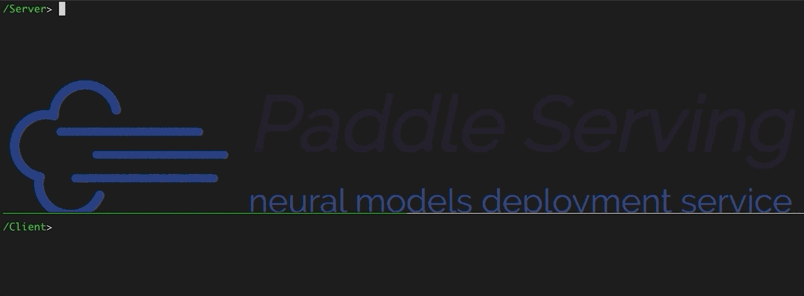
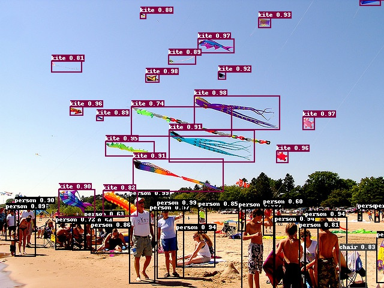

([简体中文](./README_CN.md)|English)

     

     

     
    <a href="https://travis-ci.com/PaddlePaddle/Serving">
        
        
        
        
        
        
        
        
        
    </a>
     

***

The goal of Paddle Serving is to provide high-performance, flexible and easy-to-use industrial-grade online inference services for machine learning developers and enterprises.Paddle Serving supports multiple protocols such as RESTful, gRPC, bRPC, and provides inference solutions under a variety of hardware and multiple operating system environments, and many famous pre-trained model examples. The core features are as follows:

- Integrate high-performance server-side inference engine [Paddle Inference](https://paddleinference.paddlepaddle.org.cn/product_introduction/inference_intro.html) and mobile-side engine [Paddle Lite](https://paddlelite.paddlepaddle.org.cn/introduction/tech_highlights.html). Models of other machine learning platforms (Caffe/TensorFlow/ONNX/PyTorch) can be migrated to paddle through [x2paddle](https://github.com/PaddlePaddle/X2Paddle).
- There are two frameworks, namely high-performance C++ Serving and high-easy-to-use Python pipeline. The C++ Serving is based on the bRPC network framework to create a high-throughput, low-latency inference service, and its performance indicators are ahead of competing products. The Python pipeline is based on the gRPC/gRPC-Gateway network framework and the Python language to build a highly easy-to-use and high-throughput inference service. How to choose which one please see [Techinical Selection](doc/Serving_Design_EN.md#21-design-selection).
- Support multiple [protocols](doc/C++_Serving/Inference_Protocols_CN.md) such as HTTP, gRPC, bRPC, and provide C++, Python, Java language SDK.
- Design and implement a high-performance inference service framework for asynchronous pipelines based on directed acyclic graph (DAG), with features such as multi-model combination, asynchronous scheduling, concurrent inference, dynamic batch, multi-card multi-stream inference, request cache, etc.
- Adapt to a variety of commonly used computing hardwares, such as x86 (Intel) CPU, ARM CPU, Nvidia GPU, Kunlun XPU, HUAWEI Ascend 310/910, HYGON DCU、Nvidia Jetson etc. 
- Integrate acceleration libraries of Intel MKLDNN and  Nvidia TensorRT, and low-precision and quantitative inference.
- Provide a model security deployment solution, including encryption model deployment, and authentication mechanism, HTTPs security gateway, which is used in practice.
- Support cloud deployment, provide a deployment case of Baidu Cloud Intelligent Cloud kubernetes cluster.
- Provide more than 40 classic pre-model deployment examples, such as PaddleOCR, PaddleClas, PaddleDetection, PaddleSeg, PaddleNLP, PaddleRec and other suites, and more models continue to expand.
- Supports distributed deployment of large-scale sparse parameter index models, with features such as multiple tables, multiple shards, multiple copies, local high-frequency cache, etc., and can be deployed on a single machine or clouds.
- Support service monitoring, provide prometheus-based performance statistics and port access

<h2 align="center">Tutorial and Solutions</h2>

- AIStudio tutorial(Chinese) : [Paddle Serving服务化部署框架](https://www.paddlepaddle.org.cn/tutorials/projectdetail/3946013)
- AIStudio OCR practice(Chinese) : [基于PaddleServing的OCR服务化部署实战](https://aistudio.baidu.com/aistudio/projectdetail/3630726)
- Video tutorial(Chinese) : [深度学习服务化部署-以互联网应用为例](https://aistudio.baidu.com/aistudio/course/introduce/19084)
- Edge AI solution(Chinese) : [基于Paddle Serving&百度智能边缘BIE的边缘AI解决方案](https://mp.weixin.qq.com/s/j0EVlQXaZ7qmoz9Fv96Yrw)
- GOVT Q&A Solution(Chinese) : [政务问答检索式 FAQ System](https://github.com/PaddlePaddle/PaddleNLP/tree/develop/applications/question_answering/faq_system)
- Smart Q&A Solution(Chinese) : [保险智能问答](https://github.com/PaddlePaddle/PaddleNLP/tree/develop/applications/question_answering/faq_finance)
- Semantic Indexing Solution(Chinese) : [In-batch Negatives](https://github.com/PaddlePaddle/PaddleNLP/tree/develop/applications/neural_search/recall/in_batch_negative)

<h2 align="center">Papers</h2>

- Paper : [JiZhi: A Fast and Cost-Effective Model-As-A-Service System for
Web-Scale Online Inference at Baidu](https://arxiv.org/pdf/2106.01674.pdf)
- Paper : [ERNIE 3.0 TITAN: EXPLORING LARGER-SCALE KNOWLEDGE
ENHANCED PRE-TRAINING FOR LANGUAGE UNDERSTANDING
AND GENERATION](https://arxiv.org/pdf/2112.12731.pdf)

    

<h2 align="center">Documentation</h2>

> Set up

This chapter guides you through the installation and deployment steps. It is strongly recommended to use Docker to deploy Paddle Serving. If you do not use docker, ignore the docker-related steps. Paddle Serving can be deployed on cloud servers using Kubernetes, running on many commonly hardwares such as ARM CPU, Intel CPU, Nvidia GPU, Kunlun XPU. The latest development kit of the develop branch is compiled and generated every day for developers to use.

- [Install Paddle Serving using docker](doc/Install_EN.md)
- [Build Paddle Serving from Source with Docker](doc/Compile_EN.md)
- [Install Paddle Serving on linux system](doc/Install_Linux_Env_CN.md)
- [Deploy Paddle Serving on Kubernetes(Chinese)](doc/Run_On_Kubernetes_CN.md)
- [Deploy Paddle Serving with Security gateway(Chinese)](doc/Serving_Auth_Docker_CN.md)
- Deploy on more hardwares[[ARM CPU、百度昆仑](doc/Run_On_XPU_EN.md)、[华为昇腾](doc/Run_On_NPU_CN.md)、[海光DCU](doc/Run_On_DCU_CN.md)、[Jetson](doc/Run_On_JETSON_CN.md)]
- [Docker Images](doc/Docker_Images_EN.md)
- [Download Wheel packages](doc/Latest_Packages_EN.md)

> Use

The first step is to call the model save interface to generate a model parameter configuration file (.prototxt), which will be used on the client and server. The second step, read the configuration and startup parameters and start the service. According to API documents and your case, the third step is to write client requests based on the SDK, and test the inference service.

- [Quick Start](doc/Quick_Start_EN.md)
- [Save a servable model](doc/Save_EN.md)
- [Description of configuration and startup parameters](doc/Serving_Configure_EN.md)
- [Guide for RESTful/gRPC/bRPC APIs(Chinese)](doc/C++_Serving/Introduction_CN.md#42-多语言多协议Client)
- [Infer on quantizative models](doc/Low_Precision_EN.md)
- [Data format of classic models(Chinese)](doc/Process_data_CN.md)
- [Prometheus(Chinese)](doc/Prometheus_CN.md)
- [C++ Serving(Chinese)](doc/C++_Serving/Introduction_CN.md) 
  - [Protocols(Chinese)](doc/C++_Serving/Inference_Protocols_CN.md)
  - [Hot loading models](doc/C++_Serving/Hot_Loading_EN.md)
  - [A/B Test](doc/C++_Serving/ABTest_EN.md)
  - [Encryption](doc/C++_Serving/Encryption_EN.md)
  - [Analyze and optimize performance(Chinese)](doc/C++_Serving/Performance_Tuning_CN.md)
  - [Benchmark(Chinese)](doc/C++_Serving/Benchmark_CN.md)
  - [Multiple models in series(Chinese)](doc/C++_Serving/2+_model.md)
  - [Request Cache(Chinese)](doc/C++_Serving/Request_Cache_CN.md)
- [Python Pipeline Overview(Chinese)](doc/Python_Pipeline/Pipeline_Int_CN.md)
  - [Architecture Design(Chinese)](doc/Python_Pipeline/Pipeline_Design_CN.md)
  - [Core Features(Chinese)](doc/Python_Pipeline/Pipeline_Features_CN.md)
  - [Performance Optimization(Chinese)](doc/Python_Pipeline/Pipeline_Optimize_CN.md)
  - [Benchmark(Chinese)](doc/Python_Pipeline/Pipeline_Benchmark_CN.md)
- Client SDK
  - [Python SDK(Chinese)](doc/C++_Serving/Introduction_CN.md#42-多语言多协议Client)
  - [JAVA SDK](doc/Java_SDK_EN.md)
  - [C++ SDK(Chinese)](doc/C++_Serving/Introduction_CN.md#42-多语言多协议Client)
- [Large-scale sparse parameter server](doc/Cube_Local_EN.md)

 

> Developers

For Paddle Serving developers, we provide extended documents such as custom OP, level of detail(LOD) processing.
- [Custom Operators](doc/C++_Serving/OP_EN.md)
- [Processing LoD Data](doc/LOD_EN.md)
- [FAQ(Chinese)](doc/FAQ_CN.md)

<h2 align="center">Model Zoo</h2>

Paddle Serving works closely with the Paddle model suite, and implements a large number of service deployment examples, including image classification, object detection, language and text recognition, Chinese part of speech, sentiment analysis, content recommendation and other types of examples,  for a total of 46 models.

| Image Classification & Recognition | NLP | Recommend | Face Recognition | Object Detection | OCR | Image segmentation | Keypoint Detection | Video|
| :----:  | :----: | :----: | :----: | :----: | :----: | :----: | :----: |  :----: | 
| 14 | 6 | 3 | 1 | 10 | 8 | 2 | 1 | 1 |

For more model examples, read [Model zoo](doc/Model_Zoo_EN.md)

   
  

<h2 align="center">Community</h2>

If you want to communicate with developers and other users? Welcome to join us, join the community through the following methods below.

### Wechat
- WeChat scavenging

  

### QQ
- QQ Group(Group No.：697765514)

  

> Contribution

If you want to contribute code to Paddle Serving, please reference [Contribution Guidelines](doc/Contribute_EN.md)
- Thanks to [@loveululu](https://github.com/loveululu) for providing python API of Cube.
- Thanks to [@EtachGu](https://github.com/EtachGu) in updating run docker codes.
- Thanks to [@BeyondYourself](https://github.com/BeyondYourself) in complementing the gRPC tutorial, updating the FAQ doc and modifying the mdkir command
- Thanks to [@mcl-stone](https://github.com/mcl-stone) in updating faster_rcnn benchmark
- Thanks to [@cg82616424](https://github.com/cg82616424) in updating the unet benchmark  modifying resize comment error
- Thanks to [@cuicheng01](https://github.com/cuicheng01) for providing 11 PaddleClas models
- Thanks to [@Jiaqi Liu](https://github.com/LiuChiachi) for supporting prediction for string list input
- Thanks to [@Bin Lu](https://github.com/Intsigstephon) for adding pp-shitu example

> Feedback

For any feedback or to report a bug, please propose a [GitHub Issue](https://github.com/PaddlePaddle/Serving/issues).

> License

[Apache 2.0 License](https://github.com/PaddlePaddle/Serving/blob/develop/LICENSE)
