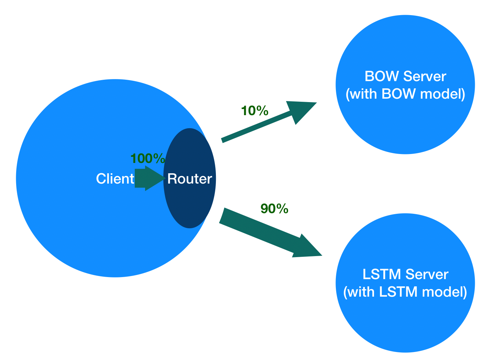

# ABTEST in Paddle Serving

([简体中文](./ABTEST_IN_PADDLE_SERVING_CN.md)|English)

This document will use an example of text classification task based on IMDB dataset to show how to build a A/B Test framework using Paddle Serving. The structure relationship between the client and servers in the example is shown in the figure below.



Note that:  A/B Test is only applicable to RPC mode, not web mode.

### Download Data and Models

```shell
cd Serving/python/examples/imdb
sh get_data.sh
```

### Processing Data
Data processing needs to use the relevant library, please use pip to install
``` shell
pip install paddlepaddle
pip install paddle-serving-app
pip install Shapely
````

You can directly run the following command to process the data.

[python abtest_get_data.py](../python/examples/imdb/abtest_get_data.py)

The Python code in the file will process the data `test_data/part-0` and write to the `processed.data` file.

### Start Server

Here, we [use docker](RUN_IN_DOCKER.md) to start the server-side service. 

First, start the BOW server, which enables the `8000` port:

``` shell
docker run -dit -v $PWD/imdb_bow_model:/model -p 8000:8000 --name bow-server registry.baidubce.com/paddlepaddle/serving:latest /bin/bash
docker exec -it bow-server /bin/bash
pip install paddle-serving-server -i https://pypi.tuna.tsinghua.edu.cn/simple
pip install paddle-serving-client -i https://pypi.tuna.tsinghua.edu.cn/simple
python -m paddle_serving_server.serve --model model --port 8000 >std.log 2>err.log &
exit
```

Similarly, start the LSTM server, which enables the `9000` port:

```bash
docker run -dit -v $PWD/imdb_lstm_model:/model -p 9000:9000 --name lstm-server registry.baidubce.com/paddlepaddle/serving:latest /bin/bash
docker exec -it lstm-server /bin/bash
pip install paddle-serving-server -i https://pypi.tuna.tsinghua.edu.cn/simple
pip install paddle-serving-client -i https://pypi.tuna.tsinghua.edu.cn/simple
python -m paddle_serving_server.serve --model model --port 9000 >std.log 2>err.log &
exit
```

### Start Client

In order to simulate abtest condition, you can run the following Python code on the host to start the client, but you need to ensure that the host has the relevant environment, you can also run in the docker environment.

Before running, use `pip install paddle-serving-client` to install the paddle-serving-client package.

You can directly use the following command to make abtest prediction.

[python abtest_client.py](../python/examples/imdb/abtest_client.py)

[//file]:#abtest_client.py
``` python
from paddle_serving_client import Client

client = Client()
client.load_client_config('imdb_bow_client_conf/serving_client_conf.prototxt')
client.add_variant("bow", ["127.0.0.1:8000"], 10)
client.add_variant("lstm", ["127.0.0.1:9000"], 90)
client.connect()

with open('processed.data') as f:
    cnt = {"bow": {'acc': 0, 'total': 0}, "lstm": {'acc': 0, 'total': 0}}
    for line in f:
        word_ids, label = line.split(';')
        word_ids = [int(x) for x in word_ids.split(',')]
        feed = {"words": word_ids}
        fetch = ["acc", "cost", "prediction"]
        [fetch_map, tag] = client.predict(feed=feed, fetch=fetch, need_variant_tag=True)
        if (float(fetch_map["prediction"][0][1]) - 0.5) * (float(label[0]) - 0.5) > 0:
            cnt[tag]['acc'] += 1
        cnt[tag]['total'] += 1

    for tag, data in cnt.items():
        print('[{}](total: {}) acc: {}'.format(tag, data['total'], float(data['acc']) / float(data['total'])))
```

In the code, the function `client.add_variant(tag, clusters, variant_weight)` is to add a variant with label `tag` and flow weight `variant_weight`. In this example, a BOW variant with label of `bow` and flow weight of `10`, and an LSTM variant with label of `lstm` and a flow weight of `90` are added. The flow on the client side will be distributed to two variants according to the ratio of `10:90`.

When making prediction on the client side, if the parameter `need_variant_tag=True` is specified, the response will contain the variant tag corresponding to the distribution flow.

### Expected Results
Due to different network conditions, the results of each prediction may be slightly different.
``` python
[lstm](total: 1867) acc: 0.490091055169
[bow](total: 217) acc: 0.73732718894
```

<!--
cp ../Serving/python/examples/imdb/get_data.sh .
cp ../Serving/python/examples/imdb/imdb_reader.py .
pip install -U paddle_serving_server
pip install -U paddle_serving_client
pip install -U paddlepaddle
sh get_data.sh
python process.py
python -m paddle_serving_server.serve --model imdb_bow_model --port 8000 --workdir workdir1 &
sleep 5
python -m paddle_serving_server.serve --model imdb_lstm_model --port 9000  --workdir workdir2 &
sleep 5
python ab_client.py >log.txt
if [[ $? -eq 0 ]]; then
    echo "test success"
else
    echo "test fail"
fi
ps -ef | grep "paddle_serving_server" | grep -v grep | awk '{print $2}' | xargs kill
-->
