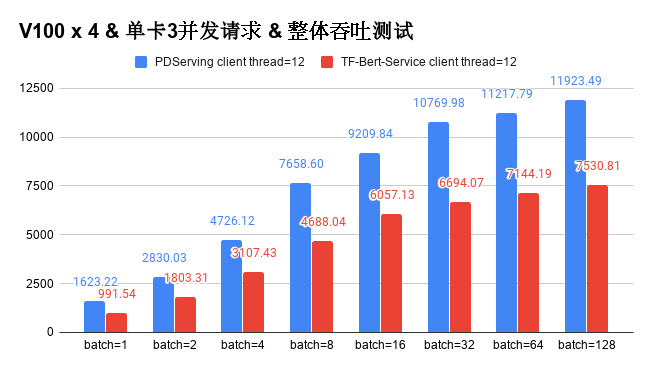

## Build Bert-As-Service in 10 minutes

([简体中文](./BERT_10_MINS_CN.md)|English)

The goal of Bert-As-Service is to give a sentence, and the service can represent the sentence as a semantic vector and return it to the user. [Bert model](https://arxiv.org/abs/1810.04805) is a popular model in the current NLP field. It has achieved good results on a variety of public NLP tasks. The semantic vector calculated by the Bert model is used as input to other NLP models, which will also greatly improve the performance of the model. Bert-As-Service allows users to easily obtain the semantic vector representation of text and apply it to their own tasks. In order to achieve this goal, we have shown in four steps that using Paddle Serving can build such a service in ten minutes. All the code and files in the example can be found in [Example](https://github.com/PaddlePaddle/Serving/tree/develop/python/examples/bert) of Paddle Serving.

#### Step1: Save the serviceable model

Paddle Serving supports various models trained based on Paddle, and saves the serviceable model by specifying the input and output variables of the model. For convenience, we can load a trained bert Chinese model from paddlehub and save a deployable service with two lines of code. The server and client configurations are placed in the `bert_seq20_model` and` bert_seq20_client` folders, respectively.

[//file]:#bert_10.py
``` python
import paddlehub as hub
model_name = "bert_chinese_L-12_H-768_A-12"
module = hub.Module(model_name)
inputs, outputs, program = module.context(
    trainable=True, max_seq_len=20)
feed_keys = ["input_ids", "position_ids", "segment_ids",
             "input_mask"]
fetch_keys = ["pooled_output", "sequence_output"]
feed_dict = dict(zip(feed_keys, [inputs[x] for x in feed_keys]))
fetch_dict = dict(zip(fetch_keys, [outputs[x] for x in fetch_keys]))

import paddle_serving_client.io as serving_io
serving_io.save_model("bert_seq20_model", "bert_seq20_client",
                      feed_dict, fetch_dict, program)
```

#### Step2: Launch Service

[//file]:#server.sh
``` shell
python -m paddle_serving_server_gpu.serve --model bert_seq20_model --thread 10 --port 9292 --gpu_ids 0
```
| Parameters | Meaning                                  |
| ---------- | ---------------------------------------- |
| model      | server configuration and model file path |
| thread     | server-side threads                      |
| port       | server port number                       |
| gpu_ids    | GPU index number                         |

#### Step3: data preprocessing logic on Client Side

Paddle Serving has many built-in corresponding data preprocessing logics. For the calculation of Chinese Bert semantic representation, we use the ChineseBertReader class under paddle_serving_app for data preprocessing. Model input fields  of multiple models corresponding to a raw Chinese sentence can be easily fetched by developers

Install paddle_serving_app

[//file]:#pip_app.sh
```shell
pip install paddle_serving_app
```

#### Step4: Client Visit Serving

the script of client side bert_client.py is as follow:

[//file]:#bert_client.py
``` python
import os
import sys
from paddle_serving_client import Client
from paddle_serving_app.reader import ChineseBertReader

reader = ChineseBertReader()
fetch = ["pooled_output"]
endpoint_list = ["127.0.0.1:9292"]
client = Client()
client.load_client_config("bert_seq20_client/serving_client_conf.prototxt")
client.connect(endpoint_list)

for line in sys.stdin:
    feed_dict = reader.process(line)
    result = client.predict(feed=feed_dict, fetch=fetch)
```

run

[//file]:#bert_10_cli.sh
```shell
cat data.txt | python bert_client.py
```

read samples from data.txt, print results at the standard output.

### Benchmark

We tested the performance of Bert-As-Service based on Padde Serving based on V100 and compared it with the Bert-As-Service based on Tensorflow. From the perspective of user configuration, we used the same batch size and concurrent number for stress testing. The overall throughput performance data obtained under 4 V100s is as follows.



<!--
yum install -y libXext libSM libXrender
pip install paddlehub paddle_serving_server paddle_serving_client
sh pip_app.sh
python bert_10.py
sh server.sh &
wget https://paddle-serving.bj.bcebos.com/bert_example/data-c.txt --no-check-certificate
head -n 500 data-c.txt > data.txt
cat data.txt | python bert_client.py
if [[ $? -eq 0 ]]; then
    echo "test success"
else
    echo "test fail"
fi
ps -ef | grep "paddle_serving_server" | grep -v grep | awk '{print $2}' | xargs kill
-->
