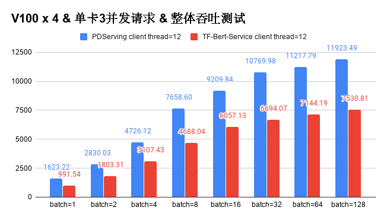

## 十分钟构建Bert-As-Service

(简体中文|[English](./BERT_10_MINS.md))

Bert-As-Service的目标是给定一个句子，服务可以将句子表示成一个语义向量返回给用户。[Bert模型](https://arxiv.org/abs/1810.04805)是目前NLP领域的热门模型，在多种公开的NLP任务上都取得了很好的效果，使用Bert模型计算出的语义向量来做其他NLP模型的输入对提升模型的表现也有很大的帮助。Bert-As-Service可以让用户很方便地获取文本的语义向量表示并应用到自己的任务中。为了实现这个目标，我们通过以下几个步骤说明使用Paddle Serving在十分钟内就可以搭建一个这样的服务。示例中所有的代码和文件均可以在Paddle Serving的[示例](https://github.com/PaddlePaddle/Serving/tree/develop/python/examples/bert)中找到。


若使用python的版本为3.X, 将以下命令中的pip 替换为pip3, python替换为python3.


### Step1：获取模型
#### 方法1：
示例中采用[Paddlehub](https://github.com/PaddlePaddle/PaddleHub)中的[BERT中文模型](https://www.paddlepaddle.org.cn/hubdetail?name=bert_chinese_L-12_H-768_A-12&en_category=SemanticModel)。
请先安装paddlehub
```
pip install paddlehub
```
执行
```
python prepare_model.py 128
```
参数128表示BERT模型中的max_seq_len，即预处理后的样本长度。
生成server端配置文件与模型文件，存放在bert_seq128_model文件夹。
生成client端配置文件，存放在bert_seq128_client文件夹。

#### 方法2：
您也可以从bos上直接下载上述模型（max_seq_len=128），解压后server端配置文件与模型文件存放在bert_chinese_L-12_H-768_A-12_model文件夹，client端配置文件存放在bert_chinese_L-12_H-768_A-12_client文件夹：
```shell
wget https://paddle-serving.bj.bcebos.com/paddle_hub_models/text/SemanticModel/bert_chinese_L-12_H-768_A-12.tar.gz
tar -xzf bert_chinese_L-12_H-768_A-12.tar.gz
mv bert_chinese_L-12_H-768_A-12_model bert_seq128_model
mv bert_chinese_L-12_H-768_A-12_client bert_seq128_client
```


### Step2：获取词典和样例数据

```
sh get_data.sh
```
脚本将下载中文词典vocab.txt和中文样例数据data-c.txt


### Step3：启动服务

启动cpu预测服务，执行
```
python -m paddle_serving_server.serve --model bert_seq128_model/ --port 9292  #启动cpu预测服务

```
或者，启动gpu预测服务，执行
```
python -m paddle_serving_server.serve --model bert_seq128_model/ --port 9292 --gpu_ids 0 #在gpu 0上启动gpu预测服务

```

| 参数    | 含义                       |
| ------- | -------------------------- |
| model   | server端配置与模型文件路径 |
| thread  | server端线程数             |
| port    | server端端口号             |
| gpu_ids | GPU索引号                  |


### Step4：客户端数据预处理逻辑

Paddle Serving内建了很多经典典型对应的数据预处理逻辑，对于中文Bert语义表示的计算，我们采用paddle_serving_app下的ChineseBertReader类进行数据预处理，开发者可以很容易获得一个原始的中文句子对应的多个模型输入字段。

安装paddle_serving_app

```shell
pip install paddle_serving_app
```

### Step5：客户端访问

#### 方法1：通过RPC方式执行预测
执行
```
head data-c.txt | python bert_client.py --model bert_seq128_client/serving_client_conf.prototxt

```
启动client读取data-c.txt中的数据进行预测，预测结果为文本的向量表示（由于数据较多，脚本中没有将输出进行打印），server端的地址在脚本中修改。


#### 方法2：通过HTTP方式执行预测
该方式分为两步
1、启动一个HTTP预测服务端。

启动cpu HTTP预测服务，执行
```
python bert_web_service.py bert_seq128_model/ 9292 #启动CPU预测服务

```

或者，启动gpu HTTP预测服务，执行
```
 export CUDA_VISIBLE_DEVICES=0,1
```
通过环境变量指定gpu预测服务使用的gpu，示例中指定索引为0和1的两块gpu
```
python bert_web_service_gpu.py bert_seq128_model/ 9292 #启动gpu预测服务
```

2、通过HTTP请求执行预测。
```
curl -H "Content-Type:application/json" -X POST -d '{"feed":[{"words": "hello"}], "fetch":["pooled_output"]}' http://127.0.0.1:9292/bert/prediction
```

### 性能测试

我们基于V100对基于Padde Serving研发的Bert-As-Service的性能进行测试并与基于Tensorflow实现的Bert-As-Service进行对比，从用户配置的角度，采用相同的batch size和并发数进行压力测试，得到4块V100下的整体吞吐性能数据如下。


