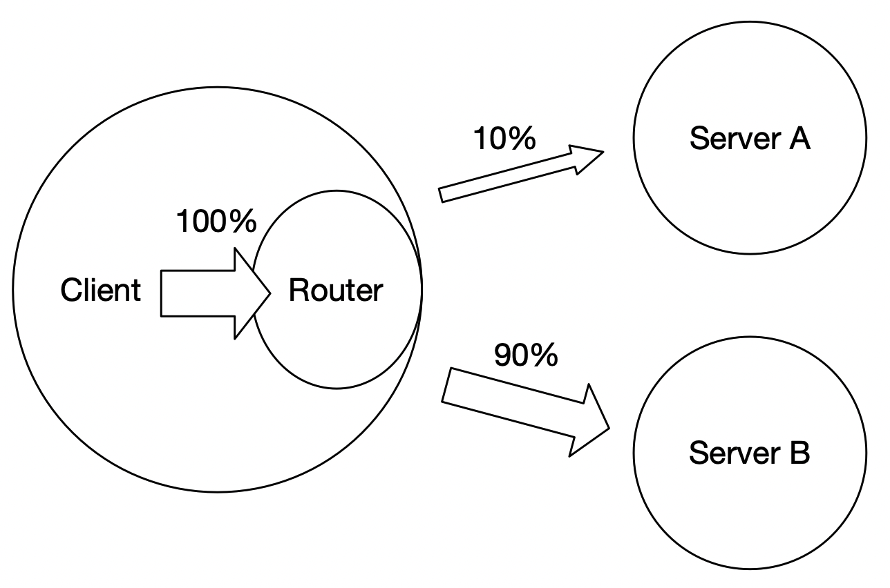

# C++ Serving ABTest

- [功能设计](#1)
- [使用案例](#2)
  - [1.1 安装 Paddle Serving Wheels](#2.1)
  - [1.2 下载多个模型并保存模型参数](#2.2)
  - [1.3 启动 A，B，C 3个服务](#2.3)
  - [1.4 客户端注册 A，B，C 服务端地址](#2.4)
  - [1.5 启动客户端并验证结果](#2.5)

ABTest 是一种功能测试方案，一般是为同一个产品目标制定多种方案，让一部分用户使用 A 方案，另一部分用户使用 B 或 C 方案，根据测试效果，如点击率、转化率等来评价方案的优劣。

模型服务化部署框架中，ABTest 属于一个重要的基础功能，为模型迭代升级提供实验环境。Paddle Serving 的 PYTHON SDK 中实现 ABTest 功能，为用户提供简单易用功能测试环境。

<a name="1"></a>

## 功能设计

Paddle Serving 的 ABTest 功能是基于 PYTHON SDK 和 多个服务端构成。每个服务端加载不同模型，在客户端上注册多个服务端地址和访问比例，最终确定访问。

<div align=center>

</div

<a name="2"></a>

## 使用案例

以 [imdb](https://github.com/PaddlePaddle/Serving/tree/develop/examples/C%2B%2B/imdb) 示例为例，介绍 ABTest 的使用，部署有5个步骤：

1. 安装 Paddle Serving Wheels
2. 下载多个模型并保存模型参数
3. 启动 A，B，C 3个服务
4. 客户端注册 A，B，C 服务端地址
5. 启动客户端并验证结果

<a name="2.1"></a>

**一.安装 Paddle Serving Wheels**

使用 ABTest 功能的前提是使用 PYTHON SDK，因此需要安装 `paddle_serving_client` 的 wheel 包。[安装方法](../Docker_Images_CN.md) 如下：

```
pip3 install paddle-serving-client==0.8.3 -i https://pypi.tuna.tsinghua.edu.cn/simple
```

<a name="2.2"></a>

**二.下载多个模型并保存模型参数**

本示例已提供了一键下载脚本 `sh get_data.sh`，下载自训练的模型 `bow`、`cnn`和`lstm` 3种不同方式训练的模型。 

```
sh get_data.sh
```

3种模型的所有文件如下所示，已为用户提前保存模型参数，无需执行保存操作。
```
├── imdb_bow_client_conf
│   ├── serving_client_conf.prototxt
│   └── serving_client_conf.stream.prototxt
├── imdb_bow_model
│   ├── embedding_0.w_0
│   ├── fc_0.b_0
│   ├── fc_0.w_0
│   ├── fc_1.b_0
│   ├── fc_1.w_0
│   ├── fc_2.b_0
│   ├── fc_2.w_0
│   ├── fluid_time_file
│   ├── __model__
│   ├── serving_server_conf.prototxt
│   └── serving_server_conf.stream.prototxt
├── imdb_cnn_client_conf
│   ├── serving_client_conf.prototxt
│   └── serving_client_conf.stream.prototxt
├── imdb_cnn_model
│   ├── embedding_0.w_0
│   ├── fc_0.b_0
│   ├── fc_0.w_0
│   ├── fc_1.b_0
│   ├── fc_1.w_0
│   ├── fluid_time_file
│   ├── __model__
│   ├── sequence_conv_0.b_0
│   ├── sequence_conv_0.w_0
│   ├── serving_server_conf.prototxt
│   └── serving_server_conf.stream.prototxt
├── imdb_lstm_client_conf
│   ├── serving_client_conf.prototxt
│   └── serving_client_conf.stream.prototxt
├── imdb_lstm_model
│   ├── embedding_0.w_0
│   ├── fc_0.b_0
│   ├── fc_0.w_0
│   ├── fc_1.b_0
│   ├── fc_1.w_0
│   ├── fc_2.b_0
│   ├── fc_2.w_0
│   ├── lstm_0.b_0
│   ├── lstm_0.w_0
│   ├── __model__
│   ├── serving_server_conf.prototxt
│   └── serving_server_conf.stream.prototxt
```

虽然3个模型的网络结构不同，但是 `feed var` 和 `fetch_var` 都是相同的便于做 ABTest。
```
feed_var {
  name: "words"
  alias_name: "words"
  is_lod_tensor: true
  feed_type: 0
  shape: -1
}
fetch_var {
  name: "fc_2.tmp_2"
  alias_name: "prediction"
  is_lod_tensor: false
  fetch_type: 1
  shape: 2
}
```

<a name="2.3"></a>

**三.启动 A，B，C 3个服务**

后台启动 `bow`、`cnn` 和 `lstm` 模型服务:

```python
## 启动 bow 模型服务
python3 -m paddle_serving_server.serve --model imdb_bow_model/ --port 9297 >/dev/null 2>&1 &

## 启动 cnn 模型服务
python3 -m paddle_serving_server.serve --model imdb_cnn_model/ --port 9298  >/dev/null 2>&1 &

## 启动 lstm 模型服务
python3 -m paddle_serving_server.serve --model imdb_lstm_model/ --port 9299 >/dev/null 2>&1 &
```

<a name="2.4"></a>

**四.客户端注册 A，B，C 服务端地址**

使用 `paddle_serving_client` 中 `Client::add_variant(self, tag, cluster, variant_weight)` 接口注册服务标签、服务地址和权重。框架会将所有权重求和后计算每个服务的比例。本示例中，bow 服务的权重是10，cnn 服务的权重是30, lstm的权重是60，每次请求分别请求到3个服务的比例是10%、30%和60%。

```
from paddle_serving_client import Client
from paddle_serving_app.reader.imdb_reader import IMDBDataset
import sys
import numpy as np

client = Client()
client.load_client_config(sys.argv[1])
client.add_variant("bow", ["127.0.0.1:9297"], 10)
client.add_variant("cnn", ["127.0.0.1:9298"], 30)
client.add_variant("lstm", ["127.0.0.1:9299"], 60)
client.connect()
```
如要在结果中打印请求到了哪个服务，在 `client.predict(feed, fetch, batch, need_variant_tag, logid)` 中设置 `need_variant_tag=True`。

<a name="2.5"></a>

**五.启动客户端并验证结果**

运行命令:
```
head test_data/part-0 | python3.7 abtest_client.py imdb_cnn_client_conf/serving_client_conf.prototxt imdb.vocab
```

运行结果如下，10次请求中，bow 服务2次，cnn 服务3次，lstm 服务5次，与设置的比例基本相近。
```
I0506 04:02:46.720135 44567 naming_service_thread.cpp:202] brpc::policy::ListNamingService("127.0.0.1:9297"): added 1
I0506 04:02:46.722630 44567 naming_service_thread.cpp:202] brpc::policy::ListNamingService("127.0.0.1:9298"): added 1
I0506 04:02:46.723577 44567 naming_service_thread.cpp:202] brpc::policy::ListNamingService("127.0.0.1:9299"): added 1
I0506 04:02:46.814075 44567 general_model.cpp:490] [client]logid=0,client_cost=9.889ms,server_cost=6.283ms.
server_tag=lstm prediction=[0.500398   0.49960205]
I0506 04:02:46.826339 44567 general_model.cpp:490] [client]logid=0,client_cost=10.261ms,server_cost=9.503ms.
server_tag=lstm prediction=[0.5007235  0.49927652]
I0506 04:02:46.828992 44567 general_model.cpp:490] [client]logid=0,client_cost=1.667ms,server_cost=0.741ms.
server_tag=bow prediction=[0.25859657 0.74140346]
I0506 04:02:46.843299 44567 general_model.cpp:490] [client]logid=0,client_cost=13.402ms,server_cost=12.827ms.
server_tag=lstm prediction=[0.50039905 0.4996009 ]
I0506 04:02:46.850219 44567 general_model.cpp:490] [client]logid=0,client_cost=5.129ms,server_cost=4.332ms.
server_tag=cnn prediction=[0.6369219  0.36307803]
I0506 04:02:46.854203 44567 general_model.cpp:490] [client]logid=0,client_cost=2.804ms,server_cost=0.782ms.
server_tag=bow prediction=[0.15088597 0.849114  ]
I0506 04:02:46.858268 44567 general_model.cpp:490] [client]logid=0,client_cost=3.292ms,server_cost=2.677ms.
server_tag=cnn prediction=[0.4608788 0.5391212]
I0506 04:02:46.869217 44567 general_model.cpp:490] [client]logid=0,client_cost=10.13ms,server_cost=9.556ms.
server_tag=lstm prediction=[0.5000269  0.49997318]
I0506 04:02:46.883790 44567 general_model.cpp:490] [client]logid=0,client_cost=13.312ms,server_cost=12.822ms.
server_tag=lstm prediction=[0.50083774 0.49916226]
I0506 04:02:46.887256 44567 general_model.cpp:490] [client]logid=0,client_cost=2.432ms,server_cost=1.812ms.
server_tag=cnn prediction=[0.47895813 0.52104187]

```
