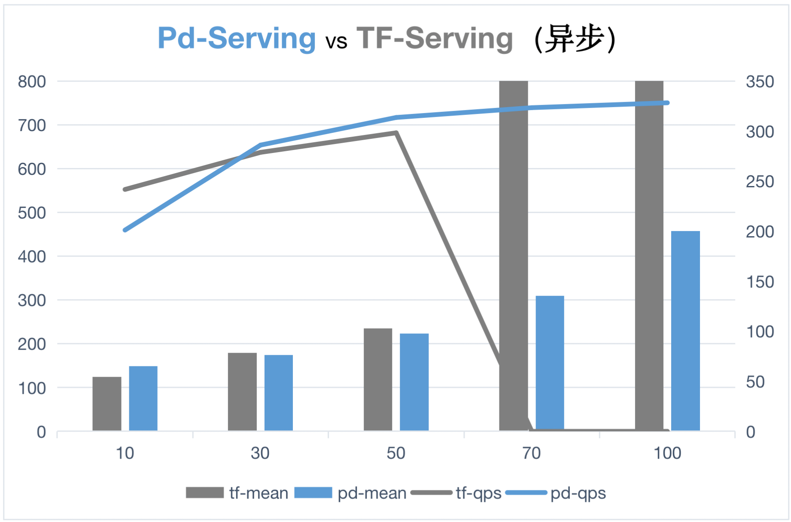

# C++ Serving vs TensorFlow Serving 性能对比
# 1. 测试环境和说明
1) GPU型号：Tesla P4(7611 Mib)
2) Cuda版本：11.0
3) 模型：ResNet_v2_50
4) 为了测试异步合并batch的效果，测试数据中batch=1
5) [使用的测试代码和使用的数据集](../../examples/C++/PaddleClas/resnet_v2_50)
6) 下图中蓝色是C++ Serving，灰色为TF-Serving。
7) 折线图为QPS，数值越大表示每秒钟处理的请求数量越大，性能就越好。
8) 柱状图为平均处理时延，数值越大表示单个请求处理时间越长，性能就越差。

# 2. 同步模式
均使用同步模式，默认参数配置。

可以看出同步模型默认参数配置情况下，C++Serving QPS和平均时延指标均优于TF-Serving。

     

     

|client_num |	model_name |	qps(samples/s) |	mean(ms) |	model_name |	qps(samples/s) |	mean(ms) |
| --- | --- | --- | --- | --- | --- | --- |
| 10 |	pd-serving |	111.336 |	89.787|	tf-serving|	84.632|	118.13|
|30	|pd-serving	|165.928	|180.761	|tf-serving	|106.572	|281.473|
|50|	pd-serving|	207.244|	241.211|	tf-serving|	80.002	|624.959|
|70	|pd-serving	|214.769	|325.894	|tf-serving	|105.17	|665.561|
|100|	pd-serving|	235.405|	424.759|	tf-serving|	93.664	|1067.619|
|150	|pd-serving	|239.114	|627.279	|tf-serving	|86.312	|1737.848|

# 3. 异步模式
均使用异步模式，最大batch=32，异步线程数=2。

可以看出异步模式情况下，两者性能接近，但当Client端并发数达到70的时候，TF-Serving服务直接超时，而C++Serving能够正常返回结果。

同时，对比同步和异步模式可以看出，异步模式在请求batch数较小时，通过合并batch能够有效提高QPS和平均处理时延。

     

     

|client_num |	model_name |	qps(samples/s) |	mean(ms) |	model_name |	qps(samples/s) |	mean(ms) |
| --- | --- | --- | --- | --- | --- | --- |
|10|	pd-serving|	130.631|	76.502|	tf-serving	|172.64	|57.916|
|30|	pd-serving|	201.062|	149.168|	tf-serving|	241.669|	124.128|
|50|	pd-serving|	286.01|	174.764|	tf-serving	|278.744	|179.367|
|70|	pd-serving|	313.58|	223.187|	tf-serving|	298.241|	234.7|
|100|	pd-serving|	323.369|	309.208|	tf-serving|	0|	∞|
|150|	pd-serving|	328.248|	456.933|	tf-serving|	0|	∞|
