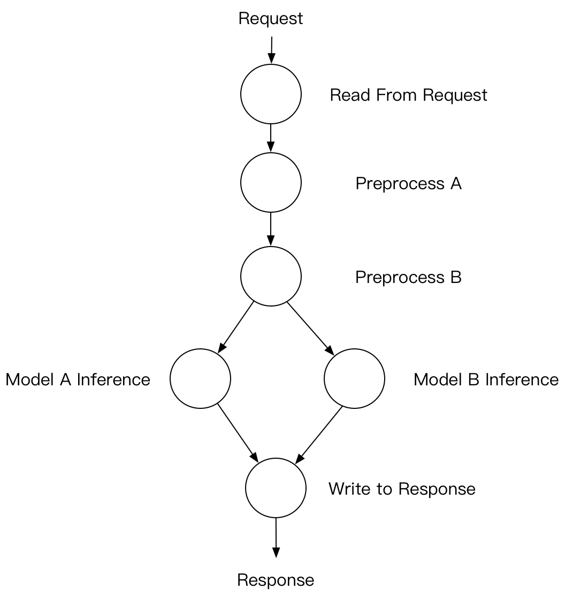
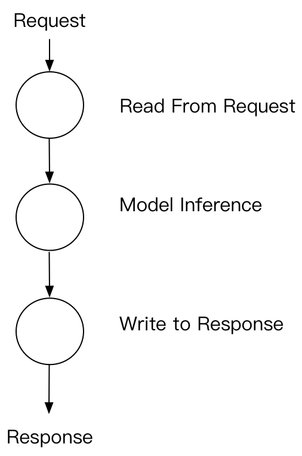
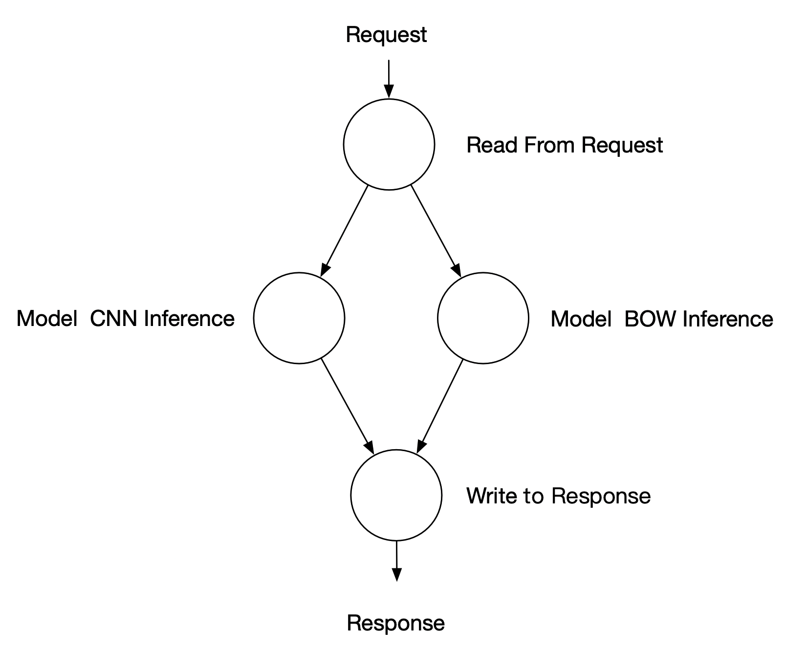

# Server端的计算图

(简体中文|[English](./DAG_EN.md))

本文档显示了Server端上计算图的概念。 如何使用PaddleServing内置运算符定义计算图。 还显示了一些顺序执行逻辑的示例。

## Server端的计算图

深度神经网络通常在输入数据上有一些预处理步骤，而在模型推断分数上有一些后处理步骤。 由于深度学习框架现在非常灵活，因此可以在训练计算图之外进行预处理和后处理。 如果要在服务器端进行输入数据预处理和推理结果后处理，则必须在服务器上添加相应的计算逻辑。 此外，如果用户想在多个模型上使用相同的输入进行推理，则最好的方法是在仅提供一个客户端请求的情况下在服务器端同时进行推理，这样我们可以节省一些网络计算开销。 由于以上两个原因，自然而然地将有向无环图（DAG）视为服务器推理的主要计算方法。 DAG的一个示例如下：

<center>

</center>

## 如何定义节点

### 简单的串联结构

PaddleServing在框架中具有一些预定义的计算节点。 一种非常常用的计算图是简单的reader-infer-response模式，可以涵盖大多数单一模型推理方案。 示例图如下所示。

<center>

</center>

通过`Python API 启动Server`相应的DAG定义代码如下（`python/paddle_serving_server/serve.py`）。

``` python
import paddle_serving_server as serving
from paddle_serving_server import OpMaker
from paddle_serving_server import OpSeqMaker

op_maker = serving.OpMaker()
read_op = op_maker.create('GeneralReaderOp')
general_infer_op = op_maker.create('GeneralInferOp')
general_response_op = op_maker.create('GeneralResponseOp')

op_seq_maker = serving.OpSeqMaker()
op_seq_maker.add_op(read_op)
op_seq_maker.add_op(general_infer_op)
op_seq_maker.add_op(general_response_op)
```

如果使用`命令行 + 配置文件的方式启动C++Server`只需[修改配置文件](../Serving_Configure_CN.md)即可,无须修改👆的代码。


对于简单的串联逻辑，我们将其简化为`Sequence`，使用`OpSeqMaker`进行构建。用户可以不指定每个节点的前继，默认按加入`OpSeqMaker`的顺序来确定前继。

由于该代码在大多数情况下都会被使用，并且用户不必更改代码，因此PaddleServing会发布一个易于使用的启动命令来启动服务。 示例如下：

``` python
python -m paddle_serving_server.serve --model uci_housing_model --thread 10 --port 9292
```

### 包含多个输入的节点

在[Paddle Serving中的集成预测](./Model_Ensemble_CN.md)文档中给出了一个包含多个输入节点的样例，示意图和代码如下。

<center>

</center>

```python
from paddle_serving_server import OpMaker
from paddle_serving_server import OpGraphMaker
from paddle_serving_server import Server

op_maker = OpMaker()
read_op = op_maker.create('GeneralReaderOp')
cnn_infer_op = op_maker.create(
    'GeneralInferOp', engine_name='cnn', inputs=[read_op])
bow_infer_op = op_maker.create(
    'GeneralInferOp', engine_name='bow', inputs=[read_op])
response_op = op_maker.create(
    'GeneralResponseOp', inputs=[cnn_infer_op, bow_infer_op])

op_graph_maker = OpGraphMaker()
op_graph_maker.add_op(read_op)
op_graph_maker.add_op(cnn_infer_op)
op_graph_maker.add_op(bow_infer_op)
op_graph_maker.add_op(response_op)
```

对于含有多输入节点的计算图，需要使用`OpGraphMaker`来构建，同时必须给出每个节点的前继。

## 更多示例

如果用户将稀疏特征作为输入，并且模型将对每个特征进行嵌入查找，则我们可以进行分布式嵌入查找操作，该操作不在Paddle训练计算图中。 示例如下：

``` python
import paddle_serving_server as serving
from paddle_serving_server import OpMaker
from paddle_serving_server import OpSeqMaker

op_maker = serving.OpMaker()
read_op = op_maker.create('GeneralReaderOp')
dist_kv_op = op_maker.create('GeneralDistKVInferOp')
general_infer_op = op_maker.create('GeneralInferOp')
general_response_op = op_maker.create('GeneralResponseOp')

op_seq_maker = serving.OpSeqMaker()
op_seq_maker.add_op(read_op)
op_seq_maker.add_op(dist_kv_op)
op_seq_maker.add_op(general_infer_op)
op_seq_maker.add_op(general_response_op)
```
