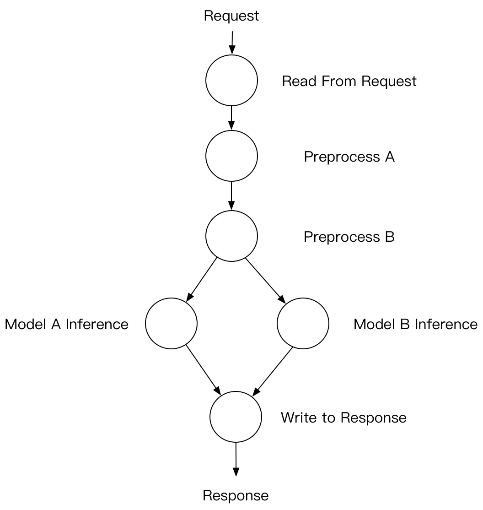
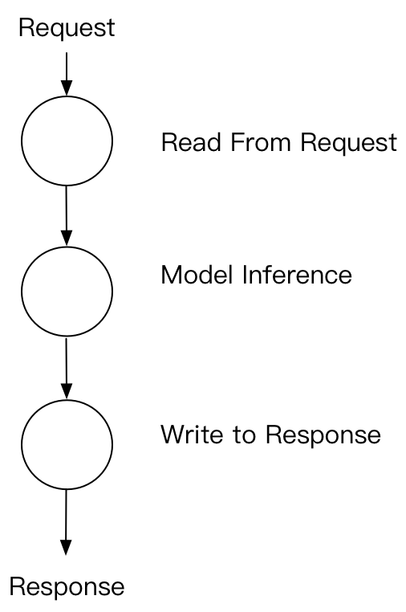
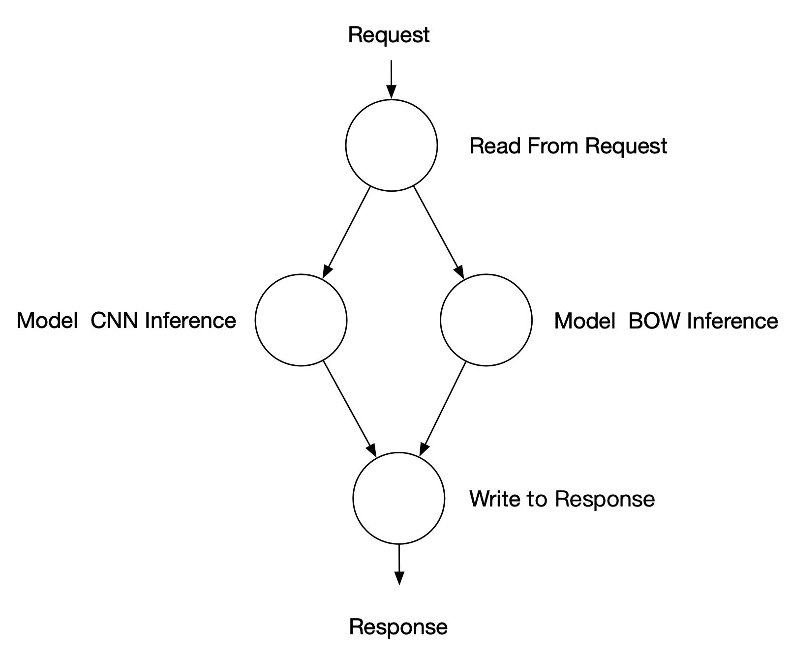

# Computation Graph On Server

([简体中文](./DAG_CN.md)|English)

This document shows the concept of computation graph on server. How to define computation graph with PaddleServing built-in operators. Examples for some sequential execution logics are shown as well.

## Computation Graph on Server

Deep neural nets often have some preprocessing steps on input data, and postprocessing steps on model inference scores. Since deep learning frameworks are now very flexible, it is possible to do preprocessing and postprocessing outside the training computation graph. If we want to do input data preprocessing and inference result postprocess on server side, we have to add the corresponding computation logics on server. Moreover, if a user wants to do inference with the same inputs on more than one model, the best way is to do the inference concurrently on server side given only one client request so that we can save some network computation overhead. For the above two reasons, it is naturally to think of a Directed Acyclic Graph(DAG) as the main computation method for server inference. One example of DAG is as follows:

<center>

</center>

## How to define Node

### Simple series structure

PaddleServing has some predefined Computation Node in the framework. A very commonly used Computation Graph is the simple reader-inference-response mode that can cover most of the single model inference scenarios. Here is an example of DAG graph.

<center>

</center>

If you want to start the server through the python API. The corresponding DAG definition code is as follows.
``` python
import paddle_serving_server as serving
from paddle_serving_server import OpMaker
from paddle_serving_server import OpSeqMaker

op_maker = serving.OpMaker()
read_op = op_maker.create('GeneralReaderOp')
general_infer_op = op_maker.create('GeneralInferOp')
general_response_op = op_maker.create('GeneralResponseOp')

op_seq_maker = serving.OpSeqMaker()
op_seq_maker.add_op(read_op)
op_seq_maker.add_op(general_infer_op)
op_seq_maker.add_op(general_response_op)
```

If you use `the command line + configuration file method to start C++ server`, you only need to modify [the configuration file](../Serving_Configure_CN.md), don`t need to change any line of 👆 code.

For simple series logic, we simplify it and build it with `OpSeqMaker`. You can determine the successor by default according to the order of joining `OpSeqMaker` without specifying the successor of each node.

Since the code will be commonly used and users do not have to change the code, PaddleServing releases a easy-to-use launching command for service startup. An example is as follows: 

``` python
python -m paddle_serving_server.serve --model uci_housing_model --thread 10 --port 9292
```

### Nodes with multiple inputs

An example containing multiple input nodes is given in the [Model_Ensemble](./Model_Ensemble_EN.md). A example graph and the corresponding DAG definition code is as follows.

<center>

</center>

```python
from paddle_serving_server import OpMaker
from paddle_serving_server import OpGraphMaker
from paddle_serving_server import Server

op_maker = OpMaker()
read_op = op_maker.create('GeneralReaderOp')
cnn_infer_op = op_maker.create(
    'GeneralInferOp', engine_name='cnn', inputs=[read_op])
bow_infer_op = op_maker.create(
    'GeneralInferOp', engine_name='bow', inputs=[read_op])
response_op = op_maker.create(
    'GeneralResponseOp', inputs=[cnn_infer_op, bow_infer_op])

op_graph_maker = OpGraphMaker()
op_graph_maker.add_op(read_op)
op_graph_maker.add_op(cnn_infer_op)
op_graph_maker.add_op(bow_infer_op)
op_graph_maker.add_op(response_op)
```

For a graph with multiple input nodes, we need to use `OpGraphMaker` to build it, and you must give the predecessor of each node.

## More Examples

If a user has sparse features as inputs, and the model will do embedding lookup for each feature, we can do distributed embedding lookup operation which is not in the Paddle training computation graph. An example is as follows:

``` python
import paddle_serving_server as serving
from paddle_serving_server import OpMaker
from paddle_serving_server import OpSeqMaker

op_maker = serving.OpMaker()
read_op = op_maker.create('GeneralReaderOp')
dist_kv_op = op_maker.create('GeneralDistKVInferOp')
general_infer_op = op_maker.create('GeneralInferOp')
general_response_op = op_maker.create('GeneralResponseOp')

op_seq_maker = serving.OpSeqMaker()
op_seq_maker.add_op(read_op)
op_seq_maker.add_op(dist_kv_op)
op_seq_maker.add_op(general_infer_op)
op_seq_maker.add_op(general_response_op)
```
