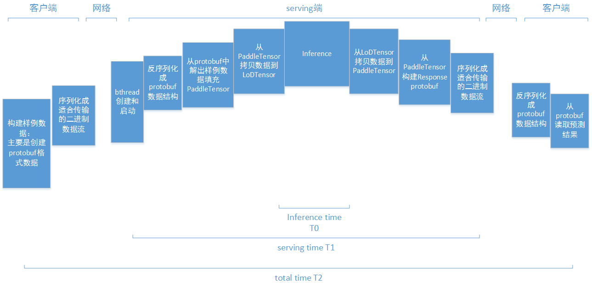
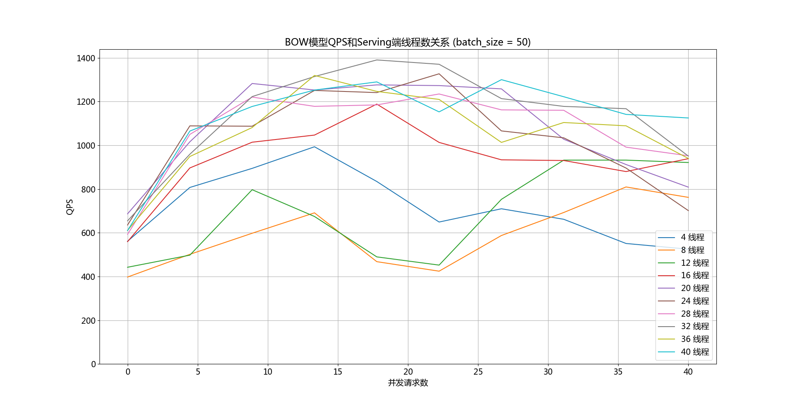
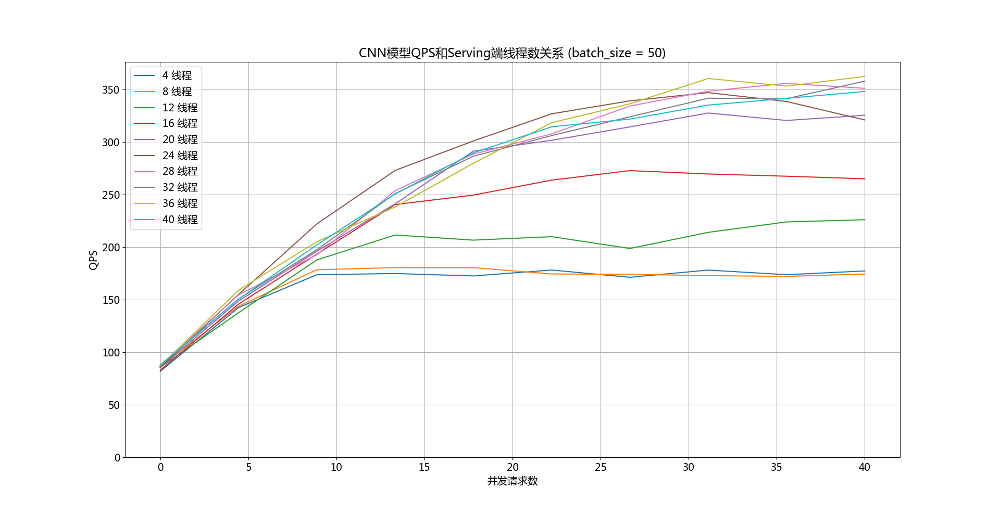

# C++ Serving框架性能测试
本文以文本分类任务为例搭建Serving预测服务，给出Serving框架性能数据：

1) Serving框架净开销测试

2) 不同模型下预测服务单线程响应时间、QPS、准确率等指标和单机模式的对比

3) 不同模型下Serving扩展能力对比

# 1. Serving单次请求时间分解

下图是一个对serving请求的耗时阶段的不完整分析。图中对brpc的开销，只列出了bthread创建和启动开销。

(右键在新窗口中浏览大图)

试与单机模式对比：

1) 从原始样例填充PaddleTensor (几us到几十us)

2) 从PaddleTensor填充LoDTensor (几us到几十us)

3) inference (几十us到几百ms)

4) 从LoDTensor填充PaddleTensor (几us到几十us)

5) 从Paddletensor读取预测结果 (几us到几十us)

与单机模式相比，serving模式增加了：

1) protobuf数据构造和序列化与反序列化 (几us到几十us)

2) 网络通信 (单机十几us，远程500us到几十ms)

3) 和bthread创建于调度等。(十几us)

从client端看(图中total time T2)，serving模式增加的时间，与inference时间的比例，对整个client端观察到的系统吞吐关系密切：

1) 当inference时间达到10+ms到几百ms (例如，文本分类的CNN模型)，而serving模式增加的时间只有几ms，则client端观察到的吞吐与单机模式几乎一致

2) 当inference时间只有几个us到几十个us (例如，文本分类的BOW模型)，而serving模式增加了几个ms，则client端观察到的吞吐与单机模式相比，会下降到单机模式的20%甚至更低。

**为了验证上述假设，文本分类任务的serving模式测试，需要在几个不同模型上分别进行，分别记录serving模式下，client端吞吐量的变化情况。**

# 2. 测试任务和测试环境

## 2.1 测试任务

文本分类的两种常见模型：BOW, CNN

**Batch Size: 本实验中所有请求的batch size均为50**

## 2.2 测试环境

| | CPU型号、核数 | 内存 |
| --- | --- | --- |
| Serving所在机器 | Intel(R) Xeon(R) CPU E5-2650 v3 @ 2.30GHz 40核 | 128G |
| Client所在机器 | Intel(R) Xeon(R) CPU E5-2650 v3 @ 2.30GHz 40核 | 128G |

Serving端与Client端通信时延：0.102 ms

# 3. 净开销测试

本测试是为了描画引入Serving框架后，在Serving端空转的情况下，每query消耗的时间，也就是框架引入的开销。

所谓空转是指，serving端去除实际执行预测的计算时间，但保留拆包和组包逻辑。

| 模型 | 净开销 (ms) |
| --- | --- |
| BOW | 1 |
| CNN | 1 |

在C++ Serving模式下，框架引入的时间开销较小，约为1ms

# 4. 预测服务单线程响应时间、QPS、准确率等指标与单机模式的对比

本测试用来确定Serving的准确率、QPS和响应时间等指标与单机模式相比是否无明显异常

<table>
<thead>
  <tr>
    <th> 模型</th>
    <th colspan=3> Serving（client与serving同机器）</th>
    <th colspan=3> 单机</th>
  </tr>
</thead>
<tbody>
  <tr>
    <td></td>
    <td>QPS</td>
    <td>Latency (ms)</td>
    <td>Accuracy</td>
    <td>QPS</td>
    <td>Latency (ms)</td>
    <td>Accuracy</td>
  </tr>
  <tr>
    <td>BOW</td>
    <td> 265.393 </td>
    <td>3</td>
    <td>0.84348</td>
    <td>715.973366</td>
    <td>1.396700</td>
    <td>0.843480</td>
  </tr>
  <tr>
    <td>CNN</td>
    <td>23.3002</td>
    <td>42</td>
    <td>0.8962</td>
    <td>25.372693</td>
    <td>39.412450</td>
    <td>0.896200</td>
  </tr>
</tbody>
</table>
 
准确率：Serving模式下与单机模式下预测准确率一致。

QPS：与模型特点有关：可以看到，在预测时间很短的BOW模型上，Serving框架本身的开销和网络通信固定时间在单次请求中的时间占比占了绝大部分，这导致Serving模式下的QPS与单机模式相比下降明显；而在预测时间较长的CNN模型上，Serving框架开销和网络通信时间在单次请求中的占比较小，Serving模式下QPS与单机模式下相差不多。这也验证了第1节的预期。

# 5. Serving扩展能力

Serving扩展能力的测试是指，在不同模型上：

1) 固定serving端brpc使用的系统线程数

2) 不断增加client端并发请求数

3) 运行一段时间后，client端记录当前设定下QPS、平均响应时间和各个分位点的响应时间等信息

4) serving与client在不同机器上，Serving端与Client端通信时延：0.102 ms

## 5.1 测试结论
1) 当模型较为复杂，模型本身的预测时间较长时（预测时间>10ms，以上述实验中CNN模型为例），Paddle Serving能够提供较好的线性扩展能力.
2) 当模型是简单模型，模型本身的预测时间较短时（预测时间<10ms，以上述实验中BOW模型为例），随着serving端线程数的增加，qps的增长趋势较为杂乱，看不出明显的线性趋势。猜测是因为预测时间较短，而线程切换、框架本身的开销等占了大头，导致虽然随着线程数增加，qps也有增长，但当并发数增大时，qps反而出现下降。
3) Server端线程数N的设置需要结合，最大并发请求量，机器core数量，以及预测时间长短这三个因素来确定。
5) 使用GPU进行模型测试，当模型预测时间较短时，Server端线程数不宜过多（线程数=1~4倍core数量），否则线程切换带来的开销不可忽视。
6) 使用GPU进行模型测试，当模型预测时间较长时，Server端线程数应稍大一些（线程数=4~20倍core数量）。由于模型预测对于CPU而言是一个阻塞操作，此时当前线程会在此处阻塞等待（类似于Sleep操作）,若所有线程均阻塞在模型预测阶段，将没有可运行BRPC的”协程worker“的空闲线程。
7) 若机器环境允许，Server端线程数应等于或略小于最大并发量。

## 5.2 测试数据-BOW模型

### Serving 4线程

| 并发数 | QPS | 总时间 | 平均响应时间 | 80分位点响应时间 | 90分位点响应时间 | 99分位点响应时间 | 99.9分位点响应时间 |
| --- | --- | --- | --- | --- | --- | --- | --- |
| 4 | 561.325 | 3563 | 7.1265 | 9 | 11 | 23 | 62 |
| 8 | 807.428 | 4954 | 9.9085 | 7 | 10 | 24 | 31 |
| 12 | 894.721 | 6706 | 13.4123 | 18 | 22 | 41 | 61 |
| 16 | 993.542 | 8052 | 16.1057 | 22 | 28 | 47 | 75 |
| 20 | 834.725 | 11980 | 23.9615 | 32 | 40 | 64 | 81 |
| 24 | 649.316 | 18481 | 36.962 | 50 | 67 | 149 | 455 |
| 28 | 709.975 | 19719 | 39.438 | 53 | 76 | 159 | 293 |
| 32 | 661.868 | 24174 | 48.3495 | 62 | 90 | 294 | 560 |
| 36 | 551.234 | 32654 | 65.3081 | 83 | 129 | 406 | 508 |
| 40 | 525.155 | 38084 | 76.1687 | 99 | 143 | 464 | 567 |

### Serving 8线程

| 并发数 | QPS | 总时间 | 平均响应时间 | 80分位点响应时间 | 90分位点响应时间 | 99分位点响应时间 | 99.9分位点响应时间 |
| --- | --- | --- | --- | --- | --- | --- | --- |
| 4 | 397.693 | 5029 | 10.0585 | 11 | 15 | 75 | 323 |
| 8 | 501.567 | 7975 | 15.9515 | 18 | 25 | 113 | 327 |
| 12 | 598.027 | 10033 | 20.0663 | 24 | 33 | 125 | 390 |
| 16 | 691.384 | 11571 | 23.1427 | 31 | 42 | 105 | 348 |
| 20 | 468.099 | 21363 | 42.7272 | 53 | 74 | 232 | 444 |
| 24 | 424.553 | 28265 | 56.5315 | 67 | 102 | 353 | 448 |
| 28 | 587.692 | 23822 | 47.6457 | 61 | 83 | 287 | 494 |
| 32 | 692.911 | 23091 | 46.1833 | 66 | 94 | 184 | 389 |
| 36 | 809.753 | 22229 | 44.4581 | 59 | 76 | 256 | 556 |
| 40 | 762.108 | 26243 | 52.4869 | 74 | 98 | 290 | 475 |

### Serving 12线程

| 并发数 | QPS | 总时间 | 平均响应时间 | 80分位点响应时间 | 90分位点响应时间 | 99分位点响应时间 | 99.9分位点响应时间 |
| --- | --- | --- | --- | --- | --- | --- | --- |
| 4 | 442.478 | 4520 | 9.0405 | 12 | 15 | 31 | 46 |
| 8 | 497.884 | 8034 | 16.0688 | 19 | 25 | 130 | 330 |
| 12 | 797.13 | 7527 | 15.0552 | 16 | 22 | 162 | 326 |
| 16 | 674.707 | 11857 | 23.7154 | 30 | 42 | 229 | 455 |
| 20 | 489.956 | 20410 | 40.8209 | 49 | 68 | 304 | 437 |
| 24 | 452.335 | 26529 | 53.0582 | 66 | 85 | 341 | 414 |
| 28 | 753.093 | 18590 | 37.1812 | 50 | 65 | 184 | 421 |
| 32 | 932.498 | 18278 | 36.5578 | 48 | 62 | 109 | 337 |
| 36 | 932.498 | 19303 | 38.6066 | 54 | 70 | 110 | 164 |
| 40 | 921.532 | 21703 | 43.4066 | 59 | 75 | 125 | 451 |

### Serving 16线程

| 并发数 | QPS | 总时间 | 平均响应时间 | 80分位点响应时间 | 90分位点响应时间 | 99分位点响应时间 | 99.9分位点响应时间 |
| --- | --- | --- | --- | --- | --- | --- | --- |
| 4 | 559.597 | 3574 | 7.1485 | 9 | 11 | 24 | 56 |
| 8 | 896.66 | 4461 | 8.9225 | 12 | 15 | 23 | 42 |
| 12 | 1014.37 | 5915 | 11.8305 | 16 | 20 | 34 | 63 |
| 16 | 1046.98 | 7641 | 15.2837 | 21 | 28 | 48 | 64 |
| 20 | 1188.64 | 8413 | 16.8276 | 23 | 31 | 55 | 71 |
| 24 | 1013.43 | 11841 | 23.6833 | 34 | 41 | 63 | 86 |
| 28 | 933.769 | 14993 | 29.9871 | 41 | 52 | 91 | 149 |
| 32 | 930.665 | 17192 | 34.3844 | 48 | 60 | 97 | 137 |
| 36 | 880.153 | 20451 | 40.9023 | 57 | 72 | 118 | 142 |
| 40 | 939.144 | 21296 | 42.5938 | 59 | 75 | 126 | 163 |

### Serving 20线程

| 并发数 | QPS | 总时间 | 平均响应时间 | 80分位点响应时间 | 90分位点响应时间 | 99分位点响应时间 | 99.9分位点响应时间 |
| --- | --- | --- | --- | --- | --- | --- | --- |
| 4 | 686.813 | 2912 | 5.825 | 7 | 9 | 18 | 54 |
| 8 | 1016.26 | 3936 | 7.87375 | 10 | 13 | 24 | 33 |
| 12 | 1282.87 | 4677 | 9.35483 | 12 | 15 | 35 | 73 |
| 16 | 1253.13 | 6384 | 12.7686 | 17 | 23 | 40 | 54 |
| 20 | 1276.49 | 7834 | 15.6696 | 22 | 28 | 53 | 90 |
| 24 | 1273.34 | 9424 | 18.8497 | 26 | 35 | 66 | 93 |
| 28 | 1258.31 | 11126 | 22.2535 | 31 | 41 | 71 | 133 |
| 32 | 1027.95 | 15565 | 31.1308 | 43 | 54 | 81 | 103 |
| 36 | 912.316 | 19730 | 39.4612 | 52 | 66 | 106 | 131 |
| 40 | 808.865 | 24726 | 49.4539 | 64 | 79 | 144 | 196 |

### Serving 24线程

| 并发数 | QPS | 总时间 | 平均响应时间 | 80分位点响应时间 | 90分位点响应时间 | 99分位点响应时间 | 99.9分位点响应时间 |
| --- | --- | --- | --- | --- | --- | --- | --- |
| 4 | 635.728 | 3146 | 6.292 | 7 | 10 | 22 | 48 |
| 8 | 1089.03 | 3673 | 7.346 | 9 | 11 | 21 | 40 |
| 12 | 1087.55 | 5056 | 10.1135 | 13 | 17 | 41 | 51 |
| 16 | 1251.17 | 6394 | 12.7898 | 17 | 24 | 39 | 54 |
| 20 | 1241.31 | 8056 | 16.1136 | 21 | 29 | 51 | 72 |
| 24 | 1327.29 | 9041 | 18.0837 | 24 | 33 | 59 | 77 |
| 28 | 1066.02 | 13133 | 26.2664 | 37 | 47 | 84 | 109 |
| 32 | 1034.33 | 15469 | 30.9384 | 41 | 51 | 94 | 115 |
| 36 | 896.191 | 20085 | 40.1708 | 55 | 68 | 110 | 168 |
| 40 | 701.508 | 28510 | 57.0208 | 74 | 88 | 142 | 199 |

### Serving 28线程

| 并发数 | QPS | 总时间 | 平均响应时间 | 80分位点响应时间 | 90分位点响应时间 | 99分位点响应时间 | 99.9分位点响应时间 |
| --- | --- | --- | --- | --- | --- | --- | --- |
| 4 | 592.944 | 3373 | 6.746 | 8 | 10 | 21 | 56 |
| 8 | 1050.14 | 3809 | 7.619 | 9 | 12 | 22 | 41 |
| 12 | 1220.75 | 4915 | 9.83133 | 13 | 16 | 26 | 51 |
| 16 | 1178.38 | 6789 | 13.579 | 19 | 24 | 41 | 65 |
| 20 | 1184.97 | 8439 | 16.8789 | 23 | 30 | 51 | 72 |
| 24 | 1234.95 | 9717 | 19.4341 | 26 | 34 | 53 | 94 |
| 28 | 1162.31 | 12045 | 24.0908 | 33 | 40 | 70 | 208 |
| 32 | 1160.35 | 13789 | 27.5784 | 39 | 47 | 75 | 97 |
| 36 | 991.79 | 18149 | 36.2987 | 50 | 61 | 91 | 110 |
| 40 | 952.336 | 21001 | 42.0024 | 58 | 69 | 105 | 136 |

### Serving 32线程

| 并发数 | QPS | 总时间 | 平均响应时间 | 80分位点响应时间 | 90分位点响应时间 | 99分位点响应时间 | 99.9分位点响应时间 |
| --- | --- | --- | --- | --- | --- | --- | --- |
| 4 | 654.879 | 3054 | 6.109 | 7 | 9 | 18 | 39 |
| 8 | 959.463 | 4169 | 8.33925 | 11 | 13 | 24 | 39 |
| 12 | 1222.99 | 4906 | 9.81367 | 13 | 16 | 30 | 39 |
| 16 | 1314.71 | 6085 | 12.1704 | 16 | 20 | 35 | 42 |
| 20 | 1390.63 | 7191 | 14.3837 | 19 | 24 | 40 | 69 |
| 24 | 1370.8 | 8754 | 17.5096 | 24 | 30 | 45 | 62 |
| 28 | 1213.8 | 11534 | 23.0696 | 31 | 37 | 60 | 79 |
| 32 | 1178.2 | 13580 | 27.1601 | 38 | 45 | 68 | 82 |
| 36 | 1167.69 | 15415 | 30.8312 | 42 | 51 | 77 | 92 |
| 40 | 950.841 | 21034 | 42.0692 | 55 | 65 | 96 | 137 |

### Serving 36线程

| 并发数 | QPS | 总时间 | 平均响应时间 | 80分位点响应时间 | 90分位点响应时间 | 99分位点响应时间 | 99.9分位点响应时间 |
| --- | --- | --- | --- | --- | --- | --- | --- |
| 4 | 611.06 | 3273 | 6.546 | 7 | 10 | 23 | 63 |
| 8 | 948.992 | 4215 | 8.43 | 10 | 13 | 38 | 87 |
| 12 | 1081.47 | 5548 | 11.0972 | 15 | 18 | 31 | 37 |
| 16 | 1319.7 | 6062 | 12.1241 | 16 | 21 | 35 | 64 |
| 20 | 1246.73 | 8021 | 16.0434 | 22 | 28 | 41 | 47 |
| 24 | 1210.04 | 9917 | 19.8354 | 28 | 34 | 54 | 70 |
| 28 | 1013.46 | 13814 | 27.6296 | 37 | 47 | 83 | 125 |
| 32 | 1104.44 | 14487 | 28.9756 | 41 | 49 | 72 | 88 |
| 36 | 1089.32 | 16524 | 33.0495 | 45 | 55 | 83 | 107 |
| 40 | 940.115 | 21274 | 42.5481 | 58 | 68 | 101 | 138 |

### Serving 40线程

| 并发数 | QPS | 总时间 | 平均响应时间 | 80分位点响应时间 | 90分位点响应时间 | 99分位点响应时间 | 99.9分位点响应时间 |
| --- | --- | --- | --- | --- | --- | --- | --- |
| 4 | 610.314 | 3277 | 6.555 | 8 | 11 | 20 | 57 |
| 8 | 1065.34 | 4001 | 8.0035 | 10 | 12 | 23 | 29 |
| 12 | 1177.86 | 5632 | 11.2645 | 14 | 18 | 33 | 310 |
| 16 | 1252.74 | 6386 | 12.7723 | 17 | 22 | 40 | 63 |
| 20 | 1290.16 | 7751 | 15.5036 | 21 | 27 | 47 | 66 |
| 24 | 1153.07 | 10407 | 20.8159 | 28 | 36 | 64 | 81 |
| 28 | 1300.39 | 10766 | 21.5326 | 30 | 37 | 60 | 78 |
| 32 | 1222.4 | 13089 | 26.1786 | 36 | 45 | 75 | 99 |
| 36 | 1141.55 | 15768 | 31.5374 | 43 | 52 | 83 | 121 |
| 40 | 1125.24 | 17774 | 35.5489 | 48 | 57 | 93 | 190 |

下图是Paddle Serving在BOW模型上QPS随serving端线程数增加而变化的图表。可以看出当线程数较少时(4线程/8线程/12线程)，QPS的变化规律非常杂乱；当线程数较多时，QPS曲线又基本趋于一致，基本无线性增长关系。

(右键在新窗口中浏览大图)

## 5.3 测试数据-CNN模型

### Serving 4线程

| 并发数 | QPS | 总时间 | 平均响应时间 | 80分位点响应时间 | 90分位点响应时间 | 99分位点响应时间 | 99.9分位点响应时间 |
| --- | --- | --- | --- | --- | --- | --- | --- |
| 4 | 81.9437 | 24407 | 47 | 55 | 64 | 80 | 91 |
| 8 | 142.486 | 28073 | 53 | 65 | 71 | 86 | 106 |
| 12 | 173.732 | 34536 | 66 | 79 | 86 | 105 | 126 |
| 16 | 174.894 | 45742 | 89 | 101 | 109 | 131 | 151 |
| 20 | 172.58 | 57944 | 113 | 129 | 138 | 159 | 187 |
| 24 | 178.216 | 67334 | 132 | 147 | 158 | 189 | 283 |
| 28 | 171.315 | 81721 | 160 | 180 | 192 | 223 | 291 |
| 32 | 178.17 | 89802 | 176 | 195 | 208 | 251 | 288 |
| 36 | 173.762 | 103590 | 204 | 227 | 241 | 278 | 309 |
| 40 | 177.335 | 112781 | 223 | 246 | 262 | 296 | 315 |

### Serving 8线程

| 并发数 | QPS | 总时间 | 平均响应时间 | 80分位点响应时间 | 90分位点响应时间 | 99分位点响应时间 | 99.9分位点响应时间 |
| --- | --- | --- | --- | --- | --- | --- | --- |
| 4 | 86.2999 | 23175 | 44 | 50 | 54 | 72 | 92 |
| 8 | 143.73 | 27830 | 53 | 65 | 71 | 83 | 91 |
| 12 | 178.471 | 33619 | 65 | 77 | 85 | 106 | 144 |
| 16 | 180.485 | 44325 | 86 | 99 | 108 | 131 | 149 |
| 20 | 180.466 | 55412 | 108 | 122 | 131 | 153 | 170 |
| 24 | 174.452 | 68787 | 134 | 151 | 162 | 189 | 214 |
| 28 | 174.158 | 80387 | 157 | 175 | 186 | 214 | 236 |
| 32 | 172.857 | 92562 | 182 | 202 | 214 | 244 | 277 |
| 36 | 172.171 | 104547 | 206 | 228 | 241 | 275 | 304 |
| 40 | 174.435 | 114656 | 226 | 248 | 262 | 306 | 338 |

### Serving 12线程

| 并发数 | QPS | 总时间 | 平均响应时间 | 80分位点响应时间 | 90分位点响应时间 | 99分位点响应时间 | 99.9分位点响应时间 |
| --- | --- | --- | --- | --- | --- | --- | --- |
| 4 | 85.6274 | 23357 | 45 | 50 | 55 | 75 | 105 |
| 8 | 137.632 | 29063 | 55 | 67 | 73 | 88 | 134 |
| 12 | 187.793 | 31950 | 61 | 73 | 79 | 94 | 123 |
| 16 | 211.512 | 37823 | 73 | 87 | 94 | 113 | 134 |
| 20 | 206.624 | 48397 | 93 | 109 | 118 | 145 | 217 |
| 24 | 209.933 | 57161 | 111 | 128 | 137 | 157 | 190 |
| 28 | 198.689 | 70462 | 137 | 154 | 162 | 186 | 205 |
| 32 | 214.024 | 74758 | 146 | 165 | 176 | 204 | 228 |
| 36 | 223.947 | 80376 | 158 | 177 | 189 | 222 | 282 |
| 40 | 226.045 | 88478 | 174 | 193 | 204 | 236 | 277 |

### Serving 16线程

| 并发数 | QPS | 总时间 | 平均响应时间 | 80分位点响应时间 | 90分位点响应时间 | 99分位点响应时间 | 99.9分位点响应时间 |
| --- | --- | --- | --- | --- | --- | --- | --- |
| 4 | 82.9119 | 24122 | 45 | 52 | 60 | 79 | 99 |
| 8 | 145.82 | 27431 | 51 | 63 | 69 | 85 | 114 |
| 12 | 193.287 | 31042 | 59 | 71 | 77 | 92 | 139 |
| 16 | 240.428 | 33274 | 63 | 76 | 82 | 99 | 127 |
| 20 | 249.457 | 40087 | 77 | 91 | 99 | 127 | 168 |
| 24 | 263.673 | 45511 | 87 | 102 | 110 | 136 | 186 |
| 28 | 272.729 | 51333 | 99 | 115 | 123 | 147 | 189 |
| 32 | 269.515 | 59366 | 115 | 132 | 140 | 165 | 192 |
| 36 | 267.4 | 67315 | 131 | 148 | 157 | 184 | 220 |
| 40 | 264.939 | 75489 | 147 | 164 | 173 | 200 | 235 |

### Serving 20线程

| 并发数 | QPS | 总时间 | 平均响应时间 | 80分位点响应时间 | 90分位点响应时间 | 99分位点响应时间 | 99.9分位点响应时间 |
| --- | --- | --- | --- | --- | --- | --- | --- |
| 4 | 85.5615 | 23375 | 44 | 49 | 55 | 73 | 101 |
| 8 | 148.765 | 26888 | 50 | 61 | 69 | 84 | 97 |
| 12 | 196.11 | 30595 | 57 | 70 | 75 | 88 | 108 |
| 16 | 241.087 | 33183 | 63 | 76 | 82 | 98 | 115 |
| 20 | 291.24 | 34336 | 65 | 66 | 78 | 99 | 114 |
| 24 | 301.515 | 39799 | 76 | 90 | 97 | 122 | 194 |
| 28 | 314.303 | 44543 | 86 | 101 | 109 | 132 | 173 |
| 32 | 327.486 | 48857 | 94 | 109 | 118 | 143 | 196 |
| 36 | 320.422 | 56176 | 109 | 125 | 133 | 157 | 190 |
| 40 | 325.399 | 61463 | 120 | 137 | 145 | 174 | 216 |

### Serving 24线程

| 并发数 | QPS | 总时间 | 平均响应时间 | 80分位点响应时间 | 90分位点响应时间 | 99分位点响应时间 | 99.9分位点响应时间 |
| --- | --- | --- | --- | --- | --- | --- | --- |
| 4 | 85.6568 | 23349 | 45 | 50 | 57 | 72 | 110 |
| 8 | 154.919 | 25820 | 48 | 57 | 66 | 81 | 95 |
| 12 | 221.992 | 27028 | 51 | 61 | 69 | 85 | 100 |
| 16 | 272.889 | 29316 | 55 | 68 | 74 | 89 | 101 |
| 20 | 300.906 | 33233 | 63 | 75 | 81 | 95 | 108 |
| 24 | 326.735 | 36727 | 69 | 82 | 87 | 102 | 114 |
| 28 | 339.057 | 41291 | 78 | 92 | 99 | 119 | 137 |
| 32 | 346.868 | 46127 | 88 | 103 | 110 | 130 | 155 |
| 36 | 338.429 | 53187 | 102 | 117 | 124 | 146 | 170 |
| 40 | 320.919 | 62321 | 119 | 135 | 144 | 176 | 226 |

### Serving 28线程

| 并发数 | QPS | 总时间 | 平均响应时间 | 80分位点响应时间 | 90分位点响应时间 | 99分位点响应时间 | 99.9分位点响应时间 |
| --- | --- | --- | --- | --- | --- | --- | --- |
| 4 | 87.8773 | 22759 | 43 | 48 | 52 | 76 | 112 |
| 8 | 154.524 | 25886 | 49 | 58 | 66 | 82 | 100 |
| 12 | 192.709 | 31135 | 59 | 72 | 78 | 93 | 112 |
| 16 | 253.59 | 31547 | 59 | 72 | 79 | 95 | 129 |
| 20 | 288.367 | 34678 | 65 | 78 | 84 | 100 | 122 |
| 24 | 307.653 | 39005 | 73 | 84 | 92 | 116 | 313 |
| 28 | 334.105 | 41903 | 78 | 90 | 97 | 119 | 140 |
| 32 | 348.25 | 45944 | 86 | 99 | 107 | 132 | 164 |
| 36 | 355.661 | 50610 | 96 | 110 | 118 | 143 | 166 |
| 40 | 350.957 | 56987 | 109 | 124 | 133 | 165 | 221 |

### Serving 32线程

| 并发数 | QPS | 总时间 | 平均响应时间 | 80分位点响应时间 | 90分位点响应时间 | 99分位点响应时间 | 99.9分位点响应时间 |
| --- | --- | --- | --- | --- | --- | --- | --- |
| 4 | 87.4088 | 22881 | 43 | 48 | 52 | 70 | 86 |
| 8 | 150.733 | 26537 | 50 | 60 | 68 | 85 | 102 |
| 12 | 197.433 | 30390 | 57 | 70 | 75 | 90 | 106 |
| 16 | 250.917 | 31883 | 60 | 73 | 78 | 94 | 121 |
| 20 | 286.369 | 34920 | 66 | 78 | 84 | 102 | 131 |
| 24 | 306.029 | 39212 | 74 | 85 | 92 | 110 | 134 |
| 28 | 323.902 | 43223 | 81 | 93 | 100 | 122 | 143 |
| 32 | 341.559 | 46844 | 89 | 102 | 111 | 136 | 161 |
| 36 | 341.077 | 52774 | 98 | 113 | 124 | 158 | 193 |
| 40 | 357.814 | 55895 | 107 | 122 | 133 | 166 | 196 |

### Serving 36线程

| 并发数 | QPS | 总时间 | 平均响应时间 | 80分位点响应时间 | 90分位点响应时间 | 99分位点响应时间 | 99.9分位点响应时间 |
| --- | --- | --- | --- | --- | --- | --- | --- |
| 4 | 86.9036 | 23014 | 44 | 49 | 53 | 72 | 112 |
| 8 | 158.964 | 25163 | 48 | 55 | 63 | 79 | 91 |
| 12 | 205.086 | 29256 | 55 | 68 | 75 | 91 | 168 |
| 16 | 238.173 | 33589 | 61 | 73 | 79 | 100 | 158 |
| 20 | 279.705 | 35752 | 67 | 79 | 86 | 106 | 129 |
| 24 | 318.294 | 37701 | 71 | 82 | 89 | 108 | 129 |
| 28 | 336.296 | 41630 | 78 | 89 | 97 | 119 | 194 |
| 32 | 360.295 | 44408 | 84 | 97 | 105 | 130 | 154 |
| 36 | 353.08 | 50980 | 96 | 113 | 123 | 152 | 179 |
| 40 | 362.286 | 55205 | 105 | 122 | 134 | 171 | 247 |

### Serving 40线程

| 并发数 | QPS | 总时间 | 平均响应时间 | 80分位点响应时间 | 90分位点响应时间 | 99分位点响应时间 | 99.9分位点响应时间 |
| --- | --- | --- | --- | --- | --- | --- | --- |
| 4 | 87.7347 | 22796 | 44 | 48 | 54 | 73 | 114 |
| 8 | 150.483 | 26581 | 50 | 59 | 67 | 85 | 149 |
| 12 | 202.088 | 29690 | 56 | 69 | 75 | 90 | 102 |
| 16 | 250.485 | 31938 | 60 | 74 | 79 | 93 | 113 |
| 20 | 289.62 | 34528 | 65 | 77 | 83 | 102 | 132 |
| 24 | 314.408 | 38167 | 72 | 83 | 90 | 110 | 125 |
| 28 | 321.728 | 43515 | 83 | 95 | 104 | 132 | 159 |
| 32 | 335.022 | 47758 | 90 | 104 | 114 | 141 | 166 |
| 36 | 341.452 | 52716 | 101 | 117 | 129 | 170 | 231 |
| 40 | 347.953 | 57479 | 109 | 130 | 143 | 182 | 216 |

下图是Paddle Serving在CNN模型上QPS随serving端线程数增加而变化的图表。可以看出，随着线程数变大，Serving QPS有较为明显的线性增长关系。可以这样解释此图表：例如，线程数为16时，基本在20个并发时达到最大QPS，此后再增加并发压力QPS基本保持稳定；当线程能够数为24线程时，基本在28并发时达到最大QPS，此后再增大并发压力qps基本保持稳定。

(右键在新窗口中浏览大图)
