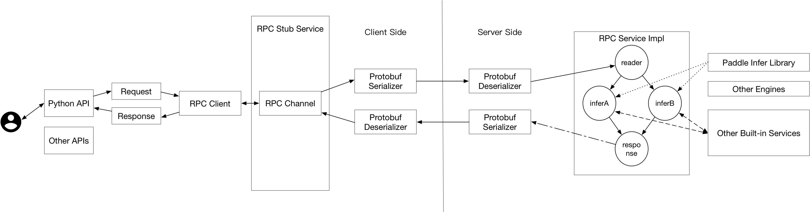
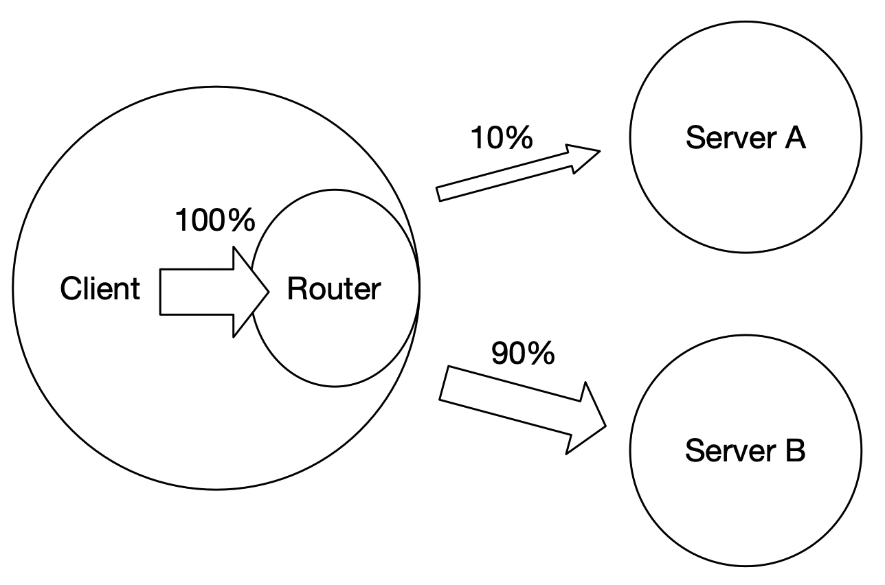

# C++ Serving 简要介绍
## 适用场景
C++ Serving主打性能，如果您想搭建企业级的高性能线上推理服务，对高并发、低延时有一定的要求。C++ Serving框架可能会更适合您。目前无论是使用同步/异步模型，[C++ Serving与TensorFlow Serving性能对比](./Benchmark_CN.md)均有优势。

C++ Serving网络框架使用brpc，核心执行引擎是基于C/C++编写，并且提供强大的工业级应用能力，包括模型热加载、模型加密部署、A/B Test、多模型组合、同步/异步模式、支持多语言多协议Client等功能。

## 1.网络框架(BRPC)
C++ Serving采用[brpc框架](https://github.com/apache/incubator-brpc)进行Client/Server端的通信。brpc是百度开源的一款PRC网络框架，具有高并发、低延时等特点，已经支持了包括百度在内上百万在线预估实例、上千个在线预估服务，稳定可靠。与gRPC网络框架相比，具有更低的延时，更高的并发性能，且底层支持<mark>**brpc/grpc/http+json/http+proto**</mark>等多种协议；缺点是跨操作系统平台能力不足。详细的框架性能开销见[C++ Serving框架性能测试](./Frame_Performance_CN.md)。

## 2.核心执行引擎
C++ Serving的核心执行引擎是一个有向无环图(也称作[DAG图](./DAG_CN.md))，DAG图中的每个节点(在PaddleServing中,借用模型中operator算子的概念，将DAG图中的节点也称为[OP](./OP_CN.md))代表预估服务的一个环节，DAG图支持多个OP按照串并联的方式进行组合，从而实现在一个服务中完成多个模型的预测整合最终产出结果。整个框架原理如下图所示，可分为Client Side 和 Server Side。

     

     

### 2.1 Client Side
如图所示，Client端通过Pybind API接口将Request请求，按照ProtoBuf协议进行序列化后，经由BRPC网络框架Client端发送给Server端。此时，Client端等待Server端的返回数据并反序列化为正常的数据，之后将结果返给Client调用方。

### 2.2 Server Side
Server端接收到序列化的Request请求后，反序列化正常数据，进入图执行引擎，按照定义好的DAG图结构，执行每个OP环节的操作（每个OP环节的处理由用户定义，即可以只是单纯的数据处理，也可以是调用预测引擎用不同的模型对输入数据进行预测），当DAG图中所有OP环节均执行完成后，将结果数据序列化后返回给Client端。

### 2.3 通信数据格式ProtoBuf
Protocol Buffers(简称Protobuf) ，是Google出品的序列化框架，与开发语言无关，和平台无关，具有良好的可扩展性。Protobuf和所有的序列化框架一样，都可以用于数据存储、通讯协议。Protobuf支持生成代码的语言包括Java、Python、C++、Go、JavaNano、Ruby、C#。Portobuf的序列化的结果体积要比XML、JSON小很多，速度比XML、JSON快很多。

在C++ Serving中定义了Client Side 和 Server Side之间通信的ProtoBuf，详细的字段的介绍见《[C++ Serving ProtoBuf简介](./Inference_Protocols_CN.md)》。

## 3.Server端特性
### 3.1 启动Server端
Server端的核心是一个由项目代码编译产生的名称为serving的二进制可执行文件，启动serving时需要用户指定一些参数(<mark>**例如，网络IP和Port端口、brpc线程数、使用哪个显卡、模型文件路径、模型是否开启trt、XPU推理、模型精度设置等等**</mark>)，有些参数是通过命令行直接传入的，还有一些是写在指定的配置文件中配置文件中。

为了方便用户快速的启动C++ Serving的Server端，除了用户自行修改配置文件并通过命令行传参运行serving二进制可执行文件以外，我们也提供了另外一种通过python脚本启动的方式。python脚本启动本质上仍是运行serving二进制可执行文件，但python脚本中会自动完成两件事：1、配置文件的生成；2、根据需要配置的参数，生成命令行，通过命令行的方式，传入参数信息并运行serving二进制可执行文件。

更多详细说明和示例，请参考[C++ Serving 参数配置和启动的详细说明](../Serving_Configure_CN.md)。

### 3.2 同步/异步模式
同步模式比较简单直接，适用于模型预测时间短，单个Request请求的batch已经比较大的情况。
同步模型下，Server端线程数N = 模型预测引擎数N = 同时处理Request请求数N，超发的Request请求需要等待当前线程处理结束后才能得到响应和处理。

异步模型主要适用于模型支持多batch(最大batch数M可通过配置选项指定),单个Request请求的batch较小(batch << M)，单次预测时间较长的情况。
异步模型下，Server端N个线程只负责接收Request请求，实际调用预测引擎是在异步框架的线程池中，异步框架的线程数可以由配置选项来指定。为了方便理解，我们假设每个Request请求的batch均为1，此时异步框架会尽可能多得从请求池中取n(n≤M)个Request并将其拼装为1个Request(batch=n)，调用1次预测引擎，得到1个Response(batch = n)，再将其对应拆分为n个Response作为返回结果。

更多关于模式参数配置以及性能调优的介绍见《[C++ Serving性能调优](./Performance_Tuning_CN.md)》。

### 3.3 多模型组合
当用户需要多个模型组合处理结果来作为一个服务接口对外暴露时，通常的解决办法是搭建内外两层服务，内层服务负责跑模型预测，外层服务负责串联和前后处理。当传输的数据量不大时，这样做的性能开销并不大，但当输出的数据量较大时，因为网络传输而带来的性能开销不容忽视(实测单次传输40MB数据时，RPC耗时为160-170ms)。

     

     

C++ Serving框架支持在一个服务中创建[多模型组合](./2+_model.md)，用户可通过[自定义DAG图](./Model_Ensemble_CN.md)的方式来表示多模型之间串并联组合关系，也支持用户[使用C++开发自定义OP节点](./OP_CN.md)。相比于使用内外两层服务来提供多模型组合处理的方式，由于节省了一次RPC网络传输的开销，把多模型在一个服务中处理性能上会有一定的提升，尤其当RPC通信传输的数据量较大时。

### 3.4 模型管理与热加载
C++ Serving的引擎支持模型管理功能，支持多种模型和模型不同版本的管理。为了保证在模型更换期间推理服务的可用性，需要在服务不中断的情况下对模型进行热加载。C++ Serving对该特性进行了支持，并提供了一个监控产出模型更新本地模型的工具，具体例子请参考《[C++ Serving中的模型热加载](./Hot_Loading_CN.md)》。

### 3.5 模型加解密
C++ Serving采用对称加密算法对模型进行加密，在服务加载模型过程中在内存中解密。目前，提供基础的模型安全能力，并不保证模型绝对安全性，用户可根据我们的设计加以完善，实现更高级别的安全性。说明文档参考《[C++ Serving加密模型预测](./Encryption_CN.md)》。

## 4.Client端特性
### 4.1 A/B Test
在对模型进行充分的离线评估后，通常需要进行在线A/B测试，来决定是否大规模上线服务。下图为使用Paddle Serving做A/B测试的基本结构，Client端做好相应的配置后，自动将流量分发给不同的Server，从而完成A/B测试。具体例子请参考《[如何使用Paddle Serving做ABTEST](./ABTest_CN.md)》。

     

     

### 4.2 多语言多协议Client
BRPC网络框架支持[多种底层通信协议](#1网络框架BRPC)，即使用目前的C++ Serving框架的Server端，各种语言的Client端，甚至使用curl的方式，只要按照上述协议（具体支持的协议见[brpc官网](https://github.com/apache/incubator-brpc)）封装数据并发送，Server端就能够接收、处理和返回结果。

对于支持的各种协议我们提供了部分的Client SDK示例供用户参考和使用，用户也可以根据自己的需求去开发新的Client SDK，也欢迎用户添加其他语言/协议（例如GRPC-Go、GRPC-C++ HTTP2-Go、HTTP2-Java等）Client SDK到我们的仓库供其他开发者借鉴和参考。

| 通信协议     | 速度 | 是否支持 | 是否提供Client SDK |
|-------------|-----|---------|-------------------|
| BRPC        | 最快 | 支持     | [C++](../../core/general-client/README_CN.md)、[Python(Pybind方式)](../../examples/C++/fit_a_line/README_CN.md)  |
| HTTP2+Proto | 快   | 支持     | coming soon           |
| GRPC        | 快   | 支持     | [Java](../../java/README_CN.md)、[Python](../../examples/C++/fit_a_line/README_CN.md)  |
| HTTP1+Proto | 一般  | 支持     | [Java](../../java/README_CN.md)、[Python](../../examples/C++/fit_a_line/README_CN.md)  |
| HTTP1+Json  | 慢   | 支持     | [Java](../../java/README_CN.md)、[Python](../../examples/C++/fit_a_line/README_CN.md)、[Curl](Http_Service_CN.md)  |
