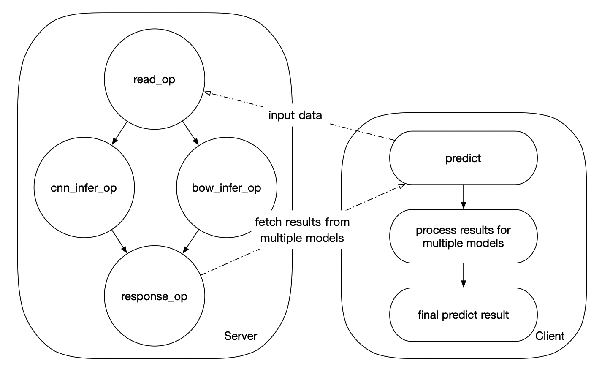

# Model Ensemble in Paddle Serving

([简体中文](Model_Ensemble_CN.md)|English)

In some scenarios, multiple models with the same input may be used to predict in parallel and integrate predicted results for better prediction effect. Paddle Serving also supports this feature.

Next, we will take the text classification task as an example to show model ensemble in Paddle Serving (This feature is still serial prediction for the time being. We will support parallel prediction as soon as possible).

## Simple example

In this example (see the figure below), the server side predict the bow and CNN models with the same input in a service in parallel, The client side fetchs the prediction results of the two models, and processes the prediction results to get the final predict results.



It should be noted that at present, only multiple models with the same format input and output in the same service are supported. In this example, the input and output formats of CNN and BOW model are the same.

The code used in the example is saved in the `examples/C++/imdb` path:

```shell
.
├── get_data.sh
├── imdb_reader.py
├── test_ensemble_client.py
└── test_ensemble_server.py
```

### Prepare data

Get the pre-trained CNN and BOW models by the following command (you can also run the `get_data.sh` script):

```shell
wget --no-check-certificate https://fleet.bj.bcebos.com/text_classification_data.tar.gz
wget --no-check-certificate https://paddle-serving.bj.bcebos.com/imdb-demo/imdb_model.tar.gz
tar -zxvf text_classification_data.tar.gz
tar -zxvf imdb_model.tar.gz
```

### Start server

Start server by the following Python code (you can also run the `test_ensemble_server.py` script):

```python
from paddle_serving_server import OpMaker
from paddle_serving_server import OpGraphMaker
from paddle_serving_server import Server

op_maker = OpMaker()
read_op = op_maker.create('GeneralReaderOp')
cnn_infer_op = op_maker.create(
    'GeneralInferOp', engine_name='cnn', inputs=[read_op])
bow_infer_op = op_maker.create(
    'GeneralInferOp', engine_name='bow', inputs=[read_op])
response_op = op_maker.create(
    'GeneralResponseOp', inputs=[cnn_infer_op, bow_infer_op])

op_graph_maker = OpGraphMaker()
op_graph_maker.add_op(read_op)
op_graph_maker.add_op(cnn_infer_op)
op_graph_maker.add_op(bow_infer_op)
op_graph_maker.add_op(response_op)

server = Server()
server.set_op_graph(op_graph_maker.get_op_graph())
model_config = {cnn_infer_op: 'imdb_cnn_model', bow_infer_op: 'imdb_bow_model'}
server.load_model_config(model_config)
server.prepare_server(workdir="work_dir1", port=9393, device="cpu")
server.run_server()
```

Different from the normal prediction service, here we need to use DAG to describe the logic of the server side.

When creating an Op, you need to specify the predecessor of the current Op (in this example, the predecessor of `cnn_infer_op` and `bow_infer_op` is `read_op`, and the predecessor of `response_op` is `cnn_infer_op` and `bow_infer_op`. For the infer Op `infer_op`, you need to define the prediction engine name `engine_name` (You can also use the default value. It is recommended to set the value to facilitate the client side to obtain the order of prediction results).

At the same time, when configuring the model path, you need to create a model configuration dictionary with the infer Op as the key and the corresponding model path as value to inform Serving which model each infer OP uses.

### Start client

Start client by the following Python code (you can also run the `test_ensemble_client.py` script):

```python
from paddle_serving_client import Client
from imdb_reader import IMDBDataset

client = Client()
# If you have more than one model, make sure that the input
# and output of more than one model are the same.
client.load_client_config('imdb_bow_client_conf/serving_client_conf.prototxt')
client.connect(["127.0.0.1:9393"])

# you can define any english sentence or dataset here
# This example reuses imdb reader in training, you
# can define your own data preprocessing easily.
imdb_dataset = IMDBDataset()
imdb_dataset.load_resource('imdb.vocab')

for i in range(3):
    line = 'i am very sad | 0'
    word_ids, label = imdb_dataset.get_words_and_label(line)
    feed = {"words": word_ids}
    fetch = ["acc", "cost", "prediction"]
    fetch_maps = client.predict(feed=feed, fetch=fetch)
    if len(fetch_maps) == 1:
        print("step: {}, res: {}".format(i, fetch_maps['prediction'][0][1]))
    else:
        for model, fetch_map in fetch_maps.items():
            print("step: {}, model: {}, res: {}".format(i, model, fetch_map[
                'prediction'][0][1]))
```

Compared with the normal prediction service, the client side has not changed much. When multiple model predictions are used, the prediction service will return a dictionary with engine name `engine_name`(the value is defined on the server side) as the key, and the corresponding model prediction results as the value.

### Expected result

```shell
step: 0, model: cnn, res: 0.560272455215
step: 0, model: bow, res: 0.633530199528
step: 1, model: cnn, res: 0.560272455215
step: 1, model: bow, res: 0.633530199528
step: 2, model: cnn, res: 0.560272455215
step: 2, model: bow, res: 0.633530199528
```
