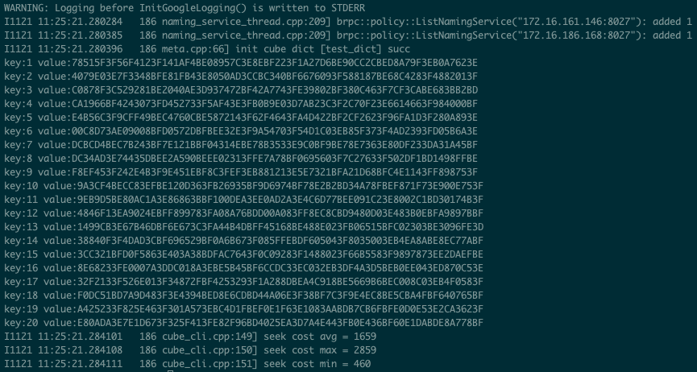

# 稀疏参数索引服务Cube单机版使用指南

(简体中文|[English](./Cube_Local_EN.md))

## 引言

在python/examples下有两个关于CTR的示例，他们分别是criteo_ctr, criteo_ctr_with_cube。前者是在训练时保存整个模型，包括稀疏参数。后者是将稀疏参数裁剪出来，保存成两个部分，一个是稀疏参数，另一个是稠密参数。由于在工业级的场景中，稀疏参数的规模非常大，达到10^9数量级。因此在一台机器上启动大规模稀疏参数预测是不实际的，因此我们引入百度多年来在稀疏参数索引领域的工业级产品Cube，提供分布式的稀疏参数服务。

<!--单机版Cube是分布式Cube的弱化版本，旨在方便开发者做实验和Demo时使用。如果有分布式稀疏参数服务的需求，请在读完此文档之后，继续阅读  [稀疏参数索引服务Cube使用指南](Cube_Local_CN.md)（正在建设中）。-->

本文档使用的都是未经过任何压缩算法处理的原始模型，如果有量化模型上线需求，请阅读[Cube稀疏参数索引量化存储使用指南](./Cube_Quant_CN.md)


## 示例
在Serving/examples/C++/PaddleRec/criteo_ctr_with_cube/下执行
```
python local_train.py # 训练模型
cp ../../../build_server/core/predictor/seq_generator seq_generator #复制Sequence File模型生成工具
cp ../../../build_server/output/bin/cube* ./cube/ #复制Cube应用程序
cp ../../../build_server/core/cube/cube-api/cube-cli ./cube/ # 复制Cube-Cli
cube_prepare.sh & #启动配送脚本
```
此示例是从模型训练到配送给Cube的全套流程，接下来会一一介绍。

## 单机版Cube组件介绍


### cube-builder

cube-builder是把模型生成分片文件和版本管理的工具。由于cube是用于分布式的稀疏参数服务，对于分布式当中的每一个节点，需要加载不同的分片，然而生成的稀疏参数文件往往一个大文件，就需要用哈希函数将其分割为不同的分片。与此同时，工业级的场景需要支持定期模型的配送和流式训练，因此对于模型的版本管理十分重要，这也是在训练保存模型时缺失的部分，因此cube-builder在生成分片的同时，也可以人为指定增加版本信息。

### cube-server

cube-server基于Cube的KV能力，对外提供稀疏参数服务，它通过brpc提供高性能分布式查询服务，通过RestAPI来进行远端调用。

### cube-cli

cube-cli是cube-server的客户端，这部分已经被整合到paddle serving当中，当我们准备好cube.conf配置文件并在paddle serving server的代码中指定kv_infer相关的op时，cube-cli就会在serving端准备就绪。

## 模型配送步骤
### 前序步骤

需要训练出模型文件，并复制相关build_server目录下的应用程序
```
python local_train.py
cp ../../../build_server/core/predictor/seq_generator seq_generator #复制Sequence File模型生成工具
cp ../../../build_server/output/bin/cube* ./cube/ #复制Cube应用程序
cp ../../../build_server/core/cube/cube-api/cube-cli ./cube/ # 复制Cube-Cli
```

### 模型文件生成Sequence File

为了让模型参数从训练端配送到预测端，我们需要把训练好的模型从Paddle 模型保存格式转换成Sequence File格式。

**为什么是 Sequence File?**
Sequence File是Hadoop File System的通用格式。在文章的开头提到了分布式Cube可以为超大规模稀疏参数服务提供支持，而大规模的稀疏参数在实际生产环境中保存在分布式文件系统当中，Hadoop File System是业界开源的最稳定的分布式文件系统之一，因此Sequence File格式成为了Cube加载模型的文件格式。

```
mkdir -p cube_model
mkdir -p cube/data
./seq_generator ctr_serving_model/SparseFeatFactors ./cube_model/feature
```

### 生成分片文件

在单机版的环境下，分片数为1。执行

```
./cube/cube-builder -dict_name=test_dict -job_mode=base -last_version=0 -cur_version=0 -depend_version=0 -input_path=./cube_model -output_path=./cube/data -shard_num=1  -only_build=false

```

### 配送给Cube-Server


单机版本的配送过程非常简单，只需要在cube二进制程序所在目录下的data文件夹存放index.前缀的文件即可。

```
mv ./cube/data/0_0/test_dict_part0/* ./cube/data/
cd cube && ./cube &
```

### Cube-Client 验证配送是否成功
此步非必须，用于测试配送是否成功
```
cd cube
./cube-cli -dict_name=test_dict -keys  keys -conf ./cube/cube.conf
```

如果查看到每个key都有对应的value输出，就说明配送成功。此文件也可以被Serving使用，用作Serving中 general kv infer op中进行cube查询。

如果执行成功，会看到如下结果
<p align="center">
    
</p>


## 注： 配置文件
以Serving/examples/C++/PaddleRec/criteo_ctr_with_cube/cube/conf下的cube.conf示例，此文件被上述的cube-cli所使用，单机版用户可以直接使用不用关注此部分，它在分布式部署中更为重要。

```
[{
    "dict_name": "test_dict",  //表名
    "shard": 1,  //分片数
    "dup": 1,  //副本数
    "timeout": 200,
    "retry": 3,
    "backup_request": 100,
    "type": "ipport_list",
    "load_balancer": "rr",
    "nodes": [{
        "ipport_list": "list://127.0.0.1:8027" //IP列表
    }]
}]
```
