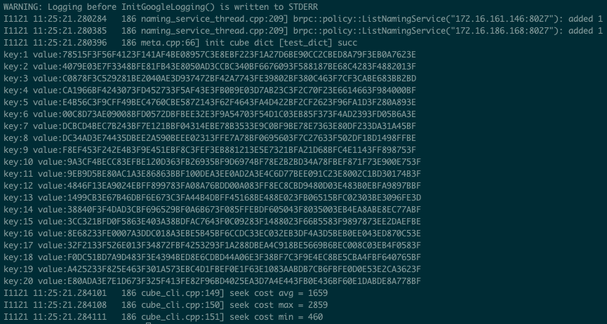

# Cube: Sparse Parameter Indexing Service (Local Mode)

([简体中文](./Cube_Local_CN.md)|English)

## Overview

There are two examples on CTR under python / examples, they are criteo_ctr, criteo_ctr_with_cube. The former is to save the entire model during training, including sparse parameters. The latter is to cut out the sparse parameters and save them into two parts, one is the sparse parameter and the other is the dense parameter. Because the scale of sparse parameters is very large in industrial cases, reaching the order of 10 ^ 9. Therefore, it is not practical to start large-scale sparse parameter prediction on one machine. Therefore, we introduced Baidu's industrial-grade product Cube to provide the sparse parameter service for many years to provide distributed sparse parameter services.

The local mode of Cube is different from distributed Cube, which is designed to be convenient for developers to use in experiments and demos. 
<!--If there is a demand for distributed sparse parameter service, please continue reading [Quantization Storage on Cube Sparse Parameter Indexing](./Cube_Quant_EN.md) after reading this document (still developing).-->

This document uses the original model without any compression algorithm. If there is a need for a quantitative model to go online, please read the [Quantization Storage on Cube Sparse Parameter Indexing](./Cube_Quant_EN.md)

## Example
in directory Serving/examples/C++/PaddleRec/criteo_ctr_with_cube, run

```
python local_train.py # train model
cp ../../../build_server/core/predictor/seq_generator seq_generator # copy Sequence File generator
cp ../../../build_server/output/bin/cube* ./cube/ # copy Cube tool kits
cp ../../../build_server/core/cube/cube-api/cube-cli ./cube/ # copy Cube Client
cube_prepare.sh & # start deliver script
```
you will convert the Sparse Parameters from trained model to the Cube Server.

## Components of Cube

### cube-builder

cube-builder is a tool for generating model shard files and version management. As the cube is used for distributed sparse parameter services, for each node in the distribution, different shards need to be loaded. However, the generated sparse parameter file is often a large file, and it needs to be divided into different shards by a hash function. At the same time, industrial-level scenarios need to support regular model distribution and streaming training, so it is very important for the version management of the model. This is also the missing part when training and saving the model. Therefore, while the cube-builder generates the shards, You can also manually specify version information.

### cube-server

The cube-server is based on the sparse parameter indexing, providing the sparse parameter service. It provides high-performance distributed query service through brpc, and makes remote calls through RestAPI.

### cube-cli

cube-cli is the client of cube-server. This part has been integrated into paddle serving. When we prepare the cube.conf configuration file and specify the kv_infer related op in the code of paddle serving server, cube-cli will Ready on the serving side.


## Serving the Model Step by Step
### precondition

we need a trained model, and copy the tool kits from build_server folder.
```
python local_train.py # train model
cp ../../../build_server/core/predictor/seq_generator seq_generator  # copy Sequence File generator
cp ../../../build_server/output/bin/cube* ./cube/ # copy Cube tool kits
cp ../../../build_server/core/cube/cube-api/cube-cli ./cube/ # copy Cube Client
```

### Generate Sequence File from Sparse Parameter

In order to get the model parameters from the training end to the prediction end, we need to convert the trained model from the Paddle model save format to the Sequence File format.

**why is Sequence File?**
Sequence File is a common format for the Hadoop File System. It was mentioned at the beginning of the article that distributed cubes can provide support for ultra-large-scale sparse parameter services, and large-scale sparse parameters are stored in distributed file systems in actual production environments. Hadoop File System is one of the most stable distributed open source. So the Sequence File format became the file format for the Cube loading model.

```
mkdir -p cube_model
mkdir -p cube/data
./seq_generator ctr_serving_model/SparseFeatFactors ./cube_model/feature
```

### Generating Shards

For the local version of Cube, the number of shard is 1. run

```
cube-builder -dict_name=test_dict -job_mode=base -last_version=0 -cur_version=0 -depend_version=0 -input_path=./cube_model -output_path=./cube/data -shard_num=1  -only_build=false
```


### Deliver to Cube-Server

The process of the cube local version is very simple, you only need to store the index files. in ./data folder where the cube binary program is located.
```
mv ./cube/data/0_0/test_dict_part0/* ./cube/data/
cd cube && ./cube &
```


### Cube-Client Verification

this step is not necessary, but it can help you to verify if the model is ready.
```
./cube-cli -dict_name=test_dict -keys  keys -conf ./cube/cube.conf
```
if you succeed, you will see this
<p align="center">
    
</p>

If you see that each key has a corresponding value output, it means that the delivery was successful. This file can also be used by Serving to perform cube query in general kv infer op in Serving.


## Appendix: Configuration
the config file is cube.config located in Serving/examples/C++/PaddleRec/criteo_ctr_with_cube/cube/conf, this file is used by cube-cli.the Cube Local Mode users do not need to understand that just use it, it would be quite important in Cube Distributed Mode.

```
[{
    "dict_name": "test_dict",  //table name
    "shard": 1,  //shard num
    "dup": 1,  //duplicates
    "timeout": 200,
    "retry": 3,
    "backup_request": 100,
    "type": "ipport_list",
    "load_balancer": "rr",
    "nodes": [{
        "ipport_list": "list://127.0.0.1:8027" //IP list
    }]
}]
```
