# PaddlePaddle分布式训练和Serving流程化部署

* [ 1. 分布式训练](#head0)
	* [ 1.1 集群配置](#head1)
		* [1.1.1 创建集群](#head2)
		* [1.1.2 配置集群环境](#head3)
	* [1.2 配置开发机环境](#head4)
		* [1.2.1 安装KubeCtl](#head5)
		* [1.2.2 安装Helm](#head6)
		* [1.2.3 配置文件](#head7)
		* [1.2.4 安装Go](#head8)
	* [ 1.3 安装volcano](#head9)
	* [1.4 搭建HTTP File Server服务](#head91)
	* [1.5 执行训练](#head10)
	* [1.6 模型产出](#head11)
		* [1.6.1 模型裁剪，产出预测ProgramDesc和dense参数](#head12)
		* [1.6.2 稀疏参数产出](#head13)
* [2. 大规模稀疏参数服务Cube的部署和使用](#head15)
	* [2.1 编译](#head16)
	* [2.2 分片cube server/agent部署](#head17)
		* [2.2.1 配置文件修改](#head18)
		* [2.2.2 拷贝可执行文件和配置文件到物理机](#head19)
		* [2.2.3 启动 cube server/agent](#head20)
	* [2.3 cube-builder部署](#head21)
		* [2.3.1 配置文件修改](#head22)
		* [2.3.2 拷贝可执行文件到物理机](#head23)
		* [2.3.3 启动cube-builder](#head24)
			* [2.3.3.1 接入配送流程](#head25)
			* [2.3.3.2 单机builder](#head26)
				* [base模式 ](#head27)
				* [delta模式](#head28)
		* [2.3.4 seqfile工具](#head29)
	* [2.4 cube-transfer部署](#head30)
		* [2.4.1 cube-transfer配置修改](#head31)
		* [2.4.2 拷贝cube-transfer到物理机](#head32)
		* [2.4.3 启动cube-transfer](#head33)
		* [2.4.4 cube-transfer支持查询接口](#head34)
		* [2.4.5 donefile格式协议](#head35)
* [3. 预测服务部署](#head36)
	* [3.1 Server端](#head37)
		* [3.1.1 Cube服务](#head38)
		* [3.1.2 Serving编译](#head39)
		* [3.1.3 配置修改](#head40)
			* [3.1.3.1 conf/gflags.conf](#head41)
			* [3.1.3.2 conf/model_toolkit.prototxt](#head42)
			* [3.1.3.3 conf/cube.conf](#head43)
			* [3.1.3.4 模型文件](#head44)
		* [3.1.4 启动Serving](#head45)
	* [3.2 Client端](#head46)
		* [3.2.1 测试数据](#head47)
		* [3.2.2 Client编译与部署](#head48)
			* [3.2.2.1 配置修改](#head49)
			* [3.2.2.2 运行服务](#head50)
	
---

在搜索、推荐、在线广告等业务场景中，embedding参数的规模常常非常庞大，达到数百GB甚至T级别；训练如此规模的模型需要用到多机分布式训练能力，将参数分片更新和保存；另一方面，训练好的模型，要应用于在线业务，也难以单机加载。Paddle Serving提供大规模稀疏参数读写服务，用户可以方便地将超大规模的稀疏参数以kv形式托管到参数服务，在线预测只需将所需要的参数子集从参数服务读取回来，再执行后续的预测流程。

本文以CTR预估任务为例，提供一个完整的基于PaddlePaddle的分布式训练和Serving的流程化部署过程。基于此流程，用户可定制自己的端到端深度学习训练和应用解决方案。

本文演示的基于PaddlePaddle的分布式训练和Serving流程化部署，基于CTR预估任务，原始模型可参见[PaddlePaddle公开模型github repo](https://github.com/PaddlePaddle/models/tree/develop/PaddleRec/ctr)。 整体拓扑架构如下图所示：

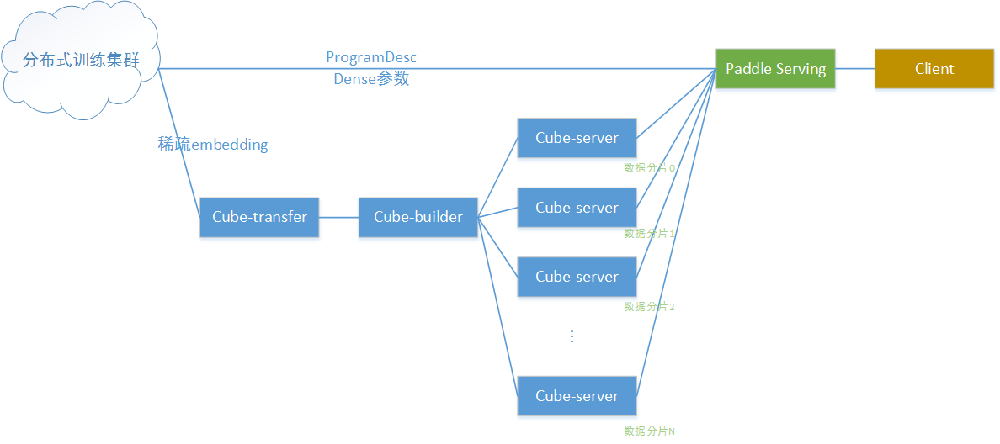

其中：
1. 分布式训练集群在百度云k8s集群上搭建，并通过[volcano](https://volcano.sh/)提交分布式训练任务和资源管理
2. 分布式训练产出dense参数和ProgramDesc，通过http服务直接下载到Serving端，给Serving加载
3. 分布式训练产出sparse embedding，由于体积太大，通过cube稀疏参数服务提供给serving访问
4. 在线预测时，Serving通过访问cube集群获取embedding数据，与dense参数配合完成预测计算过程

以下从4部分分别介绍上图中各个组件：
1. 分布式训练集群和训练任务提交
2. 稀疏参数服务部署与使用
3. Paddle Serving的部署
4. 客户端访问Paddle Serving完成CTR预估任务预测请求


## <span id="head0"> 1. 分布式训练</span>

分布式训练采用[volcano](https://github.com/volcano-sh/volcano)开源框架以及云平台实现，文档中以[百度智能云](https://cloud.baidu.com/?from=console)以及CTR预估模型为例，演示如何实现大规模稀疏参数模型的分布式训练。

### <span id="head1"> 1.1 集群配置</span>

#### <span id="head2">1.1.1 创建集群</span>

登录百度智能云官网，参考[帮助文档](https://cloud.baidu.com/doc/CCE/s/zjxpoqohb)创建容器引擎。

#### <span id="head3">1.2.1 配置集群环境</span>

进入“产品服务>容器引擎CCE”，点击“集群管理>集群列表”，可看到用户已创建的集群列表。从集群列表中查看创建的集群信息。

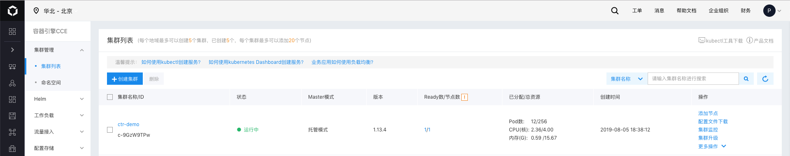

点击左侧的"Helm>Helm实例"，点击安装链接为集群一键安装helm。百度智能云为集群安装的helm版本为2.12.3，kubectl版本为1.13.4

为了能够从外部登录集群节点，需要为集群中安装了tiller的节点申请弹性公网。点击"更多操作>控制台"。

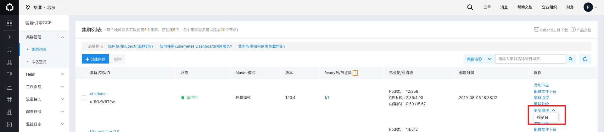

点击"命名空间"选择kube-system，点击"容器组"，查看tiller开头的节点。

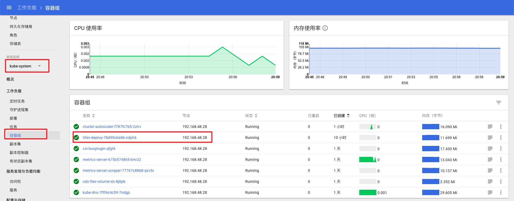

点击"产品服务>网络>弹性公网"


创建弹性公网实例，完成后选择创建的实例，点击"更多操作>绑定到BCC"，填写tiller开头的节点信息进行绑定。

### <span id="head4">1.2 配置开发机环境</span>

配置过程需要开发机的root权限。

#### <span id="head5">1.2.1 安装KubeCtl</span>

KubeCtl可以实现在本地开发机上连接百度智能云的Kubernets集群，建议参考百度云操作指南文档中[通过KubeCtl连接集群](https://cloud.baidu.com/doc/CCE/s/6jxpotcn5)部分进行安装。

#### <span id="head6">1.2.2 安装Helm</span>

建议参考[Helm官方安装文档](https://helm.sh/docs/using_helm/#installing-helm)进行安装。

**注意事项：** 开发机上的kubectl与helm的版本需要与集群上的版本相一致，目前百度智能云为集群安装的helm版本为2.12.3，kubectl版本为1.13.4。

#### <span id="head7">1.2.3 配置文件</span>

点击"集群列表"界面的"配置文件下载"，下载配置文件。

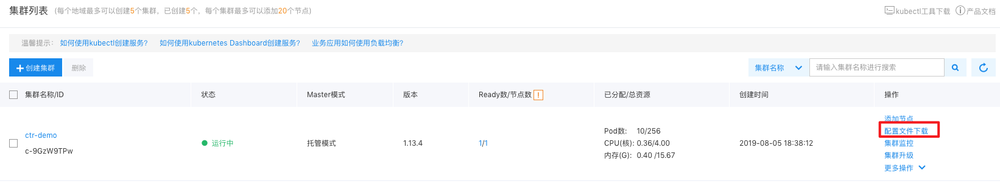

将下载的配置文件移动到~/.kube文件夹下，文件名修改为config。

通过之前创建的弹性公网ip登录运行tiller的节点，账户密码为创建集群时设置的账户和密码，默认账户为root。

将节点上的以下三个文件

> /etc/kubernetes/pki/ca.pem
>
> /etc/kubernetes/pki/admin.pem
>
> /etc/kubernetes/pki/admin-key.pem

下载至开发机并放在相同的路径，添加四个环境变量

```bash
export HELM_TLS_ENABLE=true

export HELM_TLS_CA_CERT=/etc/kubernetes/pki/ca.pem

export HELM_TLS_CERT=/etc/kubernetes/pki/admin.pem

export HELM_TLS_KEY=/etc/kubernetes/pki/admin-key.pem
```

分别执行`kubectl version`与`helm version`，如果返回client端与server端信息，则证明配置成功。

示例：

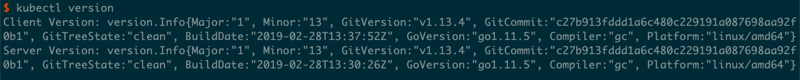

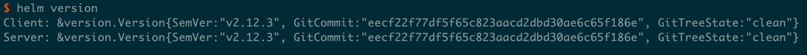

如果只返回client端信息，server端信息显示"Forbidden"，检查开发机是否使用了代理，若有可以尝试关闭代理再次执行命令检查。

#### <span id="head8">1.2.4 安装Go</span>

推荐安装Go 1.12

下载安装包

```bash
wget https://studygolang.com/dl/golang/go1.12.7.linux-amd64.tar.gz --no-check-certificate
```

解压到 /usr/local/路径下

```bash
tar zxvf go1.12.7.linux-amd64.tar.gz -C /usr/local/
```

设置环境变量

```bash
export GOPATH=/usr/local/go
export PATH=/usr/local/go/bin:$PATH
```

### <span id="head9"> 1.3 安装volcano</span>

参考[volcano官方文档](https://github.com/volcano-sh/volcano#quick-start-guide)。

通过yaml文件安装

```bash
kubectl apply -f https://raw.githubusercontent.com/volcano-sh/volcano/master/installer/volcano-development.yaml
```

安装完成后执行`kubectl get pods --namespace volcano-system`

若出现以下信息则证明安装成功：

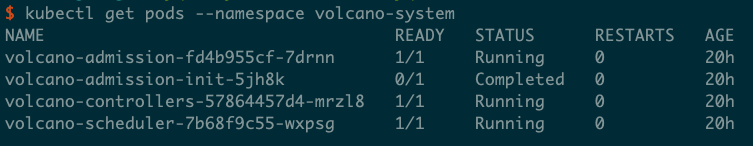

### <span id="head91">1.4 搭建HTTP File Server服务</span>

无论是dense参数还是Sparse参数，在生成之后，都需要以某种方式将文件服务暴露出来。dense参数需要配送给Paddle Serving，稀疏参数需要配速给Cube大规模稀疏参数服务器。

配送的方式是通过K8S集群建立一个Http file server的pod，再通过注册负载均衡 load balancer service，映射file server的port给load balancer，最终可以直接通过公网IP：Port的方式来访问HTTP File Server。


fileserver.yaml 一同包含两个部分，第一个是file server pod的配置，这样可以启动file server的docker镜像，并暴露文件服务端口。第二个是load balancer的配置，这样可以启动load balancer分配公网IP并且映射文件服务端口给公网。 [fileserver.yaml](./resource/fileserver.yaml) 文件示例如下：
```yaml
apiVersion: v1
kind: Pod
metadata:
  name: file-server
  labels:
    app: file-server
spec:
  volumes:
  - hostPath:
      path: /home/work
      type: ""
    name: file-home
  containers:
  - name: file-server
    image: halverneus/static-file-server
    ports:
    - containerPort: 8080
    volumeMounts:
    - mountPath: /web
      name: file-home
  nodeSelector:
    nodeType: model
---
kind: Service
apiVersion: v1
metadata:
  name: loadbalancer
spec:
  type: LoadBalancer
  ports:
    - name: file-server
      port: 8080
      targetPort: 8080
  selector:
    app: file-server
```

具体步骤如下

执行

```bash
kubectl apply -f fileserver.yaml 
```

两项配置都执行成功之后，执行

```bash
kubectl get pod
```

会显示file-server，如下图所示。

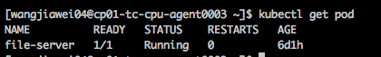

```bash
kubectl get service 
```

会显示load balancer，如下图所示。

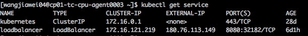

其中External IP就是文件服务的公网IP，我们可以在任意一台可以连接公网的计算机上，输入wget http://IP:Port 。例如图片中的示例，输入wget http://180.76.113.149:8080 。

如果显示下载了 index.html


就说明服务搭建成功。


### <span id="head10">1.5 执行训练</span>

创建cluster role和service account，[defaultserviceaccountclusterrole.yaml](./resource/defaultserviceaccountclusterrole.yaml) 文件示例如下：

```yaml
kind: ClusterRole
apiVersion: rbac.authorization.k8s.io/v1
metadata:
name: default
namespace: default
rules:
- apiGroups: [""]
resources: ["pods"]
verbs: ["get", "list", "watch"]

---
kind: ClusterRoleBinding
apiVersion: rbac.authorization.k8s.io/v1
metadata:
name: default
namespace: default
subjects:
- kind: ServiceAccount
name: default
namespace: default
roleRef:
kind: ClusterRole
name: default
apiGroup: rbac.authorization.k8s.io
```

执行

```bash
kubectl create -f defaultserviceaccountclusterrole.yaml 
```

CTR模型的训练镜像存放在[dockerhub](https://hub.docker.com/)网站，通过kubectl加载yaml文件启动训练任务，CTR预估模型训练任务的yaml文件为[volcano-ctr-demo-baiduyun.yaml](./resource/volcano-ctr-demo-baiduyun.yaml)。

执行

```bash
kubectl apply -f volcano-ctr-demo-baiduyun.yaml
```

通过`kubectl get pods`命令可以查看训练任务的运行情况

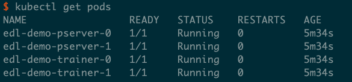

通过`kubectl logs $POD_NAME`可以查看对应的日志，例如`kubectl logs edl-demo-trainer-0`

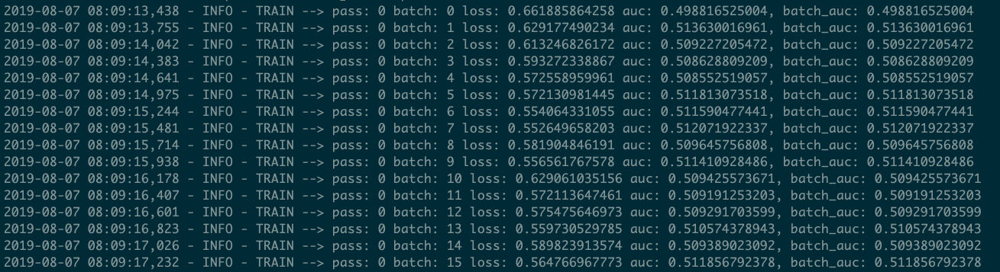

也可以通过百度云平台提供的web页面观察集群的工作负载

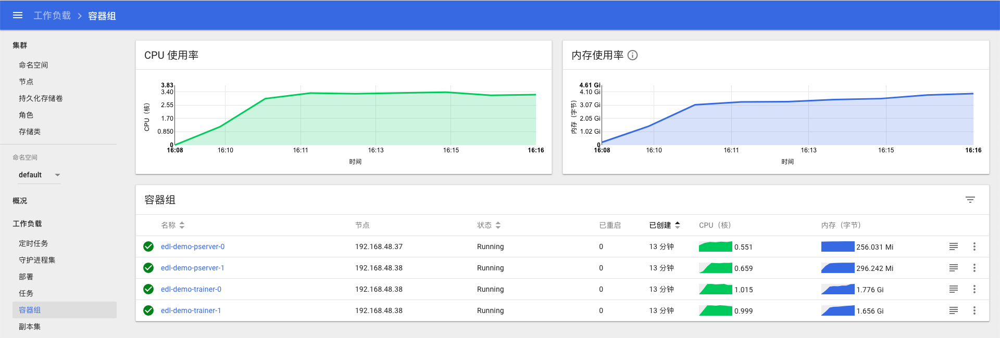

### <span id="head11">1.6 模型产出</span>

CTR预估模型包含了embedding部分以及dense神经网络两部分，其中embedding部分包含的稀疏参数较多，在某些场景下单机的资源难以加载整个模型，因此需要将这两部分分割开来，稀疏参数部分放在分布式的稀疏参数服务，dense网络部分加载到serving服务中，稀疏参数和dense网络都需要通过http file server服务来进行配送（详见本文"1.4 搭建HTTP File Server服务"一节）。在本文中使用的CTR模型训练镜像中已经包含了模型裁剪和稀疏参数产出的脚本，以下简述其原理和工作过程。

#### <span id="head12">1.6.1 模型裁剪，产出预测ProgramDesc和dense参数</span>

产出用于paddle serving预测服务的dense模型需要对保存的原始模型进行裁剪操作，修改模型的输入以及内部结构。具体原理和操作流程请参考文档[改造CTR预估模型用于大规模稀疏参数服务演示](https://github.com/PaddlePaddle/Serving/blob/develop/doc/CTR_PREDICTION.md)。

在trainer镜像中，模型裁剪的主要交互流程是：

1. 监视训练脚本所在目录的models文件夹，当发现有子目录`pass-1000`时，表示训练任务完成 (默认训练轮次为1000)
2. 调用save_program.py，生成一个适用于预测的ProgramDesc保存到models/inference_only目录，并将所需参数一并保存到该子目录下
3. 调用replace_params.py，用models/pass-1000目录下参数文件替换models/inference_only目录下同名参数文件
4. 打包models/inference_only生成ctr_model.tar.gz，放到HTTP服务目录下(详见本文"1.4 搭建HTTP File Server服务"一节），供外部用户手动下载，并替换到Serving的data/models/paddle/fluid/ctr_prediction目录中 (详见本文“预测服务部署”一节)

#### <span id="head13">1.6.2 稀疏参数产出</span>

分布式稀疏参数服务由paddle serving的Cube模块实现。Cube服务接受的原始数据格式为Hadoop seqfile格式，因此需要对paddle保存出的模型文件进行格式转换。

在trainer镜像中，将模型参数转换为seqfile的主要流程是：

1. 监视训练脚本所在目录的models文件夹，当发现有子目录`pass-1000`时，表示训练任务完成 (默认训练轮次为1000)
2. 调用dumper.py，将models/pass-1000/SparseFeatFactors文件转换成seqfile格式，同时生成一个用于让下游cube-transfer下载完整数据的donefile文件，整个目录结构放到HTTP服务目录下(详见本文"1.4 搭建HTTP File Server服务"一节），供下游cube-transfer监听进程检测和下载 (详见本文“大规模稀疏参数服务Cube的部署和使用”一节)


## <span id="head15">2. 大规模稀疏参数服务Cube的部署和使用</span>

Cube大规模稀疏参数服务服务组件，用于承载超大规模稀疏参数的查询、更新等各功能。上述分布式训练产出的稀疏参数，在k8s中以http文件服务的形式提供下载；cube则负责将稀疏参数读取、加工，切分成多个分片，灌入稀疏参数服务集群，提供对外访问。

Cube一共拆分成四个组件，共同完成上述工作：

1. cube-transfer 负责监听上游数据产出，当判断到数据更新时，将数据下载到cube-builder建库端，然后将建库的数据配送到由多个物理节点组成的稀疏参数服务集群
2. cube-builder 负责从上游数据构建cube内部索引格式，并切分成多个分片，完成建库工作
3. cube-server 每个单独的cube服务承载一个分片的cube数据
4. cube-agent 与cube-server伴生部署，负责接受cube-transfer下发的指令，在本地执行实际的数据下载维护等操作

关于Cube的详细说明文档，请参考[Cube设计文档](https://github.com/PaddlePaddle/Serving/tree/develop/cube/doc/DESIGN.md)。

关于Cube的性能数据，请参考[Cube Benchmark](https://github.com/PaddlePaddle/Serving/blob/develop/cube/doc/performance.md)

本文仅描述从头部署Cube服务的流程。

### <span id="head16">2.1 编译</span>

Cube是Paddle Serving内置的组件，只要按常规步骤编译Serving即可。要注意的是，编译Cube需要Go语言编译器。

```bash
$ git clone https://github.com/PaddlePaddle/Serving.git
$ cd Serving
$ makedir build
$ cd build
$ cmake -DWITH_GPU=OFF .. # 不需要GPU
$ make -jN                # 这里可修改并发编译线程数
$ make install
$ cd output/
$ ls bin
cube  cube-builder  cube-transfer  pdcodegen
$ ls conf
gflags.conf  transfer.conf
```

其中：
1) bin/cube, bin/cube-agent, bin/cube-builder, bin/cube-transfer是上述3个组件的可执行文件。**bin/cube是cube-server的可执行文件**
2) conf/gflags.conf是配合bin/cube使用的配置文件，主要包括端口配置等等
3) conf/transfer.conf是配合bin/cube-transfer使用的配置文件，主要包括要监听的上游数据地址等等

接下来我们按cube server/agent, cube-builder, cube-transfer的顺序，介绍Cube的完整部署流程


### <span id="head17">2.2 分片cube server/agent部署</span>


#### <span id="head18">2.2.1 配置文件修改</span>

首先修改cube server的配置文件，将port改为我们需要的端口号，(当本机内存资源紧张时，将in_mem修改为false将以磁盘访问的模式启动cube server):

```
--port=8000
--dict_split=1
--in_mem=true
```

#### <span id="head19">2.2.2 拷贝可执行文件和配置文件到物理机</span>

将bin/cube,bin/cube-agent和conf/gflags.conf拷贝到多个物理机上。假设拷贝好的文件结构如下：

```bash
$ tree
.
|-- bin
|   `-- cube
|   `-- cube-agent
|-- conf
|   `-- gflags.conf
```

#### <span id="head20">2.2.3 启动 cube server/agent</span>

```bash
nohup bin/cube &
nohup bin/cube-agent -P 8001 &
```
其中cube-agent在启动命令中使用 -P 参数指定监听端口号，在./log文件夹可以查看cube server的日志。

### <span id="head21">2.3 cube-builder部署</span>

#### <span id="head22">2.3.1 配置文件修改</span>

cube-builder配置项说明：

均在启动参数中提交

参数项如下：

```
open_builder: Usage : ./open_build --help

Flags from /home/work/dangyifei/open-builder/src/main.cpp:
-cur_version (current version, no need) type: int32 default: 0                //单机builder模式下不需要
-depend_version (depend version, job mode delta need) type: int32 default: 0  //单机builder base模式下不需要，patch模式找到meta_info里的base的key
-dict_name (dict name, no need) type: string default: ""                      //词典名，单机builder模式下不加默认空，用来和版本拼接生成索引文件名
-input_path (source data input path) type: string default: ""               //必须，源数据所在路径，仅支持本地路径
-job_mode (job mode base/delta default:base) type: string default: "base"    //默认base模式，delta模式：-job_mode=delta
-last_version (last version, job mode delta need) type: int32 default: 0     //单机builder base模式下不需要，patch模式找到meta_info里的base的id
-master_address (master address, no need) type: string default: ""           //单机builder模式不需要，会把index meta信息写到本地output/meta_info目录下
-only_build (wheather build need transfer) type: bool default: true         //单机builder模式不需要，代表是不是单机builder，如果false会向master_address发送请求，将index meta信息写到远程
-output_path (source data input path) type: string default: ""       //必须，索引建库数据的输出路径，仅支持本地路径
-shard_num (shard num) type: int32 default: -1             //必须，数据切分的分片数量

```
#### <span id="head23">2.3.2 拷贝可执行文件到物理机</span>
需要将bin/cube-builder拷贝到物理机上。  
只利用builder工具建立索引无特殊位置要求，如果接入配送环节使用必须和cube-transfer同机部署。  
假设单独使用builder工具，文件结构如下：  

```
$ tree
`-- cube-builder
|-- source
|   `-- test_seqfile
|-- output
```

#### <span id="head24">2.3.3 启动cube-builder</span>
##### <span id="head25">2.3.3.1 接入配送流程</span>
拷贝bin/cube-builder和cube-transfer程序到同一机器。  
相关参数已经封装好，只需要在cube-transfer的conf/transfer.conf里配置好cube-builder的地址、源数据和建库数据output的地址即可， 执行cube-transfer时会通过配置文件中的路径调用cube-builder，所以通常不需要手动执行cube-builder。

##### <span id="head26"> 2.3.3.2 单机builder</span>

**假设分片数为2，词典名为test**

###### <span id="head27"> base模式</span>

启动cube-builder命令，参数中的路径需要为绝对路径

```bash
./cube-builder -input_path=${source} -output_path=${output} -shard_num=2 -dict_name=test
```
运行后会根据当前时间戳自动生成建库索引文件夹1565323045_1565323045和meta信息文件夹meta_info结构如下：
```
$ tree
`-- cube-builder
|-- source
|   `-- test_seqfile
`-- output
|-- 1565323045_1565323045
|   |-- test_part0
|   |   |-- data.0
|   |   |-- data.n
|   |   |-- index.0
|   |   `-- index.n
|   |-- test_part0.tar
|   |-- test_part0.tar.md5
|   |-- test_part1
|   |   |-- data.0
|   |   |-- data.n
|   |   |-- index.0
|   |   `-- index.n
|   |-- test_part1.tar
|   `-- test_part1.tar.md5
`-- meta_info
|-- 1565323045_1565323045_0_0.json
`-- 1565323045_1565323045_1_0.json
```
test_part0.tar和test_part0.tar.md5是shard0分片的数据和md5校验，1565323045_1565323045_0_0.json是0号分片的索引长度和数量，在对应版本的delta建库中需要。  
###### <span id="head28"> delta模式</span>
需要依赖于上次的base或者delta的id和key，1565323045_1565323045_0_0.json前一个时间戳是id，后一个是key（和分片数据的目录key_id相反），对应cube-builder输入参数-last_version和-depend_version，保持output和dict_name不变（builder会寻找上一轮的index meta信息）。  

启动cube-builder命令，参数中的路径需要为绝对路径

```bash
./cube-builder -input_path=${source} -output_path=${output} -shard_num=2 -depend_version=1565323045 -last_version=1565323045 -job_mode=delta -dict_name=test
```
运行后会根据当前时间戳自动生成delta建库索引文件夹1565323045_1565326078和meta信息文件夹meta_info结构如下：
```
$ tree
`-- cube-builder
|-- source
|   `-- test_seqfile
`-- output
|-- 1565323045_1565323045
|   |-- test_part0
|   |   |-- data.0
|   |   |-- data.n
|   |   |-- index.0
|   |   `-- index.n
|   |-- test_part0.tar
|   |-- test_part0.tar.md5
|   |-- test_part1
|   |   |-- data.0
|   |   |-- data.n
|   |   |-- index.0
|   |   `-- index.n
|   |-- test_part1.tar
|   `-- test_part1.tar.md5
|-- 1565323045_1565326078
|   |-- test_part0
|   |-- data.0
|   |   |-- data.n
|   |   |-- index.0
|   |   `-- index.n
|   |-- test_part0.tar
|   |-- test_part0.tar.md5
|   |-- test_part1
|   |   |-- data.0
|   |   |-- data.n
|   |   |-- index.0
|   |   `-- index.n
|   |-- test_part1.tar
|   `-- test_part1.tar.md5
`-- meta_info
|-- 1565323045_1565323045_0_0.json
|-- 1565323045_1565323045_0_0.json
|-- 1565326078_1565323045_0_0.json
`-- 1565326078_1565323045_1_0.json
```
#### <span id="head29">2.3.4 seqfile工具</span>
builder输入数据的源格式必须为seqfile，key为uint64（输入必须为二进制8个字节），value为序列化的二进制。   
提供明文转seqfile工具和读seqfile工具，位置在output/tool里kvtool.py和kv_to_seqfile.py。  
kvtool.py 是读seqfile工具，会输出读到的kv信息，参数是文件地址假设在/home/work/test下的seqfile，运行方式如下：

```
python kvtool.py /home/work/test/seqfile
```
kv_to_seqfile.py是明文转seqfile工具，依赖于kvtool.py，会将明文kv转为seqfile文件存储，并输出donefile，在kv_to_seqfile.py的27和30行修改输入和donefile路径：
```

BASE_DONEFILE = DATA_PATH + "donefile/base.txt"  #base donefile文件地址
SOURCE_FILE = './source/file.txt' #明文源数据路径
```
要求明文txt内的格式，每行一对kv，用:分割，示例如下：
```
1:1
2:2
10:10 11 12
11:this is eleven
12:value can string
1676869128226002114:48241    37064        91    -539    114    51    -122    269    229    -134    -282
1657749292782759014:167    40        98    27    117    10    -29    15    74    67    -54
```
### <span id="head30">2.4 cube-transfer部署</span>

#### <span id="head31">2.4.1 cube-transfer配置修改</span>

cube-transfer配置文件是conf/transfer.conf，配置比较复杂，配置文件中的路径需要为绝对路径，各个配置项含义如下：
```
[default]
dict_name: test_dict                                    //词典名
mode: base_delta                                    //配送模式base_only/base_delta
storage_place: LOCAL                                    //默认LOCAL，表示使用单机builder工具
buildtool_local: /home/work/test-builder/build/cube-builder            //build工具位置，必须在本地，绝对路径
donefile_address: /home/work/test-transfer/test_data/donefile            //donefile位置支持本地路径和远程ftp或者http服务(ftp://或者http://)，只到最后文件夹，文件夹内最多2个文件base.txt patch.txt
output_address: /home/work/test-transfer/test_data/output            //build后数据索引输出位置
tmp_address: /home/work/test-transfer/test_data/tmp                //transfer工具运行中临时文件存放位置
shard_num: 2                                        //分片数
copy_num: 1                                        //每片副本数
deploy_path: /home/work/test_dict                      //不用修改                          
transfer_address: 10.10.10.5                             //cube-transfer本机的ip

[cube_agent]
agent0_0: 10.10.220.15:8001                        //0号分片0号副本的agent ip:port
cube0_0: 10.10.220.15:8000:/ssd2/cube_open                //0号分片0号副本的cube，该路径下会存放配送的数据 ip:port:deploy_path
agent1_0: 10.10.180.40:8001                        //1号分片0号副本的agent ip:port
cube1_0: 10.10.180.40:8000:/home/disk1/cube_open             //1号分片0号副本的cube ，该路径下会存放配送的数据 ip:port:deploy_path
```

#### <span id="head32">2.4.2 拷贝cube-transfer到物理机</span>

将bin/cube-transfer和conf/transfer.conf拷贝到多个物理机上，构建output和tmp文件夹用来存放配送的中间文件。  
假设拷贝好的文件结构如下：

```
$ tree
.
|-- cube-transfer
|-- output
|-- tmp
`-- conf
|-- transfer.conf
```
#### <span id="head33">2.4.3 启动cube-transfer</span>
假设启动服务端口8099，-l参数是log等级 --config是配置文件位置，./log文件夹下可以查看cube-transfer的日志
```bash
./cube-transfer -p 8099 -l 4 --config conf/transfer.conf
```
配送完毕cube-transfer会进入监听数据更新的状态，日志以及命令行会输出以下信息


#### <span id="head34">2.4.4 cube-transfer支持查询接口</span>

> 获取当前词典状态  
> http://10.10.10.5:8099/dict/info  

> 获取实例当前状态  
> http://10.10.10.5:8099/instance/status  

> 获取配送历史从最近的base到当前正在配送的delta  
> http://10.10.10.5:8099/dict/deploy/history 

#### <span id="head35">2.4.5 donefile格式协议</span>

一旦cube-transfer部署完成，它就不断监听我们配置好的donefile数据位置，发现有数据更新后，即启动数据下载，然后通知cube-builder执行建库和配送流程，将新数据配送给各个分片的cube-server。  
id最好使用版本产出时间戳，base和patch每产出一条直接在donefile文件最后加一行即可，文件名固定base.txt、patch.txt  

>base.txt每行一条，id和key相同，目录下可有多个文件，不能有文件夹
>```
>{"id":"1562000400","key":"1562000400","input":"/home/work/test_data/input/seqfile"}
>```
>patch.txt每行一条，key为base的id
>```
>{"id":"1562000401","key":"1562000400","input":"/home/work/test_data/input/seqfile"}
>{"id":"1562000402","key":"1562000400","input":"/home/work/test_data/input/seqfile"}
>```

## <span id="head36">3. 预测服务部署</span>

### <span id="head37">3.1 Server端</span>

通过wget命令从集群获取dense部分模型用于Server端。

```bash
wget "http://${HTTP_SERVICE_IP}:${HTTP_SERVICE_PORT}/path/to/models"
```

K8s集群上CTR预估任务训练完成后，模型参数分成2部分：一是embedding数据，经过dumper.py已经转成hadoop SequenceFile格式，传输给cube建库流程构建索引和灌cube；二是除embedding之外的参数文件，连同save_program.py裁剪后的program，一起配合传输给Serving加载。save_program.py裁剪原始模型的具体背景和详细步骤请参考文档[Paddle Serving CTR预估模型说明](https://github.com/PaddlePaddle/Serving/blob/develop/doc/CTR_PREDICTION.md)。

本文介绍Serving使用上述模型参数和program加载模型提供预测服务的流程。

#### <span id="head38">3.1.1 Cube服务</span>

假设Cube服务已经成功部署，用于cube客户端API的配置文件如下所示：

```json
[{
"dict_name": "dict",
"shard": 2,
"dup": 1,
"timeout": 200,
"retry": 3,
"backup_request": 100,
"type": "ipport_list",
"load_balancer": "rr",
"nodes": [{
"ipport_list": "list://192.168.1.1:8000"
},{
"ipport_list": "list://192.168.1.2:8000"
}]
}]
```

上述例子中，cube提供外部访问的表名是`dict`，有2个物理分片，分别在192.168.1.1:8000和192.168.1.2:8000

**注意事项：** nodes中的ipport_list需要按照分片的顺序(参考cube-transfer配置文件)填写。

#### <span id="head39">3.1.2 Serving编译</span>

截至写本文时，Serving develop分支已经提供了CTR预估服务相关OP，参考[ctr_prediction_op.cpp](https://github.com/PaddlePaddle/Serving/blob/develop/demo-serving/op/ctr_prediction_op.cpp)，该OP从client端接收请求后会将每个请求的26个sparse feature id发给cube服务，获得对应的embedding向量，然后填充到模型feed variable对应的LoDTensor，执行预测计算。只要按常规步骤编译Serving即可。

```bash
$ git clone https://github.com/PaddlePaddle/Serving.git
$ cd Serving
$ makedir build
$ cd build
$ cmake -DWITH_GPU=OFF .. # 不需要GPU
$ make -jN                # 这里可修改并发编译线程数
$ make install
$ cd output/demo/serving
$ ls
bin  conf  data  kvdb  log
```

#### <span id="head40">3.1.3 配置修改</span>

##### <span id="head41">3.1.3.1 conf/gflags.conf</span>

将--enable_cube改为true:

```json
--enable_cube=true
```

##### <span id="head42">3.1.3.2 conf/model_toolkit.prototxt</span>

Paddle Serving自带的model_toolkit.prototxt如下所示，如有必要可只保留ctr_prediction一个：

```
engines {
name: "image_classification_resnet"
type: "FLUID_CPU_NATIVE_DIR"
reloadable_meta: "./data/model/paddle/fluid_time_file"
reloadable_type: "timestamp_ne"
model_data_path: "./data/model/paddle/fluid/SE_ResNeXt50_32x4d"
runtime_thread_num: 0
batch_infer_size: 0
enable_batch_align: 0
}
engines {
name: "text_classification_bow"
type: "FLUID_CPU_ANALYSIS_DIR"
reloadable_meta: "./data/model/paddle/fluid_time_file"
reloadable_type: "timestamp_ne"
model_data_path: "./data/model/paddle/fluid/text_classification_lstm"
runtime_thread_num: 0
batch_infer_size: 0
enable_batch_align: 0
}

engines {
name: "ctr_prediction"
type: "FLUID_CPU_ANALYSIS_DIR"
reloadable_meta: "./data/model/paddle/fluid_time_file"
reloadable_type: "timestamp_ne"
model_data_path: "./data/model/paddle/fluid/ctr_prediction"
runtime_thread_num: 0
batch_infer_size: 0
enable_batch_align: 0
sparse_param_service_type: REMOTE
sparse_param_service_table_name: "dict"
}
```

**注意事项：** ctr_prediction model有如下2行配置：

```
sparse_param_service_type: REMOTE
sparse_param_service_table_name: "dict"
```

##### <span id="head43">3.1.3.3 conf/cube.conf</span>

conf/cube.conf是一个完整的cube配置文件模板，其中只要修改nodes列表为真实的物理节点IP:port列表即可。例如 （与第3.1.1节cube配置文件内容一致）：

```json
[{
"dict_name": "dict",
"shard": 2,
"dup": 1,
"timeout": 200,
"retry": 3,
"backup_request": 100,
"type": "ipport_list",
"load_balancer": "rr",
"nodes": [{
"ipport_list": "list://192.168.1.1:8000"
},{
"ipport_list": "list://192.168.1.2:8000"
}]
}]
```

**注意事项：** 如果修改了`dict_name`，需要同步修改3.1.3.2节中`sparse_param_service_table_name`字段

##### <span id="head44">3.1.3.4 模型文件</span>

Paddle Serving自带了一个可以工作的CTR预估模型，是从BCE上下载下来的，其制作方法为：
1. 分布式训练CTR预估任务，保存模型program和参数文件
2. 用save_program.py保存一份用于预测的program (文件名为**model**)。save_program.py随trainer docker image发布
3. 第2步中保存的program (**model**) 覆盖到第1步保存的模型文件夹中**model**文件，打包成.tar.gz上传到BCE

如果只是为了验证demo流程，serving此时已经可以用自带的CTR模型加载模型并提供预测服务能力。

为了应用重新训练的模型，只需要从k8s集群暴露的http服务下载新的ctr_model.tar.gz，解压到data/model/paddle/fluid下，并将内容移至原来的ctr_prediction目录即可：
```bash
$ cd data/model/paddle/fluid
$ wget http://${HTTP_SERVICE_IP}:${HTTP_SERVICE_PORT}/data/ctr_model.tar.gz
$ tar zxvf ctr_model.tar.gz # 假设解压出一个inference_only目录
$ rm -rf ctr_prediction     # 删除旧的ctr_prediction目录下内容
$ cp -r inference_only/* ctr_prediction
$ cd ../../../../           # 切换至serving所在目录
$ ls
bin  conf  data  kvdb  log
$ killall serving           # 杀死旧的serving进程
$ bin/serving &             # 重启serving
```

从K8S集群暴露的http服务下载训练模型，请参考文档[PaddlePaddle分布式训练和Serving流程化部署](http://icode.baidu.com/repos/baidu/personal-code/wangguibao/blob/master:ctr-embedding-to-sequencefile/path/to/doc/DISTRIBUTED_TRANING_AND_SERVING.md)

#### <span id="head45">3.1.4 启动Serving</span>

执行`./bin/serving  `启动serving服务，在./log路径下可以查看serving日志。

### <span id="head46">3.2 Client端</span>

参考[从零开始写一个预测服务：client端]([https://github.com/PaddlePaddle/Serving/blob/develop/doc/CREATING.md#3-client%E7%AB%AF](https://github.com/PaddlePaddle/Serving/blob/develop/doc/CREATING.md#3-client端))文档，实现client端代码。

文档中使用的CTR预估任务client端代码存放在Serving代码库demo-client路径下，链接[ctr_prediction.cpp](https://github.com/PaddlePaddle/Serving/blob/develop/demo-client/src/ctr_prediction.cpp)。

#### <span id="head47">3.2.1 测试数据</span>

CTR预估任务样例使用的数据来自于[原始模型](https://github.com/PaddlePaddle/models/tree/develop/PaddleRec/ctr)的测试数据，在样例中提供了1000个测试样本，如果需要更多样本可以参照原始模型下载数据的[脚本](https://github.com/PaddlePaddle/models/blob/develop/PaddleRec/ctr/data/download.sh)。

#### <span id="head48">3.2.2 Client编译与部署</span>

按照1.2Serving编译部分完成编译后，client端文件在output/demo/client/ctr_prediction路径下。

##### <span id="head49">3.2.2.1 配置修改</span>

修改conf/predictors.prototxt文件ctr_prediction_service部分

```
predictors {
name: "ctr_prediction_service"
service_name: "baidu.paddle_serving.predictor.ctr_prediction.CTRPredictionService"
endpoint_router: "WeightedRandomRender"
weighted_random_render_conf {
variant_weight_list: "50"
}
variants {
tag: "var1"
naming_conf {
cluster: "list://127.0.0.1:8010"
}
}
}
```

配置Server端ip与端口号，默认为本机ip、8010端口。

##### <span id="head50">3.2.2.2 运行服务</span>

执行`./bin/ctr_predictoin`启动client端，在./log路径下可以看到client端执行的日志。
