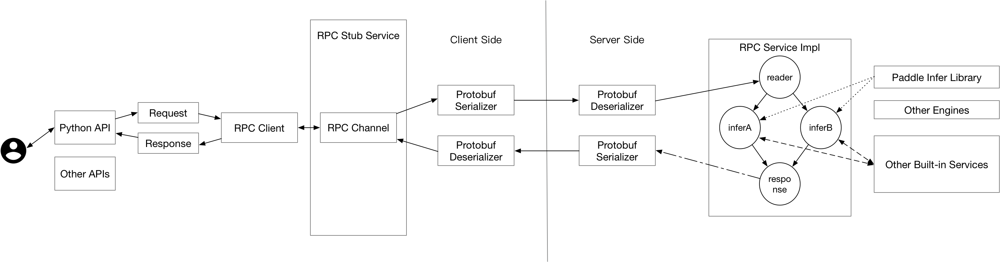
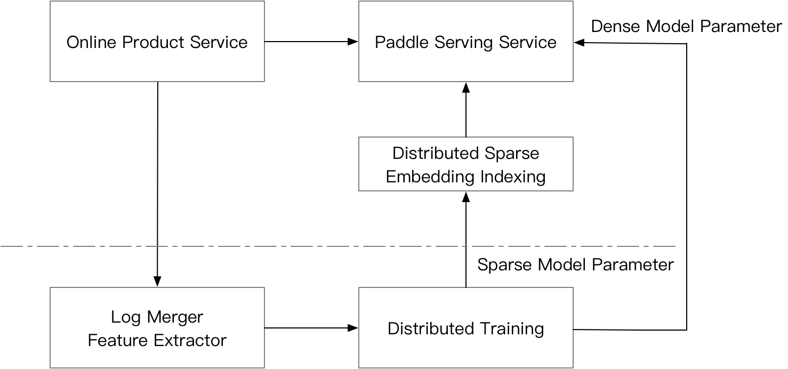

# Paddle Serving Design Doc

([简体中文](./DESIGN_DOC_CN.md)|English)

## 1. Design Objectives

- Long Term Vision: Online deployment of deep learning models will be a user-facing application in the future. Any AI developer will face the problem of deploying an online service for his or her trained model.
Paddle Serving is the official open source online deployment framework. The long term goal of Paddle Serving is to provide professional, reliable and easy-to-use online service to the last mile of AI application.

- Easy-To-Use: For algorithmic developers to quickly deploy their models online, Paddle Serving designs APIs that can be used with Paddle's training process seamlessly, most Paddle models can be deployed as a service with one line command.

- Industrial Oriented: To meet industrial deployment requirements, Paddle Serving supports lots of large-scale deployment functions: 1) Distributed Sparse Embedding Indexing. 2) Highly concurrent underlying communications. 3) Model Management, online A/B test, model online loading.

- Extensibility: Paddle Serving supports C++, Python and Golang client, and will support more clients with different languages. It is very easy to extend Paddle Serving to support other machine learning inference library, although currently Paddle inference library is the only official supported inference backend.


## 2. Module design and implementation

### 2.1 Python API interface design

#### 2.1.1 save a servable model
The inference phase of Paddle model focuses on 1) input variables of the model. 2) output variables of the model. 3) model structure and model parameters. Paddle Serving Python API provides a `save_model` interface for trained model, and save necessary information for Paddle Serving to use during deployment phase. An example is as follows:

``` python
import paddle_serving_client.io as serving_io
serving_io.save_model("serving_model", "client_conf",
                      {"words": data}, {"prediction": prediction},
                      fluid.default_main_program())
```
In the example, `{"words": data}` and `{"prediction": prediction}` assign the inputs and outputs of a model. `"words"` and `"prediction"` are alias names of inputs and outputs. The design of alias name is to help developers to memorize model inputs and model outputs. `data` and `prediction` are Paddle `[Variable](https://www.paddlepaddle.org.cn/documentation/docs/zh/api_cn/fluid_cn/Variable_cn.html#variable)` in training phase that often represents ([Tensor](https://www.paddlepaddle.org.cn/documentation/docs/zh/api_cn/fluid_cn/Tensor_cn.html#tensor)) or ([LodTensor](https://www.paddlepaddle.org.cn/documentation/docs/zh/beginners_guide/basic_concept/lod_tensor.html#lodtensor)). When the `save_model` API is called, two directories called `"serving_model"` and `"client_conf"` will be generated. The content of the saved model is as follows:

``` shell
.
├── client_conf
│   ├── serving_client_conf.prototxt
│   └── serving_client_conf.stream.prototxt
└── serving_model
    ├── embedding_0.w_0
    ├── fc_0.b_0
    ├── fc_0.w_0
    ├── fc_1.b_0
    ├── fc_1.w_0
    ├── fc_2.b_0
    ├── fc_2.w_0
    ├── lstm_0.b_0
    ├── lstm_0.w_0
    ├── __model__
    ├── serving_server_conf.prototxt
    └── serving_server_conf.stream.prototxt
```
`"serving_client_conf.prototxt"` and `"serving_server_conf.prototxt"` are the client side and the server side configurations of Paddle Serving, and `"serving_client_conf.stream.prototxt"` and `"serving_server_conf.stream.prototxt"` are the corresponding parts. Other contents saved in the directory are the same as Paddle saved inference model. We are considering to support `save_model` interface in Paddle training framework so that a user is not aware of the servable configurations. 

#### 2.1.2 Model loading on the server side

Prediction logics on the server side can be defined through Paddle Serving Server API with a few lines of code, an example is as follows:
``` python
import paddle_serving_server as serving
op_maker = serving.OpMaker()
read_op = op_maker.create('general_reader')
dist_kv_op = op_maker.create('general_dist_kv')
general_infer_op = op_maker.create('general_infer')
general_response_op = op_maker.create('general_response')

op_seq_maker = serving.OpSeqMaker()
op_seq_maker.add_op(read_op)
op_seq_maker.add_op(dist_kv_op)
op_seq_maker.add_op(general_infer_op)
op_seq_maker.add_op(general_response_op)
```
Current Paddle Serving supports operator list on the server side as follows:

<center>

| Op Name | Description |
|--------------|------|
| `general_reader` | General Data Reading Operator |
| `genreal_infer` | General Data Inference with Paddle Operator |
| `general_response` | General Data Response Operator |
| `general_dist_kv` | Distributed Sparse Embedding Indexing |

</center>

Paddle Serving supports inference engine on multiple devices. Current supports are CPU and GPU engine. Docker Images of CPU and GPU are provided officially. User can use one line command to start an inference service either on CPU or on GPU. 

``` shell
python -m paddle_serving_server.serve --model your_servable_model --thread 10 --port 9292
```
``` shell
python -m paddle_serving_server_gpu.serve --model your_servable_model --thread 10 --port 9292
```

Options of startup command are listed below: 
<center>

| Arguments | Types | Defaults | Descriptions |
|--------------|------|-----------|--------------------------------|
| `thread` | int | `4` | Concurrency on server side, usually equal to the number of CPU core |
| `port` | int | `9292` | Port exposed to users |
| `name` | str | `""` | Service name that if a user specifies, the name of HTTP service is allocated |
| `model` | str | `""` | Servable models for Paddle Serving |
| `gpu_ids` | str | `""` | Supported only in paddle_serving_server_gpu, similar to the usage of CUDA_VISIBLE_DEVICES |

</center>

For example, `python -m paddle_serving_server.serve --model your_servable_model --thread 10 --port 9292` is the same as the following code as user can define: 
``` python
from paddle_serving_server import OpMaker, OpSeqMaker, Server

op_maker = OpMaker()
read_op = op_maker.create('general_reader')
general_infer_op = op_maker.create('general_infer')
general_response_op = op_maker.create('general_response')
op_seq_maker = OpSeqMaker()
op_seq_maker.add_op(read_op)
op_seq_maker.add_op(general_infer_op)
op_seq_maker.add_op(general_response_op)
server = Server()
server.set_op_sequence(op_seq_maker.get_op_sequence())
server.set_num_threads(10)
server.load_model_config(”your_servable_model“)
server.prepare_server(port=9292, device="cpu")
server.run_server()
```

#### 2.1.3 Paddle Serving Client API
Paddle Serving supports remote service access through RPC(remote procedure call) and HTTP. RPC access of remote service can be called through Client API of Paddle Serving. A user can define data preprocess function before calling Paddle Serving's client API. The example below explains how to define the input data of Paddle Serving Client. The servable model has two inputs with alias name of `sparse` and `dense`. `sparse` corresponds to sparse sequence ids such as `[1, 1001, 100001]` and `dense` corresponds to dense vector such as `[0.2, 0.5, 0.1, 0.4, 0.11, 0.22]`. For sparse sequence data, current design supports `lod_level=0` and `lod_level=1` of Paddle, that corresponds to `Tensor` and `LodTensor`. For dense vector, current design supports any `N-D Tensor`. Users do not need to assign the shape of inference model input. The Paddle Serving Client API will check the input data's shape with servable configurations.

``` python
feed_dict["sparse"] = [1, 1001, 100001]
feed_dict["dense"] = [0.2, 0.5, 0.1, 0.4, 0.11, 0.22]
fetch_map = client.predict(feed=feed_dict, fetch=["prob"])
```

The following code sample shows that Paddle Serving Client API connects to Server API with endpoint of the servers. To use the data parallelism ability during prediction, Paddle Serving Client allows users to define multiple server endpoints.
``` python
client = Client()
client.load_client_config('servable_client_configs')
client.connect(["127.0.0.1:9292"])
```

### 2.2 Underlying Communication Mechanism
Paddle Serving adopts [baidu-rpc](https://github.com/apache/incubator-brpc) as underlying communication layer. baidu-rpc is an open-source RPC communication library with high concurrency and low latency advantages compared with other open source RPC library. Millions of instances and thousands of services are using baidu-rpc within Baidu.

### 2.3 Core Execution Engine
The core execution engine of Paddle Serving is a Directed acyclic graph(DAG). In the DAG, each node represents a phase of inference service, such as paddle inference prediction, data preprocessing and data postprocessing. DAG can fully parallelize the computation efficiency and can fully utilize the computation resources. For example, when a user has input data that needs to be feed into two models, and combine the scores of the two models, the computation of model scoring is parallelized through DAG.

<p align="center">
    <br>

    <br>
<p>

### 2.4 Micro service plugin
The underlying communication of Paddle Serving is implemented with C++ as well as the core framework, it is hard for users who do not familiar with C++ to implement new Paddle Serving Server Operators. Another approach is to use the light-weighted Web Service in Paddle Serving Server that can be viewed as a plugin. A user can implement complex data preprocessing and postprocessing logics to build a complex AI service. If access of the AI service has a large volumn, it is worth to implement the service with high performance Paddle Serving Server operators. The relationship between Web Service and RPC Service can be referenced in `User Type`.

## 3. Industrial Features

### 3.1 Distributed Sparse Parameter Indexing

Distributed Sparse Parameter Indexing is commonly seen in advertising and recommendation scenarios, and is often used coupled with distributed training. The figure below explains a commonly seen architecture for online recommendation. When the recommendation service receives a request from a user, the system will automatically collects training log for the offline distributed online training. Mean while, the request is sent to Paddle Serving Server. For sparse features, distributed sparse parameter index service is called so that sparse parameters can be looked up. The dense input features together with the looked up sparse model parameters are fed into the Paddle Inference Node of the DAG in Paddle Serving Server. Then the score can be responsed through RPC to product service for item ranking.

<p align="center">
    <br>

    <br>
<p>
Why do we need to support distributed sparse parameter indexing in Paddle Serving? 1) In some recommendation scenarios, the number of features can be up to hundreds of billions that a single node can not hold the parameters within random access memory. 2) Paddle Serving supports distributed sparse parameter indexing that can couple with paddle inference. Users do not need to do extra work to have a low latency inference engine with hundreds of billions of parameters.

### 3.2 Online A/B test

After sufficient offline evaluation of the model, online A/B test is usually needed to decide whether to enable the service on a large scale. The following figure shows the basic structure of A/B test with Paddle Serving. After the client is configured with the corresponding configuration, the traffic will be automatically distributed to different servers to achieve A/B test. Please refer to [ABTEST in Paddle Serving](ABTEST_IN_PADDLE_SERVING.md) for specific examples.

<p align="center">
    <br>

    <br>
<p>


### 3.3 Model Online Reloading     

In order to ensure the availability of services, the model needs to be hot loaded without service interruption. Paddle Serving supports this feature and provides a tool for monitoring output models to update local models. Please refer to [Hot loading in Paddle Serving](HOT_LOADING_IN_SERVING.md) for specific examples.

### 3.4 Model Management

Paddle Serving's C++ engine supports model management. Currently, python API is not released yet, please wait for the next release.

## 4. User Types
Paddle Serving provides RPC and HTTP protocol for users. For HTTP service, we recommend users with median or small traffic services to use, and the latency is not a strict requirement. For RPC protocol, we recommend high traffic services and low latency required services to use. For users who use distributed sparse parameter indexing built-in service, it is not necessary to care about the underlying details of communication. The following figure gives out several scenarios that user may want to use Paddle Serving. 

<p align="center">
    <br>

    <br>
<p>

For servable models saved from Paddle Serving IO API, users do not need to do extra coding work to startup a service, but may need some coding work on the client side. For development of Web Service plugin, a user needs to provide implementation of Web Service's preprocessing and postprocessing work if needed to get a HTTP service.

### 4.1 Web Service Development

Web Service has lots of open sourced framework. Currently Paddle Serving uses Flask as built-in service framework, and users are not aware of this. More efficient web service will be integrated in the furture if needed.

``` python
from paddle_serving_server.web_service import WebService
from imdb_reader import IMDBDataset
import sys


class IMDBService(WebService):
    def prepare_dict(self, args={}):
        if len(args) == 0:
            exit(-1)
        self.dataset = IMDBDataset()
        self.dataset.load_resource(args["dict_file_path"])

    def preprocess(self, feed={}, fetch=[]):
        if "words" not in feed:
            exit(-1)
        res_feed = {}
        res_feed["words"] = self.dataset.get_words_only(feed["words"])[0]
        return res_feed, fetch


imdb_service = IMDBService(name="imdb")
imdb_service.load_model_config(sys.argv[1])
imdb_service.prepare_server(
    workdir=sys.argv[2], port=int(sys.argv[3]), device="cpu")
imdb_service.prepare_dict({"dict_file_path": sys.argv[4]})
imdb_service.run_server()
```

`WebService` is a Base Class, providing inheritable interfaces such `preprocess` and `postprocess` for users to implement. In the inherited class of `WebService` class, users can define any functions they want and the startup function interface is the same as RPC service.

## 5. Future Plan

### 5.1 Open DAG definition API
Current version of Paddle Serving Server supports sequential type of execution flow. DAG definition API can be more helpful to users on complex tasks.

### 5.2 Auto Deployment on Cloud
In order to make deployment more easily on public cloud, Paddle Serving considers to provides Operators on Kubernetes in submitting a service job.

### 5.3 Vector Indexing and Tree based Indexing
In recommendation and advertisement systems, it is commonly seen to use vector based index or tree based indexing service to do candidate retrievals. These retrieval tasks will be built-in services of Paddle Serving.
