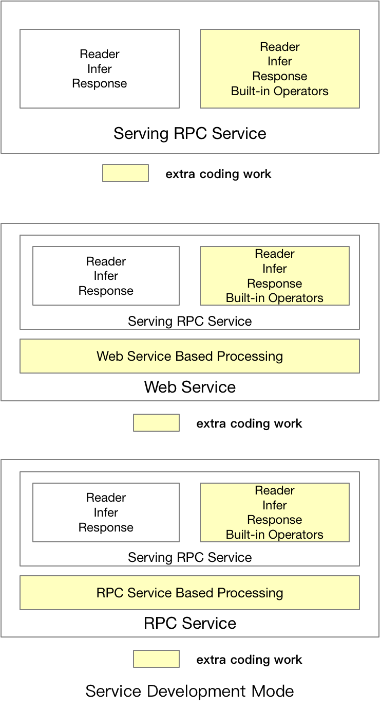

# Paddle Serving设计文档

## 1. 整体设计目标

- 长期使命：Paddle Serving是一个PaddlePaddle开源的在线服务框架，长期目标就是围绕着人工智能落地的最后一公里提供越来越专业、可靠、易用的服务。

- 工业级：为了达到工业级深度学习模型在线部署的要求，
Paddle Serving提供很多大规模场景需要的部署功能：1）分布式稀疏参数索引功能；2）高并发底层通信能力；3）模型管理、在线A/B流量测试、模型热加载。

- 简单易用：为了让使用Paddle的用户能够以极低的成本部署模型，PaddleServing设计了一套与Paddle训练框架无缝打通的预测部署API，普通模型可以使用一行命令进行服务部署。

- 功能扩展：当前，Paddle Serving支持C++、Python、Golang的客户端，未来也会面向不同类型的客户新增多种语言的客户端。在Paddle Serving的框架设计方面，尽管当前Paddle Serving以支持Paddle模型的部署为核心功能，
用户可以很容易嵌入其他的机器学习库部署在线预测。

## 2. 模块设计与实现

### 2.1 Python API接口设计

#### 2.1.1 训练模型的保存
Paddle的模型预测需要重点关注的内容：1）模型的输入变量；2）模型的输出变量；3）模型结构和模型参数。Paddle Serving Python API提供用户可以在训练过程中保存模型的接口，并将Paddle Serving在部署阶段需要保存的配置打包保存，一个示例如下：
``` python
import paddle_serving_client.io as serving_io
serving_io.save_model("serving_model", "client_conf",
                      {"words": data}, {"prediction": prediction},
                      fluid.default_main_program())
```

#### 2.1.2 服务端模型加载
当前Paddle Serving中的预估引擎支持在CPU/GPU上进行预测，对应的预测服务安装包以及镜像也有两个。但无论是CPU上进行模型预估还是GPU上进行模型预估，普通模型的预测都可用一行命令进行启动。
``` shell
python -m paddle_serving_server.serve --model your_servable_model --thread 10 --port 9292
```
``` shell
python -m paddle_serving_server_gpu.serve --model your_servable_model --thread 10 --port 9292
```
服务端的预测逻辑也可以通过Paddle Serving Server端的API进行人工定义，一个例子：
``` python
``` python
import paddle_serving_server as serving
op_maker = serving.OpMaker()
read_op = op_maker.create('general_reader')
dist_kv_op = op_maker.create('general_dist_kv')
general_infer_op = op_maker.create('general_infer')
general_response_op = op_maker.create('general_response')

op_seq_maker = serving.OpSeqMaker()
op_seq_maker.add_op(read_op)
op_seq_maker.add_op(dist_kv_op)
op_seq_maker.add_op(general_infer_op)
op_seq_maker.add_op(general_response_op)
```

当前Paddle Serving在Server端支持的主要Op请参考如下列表：

<center>

| Op 名称 | 描述 |
|--------------|------|
| `general_reader` | 通用数据格式的读取Op |
| `genreal_infer` | 通用数据格式的Paddle预测Op |
| `general_response` | 通用数据格式的响应Op |
| `general_dist_kv` | 分布式索引Op |

</center>

#### 2.1.3 客户端访问API
客户端访问远程服务的API非常简单


### 2.2 底层通信机制
Paddle Serving采用[baidu-rpc](https://github.com/apache/incubator-brpc)进行底层的通信。baidu-rpc是百度开源的一款PRC通信库，具有高并发、低延时等特点，已经支持了包括百度在内上百万在线预估实例、上千个在线预估服务，稳定可靠。Paddle Serving底层采用baidu-rpc的另一个原因是深度学习模型的远程调用服务通常对延时比较敏感，需要采用一款延时较低的rpc。

### 2.3 核心执行引擎
Paddle Serving的核心执行引擎是一个有向无环图，图中的每个节点代表预估服务的一个环节，例如计算模型预测打分就是其中一个环节。有向无环图有利于可并发节点充分利用部署实例内的计算资源，缩短延时。一个例子，当同一份输入需要送入两个不同的模型进行预估，并将两个模型预估的打分进行加权求和时，两个模型的打分过程即可以通过有向无环图的拓扑关系并发。

### 2.4 微服务插件模式
由于Paddle Serving底层采用基于C++的通信组件，并且核心框架也是基于C/C++编写，当用户想要在服务端定义复杂的前处理与后处理逻辑时，一种办法是修改Paddle Serving底层框架，重新编译源码。另一种方式可以通过在服务端嵌入轻量级的Web服务，通过在Web服务中实现更复杂的预处理逻辑，从而搭建一套逻辑完整的服务。当访问量超过了Web服务能够接受的范围，开发者有足够的理由开发一些高性能的C++预处理逻辑，并嵌入到Serving的原生服务库中。

## 3. 工业级特性

### 3.1 分布式稀疏索引

### 3.2 模型管理、在线A/B流量测试、模型热加载

## 4. 用户类型
<p align="center">
    <br>



    <br>
<p>

## 5. 未来计划

### 5.1 有向无环图结构定义开放

### 5.2 云端自动部署能力

### 5.3 向量检索、树结构检索
