百度云分布式训练CTR预估任务和Serving流程一键部署
===================

* [1. 总体概览](#head1)
* [2. 前置需求](#head2)
* [3. 分布式训练+serving方案一键部署](#head3)
* [4. 查看结果](#head4)
* [5. 二次开发指南](#head5)


# <span id='head_1'>1. 总体概览</span>

本项目提供了端到端的CTR训练和二次开发的解决方案，主要特点：

- 使用K8S集群解决原来在物理集群上训练时，会出现类似于配置参数冗杂，环境搭建繁复等问题。
- 使用基于Kube-batch开发的Volcano框架来进行任务提交和弹性调度。
- 使用Paddle Serving来进行模型的上线和预测。
- 使用Cube作为稀疏参数的分布式存储，在预测端与Paddle Serving对接。

本方案整体流程如下图所示：

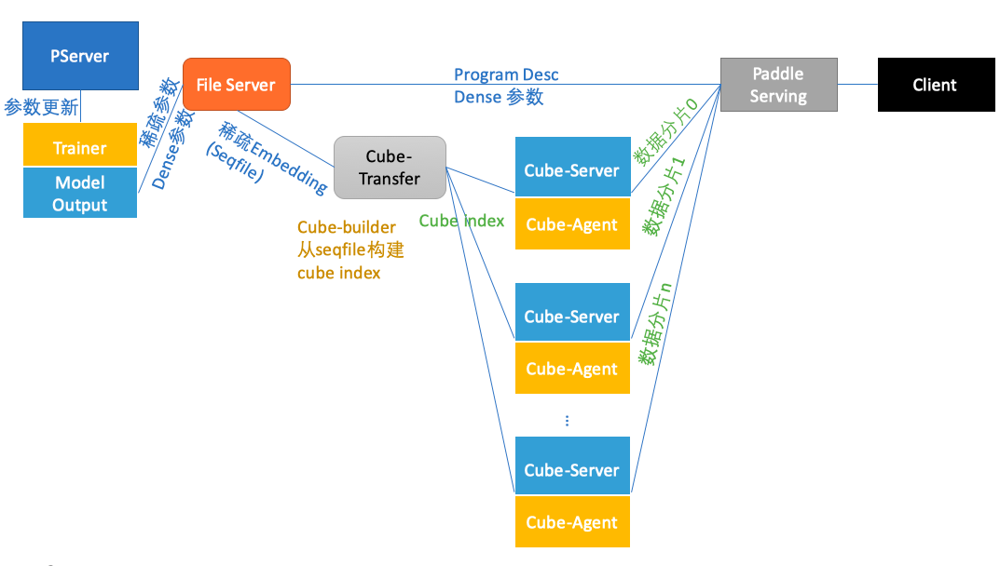

其中：

- trainer/pserver: 训练环节采用PaddlePaddle parameter server模式，对应trainer和pserver角色。分布式训练使用[volcano](https://volcano.sh/)做批量任务管理工具
- file server: 训练产出的模型文件，托管到File Server，供下游模块下载；训练产出的文件包括：ProgramDesc和模型参数，模型参数中最大的embedding由工具转换为seqfile格式，经过一系列流程配送到cube分布式稀疏参数服务，其余模型参数保持不变，配送到Paddle Serving模块
- cube-transfer: 负责监控上游训练作业产出的模型文件（hadoop sequence file）变化，拉取到本地，并调用cube-builder构建cube字典文件；通知cube-agent节点拉取最新的字典文件，并维护各个cube-server上版本一致性
- cube-builder: 负责将训练作业产出的模型文件（hadoop sequence file格式）转换成可以被cube-server加载的字典文件。字典文件具有特定的数据结构，针对尺寸和内存中访问做了高度优化
- Cube-Server: 提供分片kv读写能力的服务节点
- Cube-agent: 与cube-server同机部署，接收cube-transfer下发的字典文件更新命令，拉取数据到本地，通知cube-server进行更新

以上组件串联完成从训练到预测部署的所有流程。本文档所提供的一键部署脚本[paddle-suite.sh](https://github.com/PaddlePaddle/Serving/blob/master/doc/resource/paddle-suite.sh)可一键部署上述所有组件。

用户可以参考本部署方案，将基于PaddlePaddle的分布式训练和Serving应用到业务环境，也可以在本方案基础上做功能增强和改进，直接使用。具体的，用户可以：

-   指定数据集的输入和读取方式，来feed不同的数据集和数据集格式；相应的修改Serving代码以适应新模型
-   指定训练的规模，包括参数服务器的数量和训练节点的数量
-   指定Cube参数服务器的分片数量和副本数量

在本文第4部分会详细解释以上二次开发的实际操作。

本文主要内容：

**第2节 前置需求** 指导用户从零开始，在百度云上申请BCE集群，并部署volcano工具。本方案需使用[volcano](https://volcano.sh/)做训练环节批量任务管理工具，目前在百度云上验证通过

**第3节 分布式训练+serving方案部署** 使用paddle-suite.sh，一键部署分布式训练+serving完整流程；并详细解释脚本每一步的工作和含义

**第4节 查看结果** 根据各个pod输出，验证一键安装状态

**第5节 二次开发** 提出本一键部署方案可定制改善的部分，给出具体修改位置等

# <span id='head2'>2. 前置需求</span>

运行本方案前，需要用户已经搭建好k8s集群，并安装好volcano组件。k8s环境部署比较复杂，本文不涉及。百度智能云CCE容器引擎申请后即可使用，仅以百度云上创建k8s为例。

## 2.1 创建k8s集群

请参考
[百度智能云CCE容器引擎帮助文档-创建集群](https://cloud.baidu.com/doc/CCE/GettingStarted/24.5C.E5.88.9B.E5.BB.BA.E9.9B.86.E7.BE.A4.html#.E6.93.8D.E4.BD.9C.E6.AD.A5.E9.AA.A4)，在百度智能云上建立一个集群，节点配置需要满足如下要求

- CPU核数 \> 4

申请容器引擎示例:

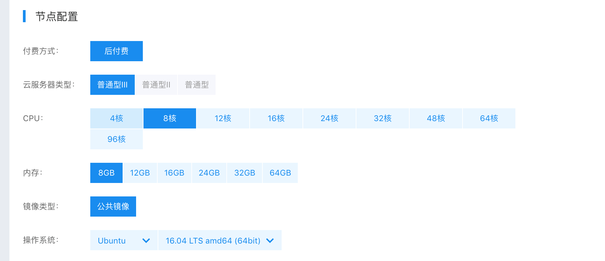

创建完成后，即可参考[百度智能云CCE容器引擎帮助文档-查看集群](https://cloud.baidu.com/doc/CCE/GettingStarted.html#.E6.9F.A5.E7.9C.8B.E9.9B.86.E7.BE.A4)，查看刚刚申请的集群信息。

## 2.2 如何操作集群

集群的操作可以通过百度云web或者通过kubectl工具进行，推荐用kubectl工具。

对于百度云k8s集群，客户端kubectl需要和百度云上kubernetes版本对应，请参考[百度智能云CCE容器引擎帮助文档-kubectl管理配置](https://cloud.baidu.com/doc/CCE/Developer-GettingStarted.html#.84.1C.DF.97.63.35.64.3B.1A.6E.7D.B1.E4.5B.E3.66)查看当前所用的kubernetes版本，并参考kubernetes官方文档下载对应版本的kubectrl版本进行安装。

\* 注意： 本操作指南给出的操作步骤都是基于linux操作环境的。

- 首先请参考[官方安装说明](https://kubernetes.io/docs/tasks/tools/install-kubectl/)，安装和百度云kubernetes版本对应的的kubectl。

-   配置kubectl，下载集群凭证。在集群界面下载集群配置文件，放在kubectl的默认配置路径（请检查\~/.kube目录是否存在，若没有请创建）

```bash
$ mv kubectl.conf  ~/.kube/config
```

-   配置完成后，您即可以使用kubectl从本地计算机访问Kubernetes集群

```bash
$ kubectl get node
```

- 关于kubectl的其他信息，可以参考[Overview of kubectl](https://kubernetes.io/docs/reference/kubectl/overview/)。

# 2.3 安装Volcano

我们使用volcano作为训练阶段的批量任务管理工具。关于volcano的详细信息，请参考[官方网站](https://volcano.sh/)的Documentation。

执行以下命令安装volcano到k8s集群：

```bash
$ kubectl apply -f https://raw.githubusercontent.com/volcano-sh/volcano/master/installer/volcano-development.yaml
```

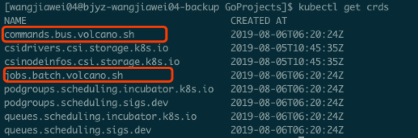


# 3. <span id='head3'>分布式训练+serving方案一键部署</span>

## 3.1 一键部署

执行以下脚本，一键将所有组件部署到k8s集群。

```bash
$ bash paddle-suite.sh
```

请参考**3.3-3.7节**验证每一步的安装是否正确，**第4节**验证训练过程和预测服务结果。

任务的所有脚本文件可以访问[这里](https://github.com/PaddlePaddle/edl/tree/develop/example/ctr/script)获取。

为方便理解，接下来会将该脚本的每一步执行过程给出说明。

## 3.2 选择一个node作为输出节点

```bash
$ kubectl label nodes $NODE_NAME nodeType=model
```

这句话的意思是给这个node做一个标记，之后的文件服务和模型产出都被强制分配在这个node上进行，把NAME的一串字符替换 \$NODE\_NAME即可。

## 3.3 启动文件服务器

```bash
kubectl apply -f fileserver.yaml
```

运行file server的启动脚本kubectl apply -f ftp.yaml，启动文件服务器

验证：通过`kubectl get pod`命令查看是否file-server这个pod已经running，通过`kubectl get service`命令查看是否file-server service是否存在：
```bash
$ kubectl get pod
```
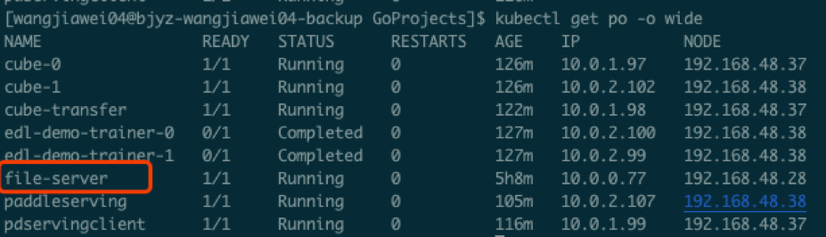

```
$ kubectl get service
```

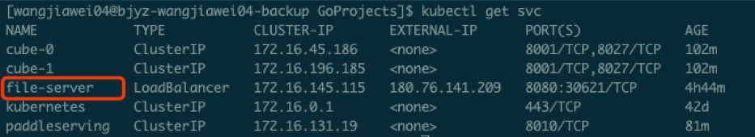


## 3.4 启动Cube稀疏参数服务器

```bash
$ kubectl apply -f cube.yaml
```

验证：通过`kubectl get service`命令查看是否cube-0和cube-1这2个service存在，则说明cube server/agent启动成功。

```
$ kubectl get service
```

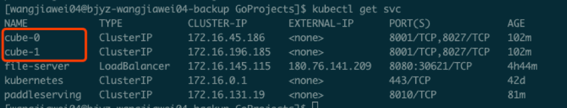

**注**：分片数量可根据稀疏字典大小灵活修改，参考5.3节。

## 3.5 启动Paddle Serving

```bash
$ kubectl apply -f paddleserving.yaml
```

验证：通过`kubectl get pod`查看serving pod是否running状态；通过`kubectl get service`查看paddleserving服务是否存在：

```bash
$ kubectl get pod
```
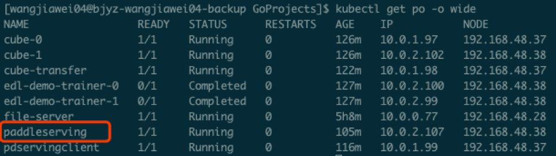

```bash
$ kubectl get service
```
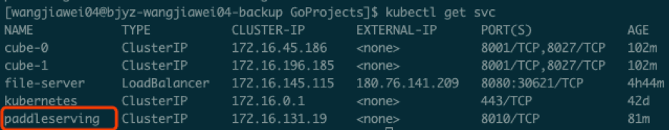

## 3.6 启动Cube稀疏参数服务器配送工具 

```bash
$ kubectl apply -f transfer.yaml
```

验证：通过`kubectl get pod`查看cube-transfer这个pod是否是running状态

```bash
$ kubectl get pod
```

这个cube-transfer配送工具会把训练好的模型从下面要介绍的edl-demo-trainer-0上通过file-server服务拉取到本地，经过cube-builder做格式转换，配送给各个分片cube-server，最终目的是给PaddleServing来进行稀疏参数查询。

**在训练任务结束前，cube-transfer会一直等待上游数据产出。直到检测到上游模型文件生成后，开始启动配送。可通过日志观察cube-transfer的工作状态：**

```
$ kubectl logs cube-transfer
```

如果出现最后wait 5min这样的字样，说明上一轮的模型已经配送成功了，接下来就可以做最后PaddleServing的测试了。

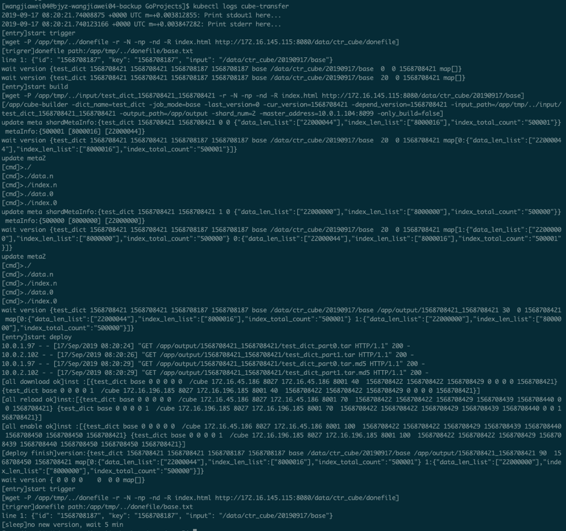


## 3.7 执行Paddle CTR分布式训练

```bash
$ kubectl apply -f ctr.yaml
```
验证：通过`kubectl get pod`查看edl-demo-trainer-0/edl-demo-trainer-1, edl-demo-pserver-0/edl-demo-pserver-1/edl-demo-pserver-2, edl-demo-model-out-trainer-0等pod是否是running状态

```bash
$ kubectl get pod
```

我们可以通过`kubectl logs edl-demo-trainer-0`来查看训练的进度，如果pass一直为0就继续等待，通常需要大概3-5分钟的之间会完成第一轮pass，这时候就会生成inference\_model。

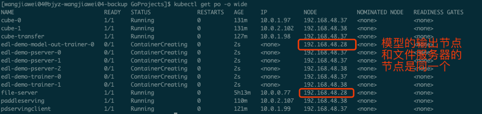

# 4. <span id='head4'>查看结果<span>

## 4.1 查看训练日志

百度云容器引擎CCE提供了web操作台方便查看pod的运行状态。

本次训练任务将启动3个pserver节点，3个trainer节点。

可以通过检查pserver和trainer的log来检查任务运行状态。 Trainer日志示例：

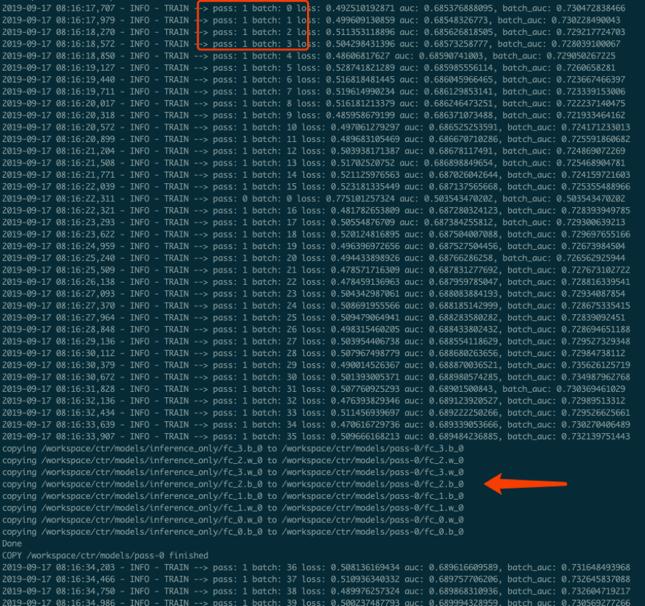

pserver日志示例：

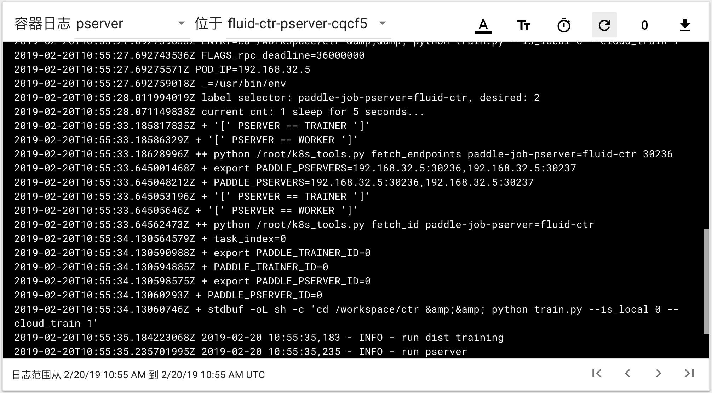

## 4.2 验证Paddle Serving预测结果 

执行

```bash
$ kubectl apply -f paddleclient.yaml
```

用如下命令进入容器内，在/client/ctr\_prediction目录下，启动CTR预估任务客户端，并通过日志查看预测结果

```bash
# 进入容器
$ kubectl exec -ti pdservingclient /bin/bash

# 此命令在容器内执行
$ bin/ctr_prediction
```

如果运行正常的话，会在一段时间后退出，紧接着就可以在log/ctr\_prediction.INFO的最后几行看到类似于这样的日志

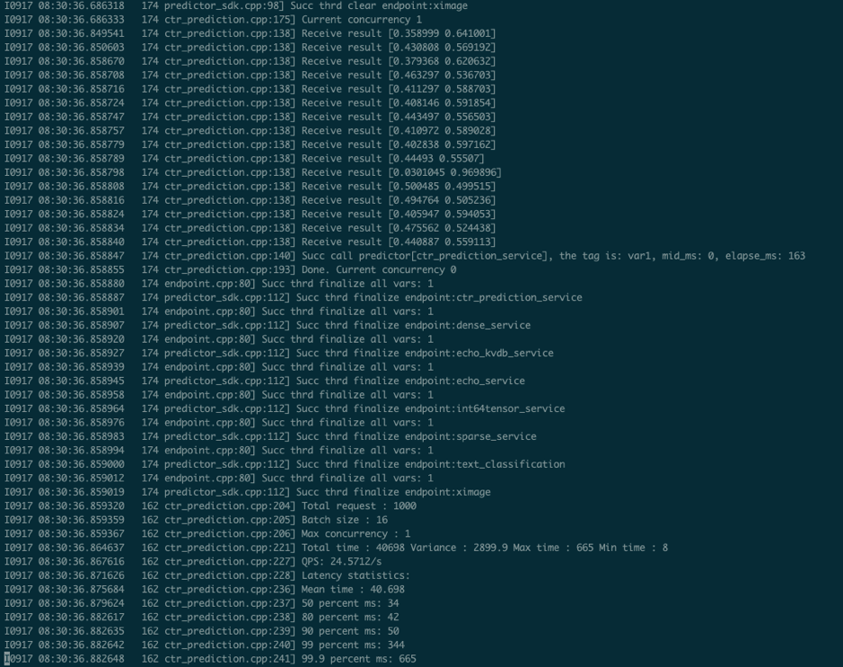

# 5. <span id='head5'>二次开发指南</span>

## 5.1 指定数据集的输入和读取方式

现有的数据的输入是从edldemo镜像当中的/workspace/ctr/data/download.sh目录进行下载。下载之后会解压在/workspace/ctr/data/raw文件夹当中，包含train.txt和test.txt。所有的数据的每一行通过空格隔开40个属性。

然后在train.py当中给出数据集的读取方式

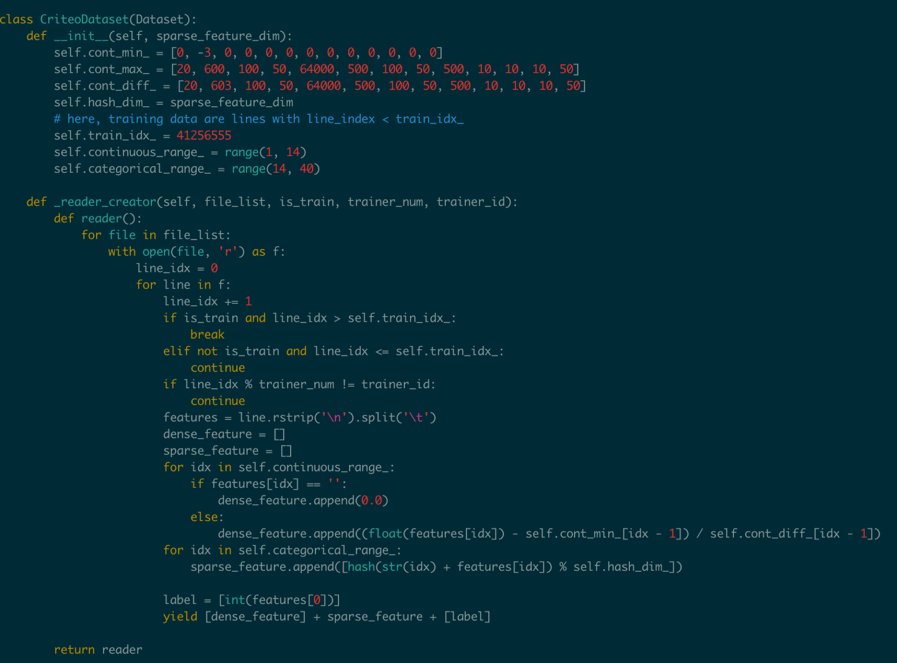

这里面包含了连续数据和离散数据。 连续数据是index [1,14)，离散数据是index [14, 40)，label是index 0，分别对应最后yield[dense\_feature] + sparse\_feature +[label]。当离散的数据和连续的数据格式和样例有不同，需要用户在这里进行指定，并且可以在\_\_init\_\_函数当中参考样例的写法对连续数据进行归一化。

对于数据的来源，文章给出的是download.sh从Criteo官方去下载数据集，然后解压后放在raw文件夹。

可以用HDFS/AFS或是其他方式来配送数据集，在启动项中加入相关命令。

在改动之后，记得保存相关的docker镜像并推送到云端

```bash
$ docker commit ${DOCKER_CONTAINER_NAME} ${DOCKER_IMAGE_NAME}
$ docker push  ${DOCKER_IMAGE_NAME}
```

也可以在Dockerfile当中进行修改

```bash
$ docker build -t ${DOCKER_IMAGE_NAME} .
$ docker push  ${DOCKER_IMAGE_NAME}
```

## 5.2 指定训练规模

在ctr.yaml文件当中，我们会发现这个是在volcano的框架下定义的Job。在Job里面，我们给出了很多Pserver和Trainer的定义，在总体的Job也给出了MinAvailable数量的定义。Pserver和Trainer下面有自己的Replicas，环境变量当中有PSERVER\_NUM和TRAINER\_MODEL和TRAINER\_NUM的数量。通常MinAvailable= PServer Num + Trainer Num，这样我们就可以启动相应的服务。

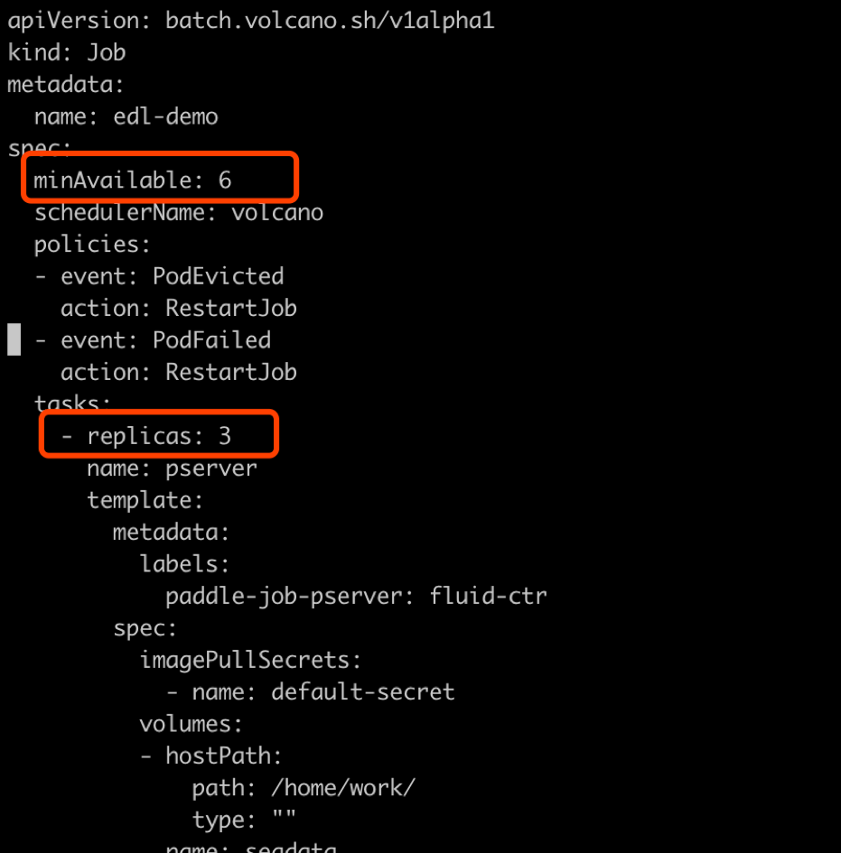

如上图所示，我们需要在min\_available处设置合理的数字。例如一个POD占用一个CPU，那么我们就要对集群的总CPU数有一个预估，不要过于接近或事超过集群CPU总和的上限。否则无法满足Volcano的Gang-Schedule机制，就会出现无法分配资源，一直处于Pending的情况。然后第二个红框当中是

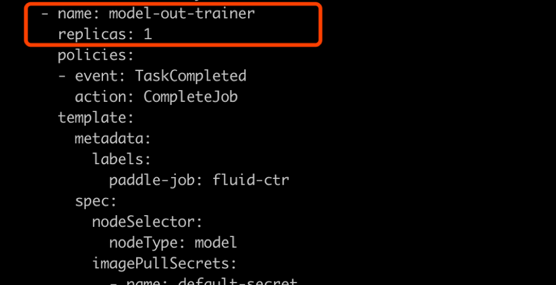

如上图所示，这个部分是用来专门做模型的输出，这里我们不需要做任何的改动，只要保留一个副本就可以。

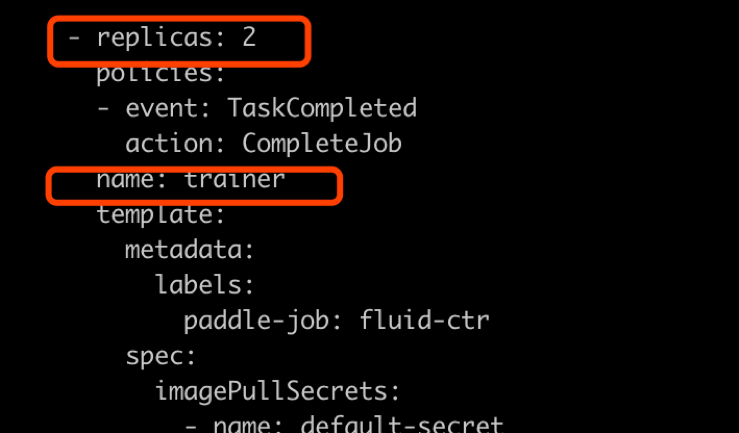

如上图所示

## 5.3 指定cube参数服务器的分片数量和副本数量

在cube.yaml文件当中，我们可以看到每一个cube的节点的定义，有一个`cubeserver pod`和`cube serverservice`。如果我们需要增加cube的副本数和分片数，只需要在yaml文件中复制相关的定义和环境变量即可。

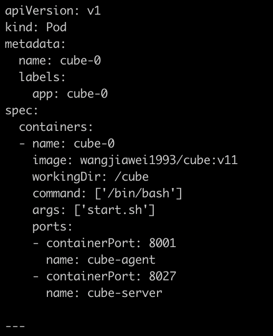


以上两个图片，一个是对cube POD的定义，一个是对cubeSERVICE的定义。如果需要扩展Cube分片数量，可以复制POD和SERVICE的定义，并重命名它们。示例程序给出的是2个分片，复制之后第3个可以命名为cube-2。

## 5.4 Serving适配新的模型

在本示例中，我们如果按照5.1节的方式，修改了CTR模型训练脚本的feed数据格式，就需要相应修改Serving的代码，以适应新的feed样例字段数量和数据类型。

本部署方案中Paddle Serving的的预测服务和客户端代码分别为：

服务端: https://github.com/PaddlePaddle/Serving/blob/develop/demo-serving/op/ctr_prediction_op.cpp

客户端：https://github.com/PaddlePaddle/Serving/blob/develop/demo-client/src/ctr_prediction.cpp

用户可在此基础上进行修改。


关于Paddle Serving的完整开发模式，可参考[Serving从零开始写一个预测服务](https://github.com/PaddlePaddle/Serving/blob/develop/doc/CREATING.md)，以及[Paddle Serving的其他文档](https://github.com/PaddlePaddle/Serving/tree/develop/doc)
