Paddle 第一版发布的demo中已经包含图像分类任务，不过当时Serving还只支持CPU预测，而图像分类的计算量太大，因此只提供了demo，没有特别强调Serving响应时间。

本次提测的Serving版本，支持GPU预测，希望以此任务为例，对Paddle Serving支持GPU预测的性能给出测试数据。

Paddle Serving依赖PaddlePaddle预测库进行实际的计算，因此Serving的性能很大程度上依赖预测库。Paddle预测库在GPU上有如下限制：

1) PaddlePaddle预测库只能单卡预测

2) 单个Serving进程内，所有预测任务共用同一个GPU stream，多个并发请求的GPU操作会被串行到stream内，因此不是完全并行；最坏情况下，2个并发请求会是串行计算。

这样当多个请求到达时，预期会出现较为严重的排队情况。

基于以上已知的问题，设计以下几种测试场景：

**1) 单卡单并发，随batch size变大的响应时间变化情况**

**2) 单卡多并发，固定batch size，观察响应时间随并发数变大的变化情况**

这是为了观察和验证Serving进程内请求排队的情况。

**3) 单卡多进程，随batch size变大的响应时间变化情况**

单卡多进程：启动N个Serving实例，他们绑定到同一张GPU卡。

如果单个Serving进程不能将GPU卡的算力打满（例如，只有不到50%），那理论上多个Serving进程使用同1张卡，可以提高的GPU的使用率。本测试项就是为了观察和验证这种场景。

  (1) 每个Seving实例的请求并发数为1

  (2) 每个Serving实例的请求并发数为N

**4) 多卡多并发，随batch size变大的响应时间变化情况**

多卡多并发：启动N个Serving实例，每个实例绑定一张GPU卡，观察每个实例上响应时间和qps等数据随请求并发数变大的变化情况

理论上，系统上多张卡之间应该互不干扰。本测试项是为了观察和验证多张卡同时跑任务时的性能。

# 1. 测试环境说明

|          | GPU | 显存 | CPU | 内存 |
|----------|---------|----------|----------------------------------------------|------|
| Serving端 | P40 x 4 | 22912MiB | Intel(R) Xeon(R) Gold 5117 CPU @ 2.00GHz 26核 | 216G |
| Client端  | P40 x 4 | 22912MiB | Intel(R) Xeon(R) Gold 5117 CPU @ 2.00GHz 26核 | 216G |

网络时延：2.63毫秒

模型：SE_ResNeXt50_32x4d

# 2. 单机性能测试
在进行Serving的性能测试前，先要摸清图像分类GPU单机预测的性能

## 2.1 单卡单并发
确保没有其他进程占用GPU。

启动单个测试进程，绑定GPU0，concurrency = 1, 持续增加batch size（1, 4, 8, 12…）记录平均响应时间；直到平响突然急剧增大。这时可以认为GPU kernel已经全部用满。

| 并发数 | batch size | 总时间 | qps | 平均响应时间 | 80分位响应时间 | 90分位响应时间 | 99分位响应时间 | 99.9分位响应时间 |
|-----|------------|--------|----------|----------|----------|----------|----------|------------|
| 1   | 2          | 2224   | 43.61511 | 22.92784 | 23       | 23       | 25       | 25         |
| 1   | 4          | 3006   | 32.2688  | 30.98969 | 31       | 31       | 33       | 33         |
| 1   | 6          | 3751   | 25.85977 | 38.67011 | 39       | 39       | 50       | 50         |
| 1   | 8          | 4831   | 20.07866 | 49.80412 | 50       | 50       | 50       | 50         |
| 1   | 10         | 5492   | 17.66205 | 56.61856 | 57       | 57       | 58       | 58         |
| 1   | 12         | 6283   | 15.43849 | 64.77319 | 65       | 65       | 66       | 66         |
| 1   | 14         | 6815   | 14.23331 | 70.25773 | 71       | 71       | 71       | 71         |
| 1   | 16         | 7729   | 12.55014 | 79.68041 | 80       | 80       | 91       | 91         |
| 1   | 18         | 8545   | 11.35167 | 88.09278 | 88       | 89       | 90       | 90         |
| 1   | 20         | 9292   | 10.43909 | 95.79382 | 96       | 96       | 97       | 97         |
| 1   | 22         | 10049  | 9.652702 | 103.5979 | 104      | 104      | 107      | 107        |
| 1   | 24         | 10927  | 8.877093 | 112.6495 | 113      | 113      | 115      | 115        |
| 1   | 26         | 13555  | 7.156031 | 139.7423 | 140      | 141      | 144      | 144        |
| 1   | 28         | 14255  | 6.80463  | 146.9588 | 148      | 148      | 149      | 149        |
| 1   | 30         | 15095  | 6.425969 | 155.6186 | 156      | 157      | 176      | 176        |
| 1   | 32         | 16076  | 6.033839 | 165.732  | 166      | 167      | 170      | 170        |
| 1   | 34         | 16646  | 5.827226 | 171.6082 | 172      | 173      | 178      | 178        |
| 1   | 36         | 17345  | 5.59239  | 178.8144 | 179      | 182      | 187      | 187        |
| 1   | 38         | 18366  | 5.281498 | 189.3402 | 191      | 193      | 216      | 216        |
| 1   | 40         | 18870  | 5.140435 | 194.5361 | 195      | 195      | 198      | 198        |
| 1   | 42         | 19677  | 4.929613 | 202.8557 | 203      | 204      | 214      | 214        |
| 1   | 44         | 20327  | 4.771978 | 209.5567 | 210      | 210      | 211      | 211        |
| 1   | 46         | 21281  | 4.558056 | 219.3918 | 220      | 220      | 221      | 221        |
| 1   | 48         | 22140  | 4.38121  | 228.2474 | 229      | 231      | 241      | 241        |
| 1   | 50         | 26627  | 3.642919 | 274.5052 | 275      | 276      | 279      | 279        |
| 1   | 52         | 27507  | 3.526375 | 283.5773 | 284      | 286      | 292      | 292        |
| 1   | 54         | 28311  | 3.42623  | 291.866  | 292      | 293      | 296      | 296        |
| 1   | 56         | 27004  | 3.59206  | 278.3918 | 279      | 281      | 296      | 296        |
| 1   | 58         | 30151  | 3.21714  | 310.8351 | 312      | 315      | 336      | 336        |
| 1   | 60         | 31092  | 3.119774 | 320.5361 | 324      | 329      | 359      | 359        |
| 1   | 62         | 31783  | 3.051946 | 327.6598 | 328      | 329      | 333      | 333        |
| 1   | 64         | 30644  | 3.165383 | 315.9175 | 316      | 320      | 342      | 342        |
| 1   | 66         | 34820  | 2.785755 | 358.9691 | 362      | 362      | 364      | 364        |
| 1   | 68         | 35824  | 2.707682 | 369.3196 | 371      | 373      | 381      | 381        |
| 1   | 70         | 36945  | 2.625524 | 380.8763 | 383      | 387      | 436      | 436        |
| 1   | 72         | 34425  | 2.81772  | 354.8969 | 357      | 361      | 369      | 369        |
| 1   | 74         | 38227  | 2.537474 | 394.0928 | 396      | 396      | 437      | 437        |
| 1   | 76         | 39079  | 2.482152 | 402.8763 | 405      | 405      | 415      | 415        |
| 1   | 78         | 40135  | 2.416843 | 413.7629 | 416      | 421      | 441      | 441        |
| 1   | 80         | 37924  | 2.557747 | 390.9691 | 393      | 400      | 417      | 417        |
| 1   | 82         | 41943  | 2.312662 | 432.4021 | 437      | 442      | 462      | 462        |
| 1   | 84         | 43172  | 2.246827 | 445.0722 | 452      | 458      | 473      | 473        |
| 1   | 86         | 43468  | 2.231527 | 448.1237 | 449      | 451      | 471      | 471        |
| 1   | 88         | 41309  | 2.348157 | 425.866  | 427      | 434      | 484      | 484        |
| 1   | 90         | 45175  | 2.147205 | 465.7216 | 467      | 469      | 491      | 491        |
| 1   | 92         | 46655  | 2.079091 | 480.9794 | 485      | 490      | 519      | 519        |
| 1   | 94         | 47312  | 2.05022  | 487.7526 | 490      | 491      | 493      | 493        |
| 1   | 96         | 44671  | 2.171431 | 460.5258 | 461      | 465      | 487      | 487        |
| 1   | 98         | 50541  | 1.919234 | 521.0413 | 526      | 535      | 575      | 575        |
| 1   | 100        | 51237  | 1.893163 | 528.2165 | 531      | 542      | 554      | 554        |
| 1   | 102        | 51835  | 1.871322 | 534.3815 | 535      | 536      | 537      | 537        |
| 1   | 104        | 48575  | 1.996912 | 500.7732 | 501      | 502      | 508      | 508        |
| 1   | 106        | 53755  | 1.804483 | 554.1752 | 555      | 556      | 567      | 567        |
| 1   | 108        | 54626  | 1.775711 | 563.1547 | 564      | 568      | 585      | 585        |
| 1   | 110        | 55572  | 1.745483 | 572.9072 | 573      | 576      | 595      | 595        |
| 1   | 112        | 52238  | 1.856886 | 538.5361 | 539      | 540      | 555      | 555        |
| 1   | 114        | 57482  | 1.687485 | 592.598  | 594      | 603      | 609      | 609        |
| 1   | 116        | 58634  | 1.65433  | 604.4742 | 612      | 617      | 654      | 654        |
| 1   | 118        | 59014  | 1.643678 | 608.3917 | 609      | 610      | 627      | 627        |
| 1   | 120        | 55744  | 1.740098 | 574.6804 | 576      | 576      | 582      | 582        |
| 1   | 122        | 61507  | 1.577056 | 634.0928 | 633      | 636      | 704      | 704        |
| 1   | 124        | 62304  | 1.556882 | 642.3093 | 643      | 646      | 664      | 664        |
| 1   | 126        | 63553  | 1.526285 | 655.1855 | 663      | 676      | 689      | 689        |
| 1   | 128        | 59575  | 1.6282   | 614.1752 | 615      | 616      | 621      | 621        |
| 1   | 130        | 66095  | 1.467585 | 681.3917 | 686      | 693      | 708      | 708        |
| 1   | 132        | 66975  | 1.448302 | 690.4639 | 691      | 694      | 725      | 725        |
| 1   | 134        | 67392  | 1.43934  | 694.7629 | 696      | 696      | 700      | 700        |
| 1   | 136        | 63605  | 1.525037 | 655.7217 | 657      | 658      | 661      | 661        |
| 1   | 138        | 69546  | 1.39476  | 716.9691 | 718      | 726      | 765      | 765        |
| 1   | 140        | 70188  | 1.382003 | 723.5876 | 725      | 725      | 728      | 728        |
| 1   | 142        | 70855  | 1.368993 | 730.4639 | 731      | 732      | 746      | 746        |
| 1   | 144        | 67093  | 1.445754 | 691.6804 | 693      | 694      | 703      | 703        |
| 1   | 146        | 72910  | 1.330407 | 751.6495 | 754      | 759      | 778      | 778        |
| 1   | 148        | 73901  | 1.312567 | 761.866  | 764      | 765      | 768      | 768        |
| 1   | 150        | 75287  | 1.288403 | 776.1547 | 776      | 779      | 835      | 835        |
| 1   | 152        | 72538  | 1.33723  | 747.8145 | 769      | 789      | 964      | 964        |
| 1   | 154        | 78081  | 1.2423   | 804.9587 | 800      | 837      | 1007     | 1007       |
| 1   | 156        | 78475  | 1.236062 | 809.0206 | 822      | 829      | 839      | 839        |
| 1   | 158        | 78480  | 1.235984 | 809.0721 | 809      | 814      | 852      | 852        |
| 1   | 160        | 74521  | 1.301647 | 768.2578 | 767      | 780      | 911      | 911        |
| 1   | 162        | 81131  | 1.195597 | 836.402  | 836      | 845      | 887      | 887        |
| 1   | 164        | 82448  | 1.176499 | 849.9794 | 859      | 867      | 902      | 902        |
| 1   | 168        | 78797  | 1.231011 | 812.3402 | 813      | 829      | 855      | 855        |
| 1   | 170        | 85168  | 1.138925 | 878.0206 | 885      | 890      | 932      | 932        |
| 1   | 172        | 86894  | 1.116303 | 895.8145 | 898      | 935      | 1045     | 1045       |
| 1   | 174        | 90203  | 1.075352 | 929.9279 | 966      | 1001     | 1147     | 1147       |
| 1   | 176        | 85560  | 1.133707 | 882.0618 | 915      | 972      | 1078     | 1078       |
| 1   | 178        | 88954  | 1.090451 | 917.0516 | 918      | 924      | 956      | 956        |
| 1   | 180        | 90373  | 1.073329 | 931.6804 | 930      | 955      | 1028     | 1028       |
| 1   | 182        | 91581  | 1.059172 | 944.134  | 941      | 949      | 1251     | 1251       |
| 1   | 184        | 86973  | 1.115289 | 896.6288 | 892      | 920      | 1364     | 1364       |
| 1   | 186        | 93538  | 1.037012 | 964.3093 | 970      | 989      | 1101     | 1101       |
| 1   | 188        | 94698  | 1.024309 | 976.2681 | 993      | 1015     | 1074     | 1074       |
| 1   | 190        | 95286  | 1.017988 | 982.3299 | 983      | 1018     | 1113     | 1113       |
| 1   | 192        | 91030  | 1.065583 | 938.4536 | 930      | 962      | 1441     | 1441       |
| 1   | 194        | 97956  | 0.990241 | 1009.856 | 1011     | 1032     | 1098     | 1098       |
| 1   | 196        | 99376  | 0.976091 | 1024.495 | 1030     | 1053     | 1128     | 1128       |
| 1   | 198        | 100879 | 0.961548 | 1039.99  | 1048     | 1078     | 1647     | 1647       |
| 1   | 200        | 94553  | 1.02588  | 974.7732 | 979      | 1005     | 1125     | 1125       |
| 1   | 202        | 101979 | 0.951176 | 1051.33  | 1060     | 1074     | 1231     | 1231       |
| 1   | 204        | 103626 | 0.936059 | 1068.309 | 1083     | 1106     | 1226     | 1226       |
| 1   | 206        | 104283 | 0.930161 | 1075.083 | 1083     | 1108     | 1440     | 1440       |
| 1   | 208        | 98584  | 0.983932 | 1016.33  | 1031     | 1041     | 1087     | 1087       |
| 1   | 210        | 106025 | 0.914879 | 1093.041 | 1110     | 1132     | 1197     | 1197       |
| 1   | 212        | 106613 | 0.909833 | 1099.103 | 1113     | 1131     | 1159     | 1159       |
| 1   | 214        | 107403 | 0.903141 | 1107.247 | 1117     | 1127     | 1209     | 1209       |
| 1   | 216        | 102126 | 0.949807 | 1052.845 | 1066     | 1085     | 1187     | 1187       |
| 1   | 218        | 109069 | 0.889345 | 1124.423 | 1137     | 1147     | 1173     | 1173       |
| 1   | 220        | 110427 | 0.878408 | 1138.423 | 1151     | 1167     | 1220     | 1220       |
| 1   | 222        | 111146 | 0.872726 | 1145.835 | 1164     | 1181     | 1216     | 1216       |
| 1   | 224        | 105529 | 0.919179 | 1087.928 | 1096     | 1107     | 1625     | 1625       |
| 1   | 226        | 114467 | 0.847406 | 1180.072 | 1190     | 1214     | 1258     | 1258       |
| 1   | 228        | 115350 | 0.840919 | 1189.175 | 1194     | 1217     | 1516     | 1516       |
| 1   | 230        | 115920 | 0.836784 | 1195.052 | 1211     | 1226     | 1262     | 1262       |
| 1   | 232        | 109363 | 0.886954 | 1127.454 | 1141     | 1157     | 1219     | 1219       |
| 1   | 234        | 118202 | 0.820629 | 1218.577 | 1232     | 1247     | 1300     | 1300       |
| 1   | 236        | 119203 | 0.813738 | 1228.897 | 1244     | 1260     | 1294     | 1294       |
| 1   | 238        | 119409 | 0.812334 | 1231.021 | 1238     | 1252     | 1295     | 1295       |
| 1   | 240        | 113127 | 0.857443 | 1166.258 | 1186     | 1192     | 1208     | 1208       |
| 1   | 242        | 121781 | 0.796512 | 1255.474 | 1267     | 1281     | 1542     | 1542       |
| 1   | 244        | 122538 | 0.791591 | 1263.278 | 1279     | 1291     | 1338     | 1338       |
| 1   | 246        | 123959 | 0.782517 | 1277.928 | 1298     | 1308     | 1407     | 1407       |
| 1   | 248        | 117470 | 0.825743 | 1211.031 | 1226     | 1259     | 1330     | 1330       |
| 1   | 250        | 126083 | 0.769334 | 1299.825 | 1307     | 1332     | 1704     | 1704       |
| 1   | 252        | 126090 | 0.769292 | 1299.897 | 1306     | 1342     | 1387     | 1387       |
| 1   | 254        | 127954 | 0.758085 | 1319.113 | 1343     | 1357     | 1507     | 1507       |
| 1   | 256        | 122189 | 0.793852 | 1259.68  | 1277     | 1293     | 1620     | 1620       |

响应时间随batch size的变化趋势如下：

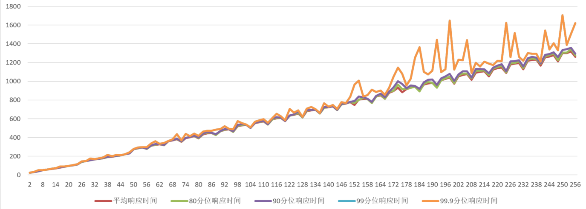

结论：在batch size小于256前提下，随着batch size的增加，平均响应时间和各分位响应时间也随之增加，其中99.9分位的响应时间浮动较大，其它指标基本线性增长。

qps随batch size的变化趋势如下：

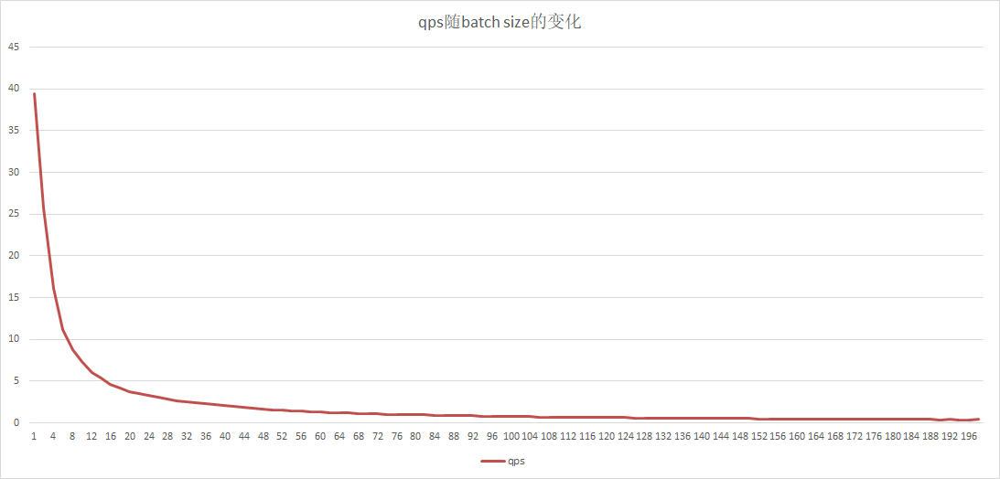

结论：在batch size小于256前提下，随着batch size的增加，qps逐渐下降。

## 2.2 单卡多并发

固定batch size（例如，可以固定为batch size= 10。以下所有场景中所有固定batch size的均以此为准），启动单个测试进程，绑定GPU0，concurrency = 1, 2, ...

如本文开头所述，目前Paddle预测库GPU预测只用1个stream，并行的请求会被串行计算。本测试项是为了观察和验证这种场景下的性能表现。预期随着并发数增加，平响和99分位响应时间会急剧变大，但总qps略有上涨后保持稳定或开始下降（并发请求数将stream占满后，每秒内处理能力达到极限）。

| 并发数 | batch size | qps | 总时间 | 平均响应时间 | 80分位响应时间 | 90分位响应时间 | 99分位响应时间 | 99.9分位响应时间 |
|-----|------------|-----------|----------|----------|----------|----------|----------|------------|
| 1   | 10         | 17.515349 | 5538.0   | 57.09278 | 57       | 58       | 60       | 60         |
| 2   | 10         | 28.65795  | 6769.5   | 69.78866 | 91       | 102      | 113      | 114        |
| 3   | 10         | 29.04675  | 10018.33 | 103.2818 | 131      | 135      | 159      | 167        |
| 4   | 10         | 26.34661  | 14726.75 | 151.8222 | 183      | 196      | 224      | 227        |
| 5   | 10         | 26.8101   | 18090.2  | 186.4969 | 236      | 251      | 279      | 294        |
| 6   | 10         | 24.38173  | 23870.33 | 246.0859 | 299      | 312      | 339      | 354        |
| 7   | 10         | 26.59259  | 25533.43 | 263.2312 | 328      | 341      | 379      | 387        |
| 8   | 10         | 27.77703  | 27936.75 | 288.0077 | 372      | 391      | 422      | 496        |
| 9   | 10         | 28.11504  | 31051    | 320.1134 | 410      | 436      | 480      | 504        |
| 10  | 10         | 25.72371  | 37708.4  | 388.7464 | 465      | 485      | 524      | 547        |
| 11  | 10         | 26.89542  | 39672.18 | 408.9916 | 513      | 537      | 600      | 659        |
| 12  | 10         | 26.08179  | 44628.83 | 460.0911 | 556      | 581      | 731      | 997        |
| 13  | 10         | 26.28853  | 47967.69 | 494.5123 | 601      | 624      | 672      | 727        |
| 14  | 10         | 25.59918  | 53048.57 | 546.8925 | 656      | 679      | 728      | 787        |
| 15  | 10         | 24.6679   | 58983.54 | 608.0776 | 699      | 727      | 808      | 938        |
| 16  | 10         | 25.56311  | 60712.5  | 625.902  | 746      | 775      | 842      | 932        |
| 17  | 10         | 23.53067  | 70078.77 | 722.4615 | 797      | 828      | 915      | 1090       |
| 18  | 10         | 22.67992  | 76984.39 | 793.6535 | 870      | 906      | 1093     | 1203       |
| 19  | 10         | 23.32594  | 79010.73 | 814.5437 | 900      | 938      | 1362     | 1755       |
| 20  | 10         | 22.71971  | 85388.4  | 880.2928 | 950      | 983      | 1132     | 1307       |
| 21  | 10         | 22.76425  | 89482.43 | 922.4993 | 1011     | 1057     | 1290     | 1475       |
| 22  | 10         | 22.47889  | 94933.5  | 978.6959 | 1070     | 1110     | 1228     | 1329       |
| 23  | 10         | 22.10953  | 100906.7 | 1040.275 | 1137     | 1186     | 1473     | 1761       |
| 24  | 10         | 21.92007  | 106204   | 1094.887 | 1206     | 1258     | 1533     | 1717       |
| 25  | 10         | 21.6662   | 111925.5 | 1153.871 | 1270     | 1338     | 1598     | 1768       |
| 26  | 10         | 21.88741  | 115226.1 | 1187.898 | 1316     | 1362     | 1498     | 1599       |
| 27  | 10         | 21.81319  | 120065   | 1237.783 | 1369     | 1426     | 1613     | 1760       |
| 28  | 10         | 21.92611  | 123870.6 | 1277.016 | 1409     | 1470     | 1632     | 1784       |
| 29  | 10         | 21.68458  | 129723.5 | 1337.356 | 1471     | 1531     | 1716     | 1972       |
| 30  | 10         | 21.39605  | 136006.4 | 1402.128 | 1528     | 1590     | 1803     | 1965       |
| 31  | 10         | 21.40258  | 140497.1 | 1448.424 | 1563     | 1630     | 1924     | 2040       |
| 32  | 10         | 21.47499  | 144540.3 | 1490.106 | 1617     | 1673     | 1852     | 1977       |
| 33  | 10         | 21.26626  | 150520.2 | 1551.754 | 1668     | 1732     | 2233     | 2928       |
| 34  | 10         | 21.70627  | 151937.6 | 1566.368 | 1705     | 1767     | 2008     | 2269       |
| 35  | 10         | 21.18346  | 160266.5 | 1652.232 | 1781     | 1852     | 2322     | 2536       |
| 36  | 10         | 21.69583  | 160952.6 | 1659.305 | 1780     | 1835     | 1986     | 2125       |
| 37  | 10         | 21.81777  | 164499   | 1695.866 | 1829     | 1886     | 2081     | 2256       |
| 38  | 10         | 20.93849  | 176039.4 | 1814.839 | 1938     | 2021     | 2461     | 2694       |
| 39  | 10         | 21.09936  | 179294.6 | 1848.398 | 1955     | 2019     | 2289     | 2621       |
| 40  | 10         | 21.73072  | 178549.1 | 1840.712 | 1981     | 2050     | 2487     | 2840       |
| 41  | 10         | 21.3417   | 186348.8 | 1921.121 | 2050     | 2110     | 2387     | 2584       |
| 42  | 10         | 21.29802  | 191285.4 | 1972.015 | 2085     | 2153     | 2393     | 2553       |
| 43  | 10         | 21.28315  | 195976.7 | 2020.378 | 2135     | 2211     | 2484     | 2736       |
| 44  | 10         | 21.20328  | 201289.7 | 2075.151 | 2199     | 2269     | 2735     | 2942       |
| 45  | 10         | 21.01285  | 207730   | 2141.547 | 2254     | 2310     | 2482     | 2612       |
| 46  | 10         | 20.90582  | 213433.4 | 2200.344 | 2309     | 2366     | 2511     | 2648       |
| 47  | 10         | 21.20298  | 215017   | 2216.67  | 2361     | 2433     | 2736     | 2983       |
| 48  | 10         | 20.65479  | 225419.9 | 2323.916 | 2430     | 2503     | 3150     | 3381       |
| 49  | 10         | 20.63753  | 230308.5 | 2374.315 | 2490     | 2559     | 2792     | 2958       |
| 50  | 10         | 20.99415  | 231016.7 | 2381.615 | 2501     | 2559     | 2709     | 2856       |
| 51  | 10         | 21.11356  | 234304.4 | 2415.509 | 2536     | 2600     | 2746     | 2853       |
| 52  | 10         | 20.68331  | 243868.1 | 2514.104 | 2645     | 2711     | 2913     | 3077       |
| 53  | 10         | 20.99738  | 244840.1 | 2524.125 | 2668     | 2744     | 3279     | 3478       |
| 54  | 10         | 20.8062   | 251751.9 | 2595.38  | 2721     | 2778     | 2926     | 3073       |
| 55  | 10         | 20.70358  | 257684.9 | 2656.546 | 2779     | 2856     | 3253     | 3628       |
| 56  | 10         | 20.72092  | 262150.6 | 2702.583 | 2821     | 2881     | 3036     | 3206       |
| 57  | 10         | 20.63749  | 267910.5 | 2761.964 | 2884     | 2956     | 3171     | 3374       |
| 58  | 10         | 20.72029  | 271521.3 | 2799.188 | 2927     | 2989     | 3170     | 3329       |
| 59  | 10         | 20.75952  | 275680.7 | 2842.069 | 2982     | 3052     | 3409     | 3645       |
| 60  | 10         | 20.66191  | 281677.7 | 2903.894 | 3038     | 3104     | 3260     | 3389       |
| 61  | 10         | 20.53766  | 288104.8 | 2970.153 | 3120     | 3208     | 3694     | 4031       |
| 62  | 10         | 20.74438  | 289909.9 | 2988.761 | 3140     | 3211     | 3386     | 3541       |
| 63  | 10         | 20.88214  | 292642.4 | 3016.932 | 3162     | 3237     | 3573     | 3948       |
| 64  | 10         | 20.75613  | 299092.4 | 3083.427 | 3223     | 3295     | 3515     | 3783       |
| 65  | 10         | 20.80666  | 303028   | 3124     | 3263     | 3344     | 3548     | 3767       |
| 66  | 10         | 20.61029  | 310621.5 | 3202.284 | 3347     | 3421     | 3759     | 4030       |
| 67  | 10         | 20.75842  | 313077.8 | 3227.607 | 3371     | 3443     | 3621     | 3743       |
| 68  | 10         | 20.78721  | 317310.5 | 3271.243 | 3410     | 3476     | 3659     | 3782       |
| 69  | 10         | 20.91105  | 320070   | 3299.691 | 3444     | 3519     | 3804     | 4088       |
| 70  | 10         | 21.06493  | 322336.8 | 3323.06  | 3461     | 3546     | 3853     | 4124       |
| 71  | 10         | 21.31435  | 323115.6 | 3331.089 | 3490     | 3563     | 3779     | 3965       |
| 72  | 10         | 21.23449  | 328898.9 | 3390.71  | 3540     | 3610     | 3790     | 3953       |
| 73  | 10         | 21.24925  | 333235.3 | 3435.416 | 3604     | 3681     | 3920     | 4102       |
| 74  | 10         | 21.04509  | 341077.2 | 3516.26  | 3679     | 3764     | 4249     | 4533       |
| 75  | 10         | 21.35814  | 340619.6 | 3511.542 | 3692     | 3771     | 4032     | 4263       |
| 76  | 10         | 21.17327  | 348174.9 | 3589.432 | 3742     | 3816     | 4035     | 4234       |
| 77  | 10         | 20.95005  | 356514.7 | 3675.409 | 3831     | 3923     | 4251     | 4521       |
| 78  | 10         | 20.97914  | 360644   | 3717.979 | 3870     | 3956     | 4253     | 4543       |
| 79  | 10         | 21.0908   | 363333.8 | 3745.709 | 3897     | 3976     | 4235     | 4580       |
| 80  | 10         | 21.12234  | 367383.6 | 3787.46  | 3938     | 4016     | 4209     | 4362       |
| 81  | 10         | 21.2174   | 370309.3 | 3817.622 | 4002     | 4079     | 4334     | 4574       |
| 82  | 10         | 20.90807  | 380427.3 | 3921.931 | 4086     | 4170     | 4378     | 4599       |
| 83  | 10         | 20.88443  | 385502.5 | 3974.253 | 4137     | 4227     | 4596     | 4932       |
| 84  | 10         | 21.00666  | 387877   | 3998.732 | 4167     | 4256     | 4480     | 4661       |
| 85  | 10         | 21.09852  | 390785.8 | 4028.719 | 4213     | 4300     | 4538     | 4739       |
| 86  | 10         | 20.93014  | 398563.9 | 4108.906 | 4281     | 4369     | 4614     | 4804       |
| 87  | 10         | 21.2002   | 398062.3 | 4103.735 | 4297     | 4376     | 4591     | 4781       |
| 88  | 10         | 20.92152  | 408001   | 4206.195 | 4362     | 4458     | 4857     | 5096       |
| 89  | 10         | 20.92099  | 412647.8 | 4254.101 | 4425     | 4513     | 4798     | 5019       |
| 90  | 10         | 20.91112  | 417481.3 | 4303.93  | 4484     | 4581     | 4901     | 5135       |
| 91  | 10         | 20.98747  | 420584.3 | 4335.921 | 4505     | 4594     | 4957     | 5358       |
| 92  | 10         | 20.97826  | 425392.7 | 4385.492 | 4557     | 4643     | 4901     | 5122       |
| 93  | 10         | 20.92941  | 431020.2 | 4443.507 | 4634     | 4727     | 5037     | 5358       |
| 94  | 10         | 20.99077  | 434381.4 | 4478.159 | 4648     | 4743     | 5014     | 5238       |
| 95  | 10         | 21.04644  | 437841.3 | 4513.828 | 4702     | 4791     | 5065     | 5303       |
| 96  | 10         | 20.90277  | 445491.1 | 4592.692 | 4773     | 4874     | 5447     | 5794       |

响应时间随并发数的变化趋势如下：

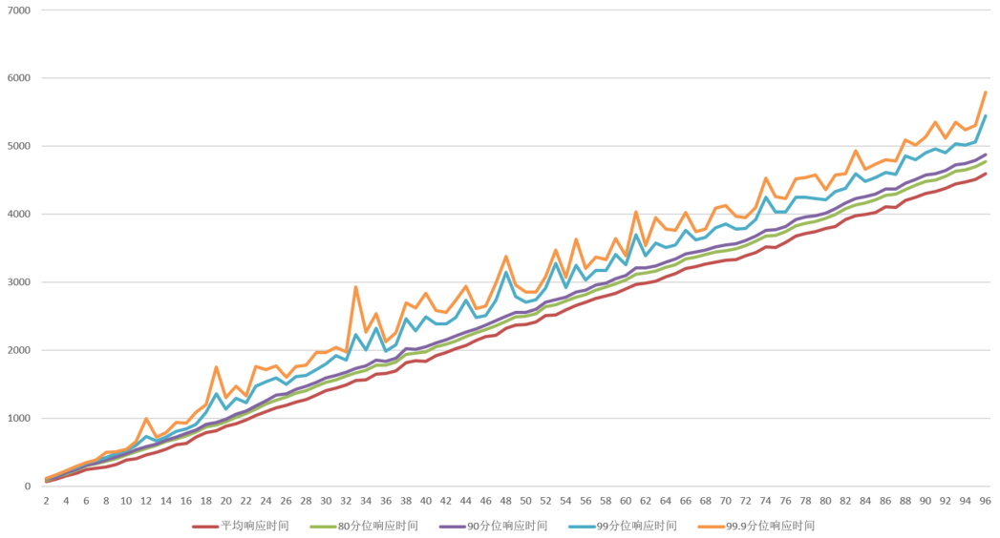

结论：随着并发数的增加，平均响应时间和各分位响应时间也随之增加，其中99.9分位和99分位的响应时间有浮动，其它指标基本线性增长。

qps随并发数的变化趋势如下：

结论：随着并发数的增加，qps呈下降趋势，在并发数大于40后，qps相对稳定。

从并发数大于97个并发后，开始报错：Cannot malloc 47.7139 MB GPU memory

## 2.3 单卡多进程

如果单个Serving进程不能将GPU卡的算力打满（例如，只有不到50%），那理论上多个Serving进程使用同1张卡，可以提高的GPU的使用率。本测试项就是为了观察和验证这种场景。

固定并发数和batch size（例如， 并发数为1，batch size=10），同时启动2个测试进程，都绑定GPU0。分别记录2个进程的qps和响应时间数据。

| 并发数 | 进程id | batchsize | qps | 总时间 | 平均响应时间 | 80分位响应时间 | 90分位响应时间 | 99分位响应时间 | 99.9分位响应时间 |
|-----|------|-----------|-----------|---------|----------|----------|----------|----------|------------|
| 1   | 1    | 10        | 13.987022 | 6935    | 71.49484 | 85       | 101      | 127      | 127     |
| 1   | 2    | 10        | 13.610215 | 7127    | 73.47423 | 89       | 103      | 127      | 127     |
| 2   | 1    | 10        | 13.19728  | 14700   | 151.5464 | 176      | 179      | 195      | 197     |
| 2   | 2    | 10        | 13.83392  | 14023.5 | 144.5722 | 174      | 179      | 185      | 186     |

与单卡多并发情况相比：

在并发为1时，总qps增加近50%，平均响应时间增加40%，90分位、99分位、99.9分位响应时间翻倍。

在并发为2时，总qps增略有下降，平均响应时间翻倍，90分位、99分位、99.9分位增加近70%。

| 并发数 | batch size | qps | 总时间 | 平均响应时间   | 80分位响应时间 | 90分位响应时间 | 99分位响应时间 | 99.9分位响应时间 |
|-----|------------|-----------|--------|----------|----------|----------|----------|------------|
| 1   | 10         | 17.515349 | 5538.0 | 57.09278 | 57       | 58       | 60       | 60         |
| 2   | 10         | 28.65795  | 6769.5 | 69.78866 | 91       | 102      | 113      | 114        |

## 2.4 多卡多并发

假设机器上有2张卡，同时启动2个测试进程，分别绑定GPU0和GPU1，固定并发数和batch size （例如，固定batch_size = 10）其他同2.1节

系统上安装有多张GPU卡的情况下，理想情况是各张卡各自工作，互不影响；本测试项是为了观察和验证这种场景下的性能表现。

| 并发数 | 进程id | batchsize | qps | 总时间 | 平均响应时间 | 80分位响应时间 | 90分位响应时间 | 99分位响应时间 | 99.9分位响应时间 |
|-----|------|-----------|-----------|----------|-----------|----------|----------|----------|------------|
| 1   | 1    | 10        | 17.06545  | 5684     | 58.59794  | 59       | 60       | 62       | 62     |
| 1   | 2    | 10        | 17.15296  | 5655     | 58.29897  | 59       | 59       | 60       | 60     |
| 2   | 1    | 10        | 31.717485 | 6116.5   | 63.0567   | 65       | 76       | 110      | 112    |
| 2   | 2    | 10        | 31.084762 | 6241     | 64.340210 | 70       | 81       | 98       | 99     |
| 3   | 1    | 10        | 29.22763  | 9956.333 | 102.6426  | 132      | 140      | 162      | 172    |
| 3   | 2    | 10        | 27.58468  | 10549.33 | 108.756   | 138      | 148      | 159      | 160    |
| 4   | 1    | 10        | 26.07965  | 14877.5  | 153.3763  | 196      | 206      | 227      | 237    |
| 4   | 2    | 10        | 26.17907  | 14821    | 152.7938  | 195      | 204      | 224      | 228    |

结论：与单卡多并发情况相比，各项性能指标基本持平。

| 并发数 | batchsize | qps | 总时间 | 平均响应时间 | 80分位响应时间 | 90分位响应时间 | 99分位响应时间 | 99.9分位响应时间 |
|-----|-----------|-----------|----------|----------|----------|----------|----------|------------|
| 1   | 10        | 17.515349 | 5538.0   | 57.09278 | 57       | 58       | 60       | 60         |
| 2   | 10        | 28.65795  | 6769.5   | 69.78866 | 91       | 102      | 113      | 114        |
| 3   | 10        | 29.04675  | 10018.33 | 103.2818 | 131      | 135      | 159      | 167        |
| 4   | 10        | 26.34661  | 14726.75 | 151.8222 | 183      | 196      | 224      | 227        |

# 3. Serving性能测试

## 3.1 单卡单并发响应时间与batch size变化关系

本测试项是为了测试单个并发的情况下，响应时间随batch size变大而变化的情况：

测试方法是：在GPU机器上启动1个Serving实例，然后用客户端压测工具以并发数1向Serving发压力，观察平响等指标随batch size增大的变化关系。随着batch size变大，平响会逐渐变大，直到忽然出现大幅增长，这时可认为batch数据用满了GPU kernel。

| 并发数 | batchsize | qps | 总时间 | 平均响应时间 | 80分位响应时间 | 90分位响应时间 | 99分位响应时间 | 99.9分位响应时间 |
|-----|-----------|-----------|--------|-------------|----------|----------|----------|------------|
| 1   | 1         | 39.478879 | 2533   | 25.33       | 26       | 28       | 43       | 43         |
| 1   | 2         | 25.733402 | 3886   | 38.86       | 41       | 47       | 57       | 57         |
| 1   | 4         | 16.147263 | 6193   | 61.93       | 64       | 68       | 74       | 74         |
| 1   | 6         | 11.166946 | 8955   | 89.55       | 92       | 97       | 107      | 107        |
| 1   | 8         | 8.759636  | 11416  | 114.16      | 119      | 124      | 132      | 132        |
| 1   | 10        | 7.345919  | 13613  | 136.13      | 141      | 149      | 193      | 193        |
| 1   | 12        | 6.081985  | 16442  | 164.42      | 168      | 177      | 204      | 204        |
| 1   | 14        | 5.334187  | 18747  | 187.47      | 192      | 200      | 233      | 233        |
| 1   | 16        | 4.592633  | 21774  | 217.74      | 223      | 238      | 280      | 280        |
| 1   | 18        | 4.142159  | 24142  | 241.42      | 245      | 252      | 287      | 287        |
| 1   | 20        | 3.782864  | 26435  | 264.35      | 270      | 279      | 308      | 308        |
| 1   | 22        | 3.51062   | 28485  | 284.85      | 293      | 302      | 337      | 337        |
| 1   | 24        | 3.301856  | 30286  | 302.86      | 314      | 326      | 358      | 358        |
| 1   | 26        | 3.06551   | 32621  | 326.21      | 338      | 342      | 485      | 485        |
| 1   | 28        | 2.870182  | 34841  | 348.41      | 360      | 368      | 420      | 420        |
| 1   | 30        | 2.68442   | 37252  | 372.52      | 385      | 399      | 419      | 419        |
| 1   | 32        | 2.525954  | 39589  | 395.89      | 415      | 425      | 450      | 450        |
| 1   | 34        | 2.387091  | 41892  | 418.92      | 434      | 442      | 496      | 496        |
| 1   | 36        | 2.261471  | 44219  | 442.19      | 455      | 486      | 566      | 566        |
| 1   | 38        | 2.181453  | 45841  | 458.41      | 467      | 485      | 588      | 588        |
| 1   | 40        | 2.093276  | 47772  | 477.72      | 484      | 496      | 595      | 595        |
| 1   | 42        | 1.99005   | 50250  | 502.5       | 514      | 524      | 615      | 615        |
| 1   | 44        | 1.901538  | 52589  | 525.89      | 532      | 553      | 609      | 609        |
| 1   | 46        | 1.805087  | 55399  | 553.99      | 569      | 584      | 673      | 673        |
| 1   | 48        | 1.623034  | 61613  | 616.13      | 631      | 641      | 676      | 676        |
| 1   | 50        | 1.549355  | 64543  | 645.43      | 661      | 674      | 733      | 733        |
| 1   | 52        | 1.496491  | 66823  | 668.23      | 682      | 698      | 795      | 795        |
| 1   | 54        | 1.425537  | 70149  | 701.49      | 714      | 747      | 859      | 859        |
| 1   | 56        | 1.386059  | 72147  | 721.47      | 733      | 747      | 822      | 822        |
| 1   | 58        | 1.33672   | 74810  | 748.1       | 761      | 777      | 859      | 859        |
| 1   | 60        | 1.291673  | 77419  | 774.19      | 792      | 801      | 911      | 911        |
| 1   | 62        | 1.251361  | 79913  | 799.13      | 813      | 833      | 978      | 978        |
| 1   | 64        | 1.206607  | 82877  | 828.77      | 845      | 871      | 1034     | 1034       |
| 1   | 66        | 1.173213  | 85236  | 852.36      | 875      | 894      | 969      | 969        |
| 1   | 68        | 1.140914  | 87649  | 876.49      | 896      | 917      | 974      | 974        |
| 1   | 70        | 1.101576  | 90779  | 907.79      | 932      | 971      | 1042     | 1042       |
| 1   | 72        | 1.077284  | 92826  | 928.26      | 948      | 962      | 1078     | 1078       |
| 1   | 74        | 1.046616  | 95546  | 955.46      | 979      | 998      | 1076     | 1076       |
| 1   | 76        | 1.019368  | 98100  | 981         | 1011     | 1028     | 1063     | 1063       |
| 1   | 78        | 0.995877  | 100414 | 1004.14     | 1027     | 1049     | 1142     | 1142       |
| 1   | 80        | 0.970327  | 103058 | 1030.58     | 1046     | 1075     | 1232     | 1232       |
| 1   | 82        | 0.949082  | 105365 | 1053.65     | 1080     | 1096     | 1188     | 1188       |
| 1   | 84        | 0.917339  | 109011 | 1090.11     | 1123     | 1160     | 1239     | 1239       |
| 1   | 86        | 0.888092  | 112601 | 1126.01     | 1153     | 1189     | 1237     | 1237       |
| 1   | 88        | 0.8726    | 114600 | 1146        | 1172     | 1193     | 1236     | 1236       |
| 1   | 90        | 0.838828  | 119214 | 1192.14     | 1202     | 1241     | 2258     | 2258       |
| 1   | 92        | 0.835122  | 119743 | 1197.43     | 1223     | 1244     | 1296     | 1296       |
| 1   | 94        | 0.816     | 122549 | 1225.49     | 1259     | 1282     | 1395     | 1395       |
| 1   | 96        | 0.794597  | 125850 | 1258.5      | 1295     | 1310     | 1477     | 1477       |
| 1   | 98        | 0.771575  | 129605 | 1296.05     | 1333     | 1365     | 1542     | 1542       |
| 1   | 100       | 0.76609   | 130533 | 1305.33     | 1336     | 1364     | 1428     | 1428       |
| 1   | 102       | 0.750103  | 133315 | 1333.15     | 1361     | 1398     | 1504     | 1504       |
| 1   | 104       | 0.736914  | 135701 | 1357.01     | 1396     | 1428     | 1484     | 1484       |
| 1   | 106       | 0.716009  | 139663 | 1396.63     | 1431     | 1483     | 1740     | 1740       |
| 1   | 108       | 0.70821   | 141201 | 1412.01     | 1444     | 1482     | 1637     | 1637       |
| 1   | 110       | 0.697015  | 143469 | 1434.69     | 1466     | 1493     | 1582     | 1582       |
| 1   | 112       | 0.679939  | 147072 | 1470.72     | 1510     | 1546     | 1668     | 1668       |
| 1   | 114       | 0.672233  | 148758 | 1487.58     | 1522     | 1544     | 1700     | 1700       |
| 1   | 116       | 0.651025  | 153604 | 1536.04     | 1588     | 1616     | 2524     | 2524       |
| 1   | 118       | 0.649401  | 153988 | 1539.88     | 1585     | 1598     | 1699     | 1699       |
| 1   | 120       | 0.639865  | 156283 | 1562.83     | 1603     | 1636     | 1784     | 1784       |
| 1   | 122       | 0.619725  | 161362 | 1613.62     | 1658     | 1690     | 2672     | 2672       |
| 1   | 124       | 0.610434  | 163818 | 1638.18     | 1660     | 1709     | 2942     | 2942       |
| 1   | 126       | 0.594015  | 168346 | 1683.46     | 1705     | 1741     | 3146     | 3146       |
| 1   | 128       | 0.58924   | 169710 | 1697.1      | 1725     | 1780     | 3013     | 3013       |
| 1   | 130       | 0.580801  | 172176 | 1721.76     | 1751     | 1798     | 3226     | 3226       |
| 1   | 132       | 0.575275  | 173830 | 1738.3      | 1779     | 1844     | 2168     | 2168       |
| 1   | 134       | 0.56464   | 177104 | 1771.04     | 1824     | 1920     | 2012     | 2012       |
| 1   | 136       | 0.55635   | 179743 | 1797.43     | 1843     | 1902     | 2272     | 2272       |
| 1   | 138       | 0.534536  | 187078 | 1870.78     | 1887     | 2040     | 3379     | 3379       |
| 1   | 140       | 0.5446    | 183621 | 1836.21     | 1882     | 1916     | 2229     | 2229       |
| 1   | 142       | 0.536121  | 186525 | 1865.25     | 1926     | 1965     | 2127     | 2127       |
| 1   | 144       | 0.530763  | 188408 | 1884.08     | 1937     | 1998     | 2082     | 2082       |
| 1   | 146       | 0.519983  | 192314 | 1923.14     | 1980     | 2052     | 2356     | 2356       |
| 1   | 148       | 0.510436  | 195911 | 1959.11     | 2019     | 2063     | 2738     | 2738       |
| 1   | 150       | 0.51067   | 195821 | 1958.21     | 2004     | 2047     | 2194     | 2194       |
| 1   | 152       | 0.499513  | 200195 | 2001.95     | 2038     | 2084     | 3105     | 3105       |
| 1   | 154       | 0.492126  | 203200 | 2032        | 2093     | 2180     | 2424     | 2424       |
| 1   | 156       | 0.48741   | 205166 | 2051.66     | 2114     | 2168     | 2424     | 2424       |
| 1   | 158       | 0.480137  | 208274 | 2082.74     | 2141     | 2185     | 2597     | 2597       |
| 1   | 160       | 0.478343  | 209055 | 2090.55     | 2150     | 2190     | 2338     | 2338       |
| 1   | 162       | 0.468615  | 213395 | 2133.95     | 2200     | 2261     | 2474     | 2474       |
| 1   | 164       | 0.466083  | 214554 | 2145.54     | 2211     | 2258     | 2615     | 2615       |
| 1   | 166       | 0.455612  | 219485 | 2194.85     | 2211     | 2254     | 4183     | 4183       |
| 1   | 168       | 0.450442  | 222004 | 2220.04     | 2279     | 2321     | 2877     | 2877       |
| 1   | 170       | 0.448893  | 222770 | 2227.7      | 2293     | 2339     | 2486     | 2486       |
| 1   | 172       | 0.433392  | 230738 | 2307.38     | 2368     | 2418     | 3391     | 3391       |
| 1   | 174       | 0.426087  | 234694 | 2346.94     | 2420     | 2510     | 3180     | 3180       |
| 1   | 176       | 0.427403  | 233971 | 2339.71     | 2403     | 2464     | 3321     | 3321       |
| 1   | 178       | 0.417155  | 239719 | 2397.19     | 2468     | 2507     | 4729     | 4729       |
| 1   | 180       | 0.417765  | 239369 | 2393.69     | 2455     | 2507     | 2827     | 2827       |
| 1   | 182       | 0.406866  | 245781 | 2457.81     | 2521     | 2623     | 4419     | 4419       |
| 1   | 184       | 0.396986  | 251898 | 2518.98     | 2517     | 2606     | 5000     | 5000       |
| 1   | 186       | 0.402329  | 248553 | 2485.53     | 2524     | 2556     | 4617     | 4617       |
| 1   | 188       | 0.394987  | 253173 | 2531.73     | 2567     | 2642     | 4964     | 4964       |
| 1   | 190       | 0.389011  | 257062 | 2570.62     | 2601     | 2684     | 4769     | 4769       |
| 1   | 192       | 0.394163  | 253702 | 2537.02     | 2583     | 2634     | 2781     | 2781       |
| 1   | 194       | 0.379815  | 263286 | 2632.86     | 2692     | 2775     | 5061     | 5061       |
| 1   | 196       | 0.377895  | 264624 | 2646.24     | 2709     | 2768     | 4873     | 4873       |
| 1   | 198       | 0.496347  | 201472 | 2616.519481 | 2703     | 2728     | 2785     | 2785       |

qps随batch size的变化趋势如下：

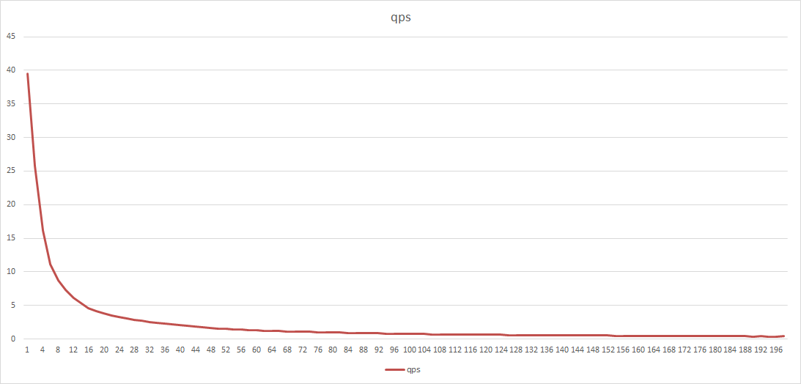

结论：在batch size小于200的前提下，随着batch size的增加，qps随之下降，并且qps与单机情况相比有大幅下降。

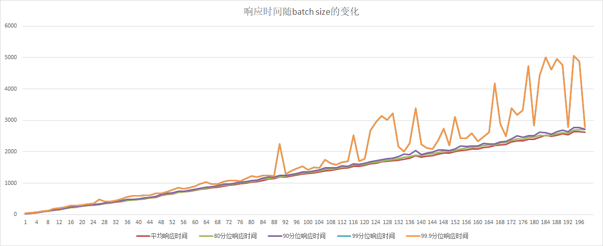

结论：随着batch size的增加，平均响应时间和各分位响应时间也随之增加，其中99.9分位的响应时间浮动较大，其它指标基本线性增长，各个响应时间指标较单机情况大幅增加。

## 3.2 单卡多并发

固定batch size（例如，可以固定为batch size= 10。以下所有场景中所有固定batch size的均以此为准），启动单个Serving进程，绑定GPU0；启动压力测试工具，以concurrency = 1, 2, ...向该Serving进程发压力，观察平响等指标随并发数增加的变化情况。

如本章开头所述，目前Paddle预测库GPU预测只用1个stream，并行的请求会被串行计算。本测试项是为了观察和验证这种场景下的性能表现。预期随着并发数增加，平响和99分位响应时间会急剧变大，但总qps略有上涨后保持稳定或开始下降（并发请求数将stream占满后，每秒内处理能力达到极限）。

| 并发数 | batch size | qps | 总时间 | 平均响应时间 | 80分位响应时间 | 90分位响应时间 | 99分位响应时间 | 99.9分位响应时间 |
|-----|------------|-----------|--------|-------------|----------|----------|----------|------------|
| 1   | 10         | 7.48559   | 13359  | 133.59      | 138      | 142      | 167      | 167        |
| 2   | 10         | 13.952839 | 14334  | 143.34      | 148      | 160      | 207      | 208        |
| 3   | 10         | 19.843895 | 15118  | 151.183333  | 149      | 177      | 249      | 261        |
| 4   | 10         | 16.42643  | 24351  | 243.51      | 283      | 292      | 324      | 327        |
| 5   | 10         | 17.525412 | 28530  | 285.302     | 330      | 337      | 361      | 377        |
| 6   | 10         | 18.325087 | 32742  | 327.42      | 381      | 390      | 423      | 443        |
| 7   | 10         | 19.130387 | 36591  | 365.918571  | 426      | 440      | 478      | 527        |
| 8   | 10         | 19.28129  | 41491  | 414.91125   | 472      | 487      | 519      | 539        |
| 9   | 10         | 19.857906 | 45322  | 453.227778  | 523      | 540      | 630      | 669        |
| 10  | 10         | 20.079918 | 49801  | 498.017     | 541      | 558      | 681      | 843        |
| 11  | 10         | 20.460929 | 53761  | 537.618182  | 579      | 672      | 885      | 988        |
| 12  | 10         | 20.565553 | 58350  | 583.505     | 667      | 749      | 943      | 998        |
| 13  | 10         | 20.541668 | 63286  | 632.863846  | 751      | 850      | 997      | 1057       |
| 14  | 10         | 20.426029 | 68540  | 685.400714  | 830      | 927      | 1029     | 1127       |
| 15  | 10         | 20.337328 | 73756  | 737.566667  | 934      | 974      | 1038     | 1154       |
| 16  | 10         | 20.386061 | 78485  | 784.858125  | 930      | 983      | 1044     | 1115       |
| 17  | 10         | 20.407428 | 83303  | 833.036471  | 964      | 995      | 1044     | 1088       |
| 18  | 10         | 20.28169  | 88750  | 887.503333  | 988      | 1011     | 1062     | 1118       |
| 19  | 10         | 20.26645  | 93751  | 937.511579  | 1009     | 1034     | 1180     | 1370       |
| 20  | 10         | 20.164136 | 99186  | 991.8675    | 1038     | 1086     | 1379     | 1514       |
| 21  | 10         | 20.25502  | 103678 | 1036.78     | 1087     | 1183     | 1464     | 1512       |
| 22  | 10         | 20.340801 | 108157 | 1081.574091 | 1187     | 1302     | 1485     | 1553       |
| 23  | 10         | 20.421028 | 112629 | 1126.297826 | 1266     | 1366     | 1505     | 1555       |
| 24  | 10         | 20.309208 | 118173 | 1181.737083 | 1358     | 1445     | 1529     | 1605       |
| 25  | 10         | 20.241276 | 123510 | 1235.104    | 1426     | 1481     | 1555     | 1633       |
| 26  | 10         | 20.213014 | 128630 | 1286.305    | 1468     | 1501     | 1560     | 1615       |
| 27  | 10         | 20.372131 | 132534 | 1325.342222 | 1464     | 1501     | 1572     | 1645       |
| 28  | 10         | 20.264891 | 138170 | 1381.702143 | 1497     | 1522     | 1599     | 1718       |
| 29  | 10         | 20.065733 | 144525 | 1445.254828 | 1531     | 1559     | 1695     | 1901       |
| 30  | 10         | 20.220675 | 148363 | 1483.635    | 1549     | 1601     | 1856     | 1958       |
| 31  | 10         | 20.2206   | 153309 | 1533.098387 | 1604     | 1687     | 1950     | 2006       |
| 32  | 10         | 20.255088 | 157985 | 1579.854063 | 1690     | 1807     | 1999     | 2094       |
| 33  | 10         | 20.111037 | 164089 | 1640.890909 | 1813     | 1939     | 2039     | 2094       |
| 34  | 10         | 20.289059 | 167578 | 1675.781765 | 1854     | 1949     | 2029     | 2072       |
| 35  | 10         | 20.167099 | 173550 | 1735.508857 | 1933     | 1987     | 2070     | 2122       |
| 36  | 10         | 20.371093 | 176721 | 1767.214444 | 1902     | 1977     | 2084     | 2130       |
| 37  | 10         | 20.316498 | 182118 | 1821.182162 | 1968     | 2002     | 2082     | 2130       |
| 38  | 10         | 20.108161 | 188978 | 1889.780789 | 2011     | 2055     | 2195     | 2349       |
| 39  | 10         | 20.355968 | 191590 | 1915.908462 | 2011     | 2049     | 2174     | 2384       |
| 40  | 10         | 20.266299 | 197372 | 1973.72725  | 2055     | 2105     | 2394     | 2502       |
| 41  | 10         | 20.187299 | 203098 | 2030.984146 | 2114     | 2211     | 2454     | 2513       |
| 42  | 10         | 20.180083 | 208126 | 2081.263571 | 2190     | 2328     | 2541     | 2621       |
| 43  | 10         | 20.171505 | 213172 | 2131.720465 | 2289     | 2410     | 2548     | 2611       |
| 44  | 10         | 20.145044 | 218416 | 2184.162955 | 2370     | 2470     | 2576     | 2655       |
| 45  | 10         | 20.128284 | 223566 | 2235.666    | 2421     | 2490     | 2566     | 2601       |
| 46  | 10         | 20.34966  | 226048 | 2260.487826 | 2427     | 2483     | 2576     | 3033       |
| 47  | 10         | 20.265085 | 231926 | 2319.266596 | 2471     | 2520     | 2628     | 3037       |
| 48  | 10         | 20.300103 | 236452 | 2364.526667 | 2497     | 2538     | 2634     | 3005       |
| 49  | 10         | 20.186124 | 242741 | 2427.414898 | 2543     | 2592     | 2748     | 2968       |
| 50  | 10         | 20.196145 | 247572 | 2475.7218   | 2562     | 2619     | 2850     | 2994       |
| 51  | 10         | 20.173412 | 252808 | 2528.083922 | 2630     | 2721     | 2974     | 3088       |
| 52  | 10         | 20.188843 | 257568 | 2575.686923 | 2715     | 2844     | 3033     | 3441       |
| 53  | 10         | 20.351271 | 260426 | 2604.267547 | 2728     | 2854     | 3026     | 3493       |
| 54  | 10         | 20.135204 | 268187 | 2681.871296 | 2879     | 2972     | 3082     | 3137       |
| 55  | 10         | 20.25917  | 271482 | 2714.824182 | 2885     | 2971     | 3121     | 3234       |
| 56  | 10         | 20.141784 | 278029 | 2780.295179 | 2968     | 3017     | 3096     | 3167       |
| 57  | 10         | 20.150386 | 282873 | 2828.730351 | 2989     | 3049     | 3163     | 3291       |
| 58  | 10         | 20.092982 | 288658 | 2886.581552 | 3022     | 3067     | 3193     | 3341       |
| 59  | 10         | 20.252296 | 291325 | 2913.255085 | 3027     | 3066     | 3236     | 3461       |
| 60  | 10         | 20.250157 | 296294 | 2962.946667 | 3073     | 3124     | 3350     | 3521       |
| 61  | 10         | 20.2362   | 301440 | 3014.409344 | 3115     | 3208     | 3475     | 3562       |
| 62  | 10         | 20.34074  | 304807 | 3048.075    | 3164     | 3249     | 3496     | 3637       |
| 63  | 10         | 20.111668 | 313251 | 3132.516508 | 3300     | 3423     | 3568     | 3635       |
| 64  | 10         | 20.073897 | 318822 | 3188.223125 | 3387     | 3490     | 3602     | 3773       |
| 65  | 10         | 20.182073 | 322068 | 3220.688154 | 3415     | 3493     | 3615     | 3675       |
| 66  | 10         | 20.152487 | 327503 | 3275.038333 | 3461     | 3517     | 3652     | 4039       |
| 67  | 10         | 20.201777 | 331654 | 3316.54403  | 3477     | 3534     | 3671     | 3741       |
| 68  | 10         | 20.172475 | 337093 | 3370.938824 | 3512     | 3566     | 3705     | 3834       |
| 69  | 10         | 20.121487 | 342917 | 3429.171159 | 3564     | 3619     | 3860     | 4056       |
| 70  | 10         | 20.212228 | 346325 | 3463.258714 | 3567     | 3635     | 3907     | 4078       |
| 71  | 10         | 20.316537 | 349469 | 3494.692535 | 3618     | 3702     | 3953     | 4447       |
| 72  | 10         | 20.244395 | 355654 | 3556.545556 | 3683     | 3779     | 4000     | 4096       |
| 73  | 10         | 20.38514  | 358104 | 3581.045068 | 3708     | 3799     | 4024     | 4171       |
| 74  | 10         | 20.234612 | 365710 | 3657.103378 | 3823     | 3925     | 4076     | 4199       |
| 75  | 10         | 20.12526  | 372666 | 3726.664133 | 3936     | 4010     | 4162     | 4701       |
| 76  | 10         | 20.187692 | 376467 | 3764.679605 | 3945     | 4015     | 4142     | 4253       |
| 77  | 10         | 20.114365 | 382811 | 3828.118182 | 4005     | 4056     | 4167     | 4400       |
| 78  | 10         | 20.213957 | 385872 | 3858.725128 | 4016     | 4069     | 4224     | 4485       |
| 79  | 10         | 20.029207 | 394424 | 3944.242532 | 4081     | 4142     | 4445     | 4582       |
| 80  | 10         | 20.239586 | 395265 | 3952.658    | 4076     | 4148     | 4422     | 4552       |
| 81  | 10         | 20.141438 | 402156 | 4021.566049 | 4144     | 4255     | 4521     | 4608       |
| 82  | 10         | 20.049096 | 408996 | 4089.960854 | 4238     | 4372     | 4607     | 4752       |
| 83  | 10         | 20.136491 | 412187 | 4121.876867 | 4284     | 4395     | 4612     | 4721       |
| 84  | 10         | 20.142629 | 417026 | 4170.2625   | 4365     | 4473     | 4639     | 4771       |
| 85  | 10         | 20.307964 | 418555 | 4185.555765 | 4347     | 4427     | 4588     | 4648       |
| 86  | 10         | 20.176947 | 426229 | 4262.294884 | 4454     | 4532     | 4708     | 4768       |
| 87  | 10         | 20.174942 | 431228 | 4312.282759 | 4491     | 4551     | 4700     | 4874       |
| 88  | 10         | 20.161706 | 436471 | 4364.713409 | 4523     | 4580     | 4708     | 4820       |
| 89  | 10         | 20.200645 | 440580 | 4405.808876 | 4550     | 4610     | 4800     | 4963       |
| 90  | 10         | 20.230811 | 444866 | 4448.661    | 4587     | 4658     | 4906     | 5096       |
| 91  | 10         | 20.209243 | 450289 | 4502.895714 | 4645     | 4733     | 4957     | 5071       |
| 92  | 10         | 20.284691 | 453544 | 4535.442826 | 4670     | 4769     | 4975     | 5095       |
| 93  | 10         | 20.212294 | 460116 | 4601.16129  | 4772     | 4890     | 5075     | 5180       |
| 94  | 10         | 20.153639 | 466417 | 4664.177766 | 4858     | 4965     | 5136     | 5332       |
| 95  | 10         | 20.196866 | 470370 | 4703.701158 | 4893     | 4988     | 5178     | 5293       |
| 96  | 10         | 20.27545  | 473479 | 4734.793438 | 4900     | 5001     | 5200     | 5272       |
| 97  | 10         | 20.22852  | 479521 | 4795.211959 | 4970     | 5034     | 5176     | 5393       |
| 98  | 10         | 20.275331 | 483346 | 4833.468061 | 4987     | 5046     | 5253     | 5751       |
| 99  | 10         | 20.198682 | 490131 | 4901.316364 | 5057     | 5127     | 5331     | 5528       |
| 100 | 10         | 20.139608 | 496534 | 4965.3454   | 5111     | 5187     | 5391     | 5487       |
| 101 | 10         | 20.236101 | 499108 | 4991.083465 | 5122     | 5205     | 5491     | 5576       |
| 102 | 10         | 20.1116   | 507170 | 5071.703922 | 5227     | 5339     | 5616     | 5785       |
| 103 | 10         | 20.19889  | 509929 | 5099.292621 | 5253     | 5362     | 5628     | 5742       |
| 104 | 10         | 20.205082 | 514722 | 5147.221538 | 5338     | 5434     | 5602     | 5715       |
| 105 | 10         | 20.178183 | 520364 | 5203.646476 | 5388     | 5492     | 5667     | 5767       |
| 106 | 10         | 20.171611 | 525491 | 5254.914245 | 5441     | 5519     | 5673     | 5785       |
| 107 | 10         | 20.175128 | 530356 | 5303.56486  | 5485     | 5561     | 5731     | 5965       |
| 108 | 10         | 20.188765 | 534951 | 5349.517685 | 5522     | 5591     | 5792     | 6052       |
| 109 | 10         | 20.232432 | 538739 | 5387.395872 | 5540     | 5615     | 5799     | 5998       |
| 110 | 10         | 20.151835 | 545856 | 5458.563182 | 5602     | 5700     | 6072     | 6166       |
| 111 | 10         | 20.223147 | 548876 | 5488.760721 | 5639     | 5721     | 6001     | 6089       |
| 112 | 10         | 20.140263 | 556100 | 5561.009554 | 5736     | 5848     | 6093     | 6264       |
| 113 | 10         | 20.145799 | 560911 | 5609.11115  | 5790     | 5909     | 6164     | 6377       |
| 114 | 10         | 20.184636 | 564786 | 5647.865439 | 5820     | 5930     | 6207     | 6283       |
| 115 | 10         | 20.176288 | 569976 | 5699.765391 | 5893     | 5984     | 6153     | 6262       |
| 116 | 10         | 20.186271 | 574648 | 5746.488017 | 5940     | 6036     | 6225     | 6424       |
| 117 | 10         | 20.182992 | 579696 | 5796.960769 | 5977     | 6056     | 6262     | 6410       |
| 118 | 10         | 20.152992 | 585521 | 5855.219576 | 6025     | 6109     | 6302     | 6527       |
| 119 | 10         | 20.193861 | 589288 | 5892.880168 | 6062     | 6126     | 6322     | 6534       |
| 120 | 10         | 20.192366 | 594284 | 5942.845917 | 6104     | 6194     | 6420     | 6533       |
| 121 | 10         | 20.184227 | 599478 | 5994.788182 | 6167     | 6259     | 6547     | 6693       |
| 122 | 10         | 20.165256 | 605001 | 6050.019836 | 6206     | 6304     | 6553     | 6636       |
| 123 | 10         | 20.20202  | 608850 | 6088.503008 | 6264     | 6367     | 6584     | 6727       |
| 124 | 10         | 20.123141 | 616206 | 6162.064435 | 6357     | 6468     | 6687     | 6820       |
| 125 | 10         | 20.110625 | 621562 | 6215.62888  | 6433     | 6518     | 6656     | 6742       |
| 126 | 10         | 20.142082 | 625556 | 6255.560476 | 6446     | 6535     | 6757     | 6845       |
| 127 | 10         | 20.162026 | 629897 | 6298.97378  | 6497     | 6591     | 6785     | 6888       |
| 128 | 10         | 20.106217 | 636619 | 6366.198594 | 6557     | 6626     | 6804     | 7097       |

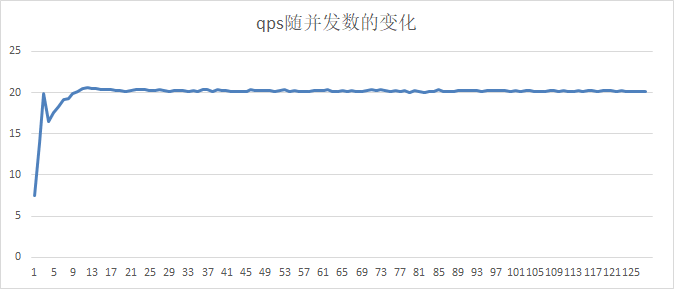

结论：在并发数小于10时，随着并发数的增加，qps也随之增加，大于10并发后，qps基本不变，与单机情况持平。

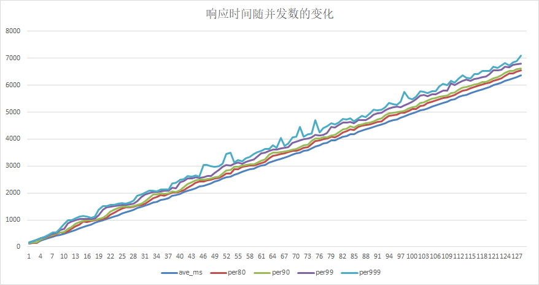

结论：随着并发数的增加，平均响应时间和各分位响应时间也随之增加，与单机相比基本持平，在并发数大于96时，没有发生显存不足的问题。

## 3.3 单卡多进程

如果单个Serving进程不能将GPU卡的算力打满（例如，只有不到50%），那理论上多个Serving进程使用同1张卡，可以提高的GPU的使用率。本测试项就是为了观察和验证这种场景。

固定并发数和batch size（例如， 并发数为1，batch size=10），同时启动2个Serving进程，他们都绑定GPU0。分别启动2个压测工具实例，分别向这个进程以一定并发数发压力，记录2个进程的qps和响应时间数据。

| 并发数 | 进程id | batch size | qps | 平均响应时间 | 80分位响应时间 | 90分位响应时间 | 99分位响应时间 | 99.9分位响应时间 |
|-----|------|------------|----------|--------|----------|----------|----------|------------|
| 1   | 1    | 10         | 5.499945 | 181.82 | 198      | 202      | 315      | 315        |
| 1   | 2    | 10         | 5.465974 | 182.95 | 198      | 203      | 361      | 361        |
| 2   | 1    | 10         | 9.639937 | 207.47 | 208      | 214      | 314      | 314        |
| 2   | 2    | 10         | 9.662303 | 206.99 | 209      | 212      | 282      | 311        |

结论：与单机多并发情况相比较，单进程qps下降，总qps提升，平均和各个分位的响应时间都增加。

该测试项的测试数据，应该与3.2节中数据做对比。

| 并发数 | batch size | qps | 总时间 | 平均响应时间 | 80分位响应时间 | 90分位响应时间 | 99分位响应时间 | 99.9分位响应时间 |
|-----|------------|-----------|-------|--------|----------|----------|----------|------------|
| 1   | 10         | 7.48559   | 13359 | 133.59 | 138      | 142      | 167      | 167        |
| 2   | 10         | 13.952839 | 14334 | 143.34 | 148      | 160      | 207      | 208        |

## 3.4 多卡单并发响应时间与batch_size的变化关系

由于PaddlePaddle预测库只能做单卡预测，间接使得Paddle Serving实例也只能绑定1张卡；在多卡机器上，可以启动多个Serving实例，各自绑定1张GPU卡，并行提供预测服务。本测试项是为了观察与验证，在启动多个Serving实例，每个实例绑定1张独立的GPU卡的情况下，单并发响应时间与batch_size的变化关系。

启动2个Serving实例，分别绑定GPU0和GPU1；再启动2个client端，分别向2个Serving进程以单并发发送请求，不断增大batch_size。

client 1：

| 并发数 | batch size | qps | 总时间 | 平均响应时间  | 80分位响应时间 | 90分位响应时间 | 99分位响应时间 | 99.9分位响应时间 |
|-----|------------|-----------|--------|---------|----------|----------|----------|------------|
| 1   | 2          | 27.419797 | 3647   | 36.47   | 37       | 39       | 64       | 64         |
| 1   | 4          | 16.509823 | 6057   | 60.57   | 62       | 65       | 85       | 85         |
| 1   | 6          | 11.837121 | 8448   | 84.48   | 86       | 89       | 144      | 144        |
| 1   | 8          | 9.099181  | 10990  | 109.9   | 113      | 117      | 204      | 204        |
| 1   | 10         | 7.753741  | 12897  | 128.97  | 132      | 139      | 173      | 173        |
| 1   | 12         | 6.393044  | 15642  | 156.42  | 160      | 164      | 182      | 182        |
| 1   | 14         | 5.747457  | 17399  | 173.99  | 178      | 180      | 234      | 234        |
| 1   | 16         | 4.870683  | 20531  | 205.31  | 210      | 220      | 278      | 278        |
| 1   | 18         | 4.398698  | 22734  | 227.34  | 232      | 239      | 285      | 285        |
| 1   | 20         | 4.037794  | 24766  | 247.66  | 255      | 261      | 291      | 291        |
| 1   | 22         | 3.659251  | 27328  | 273.28  | 279      | 284      | 353      | 353        |
| 1   | 24         | 3.336559  | 29971  | 299.71  | 307      | 320      | 509      | 509        |
| 1   | 26         | 3.098469  | 32274  | 322.74  | 331      | 340      | 423      | 423        |
| 1   | 28         | 2.837362  | 35244  | 352.44  | 368      | 379      | 419      | 419        |
| 1   | 30         | 2.674655  | 37388  | 373.88  | 388      | 399      | 533      | 533        |
| 1   | 32         | 2.554539  | 39146  | 391.46  | 401      | 406      | 443      | 443        |
| 1   | 34         | 2.338525  | 42762  | 427.62  | 436      | 458      | 661      | 661        |
| 1   | 36         | 2.205899  | 45333  | 453.33  | 465      | 483      | 727      | 727        |
| 1   | 38         | 2.116223  | 47254  | 472.54  | 490      | 500      | 571      | 571        |
| 1   | 40         | 2.029921  | 49263  | 492.63  | 508      | 524      | 716      | 716        |
| 1   | 42         | 1.918208  | 52132  | 521.32  | 531      | 553      | 750      | 750        |
| 1   | 44         | 1.82156   | 54898  | 548.98  | 568      | 588      | 900      | 900        |
| 1   | 46         | 1.701143  | 58784  | 587.84  | 597      | 612      | 764      | 764        |
| 1   | 48         | 1.655711  | 60397  | 603.97  | 610      | 629      | 867      | 867        |
| 1   | 50         | 1.550171  | 64509  | 645.09  | 659      | 679      | 924      | 924        |
| 1   | 52         | 1.529637  | 65375  | 653.75  | 673      | 691      | 792      | 792        |
| 1   | 54         | 1.461198  | 68437  | 684.37  | 700      | 721      | 894      | 894        |
| 1   | 56         | 1.385349  | 72184  | 721.84  | 741      | 772      | 892      | 892        |
| 1   | 58         | 1.333671  | 74981  | 749.81  | 779      | 798      | 1053     | 1053       |
| 1   | 60         | 1.293393  | 77316  | 773.16  | 790      | 806      | 1049     | 1049       |
| 1   | 62         | 1.247676  | 80149  | 801.49  | 826      | 847      | 1003     | 1003       |
| 1   | 64         | 1.215067  | 82300  | 823     | 849      | 886      | 984      | 984        |
| 1   | 66         | 1.175392  | 85078  | 850.78  | 874      | 891      | 1036     | 1036       |
| 1   | 68         | 1.129854  | 88507  | 885.07  | 911      | 947      | 1105     | 1105       |
| 1   | 70         | 1.0915    | 91617  | 916.17  | 942      | 972      | 1099     | 1099       |
| 1   | 72         | 1.079389  | 92645  | 926.45  | 957      | 990      | 1059     | 1059       |
| 1   | 74         | 1.050431  | 95199  | 951.99  | 986      | 1014     | 1154     | 1154       |
| 1   | 76         | 1.012556  | 98760  | 987.6   | 1021     | 1081     | 1244     | 1244       |
| 1   | 78         | 0.980825  | 101955 | 1019.55 | 1049     | 1097     | 1459     | 1459       |
| 1   | 80         | 0.967754  | 103332 | 1033.32 | 1060     | 1092     | 1252     | 1252       |
| 1   | 82         | 0.944412  | 105886 | 1058.86 | 1084     | 1134     | 1528     | 1528       |
| 1   | 84         | 0.923651  | 108266 | 1082.66 | 1115     | 1142     | 1494     | 1494       |
| 1   | 86         | 0.89844   | 111304 | 1113.04 | 1143     | 1173     | 1314     | 1314       |
| 1   | 88         | 0.874195  | 114391 | 1143.91 | 1183     | 1213     | 1432     | 1432       |
| 1   | 90         | 0.857552  | 116611 | 1166.11 | 1202     | 1242     | 1338     | 1338       |
| 1   | 92         | 0.809894  | 123473 | 1234.73 | 1246     | 1283     | 1678     | 1678       |
| 1   | 94         | 0.798441  | 125244 | 1252.44 | 1274     | 1303     | 1964     | 1964       |
| 1   | 96         | 0.781409  | 127974 | 1279.74 | 1299     | 1329     | 1531     | 1531       |
| 1   | 98         | 0.761771  | 131273 | 1312.73 | 1334     | 1363     | 1583     | 1583       |
| 1   | 100        | 0.745107  | 134209 | 1342.09 | 1374     | 1402     | 1653     | 1653       |
| 1   | 102        | 0.730268  | 136936 | 1369.36 | 1390     | 1420     | 1893     | 1893       |
| 1   | 104        | 0.718649  | 139150 | 1391.5  | 1427     | 1462     | 1592     | 1592       |
| 1   | 106        | 0.707899  | 141263 | 1412.63 | 1432     | 1481     | 2048     | 2048       |
| 1   | 108        | 0.698753  | 143112 | 1431.12 | 1459     | 1492     | 1673     | 1673       |
| 1   | 110        | 0.66929   | 149412 | 1494.12 | 1514     | 1607     | 2330     | 2330       |
| 1   | 112        | 0.666858  | 149957 | 1499.57 | 1539     | 1569     | 1706     | 1706       |
| 1   | 114        | 0.650889  | 153636 | 1536.36 | 1580     | 1618     | 1795     | 1795       |
| 1   | 116        | 0.644883  | 155067 | 1550.67 | 1595     | 1635     | 1799     | 1799       |
| 1   | 118        | 0.626378  | 159648 | 1596.48 | 1637     | 1676     | 1832     | 1832       |
| 1   | 120        | 0.617166  | 162031 | 1620.31 | 1679     | 1747     | 2233     | 2233       |
| 1   | 122        | 0.606516  | 164876 | 1648.76 | 1693     | 1722     | 2266     | 2266       |
| 1   | 124        | 0.610452  | 163813 | 1638.13 | 1670     | 1702     | 1806     | 1806       |
| 1   | 126        | 0.585943  | 170665 | 1706.65 | 1753     | 1819     | 2163     | 2163       |
| 1   | 128        | 0.578921  | 172735 | 1727.35 | 1766     | 1837     | 2062     | 2062       |
| 1   | 130        | 0.567424  | 176235 | 1762.35 | 1801     | 1853     | 2147     | 2147       |
| 1   | 132        | 0.56117   | 178199 | 1781.99 | 1804     | 1902     | 2648     | 2648       |
| 1   | 134        | 0.5539    | 180538 | 1805.38 | 1832     | 1916     | 2937     | 2937       |
| 1   | 136        | 0.544642  | 183607 | 1836.07 | 1910     | 1986     | 2210     | 2210       |
| 1   | 138        | 0.537912  | 185904 | 1859.04 | 1903     | 1946     | 2316     | 2316       |
| 1   | 140        | 0.52977   | 188761 | 1887.61 | 1914     | 2001     | 2617     | 2617       |
| 1   | 142        | 0.523747  | 190932 | 1909.32 | 1959     | 2006     | 2231     | 2231       |
| 1   | 144        | 0.515634  | 193936 | 1939.36 | 1962     | 2084     | 2457     | 2457       |
| 1   | 146        | 0.509507  | 196268 | 1962.68 | 2004     | 2063     | 2265     | 2265       |
| 1   | 148        | 0.502841  | 198870 | 1988.7  | 2049     | 2144     | 2413     | 2413       |
| 1   | 150        | 0.502134  | 199150 | 1991.5  | 2037     | 2086     | 2281     | 2281       |
| 1   | 152        | 0.491792  | 203338 | 2033.38 | 2075     | 2094     | 2700     | 2700       |
| 1   | 154        | 0.486351  | 205613 | 2056.13 | 2102     | 2152     | 2604     | 2604       |
| 1   | 156        | 0.475545  | 210285 | 2102.85 | 2168     | 2201     | 2920     | 2920       |
| 1   | 158        | 0.474496  | 210750 | 2107.5  | 2150     | 2227     | 2365     | 2365       |
| 1   | 160        | 0.467611  | 213853 | 2138.53 | 2176     | 2255     | 3022     | 3022       |
| 1   | 162        | 0.460397  | 217204 | 2172.04 | 2194     | 2331     | 2988     | 2988       |
| 1   | 164        | 0.456759  | 218934 | 2189.34 | 2230     | 2348     | 2636     | 2636       |
| 1   | 166        | 0.449879  | 222282 | 2222.82 | 2249     | 2322     | 3306     | 3306       |
| 1   | 168        | 0.440624  | 226951 | 2269.51 | 2299     | 2383     | 3632     | 3632       |
| 1   | 170        | 0.44145   | 226526 | 2265.26 | 2305     | 2426     | 2585     | 2585       |
| 1   | 172        | 0.431635  | 231677 | 2316.77 | 2378     | 2417     | 2714     | 2714       |
| 1   | 174        | 0.42495   | 235322 | 2353.22 | 2391     | 2480     | 2831     | 2831       |
| 1   | 176        | 0.409281  | 244331 | 2443.31 | 2563     | 2624     | 3402     | 3402       |
| 1   | 178        | 0.41879   | 238783 | 2387.83 | 2444     | 2525     | 2649     | 2649       |
| 1   | 180        | 0.412865  | 242210 | 2422.1  | 2454     | 2564     | 2992     | 2992       |
| 1   | 182        | 0.40871   | 244672 | 2446.72 | 2511     | 2568     | 2683     | 2683       |
| 1   | 184        | 0.403302  | 247953 | 2479.53 | 2531     | 2613     | 3200     | 3200       |
| 1   | 186        | 0.396192  | 252403 | 2524.03 | 2583     | 2622     | 3824     | 3824       |
| 1   | 188        | 0.391426  | 255476 | 2554.76 | 2602     | 2646     | 3317     | 3317       |
| 1   | 190        | 0.389557  | 256702 | 2567.02 | 2640     | 2700     | 3580     | 3580       |
| 1   | 192        | 0.385269  | 259559 | 2595.59 | 2659     | 2749     | 3585     | 3585       |
| 1   | 194        | 0.379858  | 263256 | 2632.56 | 2716     | 2816     | 3394     | 3394       |
| 1   | 196        | 0.375418  | 266370 | 2663.7  | 2740     | 2831     | 3553     | 3553       |
| 1   | 198        | 0.372534  | 268432 | 2684.32 | 2741     | 2817     | 3939     | 3939       |
| 1   | 200        | 0.367207  | 272326 | 2723.26 | 2759     | 2841     | 4114     | 4114       |
| 1   | 202        | 0.367204  | 272328 | 2723.28 | 2800     | 2861     | 4085     | 4085       |
| 1   | 204        | 0.361073  | 276952 | 2769.52 | 2830     | 2932     | 4057     | 4057       |
| 1   | 206        | 0.356544  | 280470 | 2804.7  | 2868     | 3070     | 3483     | 3483       |
| 1   | 208        | 0.355707  | 281130 | 2811.3  | 2895     | 3001     | 3093     | 3093       |
| 1   | 210        | 0.355328  | 281430 | 2814.3  | 2888     | 2995     | 3500     | 3500       |
| 1   | 212        | 0.350765  | 285091 | 2850.91 | 2927     | 3016     | 3267     | 3267       |
| 1   | 214        | 0.338437  | 295476 | 2954.76 | 3040     | 3173     | 4770     | 4770       |
| 1   | 216        | 0.342413  | 292045 | 2920.45 | 2980     | 3085     | 3951     | 3951       |
| 1   | 218        | 0.341919  | 292467 | 2924.67 | 2985     | 3078     | 3437     | 3437       |
| 1   | 220        | 0.336953  | 296777 | 2967.77 | 3048     | 3119     | 3429     | 3429       |
| 1   | 222        | 0.333076  | 300232 | 3002.32 | 3042     | 3144     | 4037     | 4037       |
| 1   | 224        | 0.331037  | 302081 | 3020.81 | 3102     | 3221     | 3512     | 3512       |
| 1   | 226        | 0.327405  | 305432 | 3054.32 | 3127     | 3274     | 3755     | 3755       |
| 1   | 228        | 0.324315  | 308342 | 3083.42 | 3187     | 3277     | 3471     | 3471       |
| 1   | 230        | 0.324681  | 307995 | 3079.95 | 3159     | 3232     | 3551     | 3551       |
| 1   | 232        | 0.321199  | 311333 | 3113.33 | 3161     | 3285     | 3684     | 3684       |
| 1   | 234        | 0.314788  | 317674 | 3176.74 | 3281     | 3324     | 3742     | 3742       |
| 1   | 236        | 0.316314  | 316142 | 3161.42 | 3256     | 3342     | 3585     | 3585       |
| 1   | 238        | 0.311316  | 321217 | 3212.17 | 3337     | 3412     | 4320     | 4320       |
| 1   | 240        | 0.306876  | 325865 | 3258.65 | 3319     | 3395     | 4779     | 4779       |
| 1   | 242        | 0.30333   | 329674 | 3296.74 | 3414     | 3480     | 3951     | 3951       |

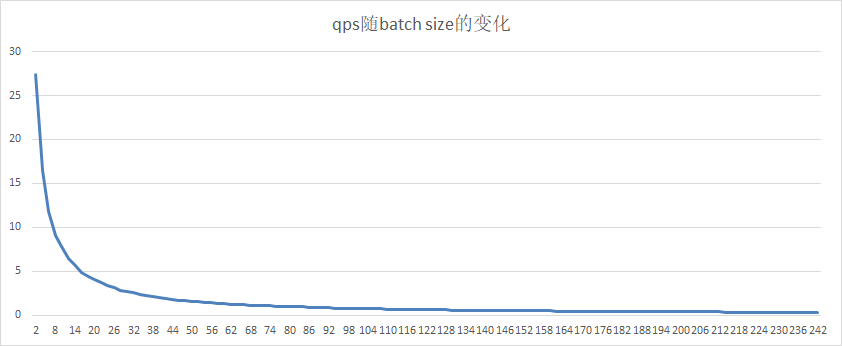

client 2：

| 并发数 | batch size | qps      | 总时间    | 平均响应时间  | 80分位响应时间 | 90分位响应时间 | 99分位响应时间 | 99.9分位响应时间 |
|-----|------------|----------|--------|---------|----------|----------|----------|------------|
| 1   | 2          | 26.71654 | 3743   | 37.43   | 39       | 41       | 65       | 65         |
| 1   | 4          | 16.34521 | 6118   | 61.18   | 63       | 65       | 114      | 114        |
| 1   | 6          | 11.58883 | 8629   | 86.29   | 89       | 94       | 125      | 125        |
| 1   | 8          | 9.084302 | 11008  | 110.08  | 116      | 119      | 166      | 166        |
| 1   | 10         | 7.747134 | 12908  | 129.08  | 132      | 140      | 163      | 163        |
| 1   | 12         | 6.392636 | 15643  | 156.43  | 159      | 164      | 191      | 191        |
| 1   | 14         | 5.747126 | 17400  | 174     | 178      | 183      | 246      | 246        |
| 1   | 16         | 4.916904 | 20338  | 203.38  | 210      | 216      | 260      | 260        |
| 1   | 18         | 4.441878 | 22513  | 225.13  | 232      | 237      | 262      | 262        |
| 1   | 20         | 3.993132 | 25043  | 250.43  | 256      | 265      | 317      | 317        |
| 1   | 22         | 3.653502 | 27371  | 273.71  | 280      | 288      | 326      | 326        |
| 1   | 24         | 3.328119 | 30047  | 300.47  | 307      | 321      | 468      | 468        |
| 1   | 26         | 3.171985 | 31526  | 315.26  | 320      | 329      | 353      | 353        |
| 1   | 28         | 2.894021 | 34554  | 345.54  | 346      | 362      | 682      | 682        |
| 1   | 30         | 2.768319 | 36123  | 361.23  | 370      | 379      | 414      | 414        |
| 1   | 32         | 2.588193 | 38637  | 386.37  | 389      | 399      | 522      | 522        |
| 1   | 34         | 2.421483 | 41297  | 412.97  | 420      | 448      | 696      | 696        |
| 1   | 36         | 2.280762 | 43845  | 438.45  | 447      | 461      | 565      | 565        |
| 1   | 38         | 2.182548 | 45818  | 458.18  | 464      | 484      | 556      | 556        |
| 1   | 40         | 2.04499  | 48900  | 489     | 501      | 518      | 698      | 698        |
| 1   | 42         | 1.977535 | 50568  | 505.68  | 515      | 525      | 619      | 619        |
| 1   | 44         | 1.879028 | 53219  | 532.19  | 540      | 565      | 649      | 649        |
| 1   | 46         | 1.717416 | 58227  | 582.27  | 595      | 615      | 679      | 679        |
| 1   | 48         | 1.668669 | 59928  | 599.28  | 605      | 623      | 671      | 671        |
| 1   | 50         | 1.571907 | 63617  | 636.17  | 657      | 674      | 722      | 722        |
| 1   | 52         | 1.515726 | 65975  | 659.75  | 674      | 691      | 853      | 853        |
| 1   | 54         | 1.460323 | 68478  | 684.78  | 701      | 719      | 843      | 843        |
| 1   | 56         | 1.424075 | 70221  | 702.21  | 712      | 739      | 779      | 779        |
| 1   | 58         | 1.340824 | 74581  | 745.81  | 754      | 807      | 1337     | 1337       |
| 1   | 60         | 1.344411 | 74382  | 743.82  | 752      | 772      | 856      | 856        |
| 1   | 62         | 1.278805 | 78198  | 781.98  | 793      | 818      | 992      | 992        |
| 1   | 64         | 1.24148  | 80549  | 805.49  | 818      | 840      | 1194     | 1194       |
| 1   | 66         | 1.203847 | 83067  | 830.67  | 838      | 874      | 978      | 978        |
| 1   | 68         | 1.168757 | 85561  | 855.61  | 866      | 901      | 1256     | 1256       |
| 1   | 70         | 1.134391 | 88153  | 881.53  | 886      | 911      | 1259     | 1259       |
| 1   | 72         | 1.09523  | 91305  | 913.05  | 941      | 964      | 1021     | 1021       |
| 1   | 74         | 1.071949 | 93288  | 932.88  | 950      | 975      | 1083     | 1083       |
| 1   | 76         | 1.046518 | 95555  | 955.55  | 968      | 989      | 1107     | 1107       |
| 1   | 78         | 1.020387 | 98002  | 980.02  | 995      | 1003     | 1238     | 1238       |
| 1   | 80         | 0.994649 | 100538 | 1005.38 | 1021     | 1043     | 1214     | 1214       |
| 1   | 82         | 0.967146 | 103397 | 1033.97 | 1052     | 1072     | 1311     | 1311       |
| 1   | 84         | 0.934239 | 107039 | 1070.39 | 1083     | 1131     | 1568     | 1568       |
| 1   | 86         | 0.921353 | 108536 | 1085.36 | 1107     | 1129     | 1197     | 1197       |
| 1   | 88         | 0.893479 | 111922 | 1119.22 | 1141     | 1206     | 1486     | 1486       |
| 1   | 90         | 0.873393 | 114496 | 1144.96 | 1167     | 1211     | 1806     | 1806       |
| 1   | 92         | 0.809422 | 123545 | 1235.45 | 1274     | 1337     | 1591     | 1591       |
| 1   | 94         | 0.795513 | 125705 | 1257.05 | 1284     | 1325     | 1588     | 1588       |
| 1   | 96         | 0.786015 | 127224 | 1272.24 | 1296     | 1324     | 1456     | 1456       |
| 1   | 98         | 0.764941 | 130729 | 1307.29 | 1337     | 1377     | 1495     | 1495       |
| 1   | 100        | 0.741983 | 134774 | 1347.74 | 1377     | 1415     | 1646     | 1646       |
| 1   | 102        | 0.730028 | 136981 | 1369.81 | 1400     | 1450     | 1685     | 1685       |
| 1   | 104        | 0.717875 | 139300 | 1393    | 1431     | 1457     | 1769     | 1769       |
| 1   | 106        | 0.699222 | 143016 | 1430.16 | 1471     | 1512     | 1892     | 1892       |
| 1   | 108        | 0.692761 | 144350 | 1443.5  | 1475     | 1542     | 2001     | 2001       |
| 1   | 110        | 0.668802 | 149521 | 1495.21 | 1529     | 1632     | 2161     | 2161       |
| 1   | 112        | 0.666693 | 149994 | 1499.94 | 1539     | 1583     | 1717     | 1717       |
| 1   | 114        | 0.651861 | 153407 | 1534.07 | 1572     | 1597     | 1803     | 1803       |
| 1   | 116        | 0.64229  | 155693 | 1556.93 | 1593     | 1642     | 2031     | 2031       |
| 1   | 118        | 0.627388 | 159391 | 1593.91 | 1632     | 1671     | 1898     | 1898       |
| 1   | 120        | 0.617501 | 161943 | 1619.43 | 1669     | 1724     | 1928     | 1928       |
| 1   | 122        | 0.608665 | 164294 | 1642.94 | 1680     | 1722     | 2035     | 2035       |
| 1   | 124        | 0.607083 | 164722 | 1647.22 | 1681     | 1719     | 1947     | 1947       |
| 1   | 126        | 0.587865 | 170107 | 1701.07 | 1757     | 1811     | 1921     | 1921       |
| 1   | 128        | 0.576735 | 173390 | 1733.9  | 1778     | 1859     | 2104     | 2104       |
| 1   | 130        | 0.567524 | 176204 | 1762.04 | 1792     | 1880     | 2367     | 2367       |
| 1   | 132        | 0.558822 | 178948 | 1789.48 | 1840     | 1936     | 2407     | 2407       |
| 1   | 134        | 0.551128 | 181446 | 1814.46 | 1851     | 1899     | 3198     | 3198       |
| 1   | 136        | 0.541213 | 184770 | 1847.7  | 1913     | 1981     | 2777     | 2777       |
| 1   | 138        | 0.53749  | 186050 | 1860.5  | 1896     | 1958     | 2078     | 2078       |
| 1   | 140        | 0.530211 | 188604 | 1886.04 | 1928     | 1970     | 2521     | 2521       |
| 1   | 142        | 0.523437 | 191045 | 1910.45 | 1959     | 2005     | 2312     | 2312       |
| 1   | 144        | 0.519891 | 192348 | 1923.48 | 1965     | 2016     | 2317     | 2317       |
| 1   | 146        | 0.509674 | 196204 | 1962.04 | 2016     | 2043     | 2179     | 2179       |
| 1   | 148        | 0.502854 | 198865 | 1988.65 | 2029     | 2125     | 2544     | 2544       |
| 1   | 150        | 0.49988  | 200048 | 2000.48 | 2043     | 2091     | 2495     | 2495       |
| 1   | 152        | 0.491123 | 203615 | 2036.15 | 2105     | 2166     | 2599     | 2599       |
| 1   | 154        | 0.484921 | 206219 | 2062.19 | 2102     | 2163     | 3197     | 3197       |
| 1   | 156        | 0.474877 | 210581 | 2105.81 | 2167     | 2222     | 2584     | 2584       |
| 1   | 158        | 0.474994 | 210529 | 2105.29 | 2168     | 2222     | 2327     | 2327       |
| 1   | 160        | 0.468325 | 213527 | 2135.27 | 2159     | 2272     | 2638     | 2638       |
| 1   | 162        | 0.457815 | 218429 | 2184.29 | 2235     | 2319     | 2986     | 2986       |
| 1   | 164        | 0.457032 | 218803 | 2188.03 | 2226     | 2309     | 2924     | 2924       |
| 1   | 166        | 0.450455 | 221998 | 2219.98 | 2263     | 2340     | 3110     | 3110       |
| 1   | 168        | 0.440455 | 227038 | 2270.38 | 2307     | 2408     | 4202     | 4202       |
| 1   | 170        | 0.441143 | 226684 | 2266.84 | 2322     | 2375     | 2650     | 2650       |
| 1   | 172        | 0.436178 | 229264 | 2292.64 | 2327     | 2396     | 2974     | 2974       |
| 1   | 174        | 0.424744 | 235436 | 2354.36 | 2404     | 2503     | 2818     | 2818       |
| 1   | 176        | 0.409717 | 244071 | 2440.71 | 2542     | 2635     | 3947     | 3947       |
| 1   | 178        | 0.418648 | 238864 | 2388.64 | 2470     | 2561     | 2776     | 2776       |
| 1   | 180        | 0.412746 | 242280 | 2422.8  | 2479     | 2528     | 3451     | 3451       |
| 1   | 182        | 0.408542 | 244773 | 2447.73 | 2512     | 2549     | 2716     | 2716       |
| 1   | 184        | 0.404973 | 246930 | 2469.3  | 2500     | 2641     | 3004     | 3004       |
| 1   | 186        | 0.396032 | 252505 | 2525.05 | 2603     | 2682     | 3701     | 3701       |
| 1   | 188        | 0.391526 | 255411 | 2554.11 | 2586     | 2697     | 4194     | 4194       |
| 1   | 190        | 0.392437 | 254818 | 2548.18 | 2596     | 2676     | 3244     | 3244       |
| 1   | 192        | 0.384134 | 260326 | 2603.26 | 2648     | 2729     | 3479     | 3479       |
| 1   | 194        | 0.378748 | 264028 | 2640.28 | 2719     | 2838     | 4297     | 4297       |
| 1   | 196        | 0.375518 | 266299 | 2662.99 | 2721     | 2858     | 3788     | 3788       |
| 1   | 198        | 0.372256 | 268632 | 2686.32 | 2766     | 2869     | 4055     | 4055       |
| 1   | 200        | 0.366987 | 272489 | 2724.89 | 2767     | 2851     | 4497     | 4497       |
| 1   | 202        | 0.36685  | 272591 | 2725.91 | 2789     | 2888     | 3836     | 3836       |
| 1   | 204        | 0.36094  | 277054 | 2770.54 | 2829     | 2881     | 4396     | 4396       |
| 1   | 206        | 0.356806 | 280264 | 2802.64 | 2916     | 3006     | 4142     | 4142       |
| 1   | 208        | 0.355916 | 280965 | 2809.65 | 2878     | 2953     | 3317     | 3317       |
| 1   | 210        | 0.354379 | 282184 | 2821.84 | 2914     | 3009     | 3225     | 3225       |
| 1   | 212        | 0.350447 | 285350 | 2853.5  | 2940     | 2996     | 3622     | 3622       |
| 1   | 214        | 0.33866  | 295281 | 2952.81 | 3045     | 3121     | 4354     | 4354       |
| 1   | 216        | 0.3423   | 292141 | 2921.41 | 3046     | 3153     | 3806     | 3806       |
| 1   | 218        | 0.341059 | 293204 | 2932.04 | 3014     | 3102     | 3269     | 3269       |
| 1   | 220        | 0.336905 | 296820 | 2968.2  | 3063     | 3124     | 3548     | 3548       |
| 1   | 222        | 0.333258 | 300068 | 3000.68 | 3102     | 3193     | 3682     | 3682       |
| 1   | 224        | 0.331324 | 301819 | 3018.19 | 3118     | 3220     | 3743     | 3743       |
| 1   | 226        | 0.327409 | 305428 | 3054.28 | 3146     | 3278     | 3798     | 3798       |
| 1   | 228        | 0.325404 | 307310 | 3073.1  | 3195     | 3300     | 3628     | 3628       |
| 1   | 230        | 0.3249   | 307787 | 3077.87 | 3174     | 3238     | 3361     | 3361       |
| 1   | 232        | 0.321356 | 311181 | 3111.81 | 3179     | 3325     | 3691     | 3691       |
| 1   | 234        | 0.315266 | 317192 | 3171.92 | 3277     | 3393     | 3858     | 3858       |
| 1   | 236        | 0.318074 | 314392 | 3143.92 | 3243     | 3295     | 3645     | 3645       |
| 1   | 238        | 0.309675 | 322919 | 3229.19 | 3350     | 3487     | 4056     | 4056       |
| 1   | 240        | 0.303451 | 329542 | 3295.42 | 3384     | 3590     | 5369     | 5369       |
| 1   | 242        | 0.303498 | 329492 | 3294.92 | 3396     | 3439     | 4505     | 4505       |

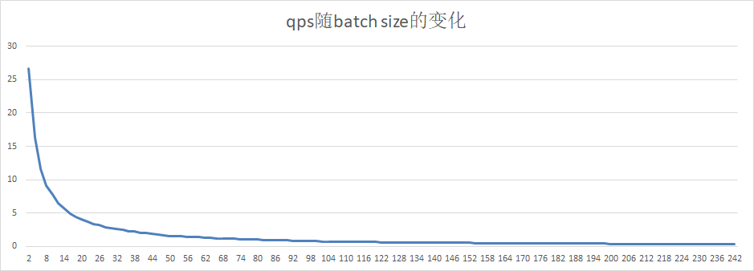

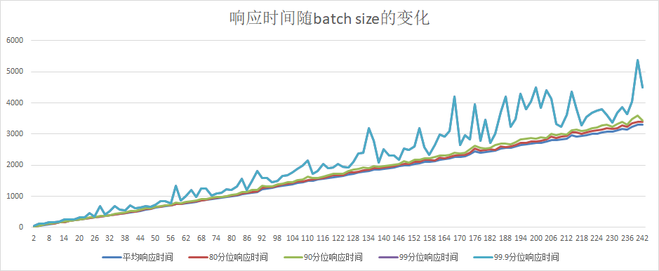

结论：与单卡单进程相比，qps基本翻倍，各个响应时间基本不变，可以认为各个卡之间无影响。

## 3.5 多卡多并发响应时间与batch_size的变化关系

启动2个Serving实例，分别绑定GPU0和GPU1；再启动2个client端，分别向2个Serving进程以并发数=10发送请求，不断增大batch_size。

client 1：

| 并发数 | batch size | qps       | 总时间     | 平均响应时间      | 80分位响应时间 | 90分位响应时间 | 99分位响应时间 | 99.9分位响应时间 |
|-----|------------|-----------|---------|-------------|----------|----------|----------|------------|
| 10  | 10         | 18.008284 | 55530   | 555.303     | 642      | 709      | 769      | 785        |
| 10  | 20         | 9.865825  | 101360  | 1013.604    | 1062     | 1179     | 1421     | 1466       |
| 10  | 30         | 6.661737  | 150111  | 1501.116    | 1573     | 1726     | 2034     | 2185       |
| 10  | 40         | 5.164756  | 193620  | 1936.207    | 2049     | 2149     | 2601     | 2690       |
| 10  | 50         | 4.221155  | 236902  | 2369.029    | 2557     | 2642     | 3257     | 3890       |
| 10  | 60         | 2.741273  | 364794  | 3647.942    | 4711     | 5351     | 11657    | 15556      |
| 10  | 70         | 2.845889  | 351384  | 3513.843    | 3711     | 4003     | 4999     | 5554       |
| 10  | 80         | 2.516749  | 397338  | 3973.387    | 4225     | 4400     | 5316     | 6568       |
| 10  | 90         | 2.279223  | 438746  | 4387.463    | 4725     | 4990     | 6146     | 7834       |
| 10  | 100        | 1.945752  | 513940  | 5139.407    | 5466     | 5762     | 7093     | 8963       |
| 10  | 110        | 1.851197  | 540191  | 5401.912    | 5805     | 6024     | 7253     | 10026      |
| 20  | 10         | 17.879972 | 111857  | 1118.578    | 1246     | 1270     | 1302     | 1342       |
| 20  | 20         | 9.912473  | 201766  | 2017.661    | 2126     | 2280     | 2444     | 2518       |
| 20  | 30         | 6.731015  | 297132  | 2971.3235   | 3139     | 3318     | 3575     | 3819       |
| 20  | 40         | 5.093271  | 392675  | 3926.757    | 4130     | 4345     | 4770     | 5046       |
| 20  | 50         | 4.167448  | 479910  | 4799.108    | 5079     | 5230     | 5864     | 6170       |
| 20  | 60         | 3.514994  | 568991  | 5689.9185   | 6073     | 6245     | 6839     | 7535       |
| 20  | 70         | 2.961598  | 675311  | 6753.1105   | 7163     | 7433     | 8218     | 9018       |
| 20  | 80         | 2.536989  | 788336  | 7883.3685   | 8355     | 8719     | 9897     | 10623      |
| 20  | 90         | 2.20668   | 906339  | 9063.399    | 9624     | 10006    | 11071    | 14247      |
| 20  | 100        | 1.937449  | 1032285 | 10322.854   | 10837    | 11318    | 12615    | 16793      |
| 20  | 110        | 1.804763  | 1108179 | 11081.7915  | 11695    | 12083    | 13537    | 15422      |
| 30  | 10         | 17.801513 | 168525  | 1685.253333 | 1785     | 1835     | 2030     | 2102       |
| 30  | 20         | 9.891197  | 303300  | 3033.001333 | 3175     | 3312     | 3494     | 3575       |
| 30  | 30         | 6.739619  | 445129  | 4451.299667 | 4721     | 4911     | 5226     | 5617       |
| 30  | 40         | 5.315031  | 564437  | 5644.378    | 5952     | 6081     | 6631     | 8711       |
| 30  | 50         | 4.123065  | 727614  | 7276.141    | 7696     | 7912     | 8735     | 9337       |
| 30  | 60         | 3.406521  | 880664  | 8806.644333 | 9236     | 9578     | 10875    | 12432      |
| 30  | 70         | 2.880179  | 1041602 | 10416.025   | 10948    | 11238    | 12129    | 20313      |
| 30  | 80         | 2.532526  | 1184588 | 11845.88433 | 12463    | 12872    | 13801    | 23180      |
| 30  | 90         | 2.297083  | 1306004 | 13060.04433 | 13904    | 14173    | 15172    | 28654      |
| 30  | 100        | 2.002666  | 1498003 | 14980.03733 | 15855    | 16244    | 17360    | 18525      |
| 30  | 110        | 1.83226   | 1637322 | 16373.22567 | 17140    | 17532    | 28046    | 62853      |
| 40  | 10         | 18.22257  | 219508  | 2195.08175  | 2308     | 2339     | 2528     | 2571       |
| 40  | 20         | 9.752268  | 410161  | 4101.6195   | 4299     | 4434     | 4657     | 6085       |
| 40  | 30         | 6.688695  | 598024  | 5980.24125  | 6253     | 6419     | 6636     | 6843       |
| 40  | 40         | 5.04902   | 792233  | 7922.33075  | 8286     | 8515     | 8911     | 9145       |
| 40  | 50         | 4.096338  | 976482  | 9764.82875  | 10252    | 10485    | 11262    | 12351      |
| 40  | 60         | 3.41772   | 1170371 | 11703.7165  | 12202    | 12530    | 13455    | 14044      |
| 40  | 70         | 2.893795  | 1382268 | 13822.68025 | 14445    | 14746    | 15817    | 47842      |
| 40  | 80         | 2.560123  | 1562425 | 15624.2525  | 16406    | 16682    | 17744    | 59196      |
| 40  | 90         | 2.322667  | 1722158 | 17448.41793 | 17162    | 17661    | 60713    | 64893      |
| 40  | 100        | 2.389919  | 1673697 | 18162.75529 | 17667    | 18244    | 62601    | 100313     |
| 40  | 110        | 2.595806  | 1540947 | 18241.46316 | 17599    | 18057    | 63818    | 106641     |
| 50  | 10         | 17.804936 | 280821  | 2808.2188   | 2940     | 3016     | 3109     | 3155       |
| 50  | 20         | 9.779722  | 511262  | 5112.6264   | 5383     | 5476     | 5709     | 5863       |
| 50  | 30         | 6.704192  | 745802  | 7458.0222   | 7769     | 7919     | 8199     | 8953       |
| 50  | 40         | 5.080263  | 984201  | 9842.0198   | 10239    | 10424    | 10954    | 13369      |
| 50  | 50         | 4.056525  | 1232582 | 12325.8268  | 12860    | 13162    | 13952    | 14435      |
| 50  | 60         | 3.391622  | 1474221 | 14742.2166  | 15457    | 15893    | 16684    | 18819      |
| 50  | 70         | 3.091244  | 1617472 | 16771.80071 | 16865    | 17324    | 60101    | 100898     |
| 50  | 80         | 2.926027  | 1708802 | 18240.84799 | 17097    | 17623    | 63539    | 104849     |
| 50  | 90         | 3.19614   | 1564387 | 18535.391   | 17315    | 17946    | 63391    | 104642     |
| 50  | 100        | 3.428791  | 1458240 | 18972.68983 | 17907    | 18387    | 65215    | 104798     |
| 50  | 110        | 3.98105   | 1255950 | 18584.65197 | 17727    | 18299    | 64607    | 101528     |

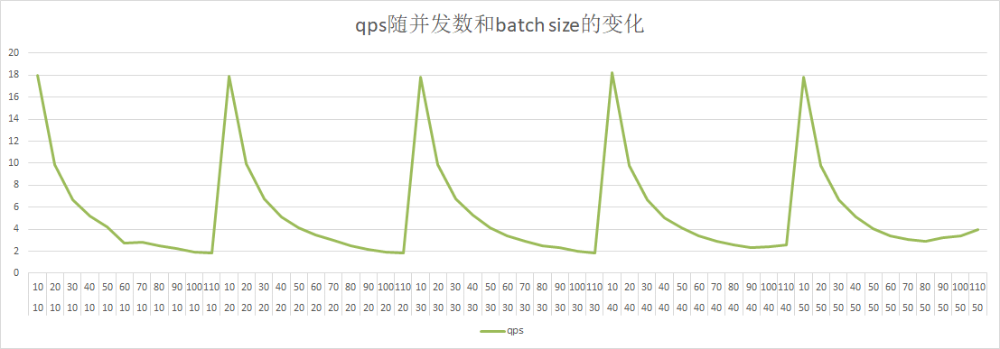

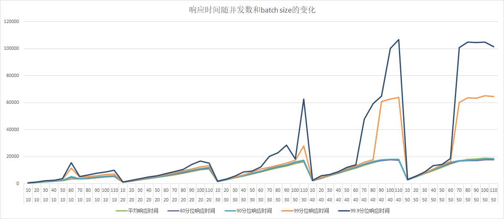

client 2：

| 并发数 | batch size | qps       | 总时间     | 平均响应时间      | 80分位响应时间 | 90分位响应时间 | 99分位响应时间 | 99.9分位响应时间 |
|-----|------------|-----------|---------|-------------|----------|----------|----------|------------|
| 10  | 10         | 17.911838 | 55829   | 558.29      | 660      | 716      | 767      | 829        |
| 10  | 20         | 10.071102 | 99294   | 992.946     | 1044     | 1094     | 1334     | 1425       |
| 10  | 30         | 6.773232  | 147640  | 1476.406    | 1550     | 1718     | 2069     | 2180       |
| 10  | 40         | 5.068835  | 197284  | 1972.843    | 2072     | 2269     | 2654     | 2867       |
| 10  | 50         | 4.232141  | 236287  | 2362.873    | 2512     | 2610     | 3202     | 3518       |
| 10  | 60         | 2.868971  | 348557  | 3485.575    | 4417     | 4864     | 7832     | 9154       |
| 10  | 70         | 2.965414  | 337221  | 3372.218    | 3590     | 3757     | 4693     | 5634       |
| 10  | 80         | 2.596715  | 385102  | 3851.022    | 4128     | 4308     | 5044     | 5858       |
| 10  | 90         | 2.277536  | 439071  | 4390.714    | 4688     | 4895     | 6029     | 6622       |
| 10  | 100        | 2.022523  | 494432  | 4944.321    | 5316     | 5494     | 6473     | 7203       |
| 10  | 110        | 1.800653  | 555354  | 5553.541    | 5907     | 6197     | 7703     | 10422      |
| 20  | 10         | 18.120374 | 110373  | 1103.734    | 1234     | 1266     | 1317     | 1367       |
| 20  | 20         | 10.012265 | 199755  | 1997.559    | 2089     | 2223     | 2447     | 2508       |
| 20  | 30         | 6.703311  | 298360  | 2983.6015   | 3171     | 3342     | 3553     | 3685       |
| 20  | 40         | 5.136305  | 389385  | 3893.8545   | 4075     | 4245     | 4679     | 4864       |
| 20  | 50         | 4.268515  | 468547  | 4685.4785   | 4961     | 5109     | 5688     | 6049       |
| 20  | 60         | 3.517219  | 568631  | 5686.314    | 6020     | 6194     | 6970     | 7398       |
| 20  | 70         | 2.985079  | 669999  | 6699.9995   | 7089     | 7351     | 8276     | 10734      |
| 20  | 80         | 2.609539  | 766419  | 7664.193    | 8103     | 8315     | 9341     | 12035      |
| 20  | 90         | 2.239466  | 893070  | 8930.704    | 9496     | 9785     | 10967    | 12314      |
| 20  | 100        | 1.968684  | 1015907 | 10159.0795  | 10745    | 11239    | 12502    | 16077      |
| 20  | 110        | 1.812463  | 1103471 | 11034.7155  | 11667    | 11964    | 13870    | 16550      |
| 30  | 10         | 17.881517 | 167771  | 1677.713333 | 1773     | 1806     | 1951     | 2527       |
| 30  | 20         | 9.881716  | 303591  | 3035.910667 | 3228     | 3359     | 3529     | 3695       |
| 30  | 30         | 6.745059  | 444770  | 4447.703667 | 4719     | 4844     | 5062     | 5247       |
| 30  | 40         | 5.123948  | 585486  | 5854.866333 | 6136     | 6345     | 6689     | 6899       |
| 30  | 50         | 4.243005  | 707046  | 7070.469    | 7432     | 7597     | 8180     | 11107      |
| 30  | 60         | 3.460866  | 866835  | 8668.355    | 9115     | 9464     | 10176    | 10713      |
| 30  | 70         | 2.937211  | 1021377 | 10213.77733 | 10771    | 11023    | 12116    | 14869      |
| 30  | 80         | 2.524868  | 1188181 | 11881.811   | 12412    | 12744    | 13858    | 19586      |
| 30  | 90         | 2.271227  | 1320872 | 13208.728   | 13898    | 14260    | 15619    | 25786      |
| 30  | 100        | 2.028742  | 1478749 | 14787.49667 | 15657    | 16033    | 17395    | 27276      |
| 30  | 110        | 1.830449  | 1638942 | 16389.42833 | 17089    | 17440    | 31311    | 62343      |
| 40  | 10         | 18.006176 | 222146  | 2221.46775  | 2315     | 2359     | 2547     | 2572       |
| 40  | 20         | 9.891686  | 404380  | 4043.8095   | 4248     | 4363     | 4542     | 4658       |
| 40  | 30         | 6.720927  | 595156  | 5951.56925  | 6257     | 6394     | 6610     | 7016       |
| 40  | 40         | 5.10964   | 782834  | 7828.34     | 8168     | 8395     | 8722     | 11487      |
| 40  | 50         | 4.119032  | 971102  | 9711.0215   | 10159    | 10433    | 10948    | 11252      |
| 40  | 60         | 3.4089    | 1173399 | 11733.992   | 12281    | 12624    | 13369    | 14668      |
| 40  | 70         | 2.844483  | 1406231 | 14062.3195  | 14664    | 15082    | 15904    | 18239      |
| 40  | 80         | 2.574988  | 1553405 | 15534.0575  | 16255    | 16566    | 17966    | 58696      |
| 40  | 90         | 2.37624   | 1683332 | 17128.79954 | 17148    | 17729    | 59420    | 97044      |
| 40  | 100        | 2.319443  | 1724552 | 18578.53057 | 17896    | 18326    | 64014    | 108697     |
| 40  | 110        | 2.368145  | 1689086 | 19074.94777 | 17729    | 18423    | 66734    | 110545     |
| 50  | 10         | 17.97727  | 278129  | 2781.292    | 2918     | 2998     | 3091     | 3145       |
| 50  | 20         | 9.961767  | 501919  | 5019.1924   | 5286     | 5405     | 5858     | 6067       |
| 50  | 30         | 6.723476  | 743663  | 7436.6352   | 7767     | 7887     | 8251     | 8688       |
| 50  | 40         | 5.139671  | 972825  | 9728.2504   | 10131    | 10350    | 10733    | 13665      |
| 50  | 50         | 4.104245  | 1218251 | 12182.5152  | 12709    | 13032    | 13693    | 14109      |
| 50  | 60         | 3.439755  | 1453592 | 14535.9218  | 15261    | 15646    | 16469    | 16898      |
| 50  | 70         | 2.907504  | 1719688 | 17196.8836  | 17057    | 17457    | 61265    | 94428      |
| 50  | 80         | 2.982454  | 1676472 | 18026.58559 | 17221    | 17728    | 62984    | 105593     |
| 50  | 90         | 3.265575  | 1531124 | 18253.74416 | 17210    | 17818    | 63490    | 108811     |
| 50  | 100        | 3.805989  | 1313719 | 18015.89441 | 17708    | 18188    | 61707    | 105320     |
| 50  | 110        | 4.218359  | 1185295 | 17926.42862 | 17490    | 17925    | 63049    | 100128     |

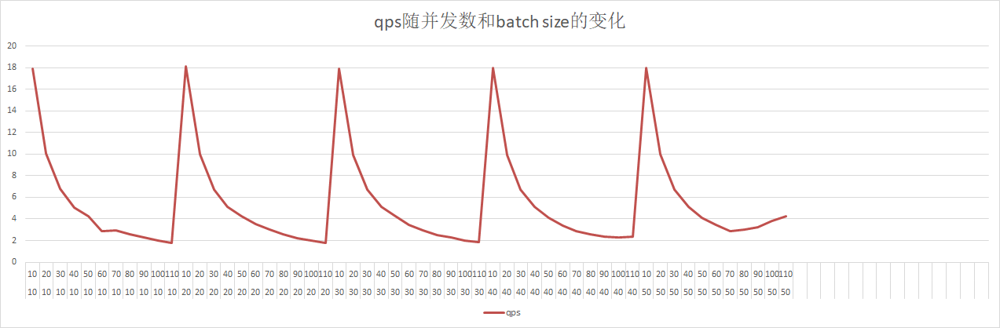

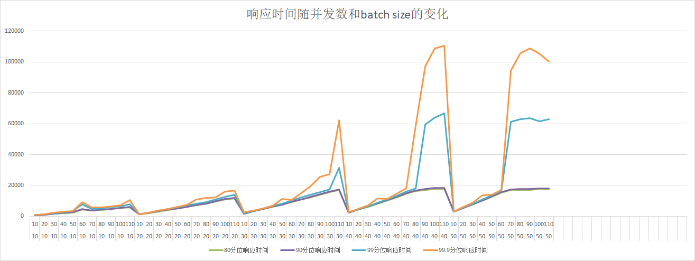

结论：多卡情况，随着并发数的增加，qps基本一致，响应时间有所增加，与单卡多并发相比，响应时间增加10%左右。
