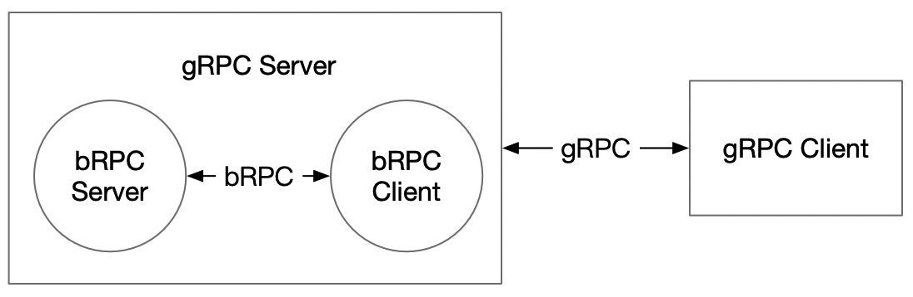

# gRPC接口

gRPC 接口实现形式类似 Web Service：



## 与bRPC接口对比

1. gRPC Server 端 `load_model_config` 函数添加 `client_config_path` 参数：

   ```python
   def load_model_config(self, server_config_paths, client_config_path=None)
   ```

   在一些例子中 bRPC Server 端与 bRPC Client 端的配置文件可能是不同的（如 cube local 例子中，Client 端的数据先交给 cube，经过 cube 处理后再交给预测库），所以 gRPC Server 端需要获取 gRPC Client 端的配置；同时为了取消 gRPC Client 端手动加载配置文件的过程，所以设计 gRPC Server 端同时加载两个配置文件。`client_config_path` 默认为 `<server_config_path>/serving_server_conf.prototxt`。

2. gRPC Client 端取消 `load_client_config` 步骤：

   在 `connect` 步骤通过 RPC 获取相应的 prototxt（从任意一个 endpoint 获取即可）。

3. gRPC Client 需要通过 RPC 方式设置 timeout 时间（调用形式与 bRPC Client保持一致）

   因为 bRPC Client 在 `connect` 后无法更改 timeout 时间，所以当 gRPC Server 收到变更 timeout 的调用请求时会重新创建 bRPC Client 实例以变更 bRPC Client timeout时间，同时 gRPC Client 会设置 gRPC 的 deadline 时间。

   **注意，设置 timeout 接口和 Inference 接口不能同时调用（非线程安全），出于性能考虑暂时不加锁。**

4. gRPC Client 端 `predict` 函数添加 `asyn` 和 `is_python` 参数：

   ```python
   def predict(self, feed, fetch, need_variant_tag=False, asyn=False, is_python=True)
   ```

   其中，`asyn` 为异步调用选项。当 `asyn=True` 时为异步调用，返回 `MultiLangPredictFuture` 对象，通过 `MultiLangPredictFuture.result()` 阻塞获取预测值；当 `asyn=Fasle` 为同步调用。

   `is_python` 为 proto 格式选项。当 `is_python=True` 时，基于 numpy bytes 格式进行数据传输，目前只适用于 Python；当 `is_python=False` 时，以普通数据格式传输，更加通用。使用 numpy bytes 格式传输耗时比普通数据格式小很多（详见 [#654](https://github.com/PaddlePaddle/Serving/pull/654)）。

5. 异常处理：当 gRPC Server 端的 bRPC Client 预测失败（返回 `None`）时，gRPC Client 端同样返回None。其他 gRPC 异常会在 Client 内部捕获，并在返回的 fetch_map 中添加一个 "status_code" 字段来区分是否预测正常（参考 timeout 样例）。

6. 由于 gRPC 只支持 pick_first 和 round_robin 负载均衡策略，ABTEST 特性还未打齐。

7. 经测试，gRPC 版本可以在 Windows、macOS 平台使用。

8. 计划支持的客户端语言：

   - [x] Python
   - [ ] Java
   - [ ] Go
   - [ ] JavaScript

## Python 端的一些例子 

详见 `python/examples/grpc_impl_example` 下的示例文件。
