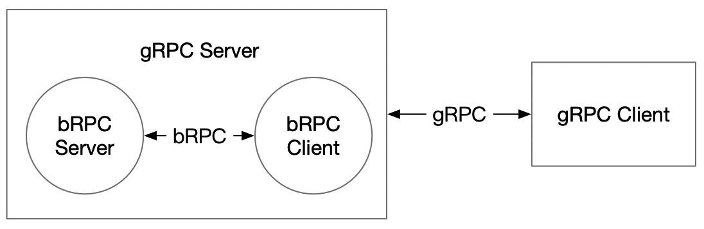

# gRPC接口使用介绍

  - [1.与bRPC接口对比](#1与brpc接口对比)
      - [1.1 服务端对比](#11-服务端对比)
      - [1.2 客服端对比](#12-客服端对比)
      - [1.3 其他](#13-其他)
  - [2.示例：线性回归预测服务](#2示例线性回归预测服务)
      - [获取数据](#获取数据)
      - [开启 gRPC 服务端](#开启-grpc-服务端)
    - [客户端预测](#客户端预测)
      - [同步预测](#同步预测)
      - [异步预测](#异步预测)
      - [Batch 预测](#batch-预测)
      - [通用 pb 预测](#通用-pb-预测)
      - [预测超时](#预测超时)
      - [List 输入](#list-输入)
  - [3.更多示例](#3更多示例)
  
使用gRPC接口，Client端可以在Win/Linux/MacOS平台上调用不同语言。gRPC 接口实现结构如下：



## 1.与bRPC接口对比

#### 1.1 服务端对比

* 由于gRPC Server 端实际包含了brpc-Client端的，因此brpc-Client的初始化过程是在gRPC Server 端实现的，所以gRPC Server 端 `load_model_config` 函数添加 `client_config_path` 参数，用于指定brpc-Client初始化过程中的传输数据格式配置文件路径（`client_config_path` 参数未指定时默认为None,此时`client_config_path` 在`load_model_config` 函数中被默认为 `<server_config_path>/serving_server_conf.prototxt`，此时brpc-Client与brpc-Server的传输数据格式配置文件相同）

   ```
   def load_model_config(self, server_config_paths, client_config_path=None)
   ```
    在一些例子中 bRPC Server 端与 bRPC Client 端的配置文件可能不同（如 在cube local 中，Client 端的数据先交给 cube，经过 cube 处理后再交给预测库），此时 gRPC Server 端需要手动设置 gRPC Client 端的配置`client_config_path`。

#### 1.2 客服端对比

* gRPC Client 端取消 `load_client_config` 步骤：

   在 `connect` 步骤通过 RPC 获取相应的 prototxt（从任意一个 endpoint 获取即可）。

* gRPC Client 需要通过 RPC 方式设置 timeout 时间（调用形式与 bRPC Client保持一致）

   因为 bRPC Client 在 `connect` 后无法更改 timeout 时间，所以当 gRPC Server 收到变更 timeout 的调用请求时会重新创建 bRPC Client 实例以变更 bRPC Client timeout时间，同时 gRPC Client 会设置 gRPC 的 deadline 时间。

   **注意，设置 timeout 接口和 Inference 接口不能同时调用（非线程安全），出于性能考虑暂时不加锁。**

* gRPC Client 端 `predict` 函数添加 `asyn` 和 `is_python` 参数：

   ```
   def predict(self, feed, fetch, batch=True, need_variant_tag=False, asyn=False, is_python=True,log_id=0)
   ```

1.    `asyn` 为异步调用选项。当 `asyn=True` 时为异步调用，返回 `MultiLangPredictFuture` 对象，通过 `MultiLangPredictFuture.result()` 阻塞获取预测值；当 `asyn=Fasle` 为同步调用。

2.    `is_python` 为 proto 格式选项。当 `is_python=True` 时，基于 numpy bytes 格式进行数据传输，目前只适用于 Python；当 `is_python=False` 时，以普通数据格式传输，更加通用。使用 numpy bytes 格式传输耗时比普通数据格式小很多（详见 [#654](https://github.com/PaddlePaddle/Serving/pull/654)）。

3.    `batch`为数据是否需要进行增维处理的选项。当`batch=True`时，feed数据不需要额外的处理，维持原有维度；当`batch=False`时,会对数据进行增维度处理。例如：feed.shape原始为[2,2]，当`batch=False`时,会将feed.reshape为[1,2,2]。

#### 1.3 其他

* 异常处理：当 gRPC Server 端的 bRPC Client 预测失败（返回 `None`）时，gRPC Client 端同样返回None。其他 gRPC 异常会在 Client 内部捕获，并在返回的 fetch_map 中添加一个 "status_code" 字段来区分是否预测正常（参考 timeout 样例）。

* 由于 gRPC 只支持 pick_first 和 round_robin 负载均衡策略，ABTEST 特性还未打齐。

* 系统兼容性：
    * [x]  CentOS
    * [x]  macOS
    * [x]  Windows

* 已经支持的客户端语言：

   -  Python
   -  Java
   -  Go
   
   
## 2.示例：线性回归预测服务

以下是采用gRPC实现的关于线性回归预测的一个示例，具体代码详见此[链接](../python/examples/grpc_impl_example/fit_a_line)
#### 获取数据

```shell
sh get_data.sh
```

#### 开启 gRPC 服务端

``` shell
python test_server.py uci_housing_model/
```

也可以通过下面的一行代码开启默认 gRPC 服务：

```shell
python -m paddle_serving_server.serve --model uci_housing_model --thread 10 --port 9393 --use_multilang
```
注：--use_multilang参数用来启用多语言客户端

### 客户端预测

#### 同步预测

``` shell
python test_sync_client.py
```

#### 异步预测

``` shell
python test_asyn_client.py
```

#### Batch 预测

``` shell
python test_batch_client.py
```

#### 预测超时

``` shell
python test_timeout_client.py
```

## 3.更多示例

详见[`python/examples/grpc_impl_example`](../python/examples/grpc_impl_example)下的示例文件。
