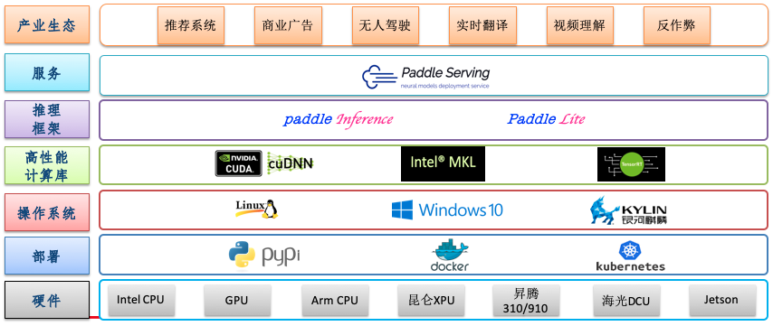

# 技术架构

## 设计目标

- 实现高性能的在线服务化推理框架。既能满足同步请求低延时快速响应，又能满足异步高吞吐的批量处理，大幅提高计算资源利用率。与同类竞品相比有性能优势。

- 覆盖工业级 AI 应用场景。工业场景对基础功能和模型有更高的要求，进阶功能包括模型安全、授权访问、适配多种计算硬件和系统环境、云端集群化部署和弹性伸缩能力等；另外，要求服务化框架支持种类型的深度学习模型，如 CV、NLP、推荐系统等

- 具备良好的服务可靠性。服务可靠性是服务运行稳定程度的一项重要指标，是对服务质量的一种测量，也是满足工业级场景使用的前提。

- 简单易用。以极低的成本部署模型，能与训练框架无缝打通的预测部署 API。通过参考大量的部署示例快速上手。

## 技术栈
Paddle Serving 的技术体系有7个层级，计算硬件、安装部署、操作系统、高性能计算库、推理引擎、Paddle Serving 框架与产业应用。Serving 集成 Paddle Inference 和 Paddle Lite 高性能推理框架，支持在多种异构硬件和多种操作中部署。

     

     

Paddle Serving 框架提供多种编程语言客户端 SDK 方便调用和系统集成，包括 Python、C++ 和 Java 语言。使用3种协议 HTTP、gRPC 和 bRPC 与服务端交互。

     

     

为了满足不同场景的用户需求，服务端设计了2种框架 C++ Serving 和 Python Pipeline。技术选型方法参见下表：

| 框架 | 响应时间 | 吞吐 | 开发效率 | 资源利用率 | 应用场景|
|-----|------|-----|-----|------|------|
|C++ Serving | 低 | 高 | 低 | 高  | 高并发低延时场景，功能完善，适合大型服务架构|
|Python Pipeline | 高 | 较高 | 高 | 高 | 开发效率高，吞吐量较高，适合单算子多模型组合场景|

性能指标说明：
1. 响应时间（ms）：单次请求平均响应时间，计算50、90、95、99分位响应时长，数值越低越好。
2. 吞吐（QPS）：服务处理请求的效率，单位时间内处理请求数量，越高越好。
3. 开发效率：使用不同开发语言完成相同工作时间不同，包括开发、调试、维护的效率等，越高越好。
4. 资源利用率：部署一个服务对资源利用率，资源利用率低是对资源的浪费，数值越高越好。

C++ Serving 完整设计与功能参见[C++ Serving 设计与实现](../C++_Serving/Introduction_CN.md)

Python Pipeline 完整设计与功能参见[Python Pipeline 设计与实现](../Python_Pipeline/Pipeline_Design_CN.md)
