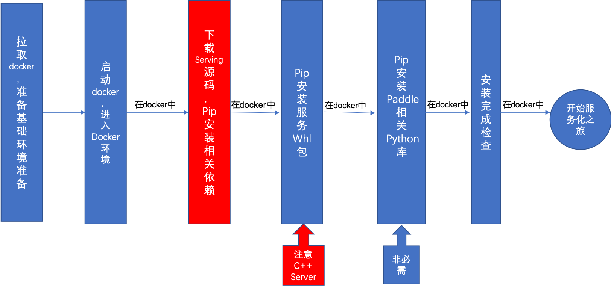

# Docker 镜像安装

本文档介绍基于标准镜像环境的安装流程。



## 获取镜像（第一步）

镜像中包含以下基础组件

|             组件             |             版本要求              |
| :--------------------------: | :-------------------------------: |
|              OS              |     Ubuntu16 and 18/CentOS 7      |
|             gcc              |          5.4.0(Cuda 10.1) and 8.2.0         |
|           gcc-c++            |          5.4.0(Cuda 10.1) and 8.2.0         |
|            cmake             |          3.16.0 and later          |
|            Python            |          3.6.0 and later          |
|              Go              |          1.17.2 and later          |
|             git              |         2.17.1 and later          |
|         glibc-static         |               2.17                |
|        openssl-devel         |              1.0.2k               |
|         bzip2-devel          |          1.0.6 and later          |
| python-devel / python3-devel |          3.6.0 and later          |
|         sqlite-devel         |         3.7.17 and later          |
|           patchelf           |                0.9                |
|           libXext            |               1.3.3               |
|            libSM             |               1.2.2               |
|          libXrender          |              0.9.10               |

**一. CPU/GPU 镜像：**

您可以通过两种方式获取镜像。

1. 通过 TAG 直接从 dockerhub 或 `registry.baidubce.com` 拉取镜像，具体 TAG 请参见下文的镜像说明章节的表格**

   ```shell
   docker pull registry.baidubce.com/paddlepaddle/serving:<TAG> 
   ```

2. 基于 Dockerfile 构建镜像**

   建立新目录，复制对应 Dockerfile 内容到该目录下 Dockerfile 文件。执行

   ```shell
   docker build -f tools/${DOCKERFILE} -t <image-name>:<images-tag> .
   ```

若需要基于源代码二次开发编译，请使用后缀为 -devel 的版本。


|                         镜像选择                         |   操作系统    |             TAG              |                          Dockerfile                          |
| :----------------------------------------------------------: | :-----: | :--------------------------: | :----------------------------------------------------------: |
|   CPU development     | Ubuntu16 |         0.8.0-devel         |        [Dockerfile.devel](../tools/Dockerfile.devel)         |
|   GPU (cuda10.1-cudnn7-tensorRT6-gcc54) development   | Ubuntu16 | 0.8.0-cuda10.1-cudnn7-gcc54-devel (not ready) | [Dockerfile.cuda10.1-cudnn7-gcc54.devel](../tools/Dockerfile.cuda10.1-cudnn7-gcc54.devel) |
|  GPU (cuda10.1-cudnn7-tensorRT6) development  | Ubuntu16 | 0.8.0-cuda10.1-cudnn7-devel | [Dockerfile.cuda10.1-cudnn7.devel](../tools/Dockerfile.cuda10.1-cudnn7.devel) |
|  GPU (cuda10.2-cudnn7-tensorRT6) development  | Ubuntu16 | 0.8.0-cuda10.2-cudnn7-devel | [Dockerfile.cuda10.2-cudnn7.devel](../tools/Dockerfile.cuda10.2-cudnn7.devel) |
| GPU (cuda10.2-cudnn8-tensorRT7) development  | Ubuntu16 | 0.8.0-cuda10.2-cudnn8-devel | [Dockerfile.cuda10.2-cudnn8.devel](../tools/Dockerfile.cuda10.2-cudnn8.devel) |
|  GPU (cuda11.2-cudnn8-tensorRT8) development  | Ubuntu16 | 0.8.0-cuda11.2-cudnn8-devel | [Dockerfile.cuda11.2-cudnn8.devel](../tools/Dockerfile.cuda11.2-cudnn8.devel) |
|   CPU Runtime |Ubuntu 16|0.8.0-runtime||
|   GPU (cuda10.1-cudnn7-tensorRT6) Runtime |Ubuntu 16|0.8.0-cuda10.1-cudnn7-runtime||
|   GPU (cuda10.2-cudnn8-tensorRT7) Runtime |Ubuntu 16|0.8.0-cuda10.2-cudnn8-runtime||
|   GPU (cuda11.2-cudnn8-tensorRT8) Runtime |Ubuntu 16|0.8.0-cuda11.2-cudnn8-runtime||

**二. Java 镜像：**

```
docker pull registry.baidubce.com/paddlepaddle/serving:0.8.0-cuda10.2-java
```

|                         镜像选择                         |   操作系统    |             TAG              |
| :----------------------------------------------------------: | :-----: | :--------------------------: |
|   GPU (cuda10.2-cudnn7-tensorRT6) development for Java     | Ubuntu16 |         0.8.0-cuda10.2-java         |

**三. XPU 镜像：**
```
docker pull registry.baidubce.com/paddlepaddle/serving:xpu-arm # for arm xpu user
docker pull registry.baidubce.com/paddlepaddle/serving:xpu-x86 # for x86 xpu user
```

|                         镜像选择                         |   操作系统    |             TAG              |
| :----------------------------------------------------------: | :-----: | :--------------------------: |
|   XPU (arm64) development     | kylin10 |         xpu-arm         |
|   XPU (x86) development     | Ubuntu16 |         xpu-x86         |

**四. ROCM 镜像：**
```
docker pull paddlepaddle/paddle:latest-dev-rocm4.0-miopen2.11 # for x86 rocm user
```

|                         镜像选择                         |   操作系统    |             TAG              |
| :----------------------------------------------------------: | :-----: | :--------------------------: |
|   ROCM4.0 (x86) development     | Ubuntu16 |         latest-dev-rocm4.0-miopen2.11         |

**五. NPU 镜像：**
```
docker pull paddlepaddle/paddle:latest-dev-cann5.0.2.alpha005-gcc82-aarch64 # for arm ascend910 user
docker pull registry.baidubce.com/paddlepaddle/serving:ascend-aarch64-cann3.3.0-paddlelite-devel # for arm ascend310 user
```

|                         镜像选择                         |   操作系统    |             TAG              |
| :----------------------------------------------------------: | :-----: | :--------------------------: |
|   Ascend910 (arm64 cann5.0.2) development     | kylin10 |         latest-dev-cann5.0.2.alpha005-gcc82-aarch64         |
|   Ascend310 (arm64 cann3.3.0) development     | kylin10 |         ascend-aarch64-cann3.3.0-paddlelite-devel         |

## 使用 pip 安装（第二步）

本节将介绍使用 pip 安装 Paddle Serving
以下示例中 GPU 环境均为 cuda10.2-cudnn7

**一. 启动开发镜像**

   **CPU:**

   ```
   # 启动 CPU Docker
   docker pull paddlepaddle/serving:0.8.0-devel
   docker run -p 9292:9292 --name test -dit paddlepaddle/serving:0.8.0-devel bash
   docker exec -it test bash
   git clone https://github.com/PaddlePaddle/Serving
   ```
   
   **GPU:**

   ```
   # 启动 GPU Docker
   docker pull paddlepaddle/serving:0.8.0-cuda10.2-cudnn7-devel
   nvidia-docker run -p 9292:9292 --name test -dit paddlepaddle/serving:0.8.0-cuda10.2-cudnn7-devel bash
   nvidia-docker exec -it test bash
   git clone https://github.com/PaddlePaddle/Serving
   ```

**二. 安装所需的 pip 依赖**

   ```
   cd Serving
   pip3 install -r python/requirements.txt
   ```
   **注意**： 如果您直接使用 PaddlePaddle 提供的开发镜像，需要执行以下脚本增加 Serving 所需依赖项
   ```
   wget https://paddle-serving.bj.bcebos.com/tools/paddle_env_install.sh
   bash paddle_env_install.sh
   ```

**三. 安装服务 whl 包**

   服务 whl 包包括： client、app、server，其中 Server 分为 CPU 和 GPU，GPU 包根据您的环境选择一种安装

   

   ```
   pip3 install paddle-serving-client==0.8.3 -i https://pypi.tuna.tsinghua.edu.cn/simple
   pip3 install paddle-serving-app==0.8.3 -i https://pypi.tuna.tsinghua.edu.cn/simple
   
   # CPU Server
   pip3 install paddle-serving-server==0.8.3 -i https://pypi.tuna.tsinghua.edu.cn/simple
   
   # GPU Server，需要确认环境再选择执行哪一条，推荐使用CUDA 10.2的包
   #CUDA10.2 + Cudnn7 + TensorRT6（推荐）
   pip3 install paddle-serving-server-gpu==0.8.3.post102 -i https://pypi.tuna.tsinghua.edu.cn/simple
   #CUDA10.1 + TensorRT6
   pip3 install paddle-serving-server-gpu==0.8.3.post101 -i https://pypi.tuna.tsinghua.edu.cn/simple
   #CUDA11.2 + TensorRT8 
   pip3 install paddle-serving-server-gpu==0.8.3.post112 -i https://pypi.tuna.tsinghua.edu.cn/simple

   ```

   默认开启国内清华镜像源来加速下载，如果您使用 HTTP 代理可以关闭(`-i https://pypi.tuna.tsinghua.edu.cn/simple`)

**四. 安装 Paddle 相关 Python 库**（可选）


   **当您使用`paddle_serving_client.convert`命令或者`Python Pipeline 框架`时才需要安装。**


   **注意**： 如果您的 Cuda 版本不是10.2，或者您需要在 GPU 环境上使用 TensorRT，请勿直接执行上述命令，需要参考[Paddle-Inference官方文档-下载安装Linux预测库](https:/paddleinference.paddlepaddle.org.cn/master/user_guides/download_lib.html#python)选择相应的 GPU 环境的 url 链接并进行安装。
   ```
   # CPU 环境请执行
   pip3 install paddlepaddle==2.2.2

   # GPU CUDA 10.2环境请执行
   pip3 install paddlepaddle-gpu==2.2.2
   ```
   

**五. 安装完成后的环境检查**
   当以上步骤均完成后可使用命令行运行环境检查功能，自动运行 Paddle Serving 相关示例，进行环境相关配置校验。

   ```
   python3 -m paddle_serving_server.serve check
   # 以下输出表明环境检查正常
   (Cmd) check_all
   PaddlePaddle inference environment running success
   C++ cpu environment running success
   C++ gpu environment running success
   Pipeline cpu environment running success
   Pipeline gpu environment running success
   ```

   详情请参考[环境检查文档](./Check_Env_CN.md)
