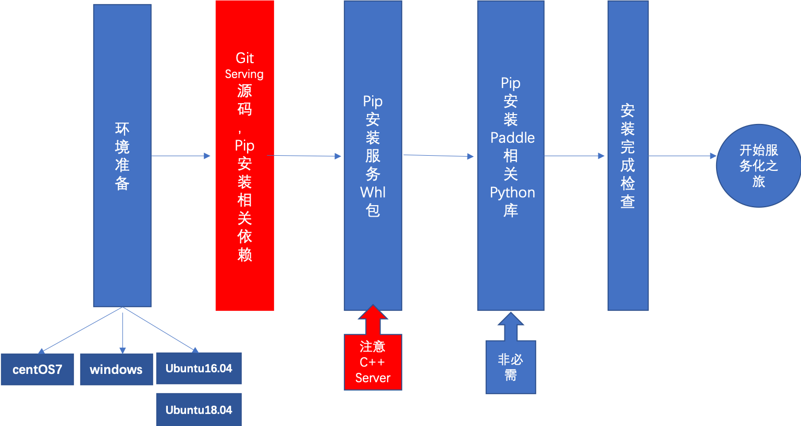

# 原生系统标准环境安装

本文介绍基于原生系统标准环境进行配置安装。




## CentOS 7 环境配置（第一步）

**一.环境准备**

* **Python 版本 3.6/3.7/3.8/3.9 (64 bit)**

**二.选择 CPU/GPU**

* 如果您的计算机有 NVIDIA® GPU，请确保满足以下条件

    * **CUDA 工具包：10.1/10.2 配合 cuDNN 7 (cuDNN 版本>=7.6.5) 或者 11.2 配合 cuDNN v8.1.1**
    * **兼容版本的 TensorRT**
    * **GPU运算能力超过3.5的硬件设备**

        您可参考NVIDIA官方文档了解CUDA和CUDNN的安装流程和配置方法，请见[CUDA](https://docs.nvidia.com/cuda/cuda-installation-guide-linux/)，[cuDNN](https://docs.nvidia.com/deeplearning/sdk/cudnn-install/)，[TensorRT](https://docs.nvidia.com/deeplearning/tensorrt/index.html), [GPU算力](https://developer.nvidia.com/cuda-gpus)

**三.安装必要工具**

需要安装的依赖库及工具详见下表：

|             组件             |             版本要求              |
| :--------------------------: | :-------------------------------: |
|         bzip2-devel          |          1.0.6 and later          |
|              make              |     later     |
|             gcc              |          8.2.0         |
|           gcc-c++            |          8.2.0         |
|            cmake             |          3.15.0 and later          |
|              Go              |          1.17.2 and later          |
|        openssl-devel         |              1.0.2k               |
|           patchelf           |                0.9                |

1. 更新系统源

    更新`yum`的源：

    ```
    yum update
    ```

    并添加必要的yum源：

    ```
    yum install -y epel-release
    ```

2. 安装工具

    `bzip2`以及`make`：

    ```
    yum install -y bzip2
    ```

    ```
    yum install -y make
    ```

    cmake 需要3.15以上，建议使用3.16.0:

    ```
    wget -q https://cmake.org/files/v3.16/cmake-3.16.0-Linux-x86_64.tar.gz
    ```

    ```
    tar -zxvf cmake-3.16.0-Linux-x86_64.tar.gz
    ```

    ```
    rm cmake-3.16.0-Linux-x86_64.tar.gz
    ```

    ```
    PATH=/home/cmake-3.16.0-Linux-x86_64/bin:$PATH
    ```

    gcc 需要5.4以上，建议使用8.2.0:

    ```
    wget -q https://paddle-docker-tar.bj.bcebos.com/home/users/tianshuo/bce-python-sdk-0.8.27/gcc-8.2.0.tar.xz && \
    tar -xvf gcc-8.2.0.tar.xz && \
    cd gcc-8.2.0 && \
    sed -i 's#ftp://gcc.gnu.org/pub/gcc/infrastructure/#https://paddle-ci.gz.bcebos.com/#g' ./contrib/download_prerequisites && \
    unset LIBRARY_PATH CPATH C_INCLUDE_PATH PKG_CONFIG_PATH CPLUS_INCLUDE_PATH INCLUDE && \
    ./contrib/download_prerequisites && \
    cd .. && mkdir temp_gcc82 && cd temp_gcc82 && \
    ../gcc-8.2.0/configure --prefix=/usr/local/gcc-8.2 --enable-threads=posix --disable-checking --disable-multilib && \
    make -j8 && make install
    ```

3. 安装GOLANG

    建议使用 go1.17.2:

    ```
    wget -qO- https://go.dev/dl/go1.17.2.linux-amd64.tar.gz | \
    tar -xz -C /usr/local && \
    mkdir /root/go && \
    mkdir /root/go/bin && \
    mkdir /root/go/src && \
    echo "GOROOT=/usr/local/go" >> /root/.bashrc && \
    echo "GOPATH=/root/go" >> /root/.bashrc && \
    echo "PATH=/usr/local/go/bin:/root/go/bin:$PATH" >> /root/.bashrc
    source /root/.bashrc
    ```
  
4. 安装依赖库

    安装相关依赖库 patchelf：

    ```
    yum install patchelf
    ```

    配置 ssl 依赖库

    ```
    wget https://paddle-serving.bj.bcebos.com/others/centos_ssl.tar && \
    tar xf centos_ssl.tar && rm -rf centos_ssl.tar && \
    mv libcrypto.so.1.0.2k /usr/lib/libcrypto.so.1.0.2k && mv libssl.so.1.0.2k /usr/lib/libssl.so.1.0.2k && \
    ln -sf /usr/lib/libcrypto.so.1.0.2k /usr/lib/libcrypto.so.10 && \
    ln -sf /usr/lib/libssl.so.1.0.2k /usr/lib/libssl.so.10 && \
    ln -sf /usr/lib/libcrypto.so.10 /usr/lib/libcrypto.so && \
    ln -sf /usr/lib/libssl.so.10 /usr/lib/libssl.so
    ```

## Ubuntu 16.04/18.04 环境配置（第一步）

**一.环境准备**

* **Python 版本 3.6/3.7/3.8/3.9 (64 bit)**

**二.选择 CPU/GPU**

* 如果您的计算机有 NVIDIA® GPU，请确保满足以下条件

    * **CUDA 工具包 10.1/10.2 配合 cuDNN 7 (cuDNN 版本>=7.6.5)**
    * **CUDA 工具包 11.2 配合 cuDNN v8.1.1**
    * **配套版本的 TensorRT**
    * **GPU运算能力超过3.5的硬件设备**

        您可参考NVIDIA官方文档了解CUDA和CUDNN的安装流程和配置方法，请见[CUDA](https://docs.nvidia.com/cuda/cuda-installation-guide-linux/)，[cuDNN](https://docs.nvidia.com/deeplearning/sdk/cudnn-install/)，[TensorRT](https://docs.nvidia.com/deeplearning/tensorrt/index.html)

**三.安装必要工具**

1. 更新系统源

    更新`apt`的源：

    ```
    apt update
    ```

2. 安装工具

    `bzip2`以及`make`：

    ```
    apt install -y bzip2
    ```
    ```
    apt install -y make
    ```

    cmake 需要3.15以上，建议使用3.16.0:

    ```
    wget -q https://cmake.org/files/v3.16/cmake-3.16.0-Linux-x86_64.tar.gz
    ```

    ```
    tar -zxvf cmake-3.16.0-Linux-x86_64.tar.gz
    ```

    ```
    rm cmake-3.16.0-Linux-x86_64.tar.gz
    ```

    ```
    PATH=/home/cmake-3.16.0-Linux-x86_64/bin:$PATH
    ```

    gcc 需要5.4以上，建议使用8.2.0:

    ```
    wget -q https://paddle-docker-tar.bj.bcebos.com/home/users/tianshuo/bce-python-sdk-0.8.27/gcc-8.2.0.tar.xz && \
    tar -xvf gcc-8.2.0.tar.xz && \
    cd gcc-8.2.0 && \
    sed -i 's#ftp://gcc.gnu.org/pub/gcc/infrastructure/#https://paddle-ci.gz.bcebos.com/#g' ./contrib/download_prerequisites && \
    unset LIBRARY_PATH CPATH C_INCLUDE_PATH PKG_CONFIG_PATH CPLUS_INCLUDE_PATH INCLUDE && \
    ./contrib/download_prerequisites && \
    cd .. && mkdir temp_gcc82 && cd temp_gcc82 && \
    ../gcc-8.2.0/configure --prefix=/usr/local/gcc-8.2 --enable-threads=posix --disable-checking --disable-multilib && \
    make -j8 && make install
    ```

3. 安装GOLANG

    建议使用 go1.17.2:

    ```
    wget -qO- https://go.dev/dl/go1.17.2.linux-amd64.tar.gz | \
    tar -xz -C /usr/local && \
    mkdir /root/go && \
    mkdir /root/go/bin && \
    mkdir /root/go/src && \
    echo "GOROOT=/usr/local/go" >> /root/.bashrc && \
    echo "GOPATH=/root/go" >> /root/.bashrc && \
    echo "PATH=/usr/local/go/bin:/root/go/bin:$PATH" >> /root/.bashrc
    source /root/.bashrc
    ```
  
4. 安装依赖库

    安装相关依赖库 patchelf：

    ```
    apt-get install patchelf
    ```

    配置 ssl 依赖库

    ```
    wget https://paddle-serving.bj.bcebos.com/others/centos_ssl.tar && \
    tar xf centos_ssl.tar && rm -rf centos_ssl.tar && \
    mv libcrypto.so.1.0.2k /usr/lib/libcrypto.so.1.0.2k && mv libssl.so.1.0.2k /usr/lib/libssl.so.1.0.2k && \
    ln -sf /usr/lib/libcrypto.so.1.0.2k /usr/lib/libcrypto.so.10 && \
    ln -sf /usr/lib/libssl.so.1.0.2k /usr/lib/libssl.so.10 && \
    ln -sf /usr/lib/libcrypto.so.10 /usr/lib/libcrypto.so && \
    ln -sf /usr/lib/libssl.so.10 /usr/lib/libssl.so
    ```

## Windows 环境配置（第一步）

由于受限第三方库的支持，Windows平台目前只支持用web service的方式搭建local predictor预测服务。

**一.环境准备**

* **Python 版本 3.6/3.7/3.8/3.9 (64 bit)**

**二.选择 CPU/GPU**

* 如果您的计算机有 NVIDIA® GPU，请确保满足以下条件

    * **CUDA 工具包 10.1/10.2 配合 cuDNN 7 (cuDNN 版本>=7.6.5)**
    * **CUDA 工具包 11.2 配合 cuDNN v8.1.1**
    * **配套版本的 TensorRT**
    * **GPU运算能力超过3.5的硬件设备**

        您可参考NVIDIA官方文档了解CUDA和CUDNN的安装流程和配置方法，请见[CUDA](https://docs.nvidia.com/cuda/cuda-installation-guide-linux/)，[cuDNN](https://docs.nvidia.com/deeplearning/sdk/cudnn-install/)，[TensorRT](https://docs.nvidia.com/deeplearning/tensorrt/index.html)

**三.安装必要工具**

1. 更新 wget 工具

    在链接[下载wget](http://gnuwin32.sourceforge.net/packages/wget.htm)，解压后复制到`C:\Windows\System32`下，如有安全提示需要通过。

2. 安装git工具

    详情参见[Git官网](https://git-scm.com/downloads)

3. 安装必要的C++库（可选）

    部分用户可能会在`import paddle`阶段遇见dll无法链接的问题，建议[安装Visual Studio社区版本](https://visualstudio.microsoft.com/) ，并且安装C++的相关组件。

## 使用 pip 安装（第二步）

**一. 安装服务 whl 包**

   服务 whl 包包括： client、app、server，其中 Server 分为 CPU 和 GPU，GPU 包根据您的环境选择一种安装

   ```
   pip3 install paddle-serving-client==0.8.3 -i https://pypi.tuna.tsinghua.edu.cn/simple
   pip3 install paddle-serving-app==0.8.3 -i https://pypi.tuna.tsinghua.edu.cn/simple
   
   # CPU Server
   pip3 install paddle-serving-server==0.8.3 -i https://pypi.tuna.tsinghua.edu.cn/simple
   
   # GPU Server，需要确认环境再选择执行哪一条，推荐使用CUDA 10.2的包
   # CUDA10.2 + Cudnn7 + TensorRT6（推荐）
   pip3 install paddle-serving-server-gpu==0.8.3.post102 -i https://pypi.tuna.tsinghua.edu.cn/simple 
   # CUDA10.1 + TensorRT6
   pip3 install paddle-serving-server-gpu==0.8.3.post101 -i https://pypi.tuna.tsinghua.edu.cn/simple
   # CUDA11.2 + TensorRT8
   pip3 install paddle-serving-server-gpu==0.8.3.post112 -i https://pypi.tuna.tsinghua.edu.cn/simple
   ```

   默认开启国内清华镜像源来加速下载，如果您使用 HTTP 代理可以关闭(`-i https://pypi.tuna.tsinghua.edu.cn/simple`)

**二. 安装 Paddle 相关 Python 库**
   **当您使用`paddle_serving_client.convert`命令或者`Python Pipeline 框架`时才需要安装。**
   ```
   # CPU 环境请执行
   pip3 install paddlepaddle==2.2.2

   # GPU CUDA 10.2环境请执行
   pip3 install paddlepaddle-gpu==2.2.2
   ```
   **注意**： 如果您的 Cuda 版本不是10.2，或者您需要在 GPU 环境上使用 TensorRT，请勿直接执行上述命令，需要参考[Paddle-Inference官方文档-下载安装Linux预测库](https:/paddleinference.paddlepaddle.org.cn/master/user_guides/download_lib.html#python)选择相应的 GPU 环境的 url 链接并进行安装。

**三. 安装完成后的环境检查**
   当以上步骤均完成后可使用命令行运行环境检查功能，自动运行 Paddle Serving 相关示例，进行环境相关配置校验。

   ```
   python3 -m paddle_serving_server.serve check
   # 以下输出表明环境检查正常
   (Cmd) check_all
   PaddlePaddle inference environment running success
   C++ cpu environment running success
   C++ gpu environment running success
   Pipeline cpu environment running success
   Pipeline gpu environment running success
   ```

   详情请参考[环境检查文档](./Check_Env_CN.md)