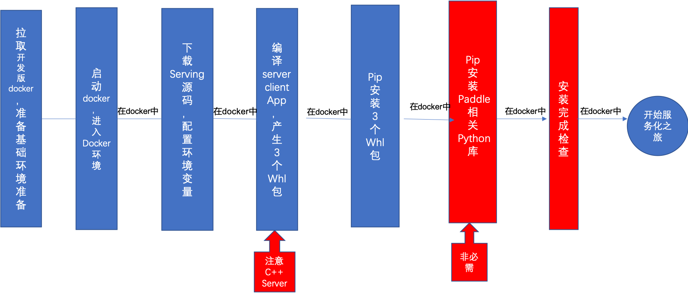

# 如何编译 PaddleServing

## 总体概述

编译 Paddle Serving 一共分以下几步

- 编译环境准备：根据模型和运行环境的需要，选择最合适的镜像
- 下载代码库：下载 Serving 代码库，按需要执行初始化操作
- 环境变量准备：根据运行环境的需要，确定 Python 各个环境变量，如GPU环境还需要确定 Cuda，Cudnn，TensorRT 等环境变量。
- 正式编译： 编译 `paddle-serving-server`, `paddle-serving-client`, `paddle-serving-app` 相关 whl 包
- 安装相关 whl 包：安装编译出的三个 whl 包，并设置 SERVING_BIN 环境变量

此外，针对某些 C++ 二次开发场景，我们也提供了 OPENCV 的联编方案。




## 编译环境准备

|             组件             |             版本要求              |
| :--------------------------: | :-------------------------------: |
|              OS              |     Ubuntu16 and 18/CentOS 7      |
|             gcc              |          5.4.0(Cuda 10.1) and 8.2.0         |
|           gcc-c++            |          5.4.0(Cuda 10.1) and 8.2.0         |
|            cmake             |          3.16.0 and later          |
|            Python            |          3.6.0 and later          |
|              Go              |          1.17.2 and later          |
|             git              |         2.17.1 and later          |
|         glibc-static         |               2.17                |
|        openssl-devel         |              1.0.2k               |
|         bzip2-devel          |          1.0.6 and later          |
| python-devel / python3-devel |          3.6.0 and later          |
|         sqlite-devel         |         3.7.17 and later          |
|           patchelf           |                0.9                |
|           libXext            |               1.3.3               |
|            libSM             |               1.2.2               |
|          libXrender          |              0.9.10               |

推荐使用 Docker 编译，我们已经为您准备好了 Paddle Serving 编译环境并配置好了上述编译依赖，详见[镜像环境](Docker_Images_CN.md)。

我们提供了五个环境的开发镜像，分别是 CPU， CUDA10.1+CUDNN7， CUDA10.2+CUDNN7，CUDA10.2+CUDNN8， CUDA11.2+CUDNN8。我们提供了 Serving 开发镜像涵盖以上环境。


|  环境                         |   Serving 开发镜像Tag               |    操作系统      
| :--------------------------: | :-------------------------------: | :-------------: |
|  CPU                         | 0.8.0-devel                       |  Ubuntu 16.04   |
|  CUDA10.1 + CUDNN7             | 0.8.0-cuda10.1-cudnn7-devel       |  Ubuntu 16.04   |
|  CUDA10.2 + CUDNN7             | 0.8.0-cuda10.2-cudnn7-devel       |  Ubuntu 16.04   |
|  CUDA10.2 + CUDNN8             | 0.8.0-cuda10.2-cudnn8-devel       |  Ubuntu 16.04   |
|  CUDA11.2 + CUDNN8             | 0.8.0-cuda11.2-cudnn8-devel       |  Ubuntu 16.04   |

我们首先要针对自己所需的环境拉取相关镜像。上表**环境**一列下，除了 CPU，其余（Cuda**+Cudnn**）都属于 GPU 环境。
您可以使用 Serving 开发镜像。
```
docker pull registry.baidubce.com/paddlepaddle/serving:${Serving开发镜像Tag}

# 如果是 GPU 镜像
nvidia-docker run --rm -it registry.baidubce.com/paddlepaddle/serving:${Serving开发镜像Tag} bash

# 如果是 CPU 镜像
docker run --rm -it registry.baidubce.com/paddlepaddle/serving:${Serving开发镜像Tag} bash
```


## 下载代码库
```
git clone https://github.com/PaddlePaddle/Serving
cd Serving && git submodule update --init --recursive

```

## 环境变量准备

**一. 设置 PYTHON 环境变量**

请按照如下，确定好需要编译的 Python 版本，设置对应的环境变量，一共需要设置三个环境变量，分别是 `PYTHON_INCLUDE_DIR`, `PYTHON_LIBRARIES`, `PYTHON_EXECUTABLE`。以下我们以 python 3.7为例，介绍如何设置这三个环境变量。

```
# 请自行修改至自身路径
export PYTHON_INCLUDE_DIR=/usr/local/include/python3.7m/
export PYTHON_LIBRARIES=/usr/local/lib/x86_64-linux-gnu/libpython3.7m.so
export PYTHON_EXECUTABLE=/usr/local/bin/python3.7

export GOPATH=$HOME/go
export PATH=$PATH:$GOPATH/bin

python3.7 -m pip install -r python/requirements.txt
 
go env -w GO111MODULE=on
go env -w GOPROXY=https://goproxy.cn,direct
go install github.com/grpc-ecosystem/grpc-gateway/protoc-gen-grpc-gateway@v1.15.2
go install github.com/grpc-ecosystem/grpc-gateway/protoc-gen-swagger@v1.15.2
go install github.com/golang/protobuf/protoc-gen-go@v1.4.3
go install google.golang.org/grpc@v1.33.0
go env -w GO111MODULE=auto
```
环境变量的含义如下表所示。

| cmake 环境变量         | 含义                                | 注意事项               | Docker 环境是否需要 |
|-----------------------|-------------------------------------|-------------------------------|--------------------|
| PYTHON_INCLUDE_DIR | Python.h 所在的目录，通常为 **/include/python3.7/Python.h | 如果没有找到。说明 1）没有安装开发版本的 Python，需重新安装 2）权限不足无法查看相关系统目录。                | 是(/usr/local/include/python3.7)                 |
| PYTHON_LIBRARIES         | libpython3.7.so 或 libpython3.7m.so 所在目录，通常为 /usr/local/lib  | 如果没有找到。说明 1）没有安装开发版本的 Python，需重新安装 2）权限不足无法查看相关系统目录。                | 是(/usr/local/lib/x86_64-linux-gnu/libpython3.7m.so)                 |
| PYTHON_EXECUTABLE   | python3.7 所在目录，通常为 /usr/local/bin |                | 是(/usr/local/bin/python3.7)                 |


**二. 设置 CUDA 环境变量**


如果您是 GPU 用户需要额外设置 `CUDA_PATH`, `CUDNN_LIBRARY`, `CUDA_CUDART_LIBRARY` 和 `TENSORRT_LIBRARY_PATH`。
```
export CUDA_PATH='/usr/local/cuda'
export CUDNN_LIBRARY='/usr/local/cuda/lib64/'
export CUDA_CUDART_LIBRARY="/usr/local/cuda/lib64/"
export TENSORRT_LIBRARY_PATH="/usr/"
```
环境变量的含义如下表所示。

| cmake 环境变量         | 含义                                | GPU 环境注意事项               | Docker 环境是否需要 |
|-----------------------|-------------------------------------|-------------------------------|--------------------|
| CUDA_TOOLKIT_ROOT_DIR | cuda 安装路径，通常为 /usr/local/cuda | 全部 GPU 环境都需要                | 否(/usr/local/cuda)                 |
| CUDNN_LIBRARY         | libcudnn.so.* 所在目录，通常为 /usr/local/cuda/lib64/  | 全部 GPU 环境都需要                | 否(/usr/local/cuda/lib64/)                 |
| CUDA_CUDART_LIBRARY   | libcudart.so.* 所在目录，通常为 /usr/local/cuda/lib64/ | 全部 GPU 环境都需要                | 否(/usr/local/cuda/lib64/)                 |
| TENSORRT_ROOT         | libnvinfer.so.* 所在目录的上一级目录，取决于 TensorRT 安装目录 | 全部 GPU 环境都需要 | 否(/usr)                 |


## 正式编译

我们一共需要编译三个目标，分别是 `paddle-serving-server`, `paddle-serving-client`, `paddle-serving-app`，其中 `paddle-serving-server` 需要区分 CPU 或者 GPU 版本。
全部编译选项详见附录。

**一. 编译 paddle-serving-server**

如果是 CPU 版本请运行，

```
mkdir build_server
cd build_server
cmake -DPYTHON_INCLUDE_DIR=$PYTHON_INCLUDE_DIR \
    -DPYTHON_LIBRARIES=$PYTHON_LIBRARIES \
    -DPYTHON_EXECUTABLE=$PYTHON_EXECUTABLE \
    -DSERVER=ON \
    -DWITH_GPU=OFF ..
make -j20
cd ..
```

如果是 GPU 版本，请运行，
```
mkdir build_server
cd build_server
cmake -DPYTHON_INCLUDE_DIR=$PYTHON_INCLUDE_DIR \
    -DPYTHON_LIBRARIES=$PYTHON_LIBRARIES \
    -DPYTHON_EXECUTABLE=$PYTHON_EXECUTABLE \
    -DCUDA_TOOLKIT_ROOT_DIR=$CUDA_PATH \
    -DCUDNN_LIBRARY=$CUDNN_LIBRARY \
    -DCUDA_CUDART_LIBRARY=$CUDA_CUDART_LIBRARY \
    -DTENSORRT_ROOT=$TENSORRT_LIBRARY_PATH \
    -DSERVER=ON \
    -DWITH_GPU=ON ..
make -j20
cd ..
``` 

编译出的 whl 包在 `build_server/python/dist/` 目录下，编译出的二进制文件在 `build_server/core/general-server/serving` 路径下。

**二. 编译 paddle-serving-client**

接下来，我们继续编译 client，这个包的编译命令在所有平台通用，不区分 CPU 和 GPU 的版本。
```
# 编译 paddle-serving-client
mkdir build_client
cd build_client
cmake -DPYTHON_INCLUDE_DIR=$PYTHON_INCLUDE_DIR \
    -DPYTHON_LIBRARIES=$PYTHON_LIBRARIES \
    -DPYTHON_EXECUTABLE=$PYTHON_EXECUTABLE \
    -DCLIENT=ON ..
make -j10
cd ..
```
编译出的 whl 包在 `build_client/python/dist/` 目录下。

**三. 编译 paddle-serving-app**

```
# 编译 paddle-serving-app
mkdir build_app
cd build_app
cmake -DPYTHON_INCLUDE_DIR=$PYTHON_INCLUDE_DIR \
    -DPYTHON_LIBRARIES=$PYTHON_LIBRARIES \
    -DPYTHON_EXECUTABLE=$PYTHON_EXECUTABLE \
    -DAPP=ON ..
make -j10
cd ..
```
编译出的 whl 包在 `build_app/python/dist/` 目录下。

## 安装相关 whl 包
```
pip3.7 install -r build_server/python/dist/*.whl
pip3.7 install -r build_client/python/dist/*.whl
pip3.7 install -r build_app/python/dist/*.whl
export SERVING_BIN=${PWD}/build_server/core/general-server/serving
```

注意到最后一行 `export SERVING_BIN`，运行 python 端 Server 时，会检查 `SERVING_BIN` 环境变量，如果想使用自己编译的二进制文件，请将设置该环境变量为对应二进制文件的路径，通常是 `export SERVING_BIN=${BUILD_DIR}/core/general-server/serving`。
其中 BUILD_DIR 为 `build_server` 的绝对路径。
可以 cd build_server 路径下，执行 `export SERVING_BIN=${PWD}/core/general-server/serving`


## 开启 WITH_OPENCV 选项编译 C++ Server

**注意：** 只有当您需要对 Paddle Serving C++ 部分进行二次开发，且新增的代码依赖于 OpenCV 库时，您才需要这样做。

编译 Serving C++ Server 部分，开启 WITH_OPENCV 选项时，需要已安装的 OpenCV 库，若尚未安装，可参考本文档后面的说明编译安装 OpenCV 库。

以开启 WITH_OPENCV 选项，编译 CPU 版本 Paddle Inference Library 为例，在上述编译命令基础上，加入 `DOPENCV_DIR=${OPENCV_DIR}` 和 `DWITH_OPENCV=ON` 选项。
```
OPENCV_DIR=your_opencv_dir #`your_opencv_dir` 为 opencv 库的安装路径。
mkdir build_server && cd build_server
cmake -DPYTHON_INCLUDE_DIR=$PYTHON_INCLUDE_DIR/ \
    -DPYTHON_LIBRARIES=$PYTHON_LIBRARIES \
    -DPYTHON_EXECUTABLE=$PYTHON_EXECUTABLE \
    -DOPENCV_DIR=${OPENCV_DIR} \
    -DWITH_OPENCV=ON \
    -DSERVER=ON ..
make -j10
```

**注意：** 编译成功后，需要设置 `SERVING_BIN` 路径。


## 附：CMake 选项说明

|     编译选项     |                    说明                    | 默认 |
| :--------------: | :----------------------------------------: | :--: |
|     WITH_AVX     | Compile Paddle Serving with AVX intrinsics | OFF  |
|     WITH_MKL     |  Compile Paddle Serving with MKL support   | OFF  |
|     WITH_GPU     |   Compile Paddle Serving with NVIDIA GPU   | OFF  |
|     WITH_TRT     |    Compile Paddle Serving with TensorRT    | OFF  |
|     WITH_OPENCV  |    Compile Paddle Serving with OPENCV      | OFF  |
|  CUDNN_LIBRARY   |    Define CuDNN library and header path    |      |
| CUDA_TOOLKIT_ROOT_DIR |       Define CUDA PATH                |      |
|   TENSORRT_ROOT  |           Define TensorRT PATH             |      |
|      CLIENT      |       Compile Paddle Serving Client        | OFF  |
|      SERVER      |       Compile Paddle Serving Server        | OFF  |
|       APP        |     Compile Paddle Serving App package     | OFF  |
|       PACK       |              Compile for whl               | OFF  |


## 附：编译安装 OpenCV 库
**注意：** 只有当您需要在 C++ 代码中引入 OpenCV 库时，您才需要这样做。

* 首先需要从 OpenCV 官网上下载在 Linux 环境下源码编译的包，以 OpenCV3.4.7 为例，下载命令如下。

```
wget https://github.com/opencv/opencv/archive/3.4.7.tar.gz
tar -xf 3.4.7.tar.gz
```

最终可以在当前目录下看到 `opencv-3.4.7/` 的文件夹。

* 编译 OpenCV，设置 OpenCV 源码路径(`root_path`)以及安装路径(`install_path`)。进入 OpenCV 源码路径下，按照下面的方式进行编译。

```shell
root_path=your_opencv_root_path
install_path=${root_path}/opencv3

rm -rf build
mkdir build
cd build

cmake .. \
    -DCMAKE_INSTALL_PREFIX=${install_path} \
    -DCMAKE_BUILD_TYPE=Release \
    -DBUILD_SHARED_LIBS=OFF \
    -DWITH_IPP=OFF \
    -DBUILD_IPP_IW=OFF \
    -DWITH_LAPACK=OFF \
    -DWITH_EIGEN=OFF \
    -DCMAKE_INSTALL_LIBDIR=lib64 \
    -DWITH_ZLIB=ON \
    -DBUILD_ZLIB=ON \
    -DWITH_JPEG=ON \
    -DBUILD_JPEG=ON \
    -DWITH_PNG=ON \
    -DBUILD_PNG=ON \
    -DWITH_TIFF=ON \
    -DBUILD_TIFF=ON

make -j
make install
```


其中 `root_path` 为下载的 OpenCV 源码路径，`install_path` 为 OpenCV 的安装路径，`make install` 完成之后，会在该文件夹下生成 OpenCV 头文件和库文件，用于引用 OpenCV 库的代码的编译。

最终在安装路径下的文件结构如下所示。

```
opencv3/
|-- bin
|-- include
|-- lib
|-- lib64
|-- share
```
