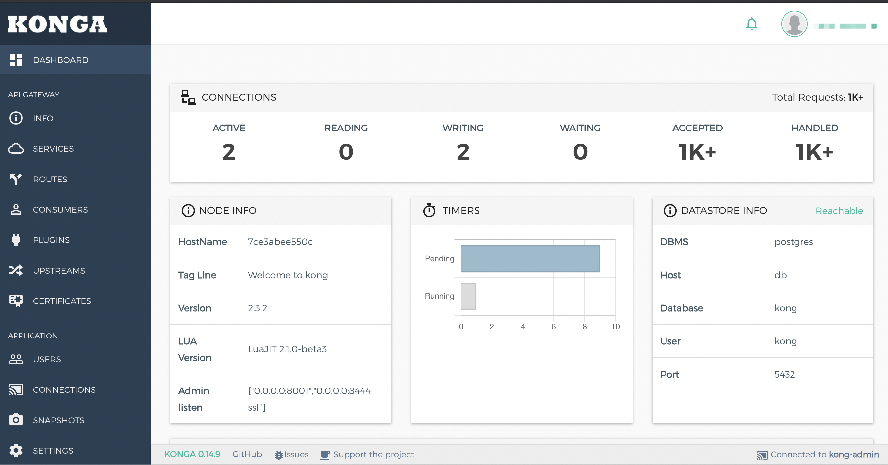
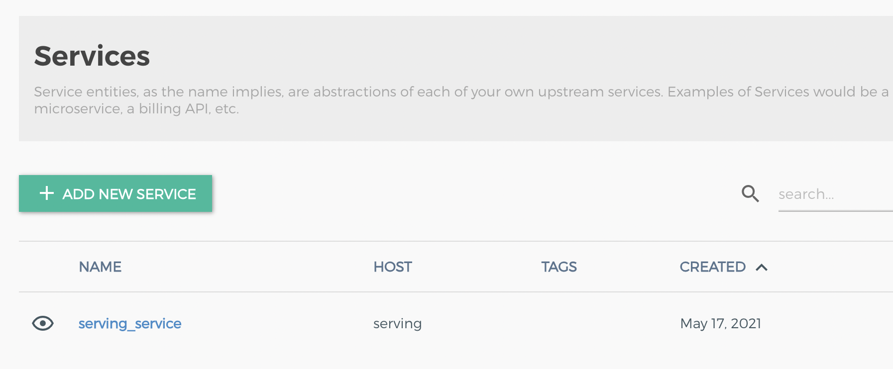
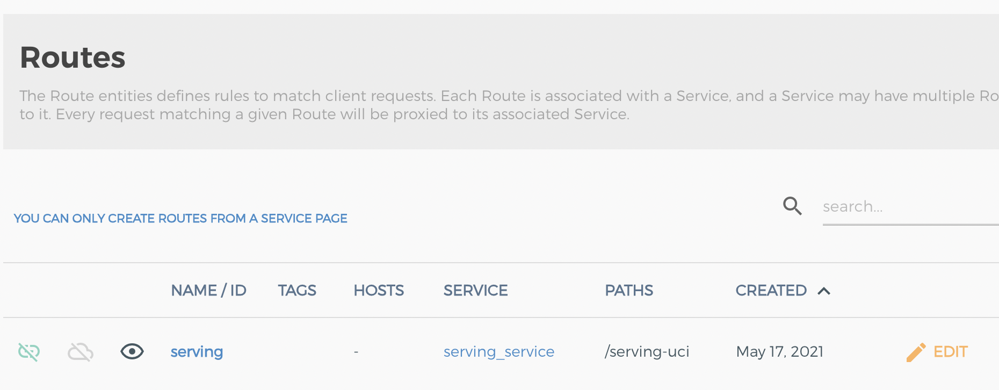
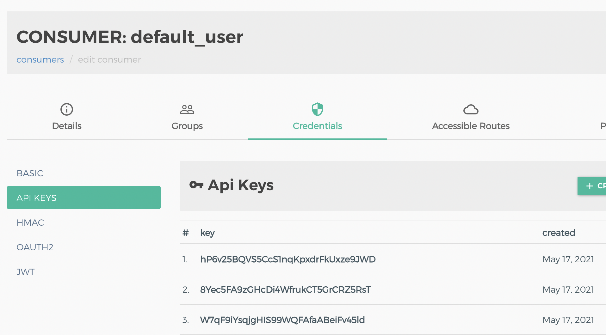

# 在Paddle Serving使用安全网关

## 简介

在之前的服务部署示例中，我们都从开发的角度切入，然而，在现实的生产环境中，仅仅提供一个能够预测的远端服务接口还远远不够。我们仍然要考虑以下不足。

- 这个服务还不能以网关的形式提供，访问路径难以管理。
- 这个服务接口不够安全，需要做相应的鉴权。
- 这个服务接口不能够控制流量，无法合理利用资源。

本文档的作用，就以 Uci 房价预测服务为例，来介绍如何强化预测服务 API 接口安全。API 网关作为流量入口，对接口进行统一管理。但 API 网关可以提供流量加密和鉴权等安全功能。

## Docker部署

可以使用 docker-compose 来部署安全网关。这个示例的步骤就是 [部署本地Serving容器] - [部署本地安全网关] - [通过安全网关访问Serving]

**注明：** docker-compose 与 docker 不一样，它依赖于 docker，一次可以部署多个 docker 容器，可以类比于本地版的 kubenetes，docker-compose 的教程请参考[docker-compose安装](https://docs.docker.com/compose/install/) 

```shell
docker-compose -f tools/auth/auth-serving-docker.yaml up -d
```

可以通过 `docker ps` 来查看启动的容器。

```shell
3035cf445029        pantsel/konga:next                                                              "/app/start.sh"          About an hour ago   Up About an hour             0.0.0.0:8005->1337/tcp                                                                               anquan_konga_1
7ce3abee550c        registry.baidubce.com/serving_gateway/kong:paddle                               "/docker-entrypoint.…"   About an hour ago   Up About an hour (healthy)   0.0.0.0:8000->8000/tcp, 127.0.0.1:8001->8001/tcp, 0.0.0.0:8443->8443/tcp, 127.0.0.1:8444->8444/tcp   anquan_kong_1
25810fd79a27        postgres:9.6                                                                    "docker-entrypoint.s…"   About an hour ago   Up About an hour (healthy)   5432/tcp                                                                                             anquan_db_1
ee59a3dd4806        registry.baidubce.com/serving_dev/serving-runtime:cpu-py36                      "bash -c ' wget --no…"   About an hour ago   Up About an hour             0.0.0.0:9393->9393/tcp                                                                               anquan_serving_1
665fd8a34e15        redis:latest                                                                    "docker-entrypoint.s…"   About an hour ago   Up About an hour             0.0.0.0:6379->6379/tcp                                                                               anquan_redis_1 
```

其中我们之前 serving 容器 以 9393 端口暴露，KONG 网关的端口是 8443， KONG 的 Web 控制台的端口是 8001。接下来我们在浏览器访问 `https://$IP_ADDR:8001`, 其中 IP_ADDR 就是宿主机的 IP 。


可以看到在注册结束后，登陆，看到了 DASHBOARD，我们先看 SERVICES，可以看到 `serving_service`，这意味着我们端口在 9393 的 Serving 服务已经在 KONG 当中被注册。




然后在 ROUTES 中，我们可以看到 serving 被链接到了 `/serving-uci`。

最后我们点击 CONSUMERS - default_user - Credentials - API KEYS ，我们可以看到 `Api Keys` 下看到很多 key



接下来可以通过 curl 访问

```shell
 curl -H "Content-Type:application/json" -H "X-INSTANCE-ID:kong_ins" -H "apikey:hP6v25BQVS5CcS1nqKpxdrFkUxze9JWD" -X POST -d '{"feed":[{"x": [0.0137, -0.1136, 0.2553, -0.0692, 0.0582, -0.0727, -0.1583, -0.0584, 0.6283, 0.4919, 0.1856, 0.0795, -0.0332]}], "fetch":["price"]}' https://127.0.0.1:8443/serving-uci/uci/prediction -k
```

与之前的 Serving HTTP 服务相比，有以下区别。

- 使用 https 加密访问，而不是 http
- 使用 serving_uci 的路径映射到网关
- 在 header 处增加了 `X-INSTANCE-ID` 和 `apikey`


## K8S 部署

同样，我们也提供了 K8S 集群部署 Serving 安全网关的方式。

**一. 启动 Serving 服务**

我们仍然以 [Uci房价预测](../examples/C++/fit_a_line/)服务作为例子，这里省略了镜像制作的过程，详情可以参考 [在 Kubernetes 集群上部署Paddle Serving](./Run_On_Kubernetes_CN.md)。

在这里我们直接执行 
```
kubectl apply -f tools/auth/serving-demo-k8s.yaml
```


**二.  安装 KONG (一个集群只需要执行一次就可以)**
接下来我们执行 KONG Ingress 的安装
```
kubectl apply -f tools/auth/kong-install.yaml
```

输出是
```
namespace/kong created
customresourcedefinition.apiextensions.k8s.io/kongclusterplugins.configuration.konghq.com created
customresourcedefinition.apiextensions.k8s.io/kongconsumers.configuration.konghq.com created
customresourcedefinition.apiextensions.k8s.io/kongingresses.configuration.konghq.com created
customresourcedefinition.apiextensions.k8s.io/kongplugins.configuration.konghq.com created
customresourcedefinition.apiextensions.k8s.io/tcpingresses.configuration.konghq.com created
serviceaccount/kong-serviceaccount created
clusterrole.rbac.authorization.k8s.io/kong-ingress-clusterrole created
clusterrolebinding.rbac.authorization.k8s.io/kong-ingress-clusterrole-nisa-binding created
service/kong-proxy created
service/kong-validation-webhook created
deployment.apps/ingress-kong created
```
我们可以输入
```
kubectl get service --all-namespaces 
```
会显示
```
NAMESPACE     NAME                      TYPE        CLUSTER-IP       EXTERNAL-IP   PORT(S)                    AGE
default       uci                       ClusterIP   172.16.87.89     <none>        9393/TCP                   7d7h
kong          kong-proxy                NodePort    172.16.23.91     <none>        80:8175/TCP,443:8521/TCP   102m
kong          kong-validation-webhook   ClusterIP   172.16.114.93    <none>        443/TCP                    102m

```

**三. 创建 Ingress 资源**

接下来需要做 Serving 服务和 KONG 的链接

```
kubectl apply -f tools/auth/kong-ingress-k8s.yaml
```

我们也给出 yaml 文件内容
```
apiVersion: extensions/v1beta1
kind: Ingress
metadata:
  name: demo
  annotations:
    konghq.com/strip-path: "true"
    kubernetes.io/ingress.class: kong
spec:
  rules:
  - http:
      paths:
      - path: /foo
        backend:
          serviceName: {{SERVING_SERVICE_NAME}}
          servicePort: {{SERVICE_PORT}}
```
其中 serviceName 就是 uci，servicePort 就是 9393，如果是别的服务就需要改这两个字段，最终会映射到`/foo`下。
在这一步之后，我们就可以 
```
curl -H "Content-Type:application/json" -X POST -d '{"feed":[{"x": [0.0137, -0.1136, 0.2553, -0.0692, 0.0582, -0.0727, -0.1583, -0.0584, 0.6283, 0.4919, 0.1856, 0.0795, -0.0332]}], "fetch":["price"]}' http://$IP:$PORT/foo/uci/prediction
```

**四. 增加安全网关限制**

之前的接口没有鉴权功能，无法验证用户身份合法性，现在我们添加一个 key-auth 插件

执行
```
kubectl apply -f key-auth-k8s.yaml
```

其中，yaml 文内容为
```
apiVersion: configuration.konghq.com/v1
kind: KongPlugin
metadata:
  name: key-auth
plugin: key-auth
```

现在，需要创建 secret，key 值为用户指定，需要在请求时携带 Header 中 apikey 字段
执行
```
kubectl create secret generic default-apikey  \
   --from-literal=kongCredType=key-auth  \
   --from-literal=key=ZGVmYXVsdC1hcGlrZXkK
```

在这里，我们的 key 是随意制定了一串 `ZGVmYXVsdC1hcGlrZXkK`，实际情况也可以
创建一个用户（consumer）标识访问者身份，并未该用户绑定 apikey。
执行
```
kubectl apply -f kong-consumer-k8s.yaml
```

其中，yaml 文内容为
```
apiVersion: configuration.konghq.com/v1
kind: KongConsumer
metadata:
  name: default
  annotations:
    kubernetes.io/ingress.class: kong
username: default
credentials:
- default-apikey
```

如果我们这时还想再像上一步一样的做 curl 访问，会发现已经无法访问，此时已经具备了安全能力，我们需要对应的 key。


**五. 通过 API Key 访问服务**

执行
```
curl -H "Content-Type:application/json" -H "apikey:ZGVmYXVsdC1hcGlrZXkK" -X POST -d '{"feed":[{"x": [0.0137, -0.1136, 0.2553, -0.0692, 0.0582, -0.0727, -0.1583, -0.0584, 0.6283, 0.4919, 0.1856, 0.0795, -0.0332]}], "fetch":["price"]}' https://$IP:$PORT/foo/uci/prediction -k
```
我们可以看到 apikey 已经加入到了 curl 请求的 header 当中。
