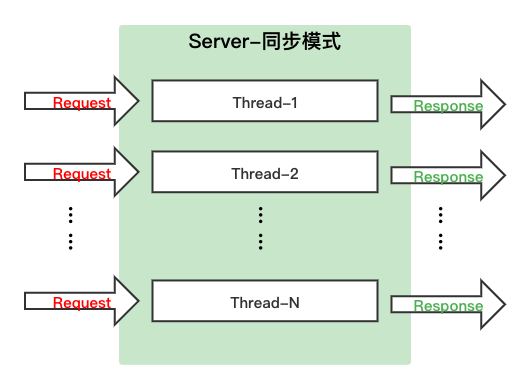
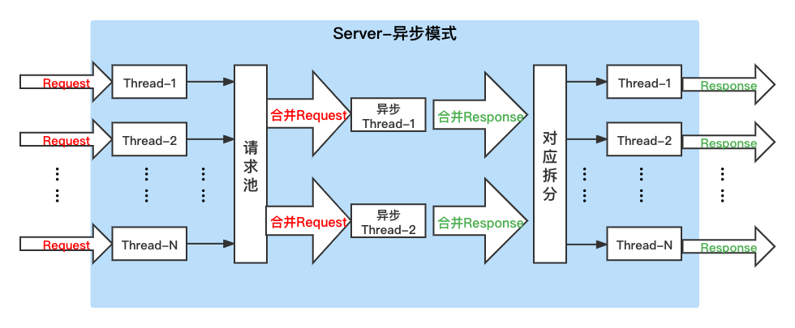

# C++ Serving 异步模式

- [设计方案](#1)
    - [网络同步线程](#1.1)
    - [异步调度线程](#1.2)
    - [动态批量](#1.3)
- [使用案例](#2)
    - [开启同步模式](#2.1)
    - [开启异步模式](#2.2)
- [性能测试](#3)
    - [测试结果](#3.1)
    - [测试数据](#3.2)

<a name="1"></a>

## 设计方案

<a name="1.1"></a>

**一.同步网络线程**

Paddle Serving 的网络框架层面是同步处理模式，即 bRPC 网络处理线程从系统内核拿到完整请求数据后( epoll 模式)，在同一线程内完成业务处理，C++ Serving 默认使用同步模式。同步模式比较简单直接，适用于模型预测时间短，或单个 Request 请求批量较大的情况。

<p align="center">

<p>

Server 端线程数 N = 模型预测引擎数 N = 同时处理 Request 请求数 N，超发的 Request 请求需要等待当前线程处理结束后才能得到响应和处理。

<a name="1.2"></a>

**二.异步调度线程**

为了提高计算芯片吞吐和计算资源利用率，C++ Serving 在调度层实现异步多线程并发合并请求，实现动态批量推理。异步模型主要适用于模型支持批量，单个 Request 请求的无批量或较小，单次预测时间较长的情况。

<p align="center">

<p>

异步模式下，Server 端 N 个线程只负责接收 Request 请求，实际调用预测引擎是在异步框架的线程池中，异步框架的线程数可以由配置选项来指定。为了方便理解，我们假设每个 Request 请求批量均为1，此时异步框架会尽可能多得从请求池中取 n(n≤M)个 Request 并将其拼装为1个 Request(batch=n)，调用1次预测引擎，得到1个 Response(batch = n)，再将其对应拆分为 n 个 Response 作为返回结果。

<a name="1.3"></a>

**三.动态批量** 

通常，异步框架合并多个请求的前提是所有请求的 `feed var` 的维度除 batch 维度外必须是相同的。例如，以 OCR 文字识别案例中检测模型为例，A 请求的 `x` 变量的 shape 是 [1, 3, 960, 960]，B 请求的 `x` 变量的 shape 是 [2, 3, 960, 960]，虽然第一个维度值不相同，但第一个维度属于 `batch` 维度，因此，请求 A 和 请求 B 可以合并。C 请求的 `x` 变量的 shape 是 [1, 3, 640, 480]，由于除了 `batch` 维度外还有2个维度值不同，A 和 C 不能直接合并。

从经验来看，当2个请求的同一个变量 shape 维度的数量相等时，通过 `padding` 补0的方式按最大 shape 值对齐即可。即 C 请求的 shape 补齐到 [1, 3, 960, 960]，那么就可以与 A 和 B 请求合并了。Paddle Serving 框架实现了动态 Padding 功能补齐 shape。

当多个将要合并的请求中有一个 shape 值很大时，所有请求的 shape 都要按最大补齐，导致计算量成倍增长。Paddle Serving 设计了一套合并策略，满足任何一个条件均可合并:

- 条件 1：绝对值差的字节数小于 **1024** 字节，评估补齐绝对长度
- 条件 2：相似度的乘积大于 **50%**，评估相似度，评估补齐绝对值整体数据量比例
  
场景1：`Shape-1 = [batch, 500, 500], Shape-2 = [batch, 400, 400]`。此时，`绝对值差 = 500*500 - 400*400 = 90000` 字节，`相对误差= (400/500) * (400/500) = 0.8*0.8 = 0.64`，满足条件1，不满足条件2，触发动态 Padding。

场景2：`Shape-1 = [batch, 1, 1], Shape-2 = [batch, 2, 2]`。此时，`绝对值差 = 2*2 - 1*1 = 3`字节，`相对误差 = (1/2) * (1/2) = 0.5*0.5 = 0.25`，满足条件2，不满足条件1，触发动态 Padding。

场景3：`Shape-1 = [batch, 3, 320, 320], Shape-2 = [batch, 3, 960, 960]`。此时，`绝对值差 = 3*960*960 - 3*320*320 = 2457600`字节，`相对误差 = (3/3) * (320/960) * (320/960) = 0.3*0.3 = 0.09`，条件1和条件2均不满足，未触发动态 Padding。

<a name="2"></a>

## 使用案例

<a name="2.1"></a>

**一.开启同步模式**

启动命令不使用 `--runtime_thread_num` 和 `--batch_infer_size` 时，属于同步处理模式，未开启异步模式。`--thread 16` 表示启动16个同步网络处理线程。
```
python3 -m paddle_serving_server.serve --model uci_housing_model --thread 16 --port 9292 
```

<a name="2.2"></a>

**二.开启异步模式**

启动命令使用 `--runtime_thread_num 2` 和  `--batch_infer_size 32` 开启异步模式，Serving 框架会启动2个异步线程，单次合并最大批量为32，自动开启动态 Padding。 
```
python3 -m paddle_serving_server.serve --model uci_housing_model --thread 16 --port 9292 --runtime_thread_num 4 --batch_infer_size 32 --ir_optim --gpu_multi_stream --gpu_ids 0
```

<a name="3"></a>

## 性能测试


- GPU：Tesla P4 7611 MiB
- CUDA：cuda11.2-cudnn8-trt8
- Python 版本：python3.7
- 模型：ResNet_v2_50
- 测试数据：构造全1输入，单client请求100次，shape 范围(1, 224 ± 50, 224 ± 50)

同步模式启动命令:
```
python3 -m paddle_serving_server.serve --model resnet_v2_50_imagenet_model --port 9393 --thread 8 --ir_optim --gpu_multi_stream --gpu_ids 1 --enable_prometheus --prometheus_port 1939
```

异步模式启动命令:
```
python3 -m paddle_serving_server.serve --model resnet_v2_50_imagenet_model --port 9393 --thread 64 --runtime_thread_num 8 --ir_optim --gpu_multi_stream --gpu_ids 1 --enable_prometheus --prometheus_port 19393
```

<a name="3.1"></a>

**一.测试结果**

使用异步模式，并开启动态批量后，并发测试不同 shape 数据时，吞吐性能大幅提升。
<div align=center>

</div

由于动态批量导致响应时长增长，经过测试，大多数场景下吞吐增量高于响应时长增长，尤其在高并发场景(client=70时)，在响应时长增长 33% 情况下，吞吐增加 105%。

|Client |1 |5 |10 | 20 |30 |40 |50 |70 |
|---|---|---|---|---|---|---|---|---|
|QPS |-2.08% |-7.23% |-1.89% |20.55% |23.02% |23.34% |46.41% |105.27% |
|响应时长 | 2.70% |7.09% |5.24% |13.34% |10.80% |43.60% |8.72% |33.89% |

异步模式可有效提升服务吞吐性能。

<a name="3.2"></a>

**二.测试数据**

1. 同步模式

| client_num | batch_size |CPU_util_pre(%) |CPU_util(%) |GPU_memory(mb) |GPU_util(%) |qps(samples/s) |total count |mean(ms) |median(ms) |80 percent(ms) |90 percent(ms) |99 percent(ms) |total cost(s) |each cost(s)|infer_count_total|infer_cost_total(ms)|infer_cost_avg(ms)|
|---|---|---|---|---|---|---|---|---|---|---|---|---|---|---|---|---|---|
| 1 |1 |1.30 |18.90 |2066 |71.56 |22.938 |100 |43.594 |23.516 |78.118 |78.323 |133.544 |4.4262 |4.3596 |7100.0000 |1666392.70 | 41.1081 |
| 5 |1 |2.00 |28.20 |3668 |92.57 |33.630 |500 |148.673 |39.531 |373.231 |396.306 |419.088 |15.0606 |14.8676 |7600.0000 |1739372.7480| 145.9601 |
|10 |1 |1.90 |29.80 |4202 |91.98 |34.303 |1000 |291.512 |76.728 |613.963 |632.736 |1217.863 |29.8004 |29.1516 |8600.0000 |1974147.7420| 234.7750 |
|20 |1 |4.70 |49.60 |4736 |92.63 |34.359 |2000 |582.089 |154.952 |1239.115 |1813.371 |1858.128 |59.7303 |58.2093 |12100.0000 |2798459.6330 |235.6248 |
|30 |1 |5.70 |65.70 |4736 |92.60 |34.162 |3000 |878.164 |231.121 |2391.687 |2442.744 |2499.963 |89.6546 |87.8168 |17600.0000 |4100408.9560 |236.6877 |
|40 |1 |5.40 |74.40 |5270 |92.44 |34.090 |4000 |1173.373 |306.244 |3037.038 |3070.198 |3134.894 |119.4162 |117.3377 |21600.0000 |5048139.2170 |236.9326|
|50 |1 |1.40 |64.70 |5270 |92.37 |34.031 |5000 |1469.250 |384.327 |3676.812 |3784.330 |4366.862 |149.7041 |146.9254 |26600.0000 |6236269.4230 |237.6260|
|70 |1 |3.70 |79.70 |5270 |91.89 |33.976 |7000 |2060.246 |533.439 |5429.255 |5552.704 |5661.492 |210.1008 |206.0250 |33600.0000 |7905005.9940 |238.3909|


2. 异步模式 - 未开启动态批量

| client_num | batch_size |CPU_util_pre(%) |CPU_util(%) |GPU_memory(mb) |GPU_util(%) |qps(samples/s) |total count |mean(ms) |median(ms) |80 percent(ms) |90 percent(ms) |99 percent(ms) |total cost(s) |each cost(s)|infer_count_total|infer_cost_total(ms)|infer_cost_avg(ms)|
|---|---|---|---|---|---|---|---|---|---|---|---|---|---|---|---|---|---|
| 1 |1 |6.20 |13.60 |5170 |71.11 |22.894 |100 |43.677 |23.992 |78.285 |78.788 |123.542 |4.4253 |4.3679 |3695.0000 |745061.9120 |40.6655 |
| 5 |1 |6.10 |32.20 |7306 |89.54 |33.532 |500 |149.109 |43.906 |376.889 |401.999 |422.753 |15.1623 |14.9113 |4184.0000 |816834.2250 |146.7736|
|10 |1 |4.90 |43.60 |7306 |91.55 |38.136 |1000 |262.216 |75.393 |575.788 |632.016 |1247.775 |27.1019 |26.2220 |5107.0000 |1026490.3950 |227.1464|
|20 |1 |5.70 |39.60 |7306 |91.36 |58.601 |2000 |341.287 |145.774 |646.824 |994.748 |1132.979 |38.3915 |34.1291 |7461.0000 |1555234.6260 |229.9113|
|30 |1 |1.30 |45.40 |7484 |91.10 |69.008 |3000 |434.728 |204.347 |959.184 |1092.181 |1661.289 |46.3822 |43.4732 |10289.0000 |2269499.9730 |249.4257|
|40 |1 |3.10 |73.00 |7562 |91.83 |80.956 |4000 |494.091 |272.889 |966.072 |1310.011 |1851.887 |52.0609 |49.4095 |12102.0000 |2678878.2010 |225.8016|
|50 |1 |0.80 |68.00 |7522 |91.10 |83.018 |5000 |602.276 |364.064 |1058.261 |1473.051 |1671.025 |72.9869 |60.2280 |14225.0000 |3256628.2820 |272.1385|
|70 |1 |6.10 |78.40 |7584 |92.02 |65.069 |7000 |1075.777 |474.014 |2411.296 |2705.863 |3409.085 |111.6653 |107.5781 |17974.0000 |4139377.4050 |235.4626


3. 异步模式 - 开启动态批量


| client_num | batch_size |CPU_util_pre(%) |CPU_util(%) |GPU_memory(mb) |GPU_util(%) |qps(samples/s) |total count |mean(ms) |median(ms) |80 percent(ms) |90 percent(ms) |99 percent(ms) |total cost(s) |each cost(s)|infer_count_total|infer_cost_total(ms)|infer_cost_avg(ms)|
|---|---|---|---|---|---|---|---|---|---|---|---|---|---|---|---|---|---|
| 1 |1 |1.20 |13.30 |6048 |70.07 |22.417 |100 |44.606 |24.486 |78.365 |78.707 |139.349 |4.5201 |4.4608 |1569.0000 |462418.6390 |41.7646 |
| 5 |1 |1.20 |50.80 |7116 |87.37 |31.106 |500 |160.740 |42.506 |414.903 |458.841 |481.112 |16.3525 |16.0743 |2059.0000 |539439.3300 |157.1851
|10 |1 |0.80 |26.20 |7264 |88.74 |37.417 |1000 |267.254 |79.452 |604.451 |686.477 |1345.528 |27.9848 |26.7258 |2950.0000 |752428.0570 |239.0446|
|20 |1 |1.50 |32.80 |7264 |89.52 |70.641 |2000 |283.117 |133.441 |516.066 |652.089 |1274.957 |33.0280 |28.3121 |4805.0000 |1210814.5610 |260.5873|
|30 |1 |0.90 |59.10 |7348 |89.57 |84.894 |3000 |353.380 |217.385 |613.587 |757.829 |1277.283 |40.7093 |35.3384 |6924.0000 |1817515.1710 |276.3695|
|40 |1 |1.30 |57.30 |7356 |89.30 |99.853 |4000 |400.584 |204.425 |666.015 |1031.186 |1380.650 |49.4807 |40.0588 |8104.0000 |2200137.0060 |324.2558|
|50 |1 |1.50 |50.60 |7578 |89.04 |121.545 |5000 |411.364 |331.118 |605.809 |874.543 |1285.650 |48.2343 |41.1369 |9350.0000 |2568777.6400 |295.8593|
|70 |1 |3.80 |83.20 |7602 |89.59 |133.568 |7000 |524.073 |382.653 |799.463 |1202.179 |1576.809 |57.2885 |52.4077 |10761.0000 |3013600.9670 |315.2540|
