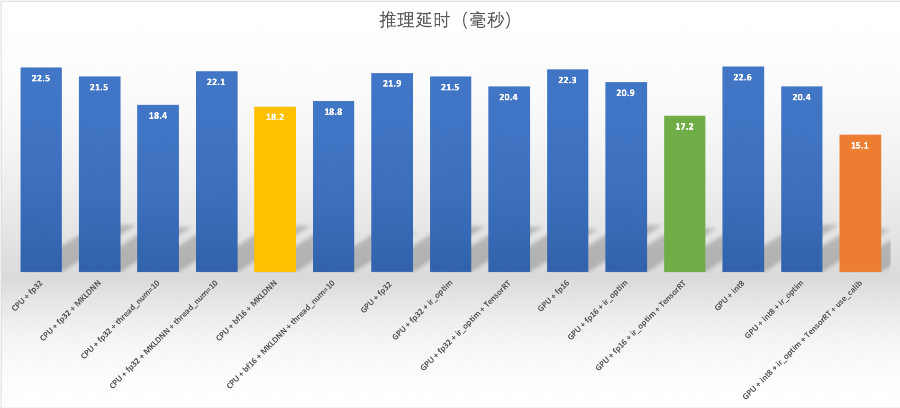

# Python Pipeline 高阶用法

在复杂业务场景中使用常规功能无法满足需求，本文介绍一些高阶用法。
- DAG 结构跳过某个 Op 运行
- 批量推理
- 单机多卡推理
- 多种计算芯片上推理
- 低精度推理
- TensorRT 推理加速
- MKLDNN 推理加速


**一.DAG 结构跳过某个 Op 运行**

此应用场景一般在 Op 前后处理中有 if 条件判断时，不满足条件时，跳过后面处理。实际做法是在跳过此 Op 的 process 阶段，只要在 preprocess 做好判断，跳过 process 阶段，在和 postprocess 后直接返回即可。
preprocess 返回结果列表的第二个结果是 `is_skip_process=True` 表示是否跳过当前 Op 的 process 阶段，直接进入 postprocess 处理。

```python
## Op::preprocess() 函数实现
def preprocess(self, input_dicts, data_id, log_id):
    """
    In preprocess stage, assembling data for process stage. users can 
    override this function for model feed features.
    Args:
        input_dicts: input data to be preprocessed
        data_id: inner unique id
        log_id: global unique id for RTT
    Return:
        input_dict: data for process stage
        is_skip_process: skip process stage or not, False default
        prod_errcode: None default, otherwise, product errores occured.
                      It is handled in the same way as exception. 
        prod_errinfo: "" default
    """
    # multiple previous Op
    if len(input_dicts) != 1:
        _LOGGER.critical(
            self._log(
                "Failed to run preprocess: this Op has multiple previous "
                "inputs. Please override this func."))
        os._exit(-1)
    (_, input_dict), = input_dicts.items()
    return input_dict, False, None, ""

```
以下示例 Jump::preprocess() 重载了原函数，返回了 True 字段
```python
class JumpOp(Op):
    ## Overload func JumpOp::preprocess
    def preprocess(self, input_dicts, data_id, log_id):
        (_, input_dict), = input_dicts.items()
        if input_dict.has_key("jump"):
            return input_dict, True, None, ""
        else
            return input_dict, False, None, ""
```


**二. 批量推理**

Pipeline 支持批量推理，通过增大 batch size 可以提高 GPU 利用率。Python Pipeline 支持3种 batch 形式以及适用的场景如下：
- 场景1：客户端打包批量数据(Client Batch)
- 场景2：服务端合并多个请求动态合并批量(Server auto-batching)
- 场景3：服务端拆分一个批量数据推理请求成为多个小块推理(Server mini-batch)


1. 客户端打包批量数据

当输入数据是 numpy 类型，如shape 为[4, 3, 512, 512]的 numpy 数据，即4张图片，可直接作为输入数据。
当输入数据的 shape 不同时，需要按最大的shape的尺寸 Padding 对齐后发送给服务端

2. 服务端合并多个请求动态合并批量
有助于提升吞吐和计算资源的利用率，当多个请求的 shape 尺寸不相同时，不支持合并。当前有2种合并策略，分别是：

- 等待时间与最大批量结合（推荐）：结合`batch_size`和`auto_batching_timeout`配合使用，实际请求的批量条数超过`batch_size`时会立即执行，不超过时会等待`auto_batching_timeout`时间再执行
```
op:
    bow:
        # 并发数，is_thread_op=True时，为线程并发；否则为进程并发
        concurrency: 1

        # client连接类型，brpc, grpc和local_predictor
        client_type: brpc

        # Serving IPs
        server_endpoints: ["127.0.0.1:9393"]

        # bow模型client端配置
        client_config: "imdb_bow_client_conf/serving_client_conf.prototxt"

        # 批量查询Serving的数量, 默认1。batch_size>1要设置auto_batching_timeout，否则不足batch_size时会阻塞
        batch_size: 2

        # 批量查询超时，与batch_size配合使用
        auto_batching_timeout: 2000
```
- 阻塞式等待：仅设置`batch_size`，不设置`auto_batching_timeout`或`auto_batching_timeout=0`，会一直等待接受 `batch_size` 个请求后再推理。

```
op:
    bow:
        # 并发数，is_thread_op=True时，为线程并发；否则为进程并发
        concurrency: 1

        # client连接类型，brpc, grpc和local_predictor
        client_type: brpc

        # Serving IPs
        server_endpoints: ["127.0.0.1:9393"]

        # bow模型client端配置
        client_config: "imdb_bow_client_conf/serving_client_conf.prototxt"

        # 批量查询Serving的数量, 默认1。batch_size>1要设置auto_batching_timeout，否则不足batch_size时会阻塞
        batch_size: 2

        # 批量查询超时，与batch_size配合使用
        auto_batching_timeout: 2000

```


3.服务端拆分一个批量数据推理请求成为多个小块推理：会降低批量数据 Padding 对齐的大小，从而提升速度。可参考 [OCR 示例]()，核心思路是拆分数据成多个小批量，放入 list 对象 feed_list 并返回

```
def preprocess(self, input_dicts, data_id, log_id):
    (_, input_dict), = input_dicts.items()
    raw_im = input_dict["image"]
    data = np.frombuffer(raw_im, np.uint8)
    im = cv2.imdecode(data, cv2.IMREAD_COLOR)
    dt_boxes = input_dict["dt_boxes"]
    dt_boxes = self.sorted_boxes(dt_boxes)
    feed_list = []
    img_list = []
    max_wh_ratio = 0

    ## Many mini-batchs, the type of feed_data is list.
    max_batch_size = len(dt_boxes)

    # If max_batch_size is 0, skipping predict stage
    if max_batch_size == 0:
        return {}, True, None, ""
    boxes_size = len(dt_boxes)
    batch_size = boxes_size // max_batch_size
    rem = boxes_size % max_batch_size
    for bt_idx in range(0, batch_size + 1):
        imgs = None
        boxes_num_in_one_batch = 0
        if bt_idx == batch_size:
            if rem == 0:
                continue
            else:
                boxes_num_in_one_batch = rem
        elif bt_idx < batch_size:
            boxes_num_in_one_batch = max_batch_size
        else:
            _LOGGER.error("batch_size error, bt_idx={}, batch_size={}".
                          format(bt_idx, batch_size))
            break

        start = bt_idx * max_batch_size
        end = start + boxes_num_in_one_batch
        img_list = []
        for box_idx in range(start, end):
            boximg = self.get_rotate_crop_image(im, dt_boxes[box_idx])
            img_list.append(boximg)
            h, w = boximg.shape[0:2]
            wh_ratio = w * 1.0 / h
            max_wh_ratio = max(max_wh_ratio, wh_ratio)
        _, w, h = self.ocr_reader.resize_norm_img(img_list[0],
                                                  max_wh_ratio).shape

        imgs = np.zeros((boxes_num_in_one_batch, 3, w, h)).astype('float32')
        for id, img in enumerate(img_list):
            norm_img = self.ocr_reader.resize_norm_img(img, max_wh_ratio)
            imgs[id] = norm_img
        feed = {"x": imgs.copy()}
        feed_list.append(feed)

        return feed_list, False, None, ""
```


**三. 单机多卡推理**

单机多卡推理与 `config.yml` 中配置4个参数关系紧密，`is_thread_op`、`concurrency`、`device_type` 和 `devices`，必须在进程模型和 GPU 模式，每张卡上可分配多个进程，即 M 个 Op 进程与 N 个 GPU 卡绑定。
```
dag:
    #op资源类型, True, 为线程模型；False，为进程模型
    is_thread_op: False

op:
    det:
        #并发数，is_thread_op=True时，为线程并发；否则为进程并发
        concurrency: 6

        #当op配置没有server_endpoints时，从local_service_conf读取本地服务配置
        local_service_conf:

            client_type: local_predictor

            # device_type, 0=cpu, 1=gpu, 2=tensorRT, 3=arm cpu, 4=kunlun xpu
            device_type: 0

            # 计算硬件 ID，当 devices 为""或不写时为 CPU 预测；当 devices 为"0", "0,1,2"时为 GPU 预测，表示使用的 GPU 卡
            devices: "0,1,2"
```
以上述案例为例，`concurrency:6`，即启动6个进程，`devices:0,1,2`，根据轮询分配机制，得到如下绑定关系：

- 进程ID: 0 绑定 GPU 卡0
- 进程ID: 1 绑定 GPU 卡1
- 进程ID: 2 绑定 GPU 卡2
- 进程ID: 3 绑定 GPU 卡0
- 进程ID: 4 绑定 GPU 卡1
- 进程ID: 5 绑定 GPU 卡2
- 进程ID: 6 绑定 GPU 卡0

对于更灵活的进程与 GPU 卡绑定方式，会持续开发。


**四. 多种计算芯片上推理**

除了支持 CPU、GPU 芯片推理之外，Python Pipeline 还支持在多种计算硬件上推理。根据 `config.yml` 中的 `device_type` 和 `devices`来设置推理硬件和加速库如下：
- CPU(Intel) : 0
- GPU(GPU / Jetson / 海光 DCU) : 1
- TensorRT : 2
- CPU(Arm) : 3
- XPU : 4
- Ascend310 : 5 
- ascend910 : 6

当不设置`device_type`时，根据 `devices` 来设置，即当 `device_type` 为 "" 或空缺时为 CPU 推理；当有设定如"0,1,2"时，为 GPU 推理，并指定 GPU 卡。

以使用 GPU 的编号为0和1号卡并开启 TensorRT 为例，TensorRT 要配合 `ir_optim` 一同开启，`config.yml`详细配置如下：
```
# 计算硬件类型
device_type: 2

# 计算硬件ID，优先由device_type决定硬件类型
devices: "0,1"

# 开启ir优化
ir_optim: True

```
           
**五. 低精度推理**
Pipeline Serving支持低精度推理，CPU、GPU和TensoRT支持的精度类型如下图所示：


低精度推理需要有量化模型，配合`config.yml`配置一起使用，以[低精度示例]() 为例

1. CPU 低精度推理配置

通过设置，`device_type` 和 `devices` 字段使用 CPU 推理，通过调整`precision`、`thread_num`和`use_mkldnn`参数选择低精度和性能调优。

```
op:
    imagenet:
        #并发数，is_thread_op=True时，为线程并发；否则为进程并发
        concurrency: 1

        #当op配置没有server_endpoints时，从local_service_conf读取本地服务配置
        local_service_conf:

            #uci模型路径
            model_config: serving_server/

            #计算硬件类型: 空缺时由devices决定(CPU/GPU)，0=cpu, 1=gpu, 2=tensorRT, 3=arm cpu, 4=kunlun xpu
            device_type: 0

            #计算硬件ID，当devices为""或不写时为CPU预测；当devices为"0", "0,1,2"时为GPU预测，表示使用的GPU卡
            devices: ""

            #client类型，包括brpc, grpc和local_predictor.local_predictor不启动Serving服务，进程内预测
            client_type: local_predictor

            #Fetch结果列表，以client_config中fetch_var的alias_name为准
            fetch_list: ["score"]

            #精度，CPU 支持: "fp32"(default), "bf16"(mkldnn); 不支持: "int8"
            precision: "bf16"

            #CPU 算数计算线程数，默认4线程
            thread_num: 10

            #开启 MKLDNN
            use_mkldnn: True
```

2. GPU + TensorRT 低精度推理

通过设置，`device_type` 和 `devices` 字段使用原生 GPU 或 TensorRT 推理，通过调整`precision`、`ir_optim`和`use_calib`参数选择低精度和性能调优，如开启 TensorRT，必须一同开启`ir_optim`，`use_calib`仅配合 int8 使用。
```
op:
    imagenet:
        #并发数，is_thread_op=True时，为线程并发；否则为进程并发
        concurrency: 1

        #当op配置没有server_endpoints时，从local_service_conf读取本地服务配置
        local_service_conf:

            #uci模型路径
            model_config: serving_server/

            #计算硬件类型: 空缺时由devices决定(CPU/GPU)，0=cpu, 1=gpu, 2=tensorRT, 3=arm cpu, 4=kunlun xpu
            device_type: 2

            #计算硬件ID，当devices为""或不写时为CPU预测；当devices为"0", "0,1,2"时为GPU预测，表示使用的GPU卡
            devices: "1" # "0,1"

            #client类型，包括brpc, grpc和local_predictor.local_predictor不启动Serving服务，进程内预测
            client_type: local_predictor

            #Fetch结果列表，以client_config中fetch_var的alias_name为准
            fetch_list: ["score"]

            #精度，GPU 支持: "fp32"(default), "fp16", "int8"
            precision: "int8"

            #开启 TensorRT int8 calibration
            use_calib: True

            #开启 ir_optim
            ir_optim: True
```


3. 性能测试

测试环境如下：
- GPU 型号: A100-40GB
- CPU 型号: Intel(R) Xeon(R) Gold 6148 CPU @ 2.40GHz * 160
- CUDA: CUDA Version: 11.2
- CuDNN: 8.0

测试方法：
- 模型: Resnet50 量化模型
- 部署方法: Python Pipeline 部署
- 计时方法: 刨除第一次运行初始化，运行100次计算平均值

在此环境下测试不同精度推理结果，GPU 推理性能较好的配置是
- GPU + int8 + ir_optim + TensorRT + use_calib : 15.1 ms
- GPU + fp16 + ir_optim + TensorRT : 17.2 ms


CPU 推理性能较好的配置是
- CPU + bf16 + MKLDNN : 18.2 ms
- CPU + fp32 + thread_num=10 : 18.4 ms

完整性能指标如下：
<div align=center>

</div
