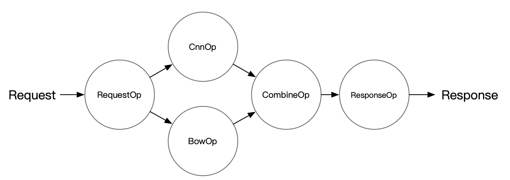

# Python Pipeline 使用案例

Python Pipeline 使用案例部署步骤可分为下载模型、配置、编写代码、推理测试4个步骤。

所有Pipeline示例在[examples/Pipeline/](../../examples/Pipeline) 目录下，目前有7种类型模型示例：
- [PaddleClas](../../examples/Pipeline/PaddleClas) 
- [Detection](../../examples/Pipeline/PaddleDetection)  
- [bert](../../examples/Pipeline/PaddleNLP/bert)
- [imagenet](../../examples/Pipeline/PaddleClas/imagenet)
- [imdb_model_ensemble](../../examples/Pipeline/imdb_model_ensemble)
- [ocr](../../examples/Pipeline/PaddleOCR/ocr)
- [simple_web_service](../../examples/Pipeline/simple_web_service)

以 imdb_model_ensemble 为例来展示如何使用 Pipeline Serving，相关代码在 `Serving/examples/Pipeline/imdb_model_ensemble` 文件夹下可以找到，例子中的 Server 端结构如下图所示：

<div align=center>

</div>

** 部署需要的文件 **
需要五类文件，其中模型文件、配置文件、服务端代码是构建Pipeline服务必备的三个文件。测试客户端和测试数据集为测试准备
- 模型文件
- 配置文件(config.yml)
  - 服务级别：服务端口、gRPC线程数、服务超时、重试次数等
  - DAG级别：资源类型、开启Trace、性能profile
  - OP级别：模型路径、并发度、推理方式、计算硬件、推理超时、自动批量等
- 服务端(web_server.py)
  - 服务级别：定义服务名称、读取配置文件、启动服务
  - DAG级别：指定多OP之间的拓扑关系
  - OP级别：重写OP前后处理
- 测试客户端
  - 正确性校验
  - 压力测试
- 测试数据集
  - 图片、文本、语音等


## 获取模型

示例中通过`get_data.sh`获取模型文件，示例中的模型文件已保存Feed/Fetch Var参数，如没有保存请跳转到[保存Serving部署参数]()步骤。
```shell
cd Serving/examples/Pipeline/imdb_model_ensemble
sh get_data.sh
```

## 创建config.yaml
本示例采用了brpc的client连接类型，还可以选择grpc或local_predictor。
```yaml
#rpc端口, rpc_port和http_port不允许同时为空。当rpc_port为空且http_port不为空时，会自动将rpc_port设置为http_port+1
rpc_port: 18070

#http端口, rpc_port和http_port不允许同时为空。当rpc_port可用且http_port为空时，不自动生成http_port
http_port: 18071

#worker_num, 最大并发数。当build_dag_each_worker=True时, 框架会创建worker_num个进程，每个进程内构建grpcSever和DAG
#当build_dag_each_worker=False时，框架会设置主线程grpc线程池的max_workers=worker_num
worker_num: 4

#build_dag_each_worker, False，框架在进程内创建一条DAG；True，框架会每个进程内创建多个独立的DAG
build_dag_each_worker: False

dag:
    #op资源类型, True, 为线程模型；False，为进程模型
    is_thread_op: True

    #重试次数
    retry: 1

    #使用性能分析, True，生成Timeline性能数据，对性能有一定影响；False为不使用
    use_profile: False

    #channel的最大长度，默认为0
    channel_size: 0

    #tracer, 跟踪框架吞吐，每个OP和channel的工作情况。无tracer时不生成数据
    tracer:
        #每次trace的时间间隔，单位秒/s
        interval_s: 10
op:
    bow:
        # 并发数，is_thread_op=True时，为线程并发；否则为进程并发
        concurrency: 1

        # client连接类型，brpc, grpc和local_predictor
        client_type: brpc

        # Serving交互重试次数，默认不重试
        retry: 1

        # Serving交互超时时间, 单位ms
        timeout: 3000

        # Serving IPs
        server_endpoints: ["127.0.0.1:9393"]

        # bow模型client端配置
        client_config: "imdb_bow_client_conf/serving_client_conf.prototxt"

        # Fetch结果列表，以client_config中fetch_var的alias_name为准
        fetch_list: ["prediction"]

        # 批量查询Serving的数量, 默认1。batch_size>1要设置auto_batching_timeout，否则不足batch_size时会阻塞
        batch_size: 2

        # 批量查询超时，与batch_size配合使用
        auto_batching_timeout: 2000
    cnn:
        # 并发数，is_thread_op=True时，为线程并发；否则为进程并发
        concurrency: 1

        # client连接类型，brpc
        client_type: brpc

        # Serving交互重试次数，默认不重试
        retry: 1

        # 预测超时时间, 单位ms
        timeout: 3000

        # Serving IPs
        server_endpoints: ["127.0.0.1:9292"]

        # cnn模型client端配置
        client_config: "imdb_cnn_client_conf/serving_client_conf.prototxt"

        # Fetch结果列表，以client_config中fetch_var的alias_name为准
        fetch_list: ["prediction"]
        
        # 批量查询Serving的数量, 默认1。
        batch_size: 2

        # 批量查询超时，与batch_size配合使用
        auto_batching_timeout: 2000
    combine:
        # 并发数，is_thread_op=True时，为线程并发；否则为进程并发
        concurrency: 1

        # Serving交互重试次数，默认不重试
        retry: 1

        # 预测超时时间, 单位ms
        timeout: 3000

        # 批量查询Serving的数量, 默认1。
        batch_size: 2

        # 批量查询超时，与batch_size配合使用
        auto_batching_timeout: 2000
```

## 编写 Server 代码

代码示例中，重点留意3个自定义Op的preprocess、postprocess处理，以及Combin Op初始化列表input_ops=[bow_op, cnn_op]，设置Combin Op的前置OP列表。

```python
from paddle_serving_server.pipeline import Op, RequestOp, ResponseOp
from paddle_serving_server.pipeline import PipelineServer
from paddle_serving_server.pipeline.proto import pipeline_service_pb2
from paddle_serving_server.pipeline.channel import ChannelDataEcode
import numpy as np
from paddle_serving_app.reader import IMDBDataset

class ImdbRequestOp(RequestOp):
    def init_op(self):
        self.imdb_dataset = IMDBDataset()
        self.imdb_dataset.load_resource('imdb.vocab')

    def unpack_request_package(self, request):
        dictdata = {}
        for idx, key in enumerate(request.key):
            if key != "words":
                continue
            words = request.value[idx]
            word_ids, _ = self.imdb_dataset.get_words_and_label(words)
            dictdata[key] = np.array(word_ids)
        return dictdata


class CombineOp(Op):
    def preprocess(self, input_data):
        combined_prediction = 0
        for op_name, data in input_data.items():
            combined_prediction += data["prediction"]
        data = {"prediction": combined_prediction / 2}
        return data


read_op = ImdbRequestOp()
bow_op = Op(name="bow",
            input_ops=[read_op],
            server_endpoints=["127.0.0.1:9393"],
            fetch_list=["prediction"],
            client_config="imdb_bow_client_conf/serving_client_conf.prototxt",
            concurrency=1,
            timeout=-1,
            retry=1)
cnn_op = Op(name="cnn",
            input_ops=[read_op],
            server_endpoints=["127.0.0.1:9292"],
            fetch_list=["prediction"],
            client_config="imdb_cnn_client_conf/serving_client_conf.prototxt",
            concurrency=1,
            timeout=-1,
            retry=1)
combine_op = CombineOp(
    name="combine",
    input_ops=[bow_op, cnn_op],
    concurrency=5,
    timeout=-1,
    retry=1)

# use default ResponseOp implementation
response_op = ResponseOp(input_ops=[combine_op])

server = PipelineServer()
server.set_response_op(response_op)
server.prepare_server('config.yml')
server.run_server()
```

## 启动服务验证

```python
from paddle_serving_client.pipeline import PipelineClient
import numpy as np

client = PipelineClient()
client.connect(['127.0.0.1:18080'])

words = 'i am very sad | 0'

futures = []
for i in range(3):
    futures.append(
        client.predict(
            feed_dict={"words": words},
            fetch=["prediction"],
            asyn=True))

for f in futures:
    res = f.result()
    if res["ecode"] != 0:
        print(res)
        exit(1)
```
