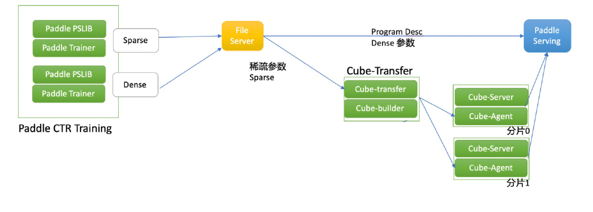

# 稀疏参数索引服务 Cube

在稀疏参数索引场景，如推荐、广告系统中通常会使用大规模 Embedding 表。由于在工业级的场景中，稀疏参数的规模非常大，达到 10^9 数量级。因此在一台机器上启动大规模稀疏参数预测是不实际的，因此我们引入百度多年来在稀疏参数索引领域的工业级产品 Cube，用于部署大规模的稀疏参数模型，支持模型的分布式管理和快速更新，并且支持 Paddle Serving 进行低延迟的批量访问。

## Cube 组件介绍

**一. cube-builder**

cube-builder 是把模型生成分片文件和版本管理的工具。由于稀疏参数文件往往是一个大文件，需要使用哈希函数将其分割为不同的分片，并使用分布式当中的每一个节点去加载不同的分片。与此同时，工业级的场景需要支持定期模型的配送和流式训练，因此对于模型的版本管理十分重要，这也是在训练保存模型时缺失的部分，因此 cube-builder 在生成分片的同时，也可以人为指定增加版本信息。

**二. cube-transfer**

cube-transfer 是调度管理服务。一方面 cube-transfer 会监测上游模型，当模型更新时进行模型下载。另一方面，会调用 cube-builder 将下载好的模型进行分片。而后与 cube-agent 进行对接完成分片文件配送。

**三. cube-agent**

cube-agent 是与cube-transfer 配套使用的调度管理服务。cube-agent 会接收来自 cube-transfer 传输来的分片文件。而后发送信号给 cube-server 对应接口完成配送操作。

**四. cube-server**

cube-server 基于 Cube 的 KV 能力，对外提供稀疏参数服务。它通过 brpc 提供高性能分布式查询服务，并支持 RestAPI 来进行远端调用。

**五. cube-cli**

cube-cli 是 cube-server 的客户端，用于请求 cube-server 进行对应稀疏参数查询功能。这部分组件已经被整合到 paddle serving 当中，当我们准备好 cube.conf 配置文件并在 server 的代码中指定kv_infer 相关的 op 时，cube-cli 就会在 server 端准备就绪。

## 配送过程

一次完整的配送流程如下：

- 将训练好的模型存放到 FileServer 中，并在传输完成后生成完成标志，这里 FileServer 可以使用 http 协议的文件传输服务；
- cube-transfer 监测到完成标志后，从 FileServer 中下载对应模型文件；
- cube-transfer 使用 cube-builder 工具对稀疏参数模型进行分片；
- cube-transfer 向 cube-agent 进行文件配送；
- cube-agent 向 cube-server 发送加载命令，通知 cube-server 热加载新的参数文件；
- cube-server 响应 Paddle Serving 发送的查询请求。