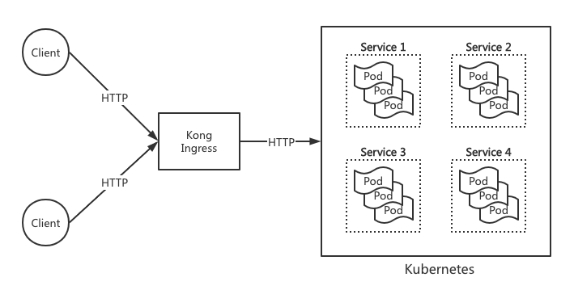

# Kubernetes 集群部署

Kubernetes 是一个基于容器技术的分布式架构的解决方案，是云原生容器集群管理系统，提供服务发现与负载均衡、存储编排、自动部署和回滚、资源管理、自动恢复以及密钥和配置管理。Paddle Serving 支持 Kubenetes 集群部署方案，为企业级用户提供集群部署示例。

## 部署方案

为了解决 Pod 迁移、Node Pod 端口、域名动态分配等问题，选择使用 Ingress 解决方案，对外提供可访问的 URL、负载均衡、SSL、基于名称的虚拟主机等功能。在众多 Ingress 插件中选用 Kong 作为微服务的 API 网关，因其具备以下优势：
- 拥有丰富的微服务功能，如 API认证、鉴权、DDos保护和灰度部署等
- 提供一些 API、服务的定义，可抽象成 Kubernetes 的 CRD，通过 Kubernetes Ingress 配置实现同步状态到 Kong 集群
- 集群配置信息存储在 postgres 数据库，配置信息实现全局节点共享和实时同步
- 有成熟的第三方管理 UI，实现可视化管理 Kong 配置

Paddle Serving 的 Kubernetes 集群部署方案设计如下图所示，用户流量通过 Kong Ingress 转发到 Kubernetes 集群。Kubernetes 集群负责管理 Service 和 Pod 实例。

<p align="center">
  
</p>

## 部署步骤

**一. 准备环境**

推荐[购买并使用百度智能云 CCE 集群](https://cloud.baidu.com/doc/CCE/index.html)，提供完整的部署环境。如自行安装 Kubenetes 集群，请参考[教程](https://kubernetes.io/zh/docs/setup/)。

此外，还需要准备一个用于 Kubenetes 集群部署的镜像仓库，通常与云服务提供商绑定，如果使用百度智能云的CCE集群，可以参照[百度智能云 CCR 镜像仓库使用方式](https://cloud.baidu.com/doc/CCR/index.html)。当然 Docker Hub 也可以作为镜像仓库，但下载速度慢，集群扩容时间较长。

在 Kubenetes 集群中运行下面命令，安装网关工具 Kong

```
kubectl apply -f https://bit.ly/kong-ingress-dbless
```

**二. 安装 Kubernetes **
kubernetes 集群环境安装和启动步骤如下，并使用 kubectl 命令与通过它与 Kubernetes 进行交互和管理。
```
// close OS firewall
systemctl disable firewarlld
systemctl stop firewarlld
 
// install etcd & kubernetes
yum install -y etcd kubernetes
 
// start etcd & kubernetes
systemctl start etcd
systemctl start docker
systemctl start kube-apiserver
systemctl start kube-controller-manager
systemctl start kube-scheduler
systemctl start kubelet
systemctl start kube-proxy
```

**二. 制作镜像**

首先，可直接使用 Paddle Serving 提供的镜像作为 Base 制作业务镜像，或者重新制作镜像。Paddle Serving 提供以下3种镜像，区别如下：
- 开发镜像：安装多种开发工具，可用于调试和编译代码，镜像体积较大。
- 运行镜像：安装运行 Serving 的必备工具，经过裁剪后镜像体积较小，适合在存储受限场景使用
- Java 镜像：为 Java SDK 提供基础环境，包括 JRE、JDK 和 Maven
- XPU 镜像：为 Arm 或 异构硬件（百度昆仑、海光DCU）环境部署

完整镜像列表，请参考 [DOCKER 开发镜像列表](./Docker_Images_CN.md)

制作镜像的整体步骤如下，这里选定 Serving 运行镜像，相比于开发镜像体积更小，镜像内已安装相关的依赖和 Serving wheel 包。
1.选定运行镜像：registry.baidubce.com/paddlepaddle/serving:0.8.3-cuda10.1-cudnn7-runtime 
2.运行镜像并拷贝模型和服务代码到镜像中，当你需要部署外部其他模型时，更换模型和代码即可。
3.制作并上传新镜像

假定已完成上述3个前置运行镜像并拷贝模型到镜像中，看具体操作。
```bash
# Run docker
nvidia-docker run --rm -dit --name pipeline_serving_demo registry.baidubce.com/paddlepaddle/serving:0.8.0-cuda10.1-cudnn7-runtime bash

# Enter your serving repo, and download OCR models
cd /home/work/Serving/examples/Pipeline/PaddleOCR/ocr

python3 -m paddle_serving_app.package --get_model ocr_rec
tar -xzvf ocr_rec.tar.gz
python3 -m paddle_serving_app.package --get_model ocr_det
tar -xzvf ocr_det.tar.gz
cd ..

# Copy OCR directory to your docker
docker cp ocr pipeline_serving_demo:/home/

# Commit and push it
docker commit pipeline_serving_demo registry.baidubce.com/paddlepaddle/serving:k8s_ocr_pipeline_0.8.3_post101
docker push registry.baidubce.com/paddlepaddle/serving:k8s_ocr_pipeline_0.8.3_post101
```

最终，你完成了业务镜像制作环节。通过拉取制作的镜像，创建Docker示例后，在`/home`路径下验证模型目录，通过以下命令验证 Wheel 包安装。
```
pip3.7 list | grep paddle
```
输出显示已安装3个 Serving Wheel 包和1个 Paddle Wheel 包。
```
paddle-serving-app        0.8.3
paddle-serving-client     0.8.3
paddle-serving-server-gpu 0.8.3.post101
paddlepaddle-gpu          2.2.2.post101
```

**三. 集群部署**

Serving/tools/generate_k8s_yamls.sh 会生成 Kubernetes 部署配置。以 OCR 为例，运行以下命令生成 Kubernetes 集群配置。
```
sh tools/generate_k8s_yamls.sh  --app_name ocr --image_name registry.baidubce.com/paddlepaddle/serving:k8s_ocr_pipeline_0.8.3_post101 --workdir /home/ocr --command "python3.7 web_service.py" --port 9999
```
生成信息如下：
```
named arg: app_name: ocr
named arg: image_name: registry.baidubce.com/paddlepaddle/serving:k8s_ocr_pipeline_0.8.3_post101
named arg: workdir: /home/ocr
named arg: command: python3.7 web_service.py
named arg: port: 9999
check k8s_serving.yaml and k8s_ingress.yaml please.
```

运行命令后，生成2个 yaml 文件，分别是 k8s_serving.yaml 和 k8s_ingress.yaml。执行以下命令启动 Kubernetes 集群 和 Ingress 网关。

```
kubectl create -f k8s_serving.yaml
kubectl create -f k8s_ingress.yaml
```

Kubernetes 下常用命令
| 命令 | 说明 |
| --- | --- |
| kubectl create -f xxx.yaml | 使用 xxx.yml 创建资源对象 |
| kubectl apply -f xxx.yaml |	使用 xxx.yml 更新资源对象 |	
| kubectl delete po mysql| 删除名为 mysql 的 pods |
| kubectl get all --all-namespace | 查询所有资源信息 |	
| kubectl get po | 查询所有 pods |
| kubectl get namespace |	查询所有命名空间 |
| kubectl get rc | 查询所有|
| kubectl get services | 查询所有 services |
| kubectl get node | 查询所有 node 节点 |
| kubectl get deploy | 查询集群部署状态 |

按下面4个步骤查询集群状态并进入 Pod 容器:

1. 最终通过输入以下命令检验集群部署状态：
```
kubectl get deploy

```

部署状态如下：
```
NAME   READY   UP-TO-DATE   AVAILABLE   AGE
ocr    1/1     1            1           10m
```

2. 查询全部 Pod 信息 运行命令：
```
kubectl get pods
```
查询 Pod 信息如下：
```
NAME                       READY   STATUS    RESTARTS   AGE
ocr-c5bd77d49-mfh72        1/1     Running   0          10m
uci-5bc7d545f5-zfn65       1/1     Running   0          52d
```

3. 进入 Pod container 运行命令：
```
kubectl exec -ti ocr-c5bd77d49-mfh72 -n bash 
```

4. 查询集群服务状态：
```
kubectl get service --all-namespaces
```

集群部署状态如下：
```
NAMESPACE     NAME                      TYPE           CLUSTER-IP       EXTERNAL-IP   PORT(S)                    AGE
default       bert                      ClusterIP      172.16.86.12     <none>        9292/TCP                   20m
default       kubernetes                ClusterIP      172.16.0.1       <none>        443/TCP                    28d
default       ocr                       ClusterIP      172.16.152.43    <none>        9999/TCP                   50m
kong          kong-proxy                LoadBalancer   172.16.88.132    <pending>     80:8893/TCP,443:8805/TCP   25d
kong          kong-validation-webhook   ClusterIP      172.16.38.100    <none>        443/TCP                    25d
kube-system   heapster                  ClusterIP      172.16.240.64    <none>        80/TCP                     28d
kube-system   kube-dns                  ClusterIP      172.16.0.10      <none>        53/UDP,53/TCP,9153/TCP     28d
kube-system   metrics-server            ClusterIP      172.16.34.157    <none>        443/TCP                    28d
```

根据 kong-proxy 的 CLUSTER-IP 和 端口信息，访问 URL: http://172.16.88.132:80/ocr/prediction 查询 OCR 服务。 

**四.更新镜像**

假定更新了文件或数据，重新生成 k8s_serving.yaml 和 k8s_ingress.yaml。
```
sh tools/generate_k8s_yamls.sh  --app_name ocr --image_name registry.baidubce.com/paddlepaddle/serving:k8s_ocr_pipeline_0.8.3_post101 --workdir /home/ocr --command "python3.7 web_service.py" --port 9999
```
更新配置，并重启Pod
```
kubectl apply -f k8s_serving.yaml
kubectl apply -f k8s_ingress.yaml

# 查找 ocr 的 pod name
kubectl get pods

# 更新 pod
kubectl exec -it ocr-c5bd77d49-s8jwh -n default -- /bin/sh
```
