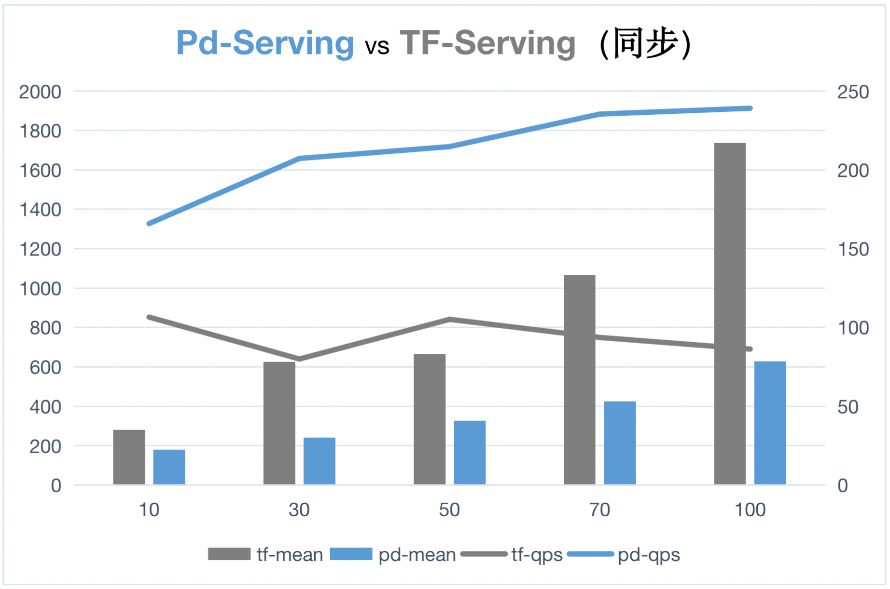

# Paddle Serving - 端到端服务化推理框架

## 1.Paddle Serving 介绍
面向模型服务化部署场景的端到端服务化推理框架 Paddle Serving，可以实现飞桨模型在 X86、ARM 平台多种硬件上高性能服务化部署，支持5种以上的 GPU、NPU 硬件推理加速；此外，Paddle Serving 提供 Docker 和 Kubernetes 的云端部署方案。

## 2.快速上手-代码模块

进入到 Serving 的 git 目录下，进入到 [fit_a_line](https://github.com/PaddlePaddle/Serving/tree/v0.8.3/examples/C%2B%2B/fit_a_line) 示例
```
## 下载模型
sh get_data.sh

## 启动服务
python3 -m paddle_serving_server.serve --model uci_housing_model --thread 10 --port 9393

## HTTP curl
curl -XPOST http://0.0.0.0:9393/GeneralModelService/inference -d ' {"tensor":[{"float_data":[0.0137,-0.1136,0.2553,-0.0692,0.0582,-0.0727,-0.1583,-0.0584,0.6283,0.4919,0.1856,0.0795,-0.0332],"elem_type":1,"name":"x","alias_name":"x","shape":[1,13]}],"fetch_var_names":["price"],"log_id":0}'
```

## 3.部署流程图

开发流程：①准备部署环境；②准备部署模型；③Serving程序开发；④服务启动与优化

**①准备部署环境**
docker 是一个开源的应用容器引擎，可以让应用程序更加方便地被打包和移植。Paddle Serving 容器化部署建议在 docker 中进行Serving服务化部署。在 Serving Docker 环境中安装 PYTHON Wheel 包

**②准备部署模型**

下载推理模型后，为了便于模型服务化部署，需要将推理模型保存成用于 Serving 部署的参数形式

**③Serving程序开发**

修改服务端和客户端代码适配模型的前后处理，通过修改配置或命令行参数，如端口、指定硬件和并发数量等指定部署参数。

**④服务启动与优化**

命令方式启动服务端和客户端，根据输出结果和性能指标做进一步的性能优化。

## 4.Demo 展示区

参考 [模型库](./4-0_ModelZoo_CN.md)

## 5.核心优势

Paddle Serving 具备工业级功能、高性能等优势。

**一.工业级**

- 支持 HTTP、gRPC、bRPC 等多种协议；提供 C++、Python、Java 语言 SDK
- 设计并实现基于有向无环图(DAG)的异步流水线高性能推理框架，具有多模型组合、异步调度、并发推理、动态批量、多卡多流推理、请求缓存等特性
- 适配 x86(Intel) CPU、ARM CPU、Nvidia GPU、昆仑 XPU、华为昇腾310/910、海光 DCU、Nvidia Jetson 等多种硬件
- 集成 Intel MKLDNN、Nvidia TensorRT 加速库，以及低精度和量化推理
- 提供一套模型安全部署解决方案，包括加密模型部署、鉴权校验、HTTPs 安全网关，并在实际项目中应用
- 支持云端部署，提供百度云智能云 kubernetes 集群部署 Paddle Serving 案例
- 提供丰富的经典模型部署示例，如 PaddleOCR、PaddleClas、PaddleDetection、PaddleSeg、PaddleNLP 和 PaddleRec等套件，共计40多个预训练精品模型

**二.高性能**

# 1. 测试环境和说明
1) GPU型号：Tesla P4(7611 Mib)
2) Cuda版本：11.0
3) 模型：ResNet_v2_50
4) 为了测试异步合并batch的效果，测试数据中batch=1
5) [使用的测试代码和使用的数据集](../../examples/C++/PaddleClas/resnet_v2_50)
6) 下图中蓝色是C++ Serving，灰色为TF-Serving。
7) 折线图为QPS，数值越大表示每秒钟处理的请求数量越大，性能就越好。
8) 柱状图为平均处理时延，数值越大表示单个请求处理时间越长，性能就越差。

同步模型默认参数配置情况下，C++ Serving QPS 和平均时延指标均优于 TF-Serving。
<p align="center">
    <br>

    <br>
<p>

异步模式情况下，两者性能接近，但当 Client 并发数达到70的时候，TF-Serving 服务直接超时，而 C++ Serving 能够正常返回结果。
<p align="center">
    <br>

    <br>
<p>


## 6.合作案例

## 7.资源汇总

## 8.开发者贡献&社区
