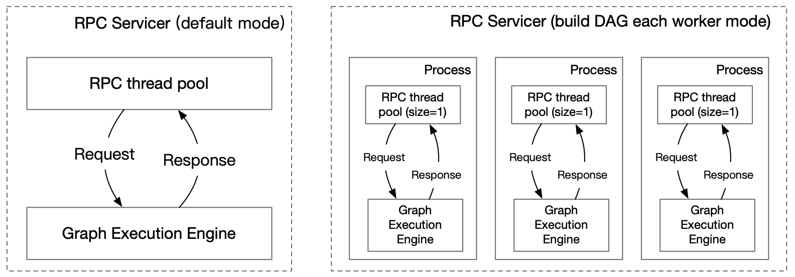
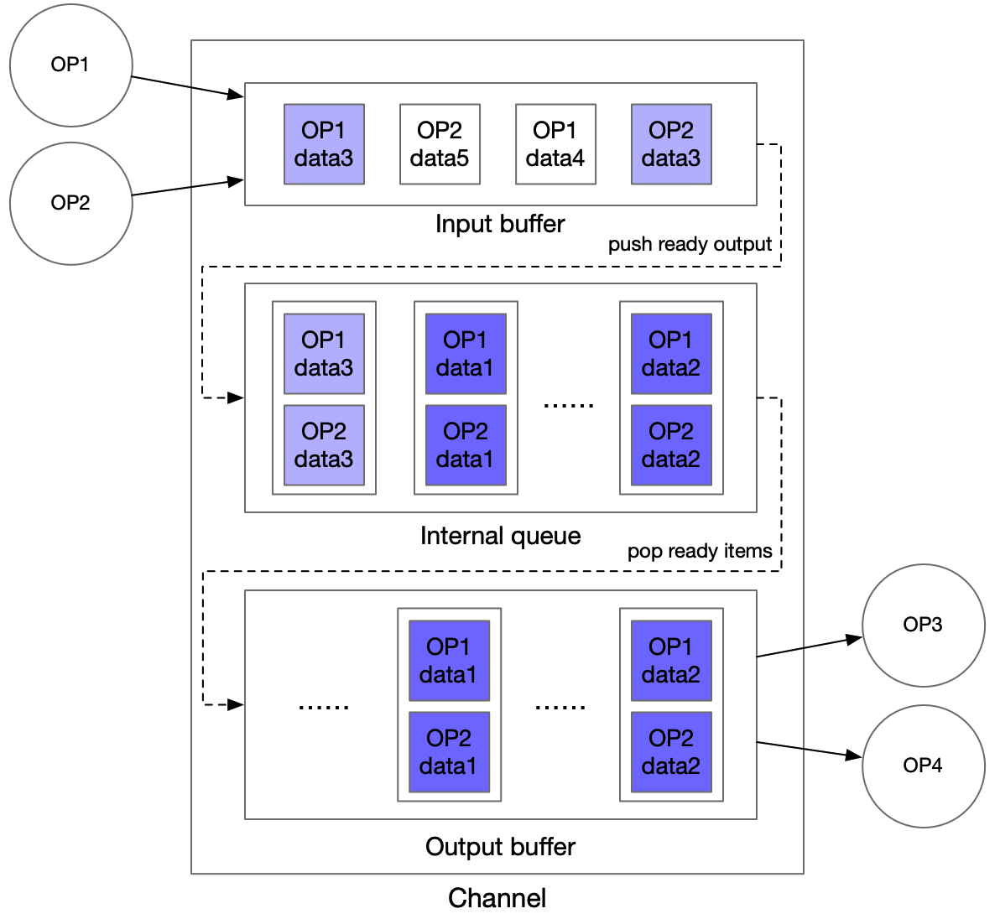

# Pipeline Serving

([简体中文](PIPELINE_SERVING_CN.md)|English)


Paddle Serving is usually used for the deployment of single model, but the end-to-end deep learning model can not solve all the problems at present. Usually, it is necessary to use multiple deep learning models to solve practical problems.

Paddle Serving provides a user-friendly programming framework for multi-model composite services, Pipeline Serving, which aims to reduce the threshold of programming, improve resource utilization (especially GPU), and improve the prediction efficiency.

## Architecture Design

The Server side is built based on gRPC and graph execution engine. The relationship between them is shown in the following figure.

<center>

</center>
### Graph Execution Engine

The graph execution engine consists of OPs and Channels, and the connected OPs share one Channel.

- Channel can be understood as a buffer queue. Each OP accepts only one Channel input and multiply Channel outputs (each output is the same); a Channel can contain outputs from multiple OPs, and data from the same Channel can be used as input for multiple OPs.
- Users only need to define relationships between OPs. Graph engine will analyze the dependencies of the entire graph and declaring Channels at the compile time.
- After Request data enters the graph execution engine service, the graph engine will generator an Request ID, and Reponse is returned through corresponding Request ID.
- For cases where large data needs to be transferred between OPs, consider RAM DB external memory for global storage and data transfer by passing index keys in Channel.

<center>

</center>


### OP Design

- The default function of a single OP is to access a single Paddle Serving Service based on the input Channel data and put the result into the output Channel.
- OP supports user customization, including preprocess, process, postprocess functions that can be inherited and implemented by the user.
- OP can set the number of concurrencies to increase the number of concurrencies processed.
- OP can obtain data from multiple different RPC requests for Auto-Batching.
- OP can be started by a thread or process.

### Channel Design

- Channel is the data structure for sharing data between OPs, responsible for sharing data or sharing data status information.
- Outputs from multiple OPs can be stored in the same Channel, and data from the same Channel can be used by multiple OPs.
- The following illustration shows the design of Channel in the graph execution engine, using input buffer and output buffer to align data between multiple OP inputs and multiple OP outputs, with a queue in the middle to buffer.

<center>

</center>


### Extreme Case Consideration

- Request timeout

  The entire graph execution engine may time out at every step. The graph execution engine controls the time out by setting `timeout` value. Requests that time out at any step will return a timeout response.

- Channel stores too much data

  Channels may store too much data, causing copy time to be too high. Graph execution engines can store OP calculation results in external memory, such as high-speed memory KV systems.

- Whether input buffers and output buffers in Channel will increase indefinitely

  - It will not increase indefinitely. The input to the entire graph execution engine is placed inside a Channel's internal queue, directly acting as a traffic control buffer queue for the entire service.
  - For input buffer, adjust the number of concurrencies of OP1 and OP2 according to the amount of computation, so that the number of input buffers from each input OP is relatively balanced.
  - For output buffer, you can use a similar process as input buffer, which adjusts the concurrency of OP3 and OP4 to control the buffer length of output buffer.
  - Note: The length of the input buffer depends on the speed at which each item in the internal queue is ready, and the length of the output buffer depends on the speed at which downstream OPs obtain data from the output buffer.

## Detailed Design

### User Interface Design

#### 1. General OP Definition

As the basic unit of graph execution engine, the general OP constructor is as follows:

```python
def __init__(name=None,
             input_ops=[],
             server_endpoints=[],
             fetch_list=[],
             client_config=None,
             concurrency=1,
             timeout=-1,
             retry=1,
             batch_size=1,
             auto_batching_timeout=None)
```

The meaning of each parameter is as follows:

|       Parameter       |                           Meaning                            |
| :-------------------: | :----------------------------------------------------------: |
|         name          | (str) String used to identify the OP type, which must be globally unique. |
|       input_ops       |     (list) A list of all previous OPs of the current Op.     |
|   server_endpoints    | (list) List of endpoints for remote Paddle Serving Service. If this parameter is not set, the OP will not access the remote Paddle Serving Service, that is, the process operation will not be performed. |
|      fetch_list       | (list) List of fetch variable names for remote Paddle Serving Service. |
|     client_config     | (str) The path of the client configuration file corresponding to the Paddle Serving Service. |
|      concurrency      |             (int) The number of concurrent OPs.              |
|        timeout        | (int) The timeout time of the process operation, in ms. If the value is less than zero, no timeout is considered. |
|         retry         | (int) Timeout number of retries. When the value is 1, no retries are made. |
|      batch_size       | (int) The expected batch_size of Auto-Batching, since building batches may time out, the actual batch_size may be less than the set value. |
| auto_batching_timeout | (float) Timeout for building batches of Auto-Batching (the unit is ms). |


#### 2. General OP Secondary Development Interface

|             Interface or Variable              |                           Explain                            |
| :--------------------------------------------: | :----------------------------------------------------------: |
|       def preprocess(self, input_dicts)        | Process the data obtained from the channel, and the processed data will be used as the input of the **process** function. (This function handles a **sample**) |
|       def process(self, feed_dict_list)        | The RPC prediction process is based on the Paddle Serving Client, and the processed data will be used as the input of the **postprocess** function. (This function handles a **batch**) |
| def postprocess(self, input_dicts, fetch_dict) | After processing the prediction results, the processed data will be put into the subsequent Channel to be obtained by the subsequent OP. (This function handles a **sample**) |
|               def init_op(self)                |      Used to load resources (such as word dictionary).       |
|              self.concurrency_idx              | Concurrency index of current process(not thread) (different kinds of OP are calculated separately). |

In a running cycle, OP will execute three operations: preprocess, process, and postprocess (when the `server_endpoints` parameter is not set, the process operation is not executed). Users can rewrite these three functions. The default implementation is as follows:

```python
def preprocess(self, input_dicts):
  # multiple previous Op
  if len(input_dicts) != 1:
    raise NotImplementedError(
      'this Op has multiple previous inputs. Please override this func.'
    ）
  (_, input_dict), = input_dicts.items()
  return input_dict

def process(self, feed_dict_list):
  err, err_info = ChannelData.check_batch_npdata(feed_dict_list)
  if err != 0:
    raise NotImplementedError(
      "{} Please override preprocess func.".format(err_info))
  call_result = self.client.predict(
    feed=feed_dict_list, fetch=self._fetch_names)
  return call_result

def postprocess(self, input_dicts, fetch_dict):
  return fetch_dict
```

The parameter of **preprocess** is the data `input_dicts` in the previous Channel. This variable (as a **sample**) is a dictionary with the name of the previous OP as key and the output of the corresponding OP as value.

The parameter of **process** is the input variable `fetch_dict_list` (a list of the return value of the preprocess function) of the Paddle Serving Client prediction interface. This variable (as a **batch**) is a list of dictionaries with feed_name as the key and the data in the ndarray format as the value.

The parameters of **postprocess** are `input_dicts` and `fetch_dict`. `input_dicts` is consistent with the parameter of preprocess, and `fetch_dict` (as a **sample**) is a sample of the return batch of the process function (if process is not executed, this value is the return value of preprocess).

Users can also rewrite the **init_op** function to load some custom resources (such as word dictionary). The default implementation is as follows:

```python
def init_op(self):
  pass
```

It should be **noted** that in the threaded version of OP, each OP will only call this function once, so the loaded resources must be thread safe.

#### 3. RequestOp Definition

RequestOp is used to process RPC data received by Pipeline Server, and the processed data will be added to the graph execution engine. Its constructor is as follows:

```python
def __init__(self)
```

#### 4. RequestOp Secondary Development Interface

|           Interface or Variable           |                           Explain                            |
| :---------------------------------------: | :----------------------------------------------------------: |
|             def init_op(self)             | It is used to load resources (such as dictionaries), and is consistent with general OP. |
| def unpack_request_package(self, request) |                  Process received RPC data.                  |

The default implementation of **unpack_request_package** is to make the key and value in RPC request into a dictionary:

```python
def unpack_request_package(self, request):
  dictdata = {}
  for idx, key in enumerate(request.key):
    data = request.value[idx]
    try:
      data = eval(data)
    except Exception as e:
      pass
    dictdata[key] = data
  return dictdata
```

The return value is required to be a dictionary type.

#### 5. ResponseOp Definition

ResponseOp is used to process the prediction results of the graph execution engine. The processed data will be used as the RPC return value of Pipeline Server. Its constructor is as follows:

```python
def __init__(self, input_ops)
```

`input_ops` is the last OP of graph execution engine. Users can construct different DAGs by setting different `input_ops` without modifying the topology of OPs.

#### 6. ResponseOp Secondary Development Interface

|            Interface or Variable             |                           Explain                            |
| :------------------------------------------: | :----------------------------------------------------------: |
|              def init_op(self)               | It is used to load resources (such as dictionaries), and is consistent with general OP. |
| def pack_response_package(self, channeldata) | Process the prediction results of the graph execution engine as the return of RPC. |

The default implementation of **pack_response_package** is to convert the dictionary of prediction results into key and value in RPC response:

```python
def pack_response_package(self, channeldata):
  resp = pipeline_service_pb2.Response()
  resp.ecode = channeldata.ecode
  if resp.ecode == ChannelDataEcode.OK.value:
    if channeldata.datatype == ChannelDataType.CHANNEL_NPDATA.value:
      feed = channeldata.parse()
      np.set_printoptions(threshold=np.nan)
      for name, var in feed.items():
        resp.value.append(var.__repr__())
        resp.key.append(name)
    elif channeldata.datatype == ChannelDataType.DICT.value:
      feed = channeldata.parse()
      for name, var in feed.items():
        if not isinstance(var, str):
          resp.ecode = ChannelDataEcode.TYPE_ERROR.value
          resp.error_info = self._log(
            "fetch var type must be str({}).".format(type(var)))
          break
        resp.value.append(var)
        resp.key.append(name)
    else:
      resp.ecode = ChannelDataEcode.TYPE_ERROR.value
      resp.error_info = self._log(
        "Error type({}) in datatype.".format(channeldata.datatype))
  else:
    resp.error_info = channeldata.error_info
  return resp
```

#### 7. PipelineServer Definition

The definition of PipelineServer is relatively simple, as follows:

```python
server = PipelineServer()
server.set_response_op(response_op)
server.prepare_server(config_yml_path)
server.run_server()
```

Where `response_op` is the responseop mentioned above, PipelineServer will initialize Channels according to the topology relationship of each OP and build the calculation graph. `config_yml_path` is the configuration file of PipelineServer. The example file is as follows:

```yaml
port: 18080  # gRPC port
worker_num: 1  # gRPC thread pool size (the number of processes in the process version servicer). The default is 1
build_dag_each_worker: false  # Whether to use process server or not. The default is false
dag:
    is_thread_op: true  # Whether to use the thread version of OP. The default is true
    client_type: brpc  # Use brpc or grpc client. The default is brpc
    retry: 1  # The number of times DAG executor retries after failure. The default value is 1, that is, no retrying
    use_profile: false  # Whether to print the log on the server side. The default is false
```


## Example

Here, we build a simple imdb model enable example to show how to use Pipeline Serving. The relevant code can be found in the `python/examples/pipeline/imdb_model_ensemble` folder. The Server-side structure in the example is shown in the following figure:


<center>

</center>


### Get the model file and start the Paddle Serving Service

```shell
cd python/examples/pipeline/imdb_model_ensemble
sh get_data.sh
python -m paddle_serving_server.serve --model imdb_cnn_model --port 9292 &> cnn.log &
python -m paddle_serving_server.serve --model imdb_bow_model --port 9393 &> bow.log &
```

### Start PipelineServer

Run the following code

```python
import logging
logging.basicConfig(level=logging.INFO)

from paddle_serving_server.pipeline import Op, RequestOp, ResponseOp
from paddle_serving_server.pipeline import PipelineServer
from paddle_serving_server.pipeline.proto import pipeline_service_pb2
from paddle_serving_server.pipeline.channel import ChannelDataEcode
import numpy as np
from paddle_serving_app.reader import IMDBDataset


_LOGGER = logging.getLogger()


class ImdbRequestOp(RequestOp):
    def init_op(self):
        self.imdb_dataset = IMDBDataset()
        self.imdb_dataset.load_resource('imdb.vocab')

    def unpack_request_package(self, request):
        dictdata = {}
        for idx, key in enumerate(request.key):
            if key != "words":
                continue
            words = request.value[idx]
            word_ids, _ = self.imdb_dataset.get_words_and_label(words)
            dictdata[key] = np.array(word_ids)
        return dictdata


class CombineOp(Op):
    def preprocess(self, input_data):
        combined_prediction = 0
        for op_name, data in input_data.items():
            _LOGGER.info("{}: {}".format(op_name, data["prediction"]))
            combined_prediction += data["prediction"]
        data = {"prediction": combined_prediction / 2}
        return data


read_op = ImdbRequestOp()
bow_op = Op(name="bow",
            input_ops=[read_op],
            server_endpoints=["127.0.0.1:9393"],
            fetch_list=["prediction"],
            client_config="imdb_bow_client_conf/serving_client_conf.prototxt",
            concurrency=1,
            timeout=-1,
            retry=1)
cnn_op = Op(name="cnn",
            input_ops=[read_op],
            server_endpoints=["127.0.0.1:9292"],
            fetch_list=["prediction"],
            client_config="imdb_cnn_client_conf/serving_client_conf.prototxt",
            concurrency=1,
            timeout=-1,
            retry=1)
combine_op = CombineOp(
    name="combine",
    input_ops=[bow_op, cnn_op],
    concurrency=5,
    timeout=-1,
    retry=1)

# use default ResponseOp implementation
response_op = ResponseOp(input_ops=[combine_op])

server = PipelineServer()
server.set_response_op(response_op)
server.prepare_server('config.yml')
server.run_server()
```

### Perform prediction through PipelineClient

```python
from paddle_serving_client.pipeline import PipelineClient
import numpy as np

client = PipelineClient()
client.connect(['127.0.0.1:18080'])

words = 'i am very sad | 0'

futures = []
for i in range(3):
    futures.append(
        client.predict(
            feed_dict={"words": words},
            fetch=["prediction"],
            asyn=True))

for f in futures:
    res = f.result()
    if res["ecode"] != 0:
        print(res)
        exit(1)
```


## How to optimize through the timeline tool

In order to better optimize the performance, PipelineServing provides a timeline tool to monitor the time of each stage of the whole service.

### Output profile information on server side

The server is controlled by the `use_profile` field in yaml:

```yaml
dag:
    use_profile: true
```

After the function is enabled, the server will print the corresponding log information to the standard output in the process of prediction. In order to show the time consumption of each stage more intuitively, Analyst module is provided for further analysis and processing of log files.

The output of the server is first saved to a file. Taking `profile.txt` as an example, the script converts the time monitoring information in the log into JSON format and saves it to the `trace` file. The `trace` file can be visualized through the tracing function of Chrome browser.

```shell
import logging
logging.basicConfig(level=logging.INFO)

from paddle_serving_server.pipeline import Analyst
import json
import sys

if __name__ == "__main__":
    log_filename = "profile.txt"
    trace_filename = "trace"
    analyst = Analyst(log_filename)
    analyst.save_trace(trace_filename)
```

Specific operation: open Chrome browser, input in the address bar `chrome://tracing/` , jump to the tracing page, click the load button, open the saved `trace` file, and then visualize the time information of each stage of the prediction service.

### Output profile information on client side

The profile function can be enabled by setting `profile=True` in the `predict` interface on the client side.

After the function is enabled, the client will print the log information corresponding to the prediction to the standard output during the prediction process, and the subsequent analysis and processing are the same as that of the server.
