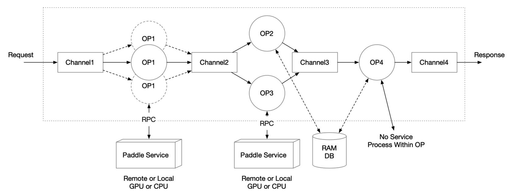

# Pipeline Serving

([简体中文](PIPELINE_SERVING_CN.md)|English)

- [Architecture Design](PIPELINE_SERVING.md#1architecture-design)
- [Detailed Design](PIPELINE_SERVING.md#2detailed-design)
- [Classic Examples](PIPELINE_SERVING.md#3classic-examples)
- [Advanced Usages](PIPELINE_SERVING.md#4advanced-usages)
- [Log Tracing](PIPELINE_SERVING.md#5log-tracing)
- [Performance Analysis And Optimization](PIPELINE_SERVING.md#6performance-analysis-and-optimization)

In many deep learning frameworks,  Serving is usually used for the deployment of single model.but in the context of AI industrial, the end-to-end deep learning model can not solve all the problems at present. Usually, it is necessary to use multiple deep learning models to solve practical problems.However, the design of multi-model applications is complicated. In order to reduce the difficulty of development and maintenance, and to ensure the availability of services, serial or simple parallel methods are usually used. In general, the throughput only reaches the usable state and the GPU utilization rate is low.

Paddle Serving provides a user-friendly programming framework for multi-model composite services, Pipeline Serving, which aims to reduce the threshold of programming, improve resource utilization (especially GPU), and improve the prediction efficiency.

## 1.Architecture Design

The Server side is built based on <b>RPC Service</b> and <b>graph execution engine</b>. The relationship between them is shown in the following figure.

<div align=center>

</div>

### 1.1 RPC Service

In order to meet the needs of different users, the RPC service starts one Web server and one RPC server at the same time, and can process 2 types of requests, RESTful API and gRPC.The gPRC gateway receives RESTful API requests and forwards requests to the gRPC server through the reverse proxy server; gRPC requests are received by the gRPC server, so the two types of requests are processed by the gRPC Service in a unified manner to ensure that the processing logic is consistent.

#### <b>1.1.1 Request and Respose of proto</b>

gRPC service and gRPC gateway service are generated with service.proto.

```proto
message Request {
  repeated string key = 1;  
  repeated string value = 2;
  optional string name = 3;
  optional string method = 4;
  optional int64 logid = 5;
  optional string clientip = 6;
};

message Response {
  optional int32 err_no = 1;
  optional string err_msg = 2;
  repeated string key = 3;
  repeated string value = 4;
};
```

The `key` and `value` in the Request are paired string arrays. The `name` and `method` correspond to the URL of the RESTful API://{ip}:{port}/{name}/{method}.The `logid` and `clientip` are convenient for users to connect service-level requests and customize strategies.

In Response, `err_no` and `err_msg` express the correctness and error information of the processing result, and `key` and `value` are the returned results.

### 1.2 Graph Execution Engine

The graph execution engine consists of OPs and Channels, and the connected OPs share one Channel.

- Channel can be understood as a buffer queue. Each OP accepts only one Channel input and multiply Channel outputs (each output is the same); a Channel can contain outputs from multiple OPs, and data from the same Channel can be used as input for multiple OPs.
- Users only need to define relationships between OPs. Graph engine will analyze the dependencies of the entire graph and declaring Channels at the compile time.
- After Request data enters the graph execution engine service, the graph engine will generator an Request ID, and Reponse is returned through corresponding Request ID.
- For cases where large data needs to be transferred between OPs, consider RAM DB external memory for global storage and data transfer by passing index keys in Channel.

<div align=center>

</div>


#### <b>1.2.1 OP Design</b>

- The default function of a single OP is to access a single Paddle Serving Service based on the input Channel data and put the result into the output Channel.
- OP supports user customization, including preprocess, process, postprocess functions that can be inherited and implemented by the user.
- OP can set the number of concurrencies to increase the number of concurrencies processed.
- OP can obtain data from multiple different RPC requests for Auto-Batching.
- OP can be started by a thread or process.

#### <b>1.2.2 Channel Design</b>

- Channel is the data structure for sharing data between OPs, responsible for sharing data or sharing data status information.
- Outputs from multiple OPs can be stored in the same Channel, and data from the same Channel can be used by multiple OPs.
- The following illustration shows the design of Channel in the graph execution engine, using input buffer and output buffer to align data between multiple OP inputs and multiple OP outputs, with a queue in the middle to buffer.

<div align=center>

</div>


#### <b>1.2.3 client type design</b>

- Prediction type (client_type) of Op has 3 types, brpc, grpc and local_predictor
- brpc: Using bRPC Client to interact with remote Serving by network, performance is better than grpc.
  - grpc: Using gRPC Client to interact with remote Serving by network, cross-platform deployment supported.
  - local_predictor: Load the model and predict in the local service without interacting with the network. Support multi-card deployment, and TensorRT prediction.
  - Selection: 
    - Time cost(lower is better): local_predict < brpc <= grpc
    - Microservice: Split the brpc or grpc model into independent services, simplify development and deployment complexity, and improve resource utilization

#### <b>1.2.4 Extreme Case Consideration</b>

- `Request timeout`

  The entire graph execution engine may time out at every step. The graph execution engine controls the time out by setting `timeout` value. Requests that time out at any step will return a timeout response.

- `Channel stores too much data`

  Channels may store too much data, causing copy time to be too high. Graph execution engines can store OP calculation results in external memory, such as high-speed memory KV systems.

- `Whether input buffers and output buffers in Channel will increase indefinitely`

  - It will not increase indefinitely. The input to the entire graph execution engine is placed inside a Channel's internal queue, directly acting as a traffic control buffer queue for the entire service.
  - For input buffer, adjust the number of concurrencies of OP1 and OP2 according to the amount of computation, so that the number of input buffers from each input OP is relatively balanced. (The length of the input buffer depends on the speed at which each item in the internal queue is ready)
  - For output buffer, you can use a similar process as input buffer, which adjusts the concurrency of OP3 and OP4 to control the buffer length of output buffer. (The length of the output buffer depends on the speed at which downstream OPs obtain data from the output buffer)
  - The amount of data in the Channel will not exceed `worker_num` of gRPC, that is, it will not exceed the thread pool size.
***

## 2.Detailed Design

For the design and implementation of Pipeline, first introduce PipelineServer, OP, pre- and post-processing of rewriting OP, and finally introduce the secondary development method of specific OP (RequestOp and ResponseOp).

### 2.1 PipelineServer Definition

PipelineServer encapsulates the RPC runtime layer and graph engine execution. All Pipeline services must first instantiate the PipelineServer example, then set up two core steps, set response op and load configuration information, and finally call run_server to start the service. The code example is as follows:

```python
server = PipelineServer()
server.set_response_op(response_op)
server.prepare_server(config_yml_path)
#server.prepare_pipeline_config(config_yml_path)
server.run_server()
```

The core interface of PipelineServer:
- `set_response_op`: setting response_op will initialize the Channel according to the topological relationship of each OP and build a calculation graph.
- `prepare_server`: load configuration information, and start remote Serving service, suitable for calling remote remote reasoning service.
- `prepare_pipeline_config`: only load configuration information, applicable to local_prdict
- `run_server`: start gRPC service, receive request.


### 2.2 OP Definition

As the basic unit of graph execution engine, the general OP constructor is as follows:

```python
def __init__(name=None,
             input_ops=[],
             server_endpoints=[],
             fetch_list=[],
             client_config=None,
             client_type=None,
             concurrency=1,
             timeout=-1,
             retry=1,
             batch_size=1,
             auto_batching_timeout=None,
             local_service_handler=None)
```

The meaning of each parameter is as follows:

|       Parameter       |                           Meaning                            |
| :-------------------: | :----------------------------------------------------------: |
|         name          | (str) String used to identify the OP type, which must be globally unique. |
|       input_ops       |     (list) A list of all previous OPs of the current Op.     |
|   server_endpoints    | (list) List of endpoints for remote Paddle Serving Service. If this parameter is not set,it is considered as local_precditor mode, and the configuration is read from local_service_conf |
|      fetch_list       | (list) List of fetch variable names for remote Paddle Serving Service. |
|     client_config     | (str) The path of the client configuration file corresponding to the Paddle Serving Service. |
|     client_type       | （str)brpc, grpc or local_predictor. local_predictor does not start the Serving service, in-process prediction|
|      concurrency      |             (int) The number of concurrent OPs.              |
|        timeout        | (int) The timeout time of the process operation, in ms. If the value is less than zero, no timeout is considered. |
|         retry         | (int) Timeout number of retries. When the value is 1, no retries are made. |
|      batch_size       | (int) The expected batch_size of Auto-Batching, since building batches may time out, the actual batch_size may be less than the set value. |
| auto_batching_timeout | (float) Timeout for building batches of Auto-Batching (the unit is ms). When batch_size> 1, auto_batching_timeout should be set, otherwise the waiting will be blocked when the number of requests is insufficient for batch_size|
| local_service_handler | (object) local predictor handler，assigned by Op init() input parameters or created in Op init()|


### 2.3 Rewrite preprocess and postprocess of OP

|              Interface or Variable               |                           Explain                            |
| :----------------------------------------------: | :----------------------------------------------------------: |
|        def preprocess(self, input_dicts)         | Process the data obtained from the channel, and the processed data will be used as the input of the **process** function. (This function handles a **sample**) |
| def process(self, feed_dict_list, typical_logid) | The RPC prediction process is based on the Paddle Serving Client, and the processed data will be used as the input of the **postprocess** function. (This function handles a **batch**) |
|  def postprocess(self, input_dicts, fetch_dict)  | After processing the prediction results, the processed data will be put into the subsequent Channel to be obtained by the subsequent OP. (This function handles a **sample**) |
|                def init_op(self)                 |      Used to load resources (such as word dictionary).       |
|               self.concurrency_idx               | Concurrency index of current process(not thread) (different kinds of OP are calculated separately). |

In a running cycle, OP will execute three operations: preprocess, process, and postprocess (when the `server_endpoints` parameter is not set, the process operation is not executed). Users can rewrite these three functions. The default implementation is as follows:

```python
def preprocess(self, input_dicts):
  # multiple previous Op
  if len(input_dicts) != 1:
    raise NotImplementedError(
      'this Op has multiple previous inputs. Please override this func.'
    ）
  (_, input_dict), = input_dicts.items()
  return input_dict

def process(self, feed_dict_list, typical_logid):
  err, err_info = ChannelData.check_batch_npdata(feed_dict_list)
  if err != 0:
    raise NotImplementedError(
      "{} Please override preprocess func.".format(err_info))
  call_result = self.client.predict(
    feed=feed_dict_list, fetch=self._fetch_names, log_id=typical_logid)
  if isinstance(self.client, MultiLangClient):
    if call_result is None or call_result["serving_status_code"] != 0:
      return None
    call_result.pop("serving_status_code")
  return call_result

def postprocess(self, input_dicts, fetch_dict):
  return fetch_dict
```

The parameter of **preprocess** is the data `input_dicts` in the previous Channel. This variable (as a **sample**) is a dictionary with the name of the previous OP as key and the output of the corresponding OP as value.

The parameter of **process** is the input variable `fetch_dict_list` (a list of the return value of the preprocess function) of the Paddle Serving Client prediction interface. This variable (as a **batch**) is a list of dictionaries with feed_name as the key and the data in the ndarray format as the value. `typical_logid` is used as the logid that penetrates to PaddleServingService.

The parameters of **postprocess** are `input_dicts` and `fetch_dict`. `input_dicts` is consistent with the parameter of preprocess, and `fetch_dict` (as a **sample**) is a sample of the return batch of the process function (if process is not executed, this value is the return value of preprocess).

Users can also rewrite the **init_op** function to load some custom resources (such as word dictionary). The default implementation is as follows:

```python
def init_op(self):
  pass
```

It should be **noted** that in the threaded version of OP, each OP will only call this function once, so the loaded resources must be thread safe.

### 2.4 RequestOp Definition and Secondary Development Interface

RequestOp is used to process RPC data received by Pipeline Server, and the processed data will be added to the graph execution engine. Its constructor is as follows:

```python
class RequestOp(Op):
    def __init__(self):
       # PipelineService.name = "@DAGExecutor"
        super(RequestOp, self).__init__(name="@DAGExecutor", input_ops=[])
        # init op
        try:
            self.init_op()
        except Exception as e:
            _LOGGER.critical("Op(Request) Failed to init: {}".format(e))
            os._exit(-1)
    def unpack_request_package(self, request):
        dict_data = {}
        log_id = None
        if request is None:
            _LOGGER.critical("request is None")
            raise ValueError("request is None")

        for idx, key in enumerate(request.key):
            dict_data[key] = request.value[idx]
        log_id = request.logid
        _LOGGER.info("RequestOp unpack one request. log_id:{}, clientip:{} \
            name:{}, method:{}".format(log_id, request.clientip, request.name,
                                       request.method))

        return dict_data, log_id, None, ""
```

The default implementation of **unpack_request_package** is to make the key and value in RPC request into a dictionary.When the default RequestOp cannot meet the parameter parsing requirements, you can customize the request parameter parsing method by rewriting the following two interfaces.The return value is required to be a dictionary type.

|           Interface or Variable           |                           Explain                            |
| :---------------------------------------: | :----------------------------------------------------------: |
|             def init_op(self)             | It is used to load resources (such as dictionaries), and is consistent with general OP. |
| def unpack_request_package(self, request) |                  Process received RPC data.                  |


### 2.5 ResponseOp Definition and Secondary Development Interface

ResponseOp is used to process the prediction results of the graph execution engine. The processed data will be used as the RPC return value of Pipeline Server. Its constructor is as follows:

```python
class RequestOp(Op):
    def __init__(self):
        # PipelineService.name = "@DAGExecutor"
        super(RequestOp, self).__init__(name="@DAGExecutor", input_ops=[])
        # init op
        try:
            self.init_op()
        except Exception as e:
            _LOGGER.critical("Op(Request) Failed to init: {}".format(e))
            os._exit(-1)
    def unpack_request_package(self, request):
        dict_data = {}
        log_id = None
        if request is None:
            _LOGGER.critical("request is None")
            raise ValueError("request is None")

        for idx, key in enumerate(request.key):
            dict_data[key] = request.value[idx]
        log_id = request.logid
        _LOGGER.info("RequestOp unpack one request. log_id:{}, clientip:{} \
            name:{}, method:{}".format(log_id, request.clientip, request.name,
                                       request.method))

        return dict_data, log_id, None, ""
```

The default implementation of **pack_response_package** is to convert the dictionary of prediction results into key and value in RPC response.When the default ResponseOp cannot meet the requirements of the result return format, you can customize the return package packaging method by rewriting the following two interfaces.

|            Interface or Variable             |                           Explain                            |
| :------------------------------------------: | :----------------------------------------------------------: |
|              def init_op(self)               | It is used to load resources (such as dictionaries), and is consistent with general OP. |
| def pack_response_package(self, channeldata) | Process the prediction results of the graph execution engine as the return of RPC. |


***

## 3.Classic Examples

All examples of pipelines are in [examples/pipeline/](../python/examples/pipeline) directory, There are 7 types of model examples currently:
- [PaddleClas](../python/examples/pipeline/PaddleClas)
- [Detection](../python/examples/pipeline/PaddleDetection)  
- [bert](../python/examples/pipeline/bert)
- [imagenet](../python/examples/pipeline/imagenet)
- [imdb_model_ensemble](../python/examples/pipeline/imdb_model_ensemble)
- [ocr](../python/examples/pipeline/ocr)
- [simple_web_service](../python/examples/pipeline/simple_web_service)

Here, we build a simple imdb model enable example to show how to use Pipeline Serving. The relevant code can be found in the `python/examples/pipeline/imdb_model_ensemble` folder. The Server-side structure in the example is shown in the following figure:

<div align=center>

</div>

### 3.1 Files required for pipeline deployment

Five types of files are needed, of which model files, configuration files, and server code are the three necessary files for building a Pipeline service. Test client and test data set are prepared for testing.
- model files
- configure files(config.yml)
  - service level: Service port, thread number, service timeout, retry, etc.
  - DAG level: Resource type, enable Trace, performance profile, etc.
  - OP level: Model path, concurrency, client type, device type, automatic batching, etc.
- Server files(web_server.py)
  - service level: Define service name, read configuration file, start service, etc.
  - DAG level: Topological relationship between OPs.
  - OP level: Rewrite preprocess and postprocess of OP.
- Test client files
  - Correctness check
  - Performance testing
- Test data set
  - pictures, texts, voices, etc.


### 3.2 Get model files

```shell
cd python/examples/pipeline/imdb_model_ensemble
sh get_data.sh
python -m paddle_serving_server.serve --model imdb_cnn_model --port 9292 &> cnn.log &
python -m paddle_serving_server.serve --model imdb_bow_model --port 9393 &> bow.log &
```

PipelineServing also supports local automatic startup of PaddleServingService. Please refer to the example `python/examples/pipeline/ocr`.


### 3.3 Create config.yaml

This example uses the client connection type of brpc, and you can also choose grpc or local_predictor.

```yaml
#rpc端口, rpc_port和http_port不允许同时为空。当rpc_port为空且http_port不为空时，会自动将rpc_port设置为http_port+1
rpc_port: 18070

#http端口, rpc_port和http_port不允许同时为空。当rpc_port可用且http_port为空时，不自动生成http_port
http_port: 18071

#worker_num, 最大并发数。当build_dag_each_worker=True时, 框架会创建worker_num个进程，每个进程内构建grpcSever和DAG
#当build_dag_each_worker=False时，框架会设置主线程grpc线程池的max_workers=worker_num
worker_num: 4

#build_dag_each_worker, False，框架在进程内创建一条DAG；True，框架会每个进程内创建多个独立的DAG
build_dag_each_worker: False

dag:
    #op资源类型, True, 为线程模型；False，为进程模型
    is_thread_op: True

    #重试次数
    retry: 1

    #使用性能分析, True，生成Timeline性能数据，对性能有一定影响；False为不使用
    use_profile: False

    #channel的最大长度，默认为0
    channel_size: 0

    #tracer, 跟踪框架吞吐，每个OP和channel的工作情况。无tracer时不生成数据
    tracer:
        #每次trace的时间间隔，单位秒/s
        interval_s: 10
op:
    bow:
        # 并发数，is_thread_op=True时，为线程并发；否则为进程并发
        concurrency: 1

        # client连接类型，brpc, grpc和local_predictor
        client_type: brpc

        # Serving交互重试次数，默认不重试
        retry: 1

        # Serving交互超时时间, 单位ms
        timeout: 3000

        # Serving IPs
        server_endpoints: ["127.0.0.1:9393"]

        # bow模型client端配置
        client_config: "imdb_bow_client_conf/serving_client_conf.prototxt"

        # Fetch结果列表，以client_config中fetch_var的alias_name为准
        fetch_list: ["prediction"]

        # 批量查询Serving的数量, 默认1。batch_size>1要设置auto_batching_timeout，否则不足batch_size时会阻塞
        batch_size: 2

        # 批量查询超时，与batch_size配合使用
        auto_batching_timeout: 2000
    cnn:
        # 并发数，is_thread_op=True时，为线程并发；否则为进程并发
        concurrency: 1

        # client连接类型，brpc
        client_type: brpc

        # Serving交互重试次数，默认不重试
        retry: 1

        # 预测超时时间, 单位ms
        timeout: 3000

        # Serving IPs
        server_endpoints: ["127.0.0.1:9292"]

        # cnn模型client端配置
        client_config: "imdb_cnn_client_conf/serving_client_conf.prototxt"

        # Fetch结果列表，以client_config中fetch_var的alias_name为准
        fetch_list: ["prediction"]
        
        # 批量查询Serving的数量, 默认1。
        batch_size: 2

        # 批量查询超时，与batch_size配合使用
        auto_batching_timeout: 2000
    combine:
        # 并发数，is_thread_op=True时，为线程并发；否则为进程并发
        concurrency: 1

        # Serving交互重试次数，默认不重试
        retry: 1

        # 预测超时时间, 单位ms
        timeout: 3000

        # 批量查询Serving的数量, 默认1。
        batch_size: 2

        # 批量查询超时，与batch_size配合使用
        auto_batching_timeout: 2000
```

### 3.4 Start PipelineServer

Run the following code

```python
from paddle_serving_server.pipeline import Op, RequestOp, ResponseOp
from paddle_serving_server.pipeline import PipelineServer
from paddle_serving_server.pipeline.proto import pipeline_service_pb2
from paddle_serving_server.pipeline.channel import ChannelDataEcode
import numpy as np
from paddle_serving_app.reader import IMDBDataset

class ImdbRequestOp(RequestOp):
    def init_op(self):
        self.imdb_dataset = IMDBDataset()
        self.imdb_dataset.load_resource('imdb.vocab')

    def unpack_request_package(self, request):
        dictdata = {}
        for idx, key in enumerate(request.key):
            if key != "words":
                continue
            words = request.value[idx]
            word_ids, _ = self.imdb_dataset.get_words_and_label(words)
            dictdata[key] = np.array(word_ids)
        return dictdata


class CombineOp(Op):
    def preprocess(self, input_data):
        combined_prediction = 0
        for op_name, data in input_data.items():
            _LOGGER.info("{}: {}".format(op_name, data["prediction"]))
            combined_prediction += data["prediction"]
        data = {"prediction": combined_prediction / 2}
        return data


read_op = ImdbRequestOp()
bow_op = Op(name="bow",
            input_ops=[read_op],
            server_endpoints=["127.0.0.1:9393"],
            fetch_list=["prediction"],
            client_config="imdb_bow_client_conf/serving_client_conf.prototxt",
            concurrency=1,
            timeout=-1,
            retry=1)
cnn_op = Op(name="cnn",
            input_ops=[read_op],
            server_endpoints=["127.0.0.1:9292"],
            fetch_list=["prediction"],
            client_config="imdb_cnn_client_conf/serving_client_conf.prototxt",
            concurrency=1,
            timeout=-1,
            retry=1)
combine_op = CombineOp(
    name="combine",
    input_ops=[bow_op, cnn_op],
    concurrency=5,
    timeout=-1,
    retry=1)

# use default ResponseOp implementation
response_op = ResponseOp(input_ops=[combine_op])

server = PipelineServer()
server.set_response_op(response_op)
server.prepare_server('config.yml')
server.run_server()
```

### 3.5 Perform prediction through PipelineClient

```python
from paddle_serving_client.pipeline import PipelineClient
import numpy as np

client = PipelineClient()
client.connect(['127.0.0.1:18080'])

words = 'i am very sad | 0'

futures = []
for i in range(3):
    futures.append(
        client.predict(
            feed_dict={"words": words},
            fetch=["prediction"],
            asyn=True))

for f in futures:
    res = f.result()
    if res["ecode"] != 0:
        print(res)
        exit(1)
```

***

## 4.Advanced Usages

### 4.1 Business custom error type

Users can customize the error code according to the business, inherit ProductErrCode, and return it in the return list in Op's preprocess or postprocess. The next stage of processing will skip the post OP processing based on the custom error code.

```python
class ProductErrCode(enum.Enum):
    """
    ProductErrCode is a base class for recording business error code. 
    product developers inherit this class and extend more error codes. 
    """
    pass
```

### 4.2 Skip process stage

The 2rd result of the result list returned by preprocess is `is_skip_process=True`, indicating whether to skip the process stage of the current OP and directly enter the postprocess processing

```python
def preprocess(self, input_dicts, data_id, log_id):
        """
        In preprocess stage, assembling data for process stage. users can 
        override this function for model feed features.
        Args:
            input_dicts: input data to be preprocessed
            data_id: inner unique id
            log_id: global unique id for RTT
        Return:
            input_dict: data for process stage
            is_skip_process: skip process stage or not, False default
            prod_errcode: None default, otherwise, product errores occured.
                          It is handled in the same way as exception. 
            prod_errinfo: "" default
        """
        # multiple previous Op
        if len(input_dicts) != 1:
            _LOGGER.critical(
                self._log(
                    "Failed to run preprocess: this Op has multiple previous "
                    "inputs. Please override this func."))
            os._exit(-1)
        (_, input_dict), = input_dicts.items()
        return input_dict, False, None, ""

```

### 4.3 Custom proto Request and Response

When the default proto structure does not meet the business requirements, at the same time, the Request and Response message structures of the proto in the following two files remain the same.

> pipeline/gateway/proto/gateway.proto 

> pipeline/proto/pipeline_service.proto

Recompile Serving Server again.

### 4.4 Custom URL

The grpc gateway processes post requests. The default `method` is `prediction`, for example: 127.0.0.1:8080/ocr/prediction. Users can customize the name and method, and can seamlessly switch services with existing URLs.

```proto
service PipelineService {
  rpc inference(Request) returns (Response) {
    option (google.api.http) = {
      post : "/{name=*}/{method=*}"
      body : "*"
    };
  }
};
```

### 4.5 Batch predictor

Pipeline supports batch predictor, and GPU utilization can be improved by increasing the batch size. Pipeline Serving supports 3 Pipeline Serving supports 3 batch forms and applicable scenarios are as follows:
- case 1: An inference request contains batch data (batch)
  - The data is of fixed length, the batch is variable, and the data is converted into BCHW format
  - The data length is variable. In the pre-processing, a single piece of data is padding converted into a fixed length
- case 2: Split the batch data of a inference request into multiple small pieces of data (mini-batch)
  - Since padding will be aligned at the longest shape, when there is a "extremely large" shape size data in a batch of data, the padding is very large.
  - Specify the size of a block to reduce the scope of the "extremely large" size data
- case 3: Merge multiple requests for one batch(auto-batching)
  - Inference time is significantly longer than preprocess and postprocess. Merge multiple request data and inference at one time will increase throughput and GPU utilization.
  - The shape of the data of multiple requests is required to be consistent

|                 Interfaces                  |                    Explain                     |
| :------------------------------------------: | :-----------------------------------------: |
|  batch | client send batch data，set batch=True of client.predict |
| mini-batch | the return type of preprocess is list，refer to the preprocess of RecOp in OCR example|
| auto-batching | set batch_size and auto_batching_timeout in config.yml |

### 4.6 Single-machine and multi-card inference

Single-machine multi-card inference can be abstracted into M OP processes bound to N GPU cards. It is related to the configuration of three parameters in config.yml. First, select the process mode, the number of concurrent processes is the number of processes, and devices is the GPU card ID.The binding method is to traverse the GPU card ID when the process starts, for example, start 7 OP processes, set devices:0,1,2 in config.yml, then the first, fourth, and seventh started processes are bound to the 0 card, and the second , 4 started processes are bound to 1 card, 3 and 6 processes are bound to card 2.

- PROCESS ID: 0  binds GPU card 0
- PROCESS ID: 1  binds GPU card 1
- PROCESS ID: 2  binds GPU card 2
- PROCESS ID: 3  binds GPU card 0
- PROCESS ID: 4  binds GPU card 1
- PROCESS ID: 5  binds GPU card 2
- PROCESS ID: 6  binds GPU card 0

Reference config.yml：
```
#计算硬件ID，当devices为""或不写时为CPU预测；当devices为"0", "0,1,2"时为GPU预测，表示使用的GPU卡
devices: "0,1,2"
```

### 4.7 Heterogeneous Devices
In addition to supporting CPU and GPU, Pipeline also supports the deployment of a variety of heterogeneous hardware. It consists of device_type and devices in config.yml. Use device_type to specify the type first, and judge according to devices when it is vacant. The device_type is described as follows:
- CPU(Intel) : 0
- GPU : 1
- TensorRT : 2
- CPU(Arm) : 3
- XPU : 4

Reference config.yml：
```
#计算硬件类型: 空缺时由devices决定(CPU/GPU)，0=cpu, 1=gpu, 2=tensorRT, 3=arm cpu, 4=kunlun xpu
device_type: 0

#计算硬件ID，优先由device_type决定硬件类型。devices为""或空缺时为CPU预测；当为"0", "0,1,2"时为GPU预测，表示使用的GPU卡
devices: "" # "0,1"
```

### 4.8 Low precision inference
Pipeline Serving supports low-precision inference. The precision types supported by CPU, GPU and TensoRT are shown in the figure below:

- CPU
  - fp32(default)
  - fp16
  - bf16(mkldnn)
- GPU
  - fp32(default)
  - fp16
  - int8
- Tensor RT
  - fp32(default)
  - fp16
  - int8 

Reference the example [simple_web_service](../python/examples/pipeline/simple_web_service).

***
 
## 5.Log Tracing
Pipeline service logs are under the `PipelineServingLogs` directory of the current directory. There are 3 types of logs, namely `pipeline.log`, `pipeline.log.wf`, and `pipeline.tracer`.

- pipeline.log : Record debug & info level log
- pipeline.log.wf : Record warning & error level log
- pipeline.tracer : Statistics the time-consuming and channel accumulation information in each stage 

When an exception occurs in the service, the error message will be recorded in the file `pipeline.log.wf`. Printing the tracer log requires adding the tracer configuration in the DAG property of `config.yml`.

### 5.1 Log uniquely id
There are two kinds of IDs in the pipeline for concatenating requests, `data_id` and `log_id` respectively. The difference between the two is as follows:

- `data_id`: The self-incrementing ID generated by the pipeline framework, marking the unique identification of the request.
- `log_id`: The identifier passed in by the upstream module tracks the serial relationship between multiple services. Since users may not pass in or guarantee uniqueness, it cannot be used as a unique identifier.

The log printed by the Pipeline framework will carry both data_id and log_id. After auto-batching is turned on, the first `data_id` in the batch will be used to mark the whole batch, and the framework will print all data_ids in the batch in a log.


### 5.2 Log Rotating
Log module of Pipeline Serving is defined in file `logger.py`.`logging.handlers.RotatingFileHandler` is used to support the rotation of disk log files. Set `maxBytes` and `backupCount` according to different file levels and daily quality. When the predetermined size is about to be exceeded, the old file will be closed and a new file will be opened for output.


```python
"handlers": {
    "f_pipeline.log": {
        "class": "logging.handlers.RotatingFileHandler",
        "level": "INFO",
        "formatter": "normal_fmt",
        "filename": os.path.join(log_dir, "pipeline.log"),
        "maxBytes": 512000000,
        "backupCount": 20,
    },
    "f_pipeline.log.wf": {
        "class": "logging.handlers.RotatingFileHandler",
        "level": "WARNING",
        "formatter": "normal_fmt",
        "filename": os.path.join(log_dir, "pipeline.log.wf"),
        "maxBytes": 512000000,
        "backupCount": 10,
    },
    "f_tracer.log": {
        "class": "logging.handlers.RotatingFileHandler",
        "level": "INFO",
        "formatter": "tracer_fmt",
        "filename": os.path.join(log_dir, "pipeline.tracer"),
        "maxBytes": 512000000,
        "backupCount": 5,
    },
},
```

***

## 6.Performance analysis and optimization


### 6.1 How to optimize with the timeline tool

In order to better optimize the performance, PipelineServing provides a timeline tool to monitor the time of each stage of the whole service.

### 6.2 Output profile information on server side

The server is controlled by the `use_profile` field in yaml:

```yaml
dag:
    use_profile: true
```

After the function is enabled, the server will print the corresponding log information to the standard output in the process of prediction. In order to show the time consumption of each stage more intuitively, Analyst module is provided for further analysis and processing of log files.

The output of the server is first saved to a file. Taking `profile.txt` as an example, the script converts the time monitoring information in the log into JSON format and saves it to the `trace` file. The `trace` file can be visualized through the tracing function of Chrome browser.

```shell
from paddle_serving_server.pipeline import Analyst
import json
import sys

if __name__ == "__main__":
    log_filename = "profile.txt"
    trace_filename = "trace"
    analyst = Analyst(log_filename)
    analyst.save_trace(trace_filename)
```

Specific operation: open Chrome browser, input in the address bar `chrome://tracing/` , jump to the tracing page, click the load button, open the saved `trace` file, and then visualize the time information of each stage of the prediction service.

### 6.3 Output profile information on client side

The profile function can be enabled by setting `profile=True` in the `predict` interface on the client side.

After the function is enabled, the client will print the log information corresponding to the prediction to the standard output during the prediction process, and the subsequent analysis and processing are the same as that of the server.

### 6.4 Analytical methods
According to the time consumption of each stage in the pipeline.tracer log, the following formula is used to gradually analyze which stage is the main time consumption.

```
cost of one single OP：
op_cost = process(pre + mid + post) 

OP Concurrency: 
op_concurrency = op_cost(s) * qps_expected

Service throughput：
service_throughput = 1 / slowest_op_cost * op_concurrency

Service average cost：
service_avg_cost = ∑op_concurrency in critical Path

Channel accumulations：
channel_acc_size = QPS(down - up) * time

Average cost of batch predictor：
avg_batch_cost = (N * pre + mid + post) / N 
```

### 6.5 Optimization ideas
According to the long time consuming in stages below, different optimization methods are adopted. 
- OP Inference stage(mid-process):
  - Increase `concurrency`
  - Turn on `auto-batching`（Ensure that the shapes of multiple requests are consistent）
  - Use `mini-batch`, If the shape of data is very large.
  - Turn on TensorRT for GPU
  - Turn on MKLDNN for CPU
  - Turn on low precison inference
- OP preprocess or postprocess stage:
  - Increase `concurrency`
  - Optimize processing logic
- In/Out stage(channel accumulation > 5):
  - Check the size and delay of the data passed by the channel
  - Optimize the channel to transmit data, do not transmit data or compress it before passing it in
  - Increase `concurrency`
  - Decrease `concurrency` upstreams.
