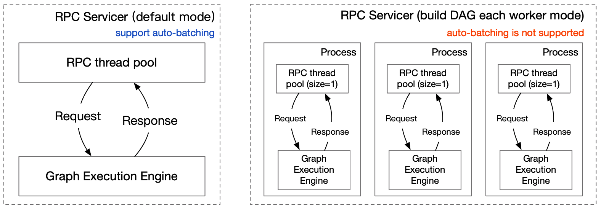

# Pipeline Serving

(简体中文|[English](PIPELINE_SERVING.md))

Paddle Serving 通常用于单模型的一键部署，但端到端的深度学习模型当前还不能解决所有问题，多个深度学习模型配合起来使用还是解决现实问题的常规手段。

Paddle Serving 提供了用户友好的多模型组合服务编程框架，Pipeline Serving，旨在降低编程门槛，提高资源使用率（尤其是GPU设备），提升整体的预估效率。


## ★ 整体架构设计

Server端基于<b>RPC服务层</b>和<b>图执行引擎</b>构建，两者的关系如下图所示。

<center>

</center>

</n>

### 1. RPC服务层

为满足用户不同的使用需求，RPC服务层同时启动1个Web服务器和1个RPC服务器，可同时处理RESTful API、gRPC 2种类型请求。gPRC gateway接收RESTful API请求通过反向代理服务器将请求转发给gRPC Service；gRPC请求由gRPC service接收，所以，2种类型的请求统一由gRPC Service处理，确保处理逻辑一致。

#### <b>1.1 proto的输入输出结构</b>

gRPC服务和gRPC gateway服务统一用service.proto生成。

```proto
message Request {
  repeated string key = 1;  
  repeated string value = 2;
  optional string name = 3;
  optional string method = 4;
  optional int64 logid = 5;
  optional string clientip = 6;
};

message Response {
  optional int32 err_no = 1;
  optional string err_msg = 2;
  repeated string key = 3;
  repeated string value = 4;
};
```
Request中`key`与`value`是配对的string数组。 `name`与`method`对应RESTful API的URL://{ip}:{port}/{name}/{method}。`logid`和`clientip`便于用户串联服务级请求和自定义策略。

Response中`err_no`和`err_msg`表达处理结果的正确性和错误信息，`key`和`value`为返回结果。


### 2. 图执行引擎

图执行引擎由 OP 和 Channel 构成，相连接的 OP 之间会共享一个 Channel。

- Channel 可以理解为一个缓冲队列。每个 OP 只接受一个 Channel 的输入和多个 Channel 的输出（每个输出相同）；一个 Channel 可以包含来自多个 OP 的输出，同一个 Channel 的数据可以作为多个 OP 的输入Channel
- 用户只需要定义 OP 间的关系，在编译期图引擎负责分析整个图的依赖关系，并声明Channel
- Request 进入图执行引擎服务后会产生一个 Request Id，Reponse 会通过 Request Id 进行对应的返回
- 对于 OP 之间需要传输过大数据的情况，可以考虑 RAM DB 外存进行全局存储，通过在 Channel 中传递索引的 Key 来进行数据传输

<center>

</center>


#### <b>2.1 OP的设计</b>

- 单个 OP 默认的功能是根据输入的 Channel 数据，访问一个 Paddle Serving 的单模型服务，并将结果存在输出的 Channel
- 单个 OP 可以支持用户自定义，包括 preprocess，process，postprocess 三个函数都可以由用户继承和实现
- 单个 OP 可以控制并发数，从而增加处理并发数
- 单个 OP 可以获取多个不同 RPC 请求的数据，以实现 Auto-Batching
- OP 可以由线程或进程启动

#### <b>2.2 Channel的设计</b>

- Channel 是 OP 之间共享数据的数据结构，负责共享数据或者共享数据状态信息
- Channel 可以支持多个OP的输出存储在同一个 Channel，同一个 Channel 中的数据可以被多个 OP 使用
- 下图为图执行引擎中 Channel 的设计，采用 input buffer 和 output buffer 进行多 OP 输入或多 OP 输出的数据对齐，中间采用一个 Queue 进行缓冲

<center>

</center>

#### <b>2.3 预测类型的设计</b>

- OP的预测类型(client_type)有3种类型，brpc、grpc和local_predictor
  - brpc: 使用bRPC Client与远端的Serving服务网络交互，性能优于grpc
  - grpc: 使用gRPC Client与远端的Serving服务网络交互，支持跨平台部署
  - local_predictor: 本地服务内加载模型并完成预测，不需要与网络交互。支持多卡部署，和TensorRT高性能预测。
  - 选型: 
    - 延时(越少越好): local_predict < brpc <= grpc
    - 微服务: brpc或grpc模型分拆成独立服务，简化开发和部署复杂度，提升资源利用率


#### <b>2.4 极端情况的考虑</b>

- 请求超时的处理

  整个图执行引擎每一步都有可能发生超时，图执行引擎里面通过设置 timeout 值来控制，任何环节超时的请求都会返回超时响应。

- Channel 存储的数据过大

  Channel 中可能会存储过大的数据，导致拷贝等耗时过高，图执行引擎里面可以通过将 OP 计算结果数据存储到外存，如高速的内存 KV 系统

- Channel 设计中的 input buffer 和 output buffer 是否会无限增加

  - 不会。整个图执行引擎的输入会放到一个 Channel 的 internal queue 里面，直接作为整个服务的流量控制缓冲队列
  - 对于 input buffer，根据计算量的情况调整 OP1 和 OP2 的并发数，使得 input buffer 来自各个输入 OP 的数量相对平衡（input buffer 的长度取决于 internal queue 中每个 item 完全 ready 的速度）
  - 对于 output buffer，可以采用和 input buffer 类似的处理方法，即调整 OP3 和 OP4 的并发数，使得 output buffer 的缓冲长度得到控制（output buffer 的长度取决于下游 OP 从 output buffer 获取数据的速度）
  - 同时 Channel 中数据量不会超过 gRPC 的 `worker_num`，即线程池大小

***

## ★ 详细设计

### 1. 普通 OP 定义

普通 OP 作为图执行引擎中的基本单元，其构造函数如下：

```python
def __init__(name=None,
             input_ops=[],
             server_endpoints=[],
             fetch_list=[],
             client_config=None,
             client_type=None,
             concurrency=1,
             timeout=-1,
             retry=1,
             batch_size=1,
             auto_batching_timeout=None,
             local_service_handler=None)
```

各参数含义如下

|        参数名         |     类型     |                  含义                             |
| :-------------------: | :---------: |:------------------------------------------------: |
|         name          |   （str）   | 用于标识 OP 类型的字符串，该字段必须全局唯一。     |
|       input_ops       |   （list）  | 当前 OP 的所有前继 OP 的列表。            |
|   server_endpoints    |   （list）  |远程 Paddle Serving Service 的 endpoints 列表。如果不设置该参数，认为是local_precditor模式，从local_service_conf中读取配置。 |
|      fetch_list       |   （list）  |远程 Paddle Serving Service 的 fetch 列表。      |
|     client_config     |   （str）   |Paddle Serving Service 对应的 Client 端配置文件路径。 |
|      client_type      |    (str)    |可选择brpc、grpc或local_predictor。local_predictor不启动Serving服务，进程内预测。 |
|      concurrency      |   （int）   | OP 的并发数。                     |
|        timeout        |   （int）   |process 操作的超时时间，单位为毫秒。若该值小于零，则视作不超时。 |
|         retry         |   （int）   |超时重试次数。当该值为 1 时，不进行重试。       |
|      batch_size       |   （int）   |进行 Auto-Batching 的期望 batch_size 大小，由于构建 batch 可能超时，实际 batch_size 可能小于设定值，默认为 1。 |
| auto_batching_timeout |  （float）  |进行 Auto-Batching 构建 batch 的超时时间，单位为毫秒。batch_size > 1时，要设置auto_batching_timeout，否则请求数量不足batch_size时会阻塞等待。 |
| local_service_handler |   (object)  |local predictor handler，Op init()入参赋值 或 在Op init()中创建|


### 2. 普通 OP二次开发接口
OP 二次开发的目的是满足业务开发人员控制OP处理策略。

|                    变量或接口                    |                             说明                             |
| :----------------------------------------------: | :----------------------------------------------------------: |
|        def preprocess(self, input_dicts)         | 对从 Channel 中获取的数据进行处理，处理完的数据将作为 **process** 函数的输入。（该函数对一个 **sample** 进行处理） |
| def process(self, feed_dict_list, typical_logid) | 基于 Paddle Serving Client 进行 RPC 预测，处理完的数据将作为 **postprocess** 函数的输入。（该函数对一个 **batch** 进行处理） |
|  def postprocess(self, input_dicts, fetch_dict)  | 处理预测结果，处理完的数据将被放入后继 Channel 中，以被后继 OP 获取。（该函数对一个 **sample** 进行处理） |
|                def init_op(self)                 |                  用于加载资源（如字典等）。                  |
|               self.concurrency_idx               |  当前进程（非线程）的并发数索引（不同种类的 OP 单独计算）。  |

OP 在一个运行周期中会依次执行 preprocess，process，postprocess 三个操作（当不设置 `server_endpoints` 参数时，不执行 process 操作），用户可以对这三个函数进行重写，默认实现如下：

```python
def preprocess(self, input_dicts):
  # multiple previous Op
  if len(input_dicts) != 1:
    raise NotImplementedError(
      'this Op has multiple previous inputs. Please override this func.'
    ）
  (_, input_dict), = input_dicts.items()
  return input_dict

def process(self, feed_dict_list, typical_logid):
  err, err_info = ChannelData.check_batch_npdata(feed_dict_list)
  if err != 0:
    raise NotImplementedError(
      "{} Please override preprocess func.".format(err_info))
  call_result = self.client.predict(
    feed=feed_dict_list, fetch=self._fetch_names, log_id=typical_logid)
  if isinstance(self.client, MultiLangClient):
    if call_result is None or call_result["serving_status_code"] != 0:
      return None
    call_result.pop("serving_status_code")
  return call_result

def postprocess(self, input_dicts, fetch_dict):
  return fetch_dict
```

**preprocess** 的参数是前继 Channel 中的数据 `input_dicts`，该变量（作为一个 **sample**）是一个以前继 OP 的 name 为 Key，对应 OP 的输出为 Value 的字典。

**process** 的参数是 Paddle Serving Client 预测接口的输入变量 `fetch_dict_list`（preprocess 函数的返回值的列表），该变量（作为一个 **batch**）是一个列表，列表中的元素为以 feed_name 为 Key，对应 ndarray 格式的数据为 Value 的字典。`typical_logid` 作为向 PaddleServingService 穿透的 logid。

**postprocess** 的参数是 `input_dicts` 和 `fetch_dict`，`input_dicts` 与 preprocess 的参数一致，`fetch_dict` （作为一个 **sample**）是 process 函数的返回 batch 中的一个 sample（如果没有执行 process ，则该值为 preprocess 的返回值）。

用户还可以对 **init_op** 函数进行重写，已加载自定义的一些资源（比如字典等），默认实现如下：

```python
def init_op(self):
  pass
```

需要**注意**的是，在线程版 OP 中，每个 OP 只会调用一次该函数，故加载的资源必须要求是线程安全的。

### 3. RequestOp 定义 与 二次开发接口

RequestOp 用于处理 Pipeline Server 接收到的 RPC 数据，处理后的数据将会被加入到图执行引擎中。其构造函数如下：

```python
def __init__(self)
```

当默认的RequestOp无法满足参数解析需求时，可通过重写下面2个接口自定义请求参数解析方法。

|                变量或接口                 |                    说明                    |
| :---------------------------------------: | :----------------------------------------: |
|             def init_op(self)             | 用于加载资源（如字典等），与普通 OP 一致。 |
| def unpack_request_package(self, request) |          处理接收到的 RPC 数据。           |

**unpack_request_package** 的默认实现是将 RPC request 中的 key 和 value 做成字典：

```python
def unpack_request_package(self, request):
  dictdata = {}
  for idx, key in enumerate(request.key):
    data = request.value[idx]
    try:
      data = eval(data)
    except Exception as e:
      pass
    dictdata[key] = data
  return dictdata
```

要求返回值是一个字典类型。

#### 4. ResponseOp 定义 与 二次开发接口

ResponseOp 用于处理图执行引擎的预测结果，处理后的数据将会作为 Pipeline Server 的RPC 返回值，其构造函数如下：

```python
def __init__(self, input_ops)
```

其中，`input_ops` 是图执行引擎的最后一个 OP，用户可以通过设置不同的 `input_ops` 以在不修改 OP 的拓扑关系下构造不同的 DAG。

当默认的 ResponseOp 无法满足结果返回格式要求时，可通过重写下面2个接口自定义返回包打包方法。

|                  变量或接口                  |                    说明                     |
| :------------------------------------------: | :-----------------------------------------: |
|              def init_op(self)               | 用于加载资源（如字典等），与普通 OP 一致。  |
| def pack_response_package(self, channeldata) | 处理图执行引擎的预测结果，作为 RPC 的返回。 |

**pack_response_package** 的默认实现是将预测结果的字典转化为 RPC response 中的 key 和 value：

```python
def pack_response_package(self, channeldata):
  resp = pipeline_service_pb2.Response()
  resp.ecode = channeldata.ecode
  if resp.ecode == ChannelDataEcode.OK.value:
    if channeldata.datatype == ChannelDataType.CHANNEL_NPDATA.value:
      feed = channeldata.parse()
      np.set_printoptions(threshold=np.nan)
      for name, var in feed.items():
        resp.value.append(var.__repr__())
        resp.key.append(name)
    elif channeldata.datatype == ChannelDataType.DICT.value:
      feed = channeldata.parse()
      for name, var in feed.items():
        if not isinstance(var, str):
          resp.ecode = ChannelDataEcode.TYPE_ERROR.value
          resp.error_info = self._log(
            "fetch var type must be str({}).".format(type(var)))
          break
        resp.value.append(var)
        resp.key.append(name)
    else:
      resp.ecode = ChannelDataEcode.TYPE_ERROR.value
      resp.error_info = self._log(
        "Error type({}) in datatype.".format(channeldata.datatype))
  else:
    resp.error_info = channeldata.error_info
  return resp
```

#### 5. PipelineServer定义

PipelineServer 的定义比较简单，如下所示：

```python
server = PipelineServer()
server.set_response_op(response_op)
server.prepare_server(config_yml_path)
server.run_server()
```

其中，`response_op` 为上面提到的 ResponseOp，PipelineServer 将会根据各个 OP 的拓扑关系初始化 Channel 并构建计算图。`config_yml_path` 为 PipelineServer 的配置文件，示例文件如下：

```yaml
# gRPC端口号
rpc_port: 18080 

# http端口号，若该值小于或等于 0 则不开启 HTTP 服务，默认为 0
http_port: 18071 

# #worker_num, 最大并发数。当build_dag_each_worker=True时, 框架会创建worker_num个进程，每个进程内构建grpcSever和DAG
worker_num: 1  

# 是否使用进程版 Servicer，默认为 false
build_dag_each_worker: false  

dag:
    # op资源类型, True, 为线程模型；False，为进程模型，默认为 True
    is_thread_op: true  

    # DAG Executor 在失败后重试次数，默认为 1，即不重试
    retry: 1  

    # 是否在 Server 端打印日志，默认为 false
    use_profile: false  

    # 跟踪框架吞吐，每个OP和channel的工作情况。无tracer时不生成数据
    tracer:
        interval_s: 600 # 监控的时间间隔，单位为秒。当该值小于 1 时不启动监控，默认为 -1

op:
    bow:
        # 并发数，is_thread_op=True时，为线程并发；否则为进程并发
        concurrency: 1

        # client连接类型，brpc
        client_type: brpc

        # Serving交互重试次数，默认不重试
        retry: 1

        # Serving交互超时时间, 单位ms
        timeout: 3000

        # Serving IPs
        server_endpoints: ["127.0.0.1:9393"]

        # bow模型client端配置
        client_config: "imdb_bow_client_conf/serving_client_conf.prototxt"

        # Fetch结果列表，以client_config中fetch_var的alias_name为准
        fetch_list: ["prediction"]

        # 批量查询Serving的数量, 默认1。batch_size>1要设置 auto_batching_timeout，否则不足batch_size时会阻塞
        batch_size: 1

        # 批量查询超时，与batch_size配合使用
        auto_batching_timeout: 2000
```

### 6. 特殊用法

#### 6.1 <b>业务自定义错误类型</b>
用户可根据业务场景自定义错误码，继承ProductErrCode，在Op的preprocess或postprocess中返回列表中返回，下一阶段处理会根据自定义错误码跳过后置OP处理。
```python
class ProductErrCode(enum.Enum):
    """
    ProductErrCode is a base class for recording business error code. 
    product developers inherit this class and extend more error codes. 
    """
    pass
```

#### <b>6.2 跳过OP process阶段</b>
preprocess返回结果列表的第二个结果是`is_skip_process=True`表示是否跳过当前OP的process阶段，直接进入postprocess处理

```python
def preprocess(self, input_dicts, data_id, log_id):
        """
        In preprocess stage, assembling data for process stage. users can 
        override this function for model feed features.
        Args:
            input_dicts: input data to be preprocessed
            data_id: inner unique id
            log_id: global unique id for RTT
        Return:
            input_dict: data for process stage
            is_skip_process: skip process stage or not, False default
            prod_errcode: None default, otherwise, product errores occured.
                          It is handled in the same way as exception. 
            prod_errinfo: "" default
        """
        # multiple previous Op
        if len(input_dicts) != 1:
            _LOGGER.critical(
                self._log(
                    "Failed to run preprocess: this Op has multiple previous "
                    "inputs. Please override this func."))
            os._exit(-1)
        (_, input_dict), = input_dicts.items()
        return input_dict, False, None, ""

```

#### <b>6.3 自定义proto Request 和 Response结构</b>

当默认proto结构不满足业务需求时，同时下面2个文件的proto的Request和Response message结构，保持一致。

> pipeline/gateway/proto/gateway.proto 

> pipeline/proto/pipeline_service.proto

再重新编译Serving Server。


#### <b>6.4 自定义URL</b>
grpc gateway处理post请求，默认`method`是`prediction`，例如:127.0.0.1:8080/ocr/prediction。用户可自定义name和method，对于已有url的服务可无缝切换

```proto
service PipelineService {
  rpc inference(Request) returns (Response) {
    option (google.api.http) = {
      post : "/{name=*}/{method=*}"
      body : "*"
    };
  }
};
```

***

## ★ 典型示例

这里通过搭建简单的 imdb model ensemble 例子来展示如何使用 Pipeline Serving，相关代码在 `python/examples/pipeline/imdb_model_ensemble` 文件夹下可以找到，例子中的 Server 端结构如下图所示：


<center>

</center>


### 1. 获取模型文件并启动 Paddle Serving Service

```shell
cd python/examples/pipeline/imdb_model_ensemble
sh get_data.sh
python -m paddle_serving_server.serve --model imdb_cnn_model --port 9292 &> cnn.log &
python -m paddle_serving_server.serve --model imdb_bow_model --port 9393 &> bow.log &
```

PipelineServing 也支持本地自动启动 PaddleServingService，请参考 `python/examples/pipeline/ocr` 下的例子。

### 2. 创建config.yaml
由于config.yaml配置信息量很多，这里仅展示OP部分配置，全量信息参考`python/examples/pipeline/imdb_model_ensemble/config.yaml`
```yaml
op:
    bow:
        # 并发数，is_thread_op=True时，为线程并发；否则为进程并发
        concurrency: 1

        # client连接类型，brpc
        client_type: brpc

        # Serving交互重试次数，默认不重试
        retry: 1

        # Serving交互超时时间, 单位ms
        timeout: 3000

        # Serving IPs
        server_endpoints: ["127.0.0.1:9393"]

        # bow模型client端配置
        client_config: "imdb_bow_client_conf/serving_client_conf.prototxt"

        # Fetch结果列表，以client_config中fetch_var的alias_name为准
        fetch_list: ["prediction"]

        # 批量查询Serving的数量, 默认1。batch_size>1要设置auto_batching_timeout，否则不足batch_size时会阻塞
        batch_size: 1

        # 批量查询超时，与batch_size配合使用
        auto_batching_timeout: 2000
    cnn:
        # 并发数，is_thread_op=True时，为线程并发；否则为进程并发
        concurrency: 1

        # client连接类型，brpc
        client_type: brpc

        # Serving交互重试次数，默认不重试
        retry: 1

        # 预测超时时间, 单位ms
        timeout: 3000

        # Serving IPs
        server_endpoints: ["127.0.0.1:9292"]

        # cnn模型client端配置
        client_config: "imdb_cnn_client_conf/serving_client_conf.prototxt"

        # Fetch结果列表，以client_config中fetch_var的alias_name为准
        fetch_list: ["prediction"]
        
        # 批量查询Serving的数量, 默认1。
        batch_size: 1

        # 批量查询超时，与batch_size配合使用
        auto_batching_timeout: 2000
    combine:
        # 并发数，is_thread_op=True时，为线程并发；否则为进程并发
        concurrency: 1

        # Serving交互重试次数，默认不重试
        retry: 1

        # 预测超时时间, 单位ms
        timeout: 3000

        # 批量查询Serving的数量, 默认1。
        batch_size: 1

        # 批量查询超时，与batch_size配合使用
        auto_batching_timeout: 2000
```

### 3. 启动 PipelineServer

代码示例中，重点留意3个自定义Op的proprocess、postprocess处理，以及Combin Op初始化列表input_ops=[bow_op, cnn_op]，设置Combin Op的前置OP列表。

```python
from paddle_serving_server.pipeline import Op, RequestOp, ResponseOp
from paddle_serving_server.pipeline import PipelineServer
from paddle_serving_server.pipeline.proto import pipeline_service_pb2
from paddle_serving_server.pipeline.channel import ChannelDataEcode
import numpy as np
from paddle_serving_app.reader import IMDBDataset

class ImdbRequestOp(RequestOp):
    def init_op(self):
        self.imdb_dataset = IMDBDataset()
        self.imdb_dataset.load_resource('imdb.vocab')

    def unpack_request_package(self, request):
        dictdata = {}
        for idx, key in enumerate(request.key):
            if key != "words":
                continue
            words = request.value[idx]
            word_ids, _ = self.imdb_dataset.get_words_and_label(words)
            dictdata[key] = np.array(word_ids)
        return dictdata


class CombineOp(Op):
    def preprocess(self, input_data):
        combined_prediction = 0
        for op_name, data in input_data.items():
            combined_prediction += data["prediction"]
        data = {"prediction": combined_prediction / 2}
        return data


read_op = ImdbRequestOp()
bow_op = Op(name="bow",
            input_ops=[read_op],
            server_endpoints=["127.0.0.1:9393"],
            fetch_list=["prediction"],
            client_config="imdb_bow_client_conf/serving_client_conf.prototxt",
            concurrency=1,
            timeout=-1,
            retry=1)
cnn_op = Op(name="cnn",
            input_ops=[read_op],
            server_endpoints=["127.0.0.1:9292"],
            fetch_list=["prediction"],
            client_config="imdb_cnn_client_conf/serving_client_conf.prototxt",
            concurrency=1,
            timeout=-1,
            retry=1)
combine_op = CombineOp(
    name="combine",
    input_ops=[bow_op, cnn_op],
    concurrency=5,
    timeout=-1,
    retry=1)

# use default ResponseOp implementation
response_op = ResponseOp(input_ops=[combine_op])

server = PipelineServer()
server.set_response_op(response_op)
server.prepare_server('config.yml')
server.run_server()
```

### 4. 通过 PipelineClient 执行预测

```python
from paddle_serving_client.pipeline import PipelineClient
import numpy as np

client = PipelineClient()
client.connect(['127.0.0.1:18080'])

words = 'i am very sad | 0'

futures = []
for i in range(3):
    futures.append(
        client.predict(
            feed_dict={"words": words},
            fetch=["prediction"],
            asyn=True))

for f in futures:
    res = f.result()
    if res["ecode"] != 0:
        print(res)
        exit(1)
```

***

## ★ 性能分析


### 1. 如何通过 Timeline 工具进行优化

为了更好地对性能进行优化，PipelineServing 提供了 Timeline 工具，对整个服务的各个阶段时间进行打点。

### 2. 在 Server 端输出 Profile 信息

Server 端用 yaml 中的 `use_profile` 字段进行控制：

```yaml
dag:
    use_profile: true
```

开启该功能后，Server 端在预测的过程中会将对应的日志信息打印到标准输出，为了更直观地展现各阶段的耗时，提供 Analyst 模块对日志文件做进一步的分析处理。

使用时先将 Server 的输出保存到文件，以 `profile.txt` 为例，脚本将日志中的时间打点信息转换成 json 格式保存到 `trace` 文件，`trace` 文件可以通过 chrome 浏览器的 tracing 功能进行可视化。

```python
from paddle_serving_server.pipeline import Analyst
import json
import sys

if __name__ == "__main__":
    log_filename = "profile.txt"
    trace_filename = "trace"
    analyst = Analyst(log_filename)
    analyst.save_trace(trace_filename)
```

具体操作：打开 chrome 浏览器，在地址栏输入 `chrome://tracing/` ，跳转至 tracing 页面，点击 load 按钮，打开保存的 `trace` 文件，即可将预测服务的各阶段时间信息可视化。

### 3. 在 Client 端输出 Profile 信息

Client 端在 `predict` 接口设置 `profile=True`，即可开启 Profile 功能。

开启该功能后，Client 端在预测的过程中会将该次预测对应的日志信息打印到标准输出，后续分析处理同 Server。

### 4. 分析方法
```
单OP耗时：
op_cost = process(pre + mid + post) 

OP期望并发数：
op_concurrency  = 单OP耗时(s) * 期望QPS

服务吞吐量：
service_throughput = 1 / 最慢OP的耗时 * 并发数

服务平响：
service_avg_cost = ∑op_concurrency 【关键路径】

Channel堆积：
channel_acc_size = QPS(down - up) * time

批量预测平均耗时：
avg_batch_cost = (N * pre + mid + post) / N 
```
