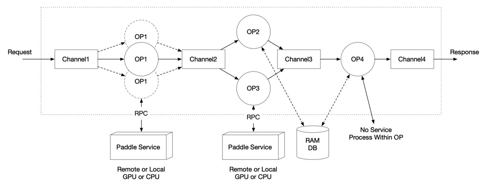

# Python Pipeline 框架设计


- [目标](#1)
- [框架设计](#2)
  - [2.1 网络层设计](#2.1)
  - [2.2 图执行引擎层](#2.2)
  - [2.3 服务日志](#2.3)
  - [2.4 错误信息](#2.4)
- [自定义信息](#3)
  - [3.1 自定义 Web 服务 URL](#3.1)
  - [3.2 自定义服务输入和输出结构](#3.2)
  - [3.3 自定义服务并发和模型配置](#3.3)
  - [3.4 自定义推理过程](#3.4)
  - [3.5 自定义业务错误类型](#3.5)


<a name="1"></a>

## 目标
为了解决多个深度学习模型组合的复杂问题，Paddle Serving 团队设计了一个通用端到端多模型组合框架，其核心特点包括:

1. 通用性：框架既要满足通用模型的输入类型，又要满足模型组合的复杂拓扑关系。
2. 高性能：与常见互联网后端服务不同，深度学习模型的推理程序属于计算密集型程序，同时 GPU 等计算芯片价格昂贵，因此在平均响应时间不苛刻的场景下，计算资源占用和吞吐量指标格外重要。
3. 高可用性：高可用的架构依赖每个服务的健壮性，服务状态可查询、异常可监控和管理是必备条件。
4. 易于开发与调试：使用 Python 语言开发可大幅提升研发效率，运行的错误信息准确帮助开发者快速定位问题。

<a name="2"></a>

## 框架设计
Python Pipeline 框架分为网络服务层和图执行引擎2部分，网络服务层处理多种网络协议请求和通用输入参数问题，图执行引擎层解决复杂拓扑关系。如下图所示

<div align=center>

</div>

<a name="2.1"></a>

**一.网络服务层**

网络服务层包括了 gRPC-gateway 和 gRPC Server。gPRC gateway 接收 HTTP 请求，打包成 proto 格式后转发给 gRPC Server，一套处理程序可同时处理 HTTP、gRPC 2种类型请求。

另外，在支持多种模型的输入输出数据类型上，使用统一的 service.proto 结构，具有更好的通用性。

```proto
message Request {
  repeated string key = 1;  
  repeated string value = 2;
  optional string name = 3;
  optional string method = 4;
  optional int64 logid = 5;
  optional string clientip = 6;
};

message Response {
  optional int32 err_no = 1;
  optional string err_msg = 2;
  repeated string key = 3;
  repeated string value = 4;
};
```
Request 是输入结构，`key` 与 `value` 是配对的 string 数组。 `name` 与 `method` 对应 URL://{ip}:{port}/{name}/{method}。`logid` 和 `clientip` 便于用户串联服务级请求和自定义策略。

Response 是输出结构，`err_no` 和 `err_msg` 表达处理结果的正确性和错误信息，`key` 和 `value` 为结果。

Pipeline 服务包装了继承于 WebService 类，以 [OCR 示例](https://github.com/PaddlePaddle/Serving/tree/develop/examples/Pipeline/PaddleOCR/ocr)为例，派生出 OcrService 类，get_pipeline_response 函数内实现 DAG 拓扑关系，默认服务入口为 read_op，函数返回的 Op 为最后一个处理，此处要求最后返回的 Op 必须唯一。

所有服务和模型的所有配置信息在 `config.yml` 中记录，URL 的 name 字段由 OcrService 初始化定义；run_service 函数启动服务。

```python
class OcrService(WebService):
    def get_pipeline_response(self, read_op):
        det_op = DetOp(name="det", input_ops=[read_op])
        rec_op = RecOp(name="rec", input_ops=[det_op])
        return rec_op

ocr_service = OcrService(name="ocr")
ocr_service.prepare_pipeline_config("config.yml")
ocr_service.run_service()
```

与网络框架相关的配置在 `config.yml` 中设置。其中 `worker_num` 表示框架主线程 gRPC 线程池工作线程数，可理解成网络同步线程并发数。

其次，`rpc_port` 和 `http_port` 是服务端口，可同时开启，不允许同时为空。
```
worker_num: 10

# http 和 gRPC 服务端口
rpc_port: 9988
http_port: 18089
```

<a name="2.2"></a>

**二.图执行引擎层**

图执行引擎的设计思路是基于有向无环图实现多模型组合的复杂拓扑关系，有向无环图由单节点或多节点串联、并联结构构成。

<div align=center>

</div>

图执行引擎抽象归纳出2种数据结构 Op 节点和 Channel 有向边，构建一条异步流水线工作流。核心概念和设计思路如下：
- Op 节点： 可理解成1个推理模型、一个处理方法，甚至是训练前向代码，可独立运行，独立设置并发度。每个 Op 节点的计算结果放入其绑定的 Channel 中。
- Channel 数据管道： 可理解为一个单向缓冲队列。每个 Channel 只接收上游 Op 节点的计算输出，作为下游 Op 节点的输入。
- 工作流：根据用户定义的节点依赖关系，图执行引擎自动生成有向无环图。每条用户请求到达图执行引擎时会生成一个唯一自增 ID，通过这种唯一性绑定关系标记流水线中的不同请求。

Op 的设计原则：
- 单个 Op 默认的功能是根据输入的 Channel 数据，访问一个 Paddle Serving 的单模型服务，并将结果存在输出的 Channel
- 单个 Op 可以支持用户自定义，包括 preprocess，process，postprocess 三个函数都可以由用户继承和实现
- 单个 Op 可以控制并发数，从而增加处理并发数
- 单个 Op 可以获取多个不同 RPC 请求的数据，以实现 Auto-Batching
- Op 可以由线程或进程启动

其构造函数如下：

```python
def __init__(name=None,
             input_ops=[],
             server_endpoints=[],
             fetch_list=[],
             client_config=None,
             client_type=None,
             concurrency=1,
             timeout=-1,
             retry=1,
             batch_size=1,
             auto_batching_timeout=None,
             local_service_handler=None)
```

各参数含义如下：

|        参数名         |     类型     |                  含义                             |
| :-------------------: | :---------: |:------------------------------------------------: |
|         name          |   （str）   | 用于标识 Op 类型的字符串，该字段必须全局唯一。     |
|       input_ops       |   （list）  | 当前 Op 的所有前继 Op 的列表。            |
|   server_endpoints    |   （list）  |远程 Paddle Serving Service 的 endpoints 列表。如果不设置该参数，认为是local_precditor模式，从local_service_conf中读取配置。 |
|      fetch_list       |   （list）  |远程 Paddle Serving Service 的 fetch 列表。      |
|     client_config     |   （str）   |Paddle Serving Service 对应的 Client 端配置文件路径。 |
|      client_type      |    (str)    |可选择brpc、grpc或local_predictor。local_predictor不启动Serving服务，进程内预测。 |
|      concurrency      |   （int）   | Op 的并发数。                     |
|        timeout        |   （int）   |process 操作的超时时间，单位为毫秒。若该值小于零，则视作不超时。 |
|         retry         |   （int）   |超时重试次数。当该值为 1 时，不进行重试。       |
|      batch_size       |   （int）   |进行 Auto-Batching 的期望 batch_size 大小，由于构建 batch 可能超时，实际 batch_size 可能小于设定值，默认为 1。 |
| auto_batching_timeout |  （float）  |进行 Auto-Batching 构建 batch 的超时时间，单位为毫秒。batch_size > 1时，要设置auto_batching_timeout，否则请求数量不足batch_size时会阻塞等待。 |
| local_service_handler |   (object) |local predictor handler，Op init() 入参赋值或在 Op init() 中创建|

对于 Op 之间需要传输过大数据的情况，可以考虑 RAM DB 外存进行全局存储，通过在 Channel 中传递索引的 Key 来进行数据传输


Channel的设计原则：
- Channel 是 Op 之间共享数据的数据结构，负责共享数据或者共享数据状态信息
- Channel 可以支持多个OP的输出存储在同一个 Channel，同一个 Channel 中的数据可以被多个 Op 使用

下图为图执行引擎中 Channel 的设计，采用 input buffer 和 output buffer 进行多 Op 输入或多 Op 输出的数据对齐，中间采用一个 Queue 进行缓冲

<div align=center>

</div>

<a name="2.3"></a>

**三.服务日志**

Pipeline 服务日志在当前目录的 `PipelineServingLogs` 目录下，有3种类型日志，分别是 `pipeline.log`、`pipeline.log.wf`、`pipeline.tracer`。
- `pipeline.log` : 记录 debug & info日志信息
- `pipeline.log.wf` : 记录 warning & error日志
- `pipeline.tracer` : 统计各个阶段耗时、channel 堆积信息

```
├── config.yml
├── get_data.sh
├── PipelineServingLogs
│   ├── pipeline.log
│   ├── pipeline.log.wf
│   └── pipeline.tracer
├── README_CN.md
├── README.md
├── uci_housing_client
│   ├── serving_client_conf.prototxt
│   └── serving_client_conf.stream.prototxt
├── uci_housing_model
│   ├── fc_0.b_0
│   ├── fc_0.w_0
│   ├── __model__
│   ├── serving_server_conf.prototxt
│   └── serving_server_conf.stream.prototxt
├── web_service_java.py
└── web_service.py
```

在服务发生异常时，错误信息会记录在 pipeline.log.wf 日志中。打印 tracer 日志要求在 config.yml 的 DAG 属性中添加 tracer 配置。

1. 日志与请求的唯一标识
Pipeline 中有2种 id 用以串联请求，分别是 data_id 和 log_id，二者区别如下：
- data_id : Pipeline 框架生成的自增 ID，标记请求唯一性标识
- log_id : 上游模块传入的标识，跟踪多个服务间串联关系，由于用户可不传入或不保证唯一性，因此不能作为唯一性标识

通常，Pipeline 框架打印的日志会同时带上 data_id 和 log_id。开启 auto-batching 后，会使用批量中的第一个 data_id 标记 batch 整体，同时框架会在一条日志中打印批量中所有 data_id。

2. 日志滚动
Pipeline 的日志模块在 `logger.py` 中定义，使用了 `logging.handlers.RotatingFileHandler` 支持磁盘日志文件的轮换。根据不同文件级别和日质量分别设置了 `maxBytes` 和 `backupCount`，当即将超出预定大小时，将关闭旧文件并打开一个新文件用于输出。

```python
"handlers": {
    "f_pipeline.log": {
        "class": "logging.handlers.RotatingFileHandler",
        "level": "INFO",
        "formatter": "normal_fmt",
        "filename": os.path.join(log_dir, "pipeline.log"),
        "maxBytes": 512000000,
        "backupCount": 20,
    },
    "f_pipeline.log.wf": {
        "class": "logging.handlers.RotatingFileHandler",
        "level": "WARNING",
        "formatter": "normal_fmt",
        "filename": os.path.join(log_dir, "pipeline.log.wf"),
        "maxBytes": 512000000,
        "backupCount": 10,
    },
    "f_tracer.log": {
        "class": "logging.handlers.RotatingFileHandler",
        "level": "INFO",
        "formatter": "tracer_fmt",
        "filename": os.path.join(log_dir, "pipeline.tracer"),
        "maxBytes": 512000000,
        "backupCount": 5,
    },
}

```

<a name="2.4"></a>

**四. 错误信息**

框架提供的错误信息如下所示， 完整信息在 `error_catch.py` 中 `CustomExceptionCode` 类中定义。

| 错误码 |  说明  |
| :---: | :-------------: |
| 0   |  成功 |
| 50 ~ 999 | 产品错误 |
| 3000 ~ 3999 | 框架内部服务错误 |
| 4000 ~ 4999 | 配置错误  |
| 5000 ~ 5999 | 用户输入错误  |
| 6000 ~ 6999 | 超时错误 | 
| 7000 ~ 7999 | 类型检查错误 |
| 8000 ~ 8999 | 内部通讯错误 |
| 9000 ~ 9999 | 推理错误 |
| 10000 ~     | 其他错误 |

具体错误信息如下：

```
class CustomExceptionCode(enum.Enum): 
    OK = 0
    PRODUCT_ERROR = 50

    NOT_IMPLEMENTED = 3000
    CLOSED_ERROR = 3001
    NO_SERVICE = 3002
    INIT_ERROR = 3003
    CONF_ERROR = 4000
    INPUT_PARAMS_ERROR = 5000
    TIMEOUT = 6000
    TYPE_ERROR = 7000
    RPC_PACKAGE_ERROR = 8000 
    CLIENT_ERROR = 9000
    UNKNOW = 10000
```

<a name="3"></a>

## 自定义信息

提供给开发者提供以下自定义信息，包括自定义 Web 服务、自定义服务输入和输出结构、自定义服务并发和模型配置和自定义推理过程
- 自定义 Web 服务 URL
- 自定义服务输入和输出结构
- 自定义服务并发和模型配置
- 自定义推理过程
- 自定义业务错误类型

<a name="3.1"></a>

**一.自定义 Web 服务 URL**

在 Web 服务中自定义服务名称是常见操作，尤其是将已有服务迁移到新框架。URL 中核心字段包括 `ip`、`port`、`name` 和 `method`，根据最新部署的环境信息设置前2个字段，重点介绍如何设置 `name` 和 `method`，框架提供默认的 `methon` 是 `prediciton`，如 `http://127.0.0.1:9999/ocr/prediction` 。

框架有2处代码与此相关，分别是 gRPC Gateway 的配置文件 `python/pipeline/gateway/proto/gateway.proto` 和 服务启动文件 `web_server.py`。

业务场景中通过设置 `name` 和 验证 `method` 解决问题。以 [OCR 示例]()为例，服务启动文件 `web_server.py` 通过类 `OcrService` 构造函数的 `name` 字段设置 URL 中 `name` 字段；
```
ocr_service = OcrService(name="ocr")
ocr_service.prepare_pipeline_config("config.yml")
ocr_service.run_service()
``` 

框架提供默认的 `methon` 是 `prediciton`，通过重载 `RequestOp::unpack_request_package` 来验证 `method`。
```
def unpack_request_package(self, request):
    dict_data = {}
    log_id = None
    if request is None:
        _LOGGER.critical("request is None")
        raise ValueError("request is None")
    if request.method is not "prediction":
        _LOGGER.critical("request method error")
        raise ValueError("request method error")      
    ...
```

在 `python/pipeline/gateway/proto/gateway.proto` 文件可以对 `name` 和 `method` 做严格限制，一般不需要修改，如需要特殊指定修改后，需要重新编译 Paddle Serving，[编译方法]()

```proto
service PipelineService {
  rpc inference(Request) returns (Response) {
    option (google.api.http) = {
      post : "/{name=*}/{method=*}"
      body : "*"
    };
  }
};
```
<a name="3.2"></a>

**二.自定义服务输入和输出结构**

输入和输出结构包括 proto 中 Request 和 Response 结构，以及 Op 前后处理返回。

当默认 proto 结构不满足业务需求时，同时下面2个文件的 proto 的 Request 和 Response message 结构，保持一致。
- pipeline/gateway/proto/gateway.proto 
- pipeline/proto/pipeline_service.proto

修改后，需要重新[编译 Paddle Serving](../Compile_CN.md)

<a name="3.3"></a>

**三.自定义服务并发和模型配置**

完整的配置信息可参考[配置信息](../Serving_Configure_CN.md)

<a name="3.4"></a>

**四.自定义推理过程**

推理 Op 为开发者提供3个外部函数接口：

|                    变量或接口                    |                             说明                             |
| :----------------------------------------------: | :----------------------------------------------------------: |
|        def preprocess(self, input_dicts)         | 对从 Channel 中获取的数据进行处理，处理完的数据将作为 **process** 函数的输入。（该函数对一个 **sample** 进行处理） |
| def process(self, feed_dict_list, typical_logid) | 基于 Paddle Serving Client 进行 RPC 预测，处理完的数据将作为 **postprocess** 函数的输入。（该函数对一个 **batch** 进行处理） |
|  def postprocess(self, input_dicts, fetch_dict)  | 处理预测结果，处理完的数据将被放入后继 Channel 中，以被后继 Op 获取。（该函数对一个 **sample** 进行处理） |
|                def init_op(self)                 |                  用于加载资源（如字典等）。                  |
|               self.concurrency_idx               |  当前进程（非线程）的并发数索引（不同种类的 Op 单独计算）。  |

Op 在一个运行周期中会依次执行 preprocess，process，postprocess 三个操作（当不设置 `server_endpoints` 参数时，不执行 process 操作），用户可以对这三个函数进行重写，默认实现如下：

```python
def preprocess(self, input_dicts):
  # multiple previous Op
  if len(input_dicts) != 1:
    raise NotImplementedError(
      'this Op has multiple previous inputs. Please override this func.'
    ）
  (_, input_dict), = input_dicts.items()
  return input_dict

def process(self, feed_dict_list, typical_logid):
  err, err_info = ChannelData.check_batch_npdata(feed_dict_list)
  if err != 0:
    raise NotImplementedError(
      "{} Please override preprocess func.".format(err_info))
  call_result = self.client.predict(
    feed=feed_dict_list, fetch=self._fetch_names, log_id=typical_logid)
  if isinstance(self.client, MultiLangClient):
    if call_result is None or call_result["serving_status_code"] != 0:
      return None
    call_result.pop("serving_status_code")
  return call_result

def postprocess(self, input_dicts, fetch_dict):
  return fetch_dict
```

**preprocess** 的参数是前继 Channel 中的数据 `input_dicts`，该变量（作为一个 **sample**）是一个以前继 Op 的 name 为 Key，对应 Op 的输出为 Value 的字典。

**process** 的参数是 Paddle Serving Client 预测接口的输入变量 `fetch_dict_list`（preprocess 函数的返回值的列表），该变量（作为一个 **batch**）是一个列表，列表中的元素为以 feed_name 为 Key，对应 ndarray 格式的数据为 Value 的字典。`typical_logid` 作为向 PaddleServingService 穿透的 logid。

**postprocess** 的参数是 `input_dicts` 和 `fetch_dict`，`input_dicts` 与 preprocess 的参数一致，`fetch_dict` （作为一个 **sample**）是 process 函数的返回 batch 中的一个 sample（如果没有执行 process ，则该值为 preprocess 的返回值）。

用户还可以对 **init_op** 函数进行重写，已加载自定义的一些资源（比如字典等），默认实现如下：

```python
def init_op(self):
  pass
```

RequestOp 和 ResponseOp 是 Python Pipeline 的中2个特殊 Op，分别是用分解 RPC 数据加入到图执行引擎中，和拿到图执行引擎的预测结果并打包 RPC 数据到客户端。
RequestOp 类的设计如下所示，核心是在 unpack_request_package 函数中解析请求数据，因此，当修改 Request 结构后重写此函数实现全新的解包处理。

|                接口                 |                    说明                    |
| :---------------------------------------: | :----------------------------------------: |
|             init_op(self)             | OP初始化，设置默认名称@DAGExecutor |
| unpack_request_package(self, request) | 解析请求数据 |

```python
class RequestOp(Op):
    def __init__(self):
        # PipelineService.name = "@DAGExecutor"
        super(RequestOp, self).__init__(name="@DAGExecutor", input_ops=[])
        # init op
        try:
            self.init_op()
        except Exception as e:
            _LOGGER.critical("Op(Request) Failed to init: {}".format(e))
            os._exit(-1)

    def unpack_request_package(self, request):
        dict_data = {}
        log_id = None
        if request is None:
            _LOGGER.critical("request is None")
            raise ValueError("request is None")

        for idx, key in enumerate(request.key):
            dict_data[key] = request.value[idx]
        log_id = request.logid
        _LOGGER.info("RequestOp unpack one request. log_id:{}, clientip:{} \
            name:{}, method:{}".format(log_id, request.clientip, request.name,
                                       request.method))

        return dict_data, log_id, None, ""
```

ResponseOp 类的设计如下所示，核心是在 pack_response_package 中打包返回结构，因此修改 Response 结构后重写此函数实现全新的打包格式。

|                  接口                  |                    说明                     |
| :------------------------------------------: | :-----------------------------------------: |
|              init_op(self)               | Op 初始化，设置默认名称 @DAGExecutor  |
| pack_response_package(self, channeldata) | 处理接收的 RPC 数据 |

```python
class ResponseOp(Op):
    def __init__(self, input_ops):
        super(ResponseOp, self).__init__(
            name="@DAGExecutor", input_ops=input_ops)
        # init op
        try:
            self.init_op()
        except Exception as e:
            _LOGGER.critical("Op(ResponseOp) Failed to init: {}".format(
                e, exc_info=True))
            os._exit(-1)
    
    def pack_response_package(self, channeldata):
        resp = pipeline_service_pb2.Response()
        error_code = channeldata.error_code
        error_info = ""
        ...  

        # pack results
        if error_code is None:
            error_code = 0
        resp.err_no = error_code
        resp.err_msg = error_info

        return resp
```
<a name="3.5"></a>

**五.自定义业务错误类型**

用户可根据业务场景自定义错误码，继承 ProductErrCode，在 Op 的 preprocess 或 postprocess 中返回列表中返回，下一阶段处理会根据自定义错误码跳过后置OP处理。
```python
class ProductErrCode(enum.Enum):
    """
    ProductErrCode is a base class for recording business error code. 
    product developers inherit this class and extend more error codes. 
    """
    pass
```

其使用方法如下所示，定义了一种错误类型 `Product_Error` ，在 `preprocess` 函数返回值中设置错误信息，在 `postprocess` 函数中也可以设置。
```python

class ProductErrCode(enum.Enum):
    """
    ProductErrCode is a base class for recording business error code. 
    product developers inherit this class and extend more error codes. 
    """
    Product_Error = 100001,

def preprocess(self, input_dicts, data_id, log_id):
    """
    In preprocess stage, assembling data for process stage. users can 
    override this function for model feed features.
    Args:
        input_dicts: input data to be preprocessed
        data_id: inner unique id
        log_id: global unique id for RTT
    Return:
        input_dict: data for process stage
        is_skip_process: skip process stage or not, False default
        prod_errcode: None default, otherwise, product errores occured.
                      It is handled in the same way as exception. 
        prod_errinfo: "" default
    """
    (_, input_dict), = input_dicts.items()
    if input_dict.get_key("product_error"):
        return input_dict, False, Product_Error, "Product Error Occured"
    return input_dict, False, None, "" 

```
