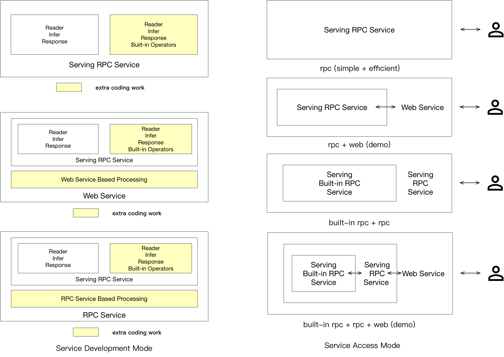
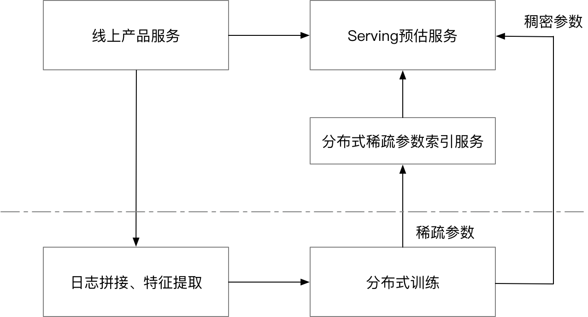
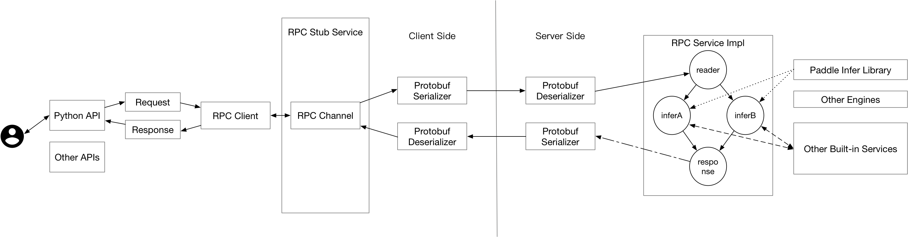
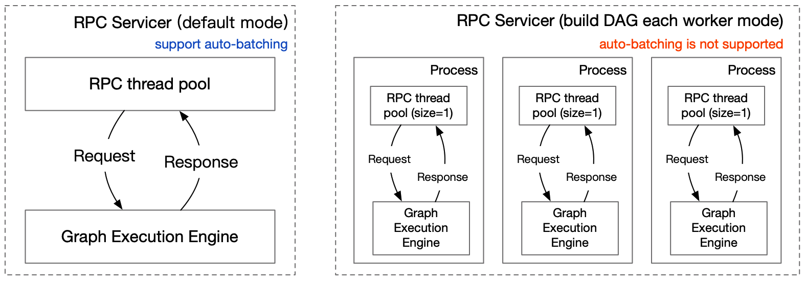

# Paddle Serving设计文档

(简体中文|[English](./Serving_Design_EN.md))

## 1. 设计目标

Paddle Serving是一个PaddlePaddle开源的在线服务框架，长期目标就是围绕着人工智能落地的最后一公里提供越来越专业、可靠、易用的服务。

- 工业级：为了达到工业级深度学习模型在线部署的要求，
Paddle Serving提供很多大规模场景需要的部署功能：1）模型管理、模型热加载、模型加解密；2）支持跨平台、多种硬件部署；3）分布式稀疏参数索引功能；4）在线A/B流量测试

- 高性能：从低延时和高吞吐2个维度思考提升模型推理的性能。1）集成Paddle Inference高性能预测引擎；2）支持Nvidia Tensor RT高性能推理引擎；3）集成高性能网络框架brpc；4）异步Pipeline模式大幅提升吞吐量

- 简单易用：为了让使用Paddle的用户能够以极低的成本部署模型，PaddleServing设计了一套与Paddle训练框架无缝打通的预测部署API，普通模型可以使用一行命令进行服务部署。20多种常见模型案例和文档。

- 功能扩展：当前，Paddle Serving支持C++、Python、Golang、Java 4种语言客户端，未来会支持更多语。在Paddle Serving的框架设计方面，尽管当前Paddle Serving以支持Paddle模型的部署为核心功能，
用户可以很容易嵌入其他的机器学习库部署在线预测。

----
## 2. 概要设计

任何优秀软件产品一定从用户需求出发，具有清晰的定位和良好的概要设计。Paddle Serving也不例外，Paddle Serving目标围绕着人工智能落地的最后一公里提供越来越专业、可靠、易用的服务。通过调研大量用户的使用场景，并将这些场景抽象归纳，例如在线服务侧重高并发，低平响；离线服务侧重批量高吞吐，高资源利用率；算法开发者擅长使用Python做模型训练和推理等。


### 2.1 设计选型
为了满足不同场景的用户需求，Paddle Serving的产品定位采用更低维度特征，如响应时间、吞吐、开发效率等，实现目标的选型和技术选型。

| 响应时间 | 吞吐 | 开发效率 | 资源利用率 | 选型 | 应用场景|
|-----|------|-----|-----|------|------|
| 低 | 最高 | 低 | 最高 |C++ Serving | 高性能场景，大型在线推荐系统召回、排序服务|
| 最高 | 较高 | 较高 |较高|Python Pipeline Serving| 兼顾吞吐和效率，单算子多模型组合场景，异步模式|
| 较高 | 低 | 较高| 低 |Python webservice| 高迭代效率场景，小型服务或需要快速迭代，模型效果验证|


性能指标说明：
1. 响应时间(ms)：单次请求平均响应时间，计算50、90、95、99分位响应时长，数值越低越好。
2. 吞吐(QPS/TPS)：服务处理请求的效率，单位时间内处理请求数量，越高越好。
3. 开发效率：使用不同开发语言完成相同工作时间不同，包括开发、调试、维护的效率等，越高越好。
4. 资源利用率：部署一个服务对资源利用率(CPU/GPU)，资源利用率低是对资源的浪费，数值越高越好。

Paddle Serving面向的用户提供RPC和HTTP两种访问协议。对于HTTP协议，我们更倾向于流量中小型的服务使用，并且对延时没有严格要求的AI服务开发者。对于RPC协议，我们面向流量较大，对延时要求更高的用户，此外RPC的客户端可能也处在一个大系统的服务中，这种情况下非常适合使用Paddle Serving提供的RPC服务。对于使用分布式稀疏参数索引服务而言，Paddle Serving的用户不需要关心底层的细节，其调用本质也是通过RPC服务再调用RPC服务。下图给出了当前设计的Paddle Serving可能会使用Serving服务的几种场景。

<p align="center">
    <br>

    <br>
<p>

对于普通的模型而言（具体指通过Serving提供的IO保存的模型，并且没有对模型进行后处理），用户使用RPC服务不需要额外的开发即可实现服务启动，但需要开发一些Client端的代码来使用服务。对于Web服务的开发，需要用户现在Paddle Serving提供的Web Service框架中进行前后处理的开发，从而实现整个HTTP服务。
  
### 2.2 工业级特性

Paddle Serving从做顶层设计时考虑到不同团队在工业级场景中会使用不同的操作系统、不同开发语言、多种硬件设备、跨深度学习平台模型转换、分布式稀疏参数索引和云上部署等一系列问题。

> 跨平台运行

跨平台是不依赖于操作系统，也不依赖硬件环境。一个操作系统下开发的应用，放到另一个操作系统下依然可以运行。因此，设计上既要考虑开发语言、组件是跨平台的，同时也要考虑不同系统上编译器的解释差异。
Docker 是一个开源的应用容器引擎，让开发者可以打包他们的应用以及依赖包到一个可移植的容器中，然后发布到任何流行的Linux机器或Windows机器上。我们将Paddle Serving框架打包了多种Docker镜像，镜像列表参考《[Docker镜像](./Docker_Images_CN.md)》，根据用户的使用场景选择镜像。为方便用户使用Docker，我们提供了帮助文档《[如何在Docker中运行PaddleServing](./Install_CN.md)》。目前，Python webservice模式可在原生系统Linux和Windows双系统上部署运行。《[Windows平台使用Paddle Serving指导](./Windows_Tutorial_CN.md)》

> 支持多种开发语言SDK

Paddle Serving提供了3种开发语言SDK，包括Python、C++、Java。Golang SDK在建设中，有兴趣的开源开发者可以提交PR。
+ Python，参考python/examples下client示例 或 4.2 web服务示例
+ C++，参考《[从零开始写一个预测服务](./C++_Serving/Creat_C++Serving_CN.md)》
+ Java，参考《[Paddle Serving Client Java SDK](./Java_SDK_CN.md)》


> 支持多种硬件设备

知名的深度学习平台的推理框架仅支持X86平台的CPU和GPU推理。随着AI算法复杂度高速增长，芯片算力大幅提升，推动物联网应用加速落地，在多种硬件上部署。Paddle Serving集成高性能推理引擎Paddle Inference和移动端推理引擎Paddle Lite，在多种硬件设备上提供推理服务。目前，除了X86 CPU、GPU外，Paddle Serving已实现ARM CPU和昆仑 XPU上部署推理服务，未来会有更多的硬件加入Paddle Serving。


> 跨深度学习平台模型转换

其他深度学习平台训练的模型，可以通过《[PaddlePaddle/X2Paddle工具](https://github.com/PaddlePaddle/X2Paddle)》将多个主流的CV模型转为Paddle模型，测试过TensorFlow、Caffe、ONNX、PyTorch模型转换。

以IMDB评论情感分析任务为例通过9步展示，Paddle Serving从模型的训练到部署预测服务的全流程《[AIStudio教程-Paddle Serving服务化部署框架](https://www.paddlepaddle.org.cn/tutorials/projectdetail/1555945)》

由于无法直接查看模型文件中feed和fetch参数信息，不方便用户拼装参数。因此，Paddle Serving开发一个工具将Paddle模型转成Serving的格式，生成包含feed和fetch参数信息的prototxt文件。下图是uci_housing示例的生成的prototxt文件，更多转换方法参考文档《[怎样保存用于Paddle Serving的模型](./Save_CN.md)》。
```
feed_var {
  name: "x"
  alias_name: "x"
  is_lod_tensor: false
  feed_type: 1
  shape: 13
}
fetch_var {
  name: "fc_0.tmp_1"
  alias_name: "price"
  is_lod_tensor: false
  fetch_type: 1
  shape: 1
}
```

> 分布式稀疏参数索引

为什么要使用Paddle Serving提供的分布式稀疏参数索引服务？1）在一些推荐场景中，模型的输入特征规模通常可以达到上千亿，单台机器无法支撑T级别模型在内存的保存，因此需要进行分布式存储。2）Paddle Serving提供的分布式稀疏参数索引服务，具有并发请求多个节点的能力，从而以较低的延时完成预估服务。
<p align="center">
    <br>

    <br>
<p>
分布式稀疏参数索引通常在广告推荐中出现，并与分布式训练配合形成完整的离线-在线一体化部署。下图解释了其中的流程，产品的在线服务接受用户请求后将请求发送给预估服务，同时系统会记录用户的请求以进行相应的训练日志处理和拼接。离线分布式训练系统会针对流式产出的训练日志进行模型增量训练，而增量产生的模型会配送至分布式稀疏参数索引服务，同时对应的稠密的模型参数也会配送至在线的预估服务。在线服务由两部分组成，一部分是针对用户的请求提取特征后，将需要进行模型的稀疏参数索引的特征发送请求给分布式稀疏参数索引服务，针对分布式稀疏参数索引服务返回的稀疏参数再进行后续深度学习模型的计算流程，从而完成预估。


----
## 3. C++ Serving设计
C++ Serving目标实现高并发、低延时的高性能推理服务。其网络框架和核心执行引擎均是基于C/C++编写，并且提供强大的工业级应用能力，包括模型管理、模型安全、A/B Testing

### 3.1 通信机制

C++ Serving采用[better-rpc](https://github.com/apache/incubator-brpc)进行底层的通信。better-rpc是百度开源的一款PRC通信库，具有高并发、低延时等特点，已经支持了包括百度在内上百万在线预估实例、上千个在线预估服务，稳定可靠。与gRPC网络框架相比，具有更低的延时，更高的并发性能；缺点是跨操作系统平台、跨语言能力不足。

### 3.2 核心执行引擎

C++ Serving的核心执行引擎是一个有向无环图，图中的每个节点代表预估服务的一个环节，例如计算模型预测打分就是其中一个环节。有向无环图有利于可并发节点充分利用部署实例内的计算资源，缩短延时。一个例子，当同一份输入需要送入两个不同的模型进行预估，并将两个模型预估的打分进行加权求和时，两个模型的打分过程即可以通过有向无环图的拓扑关系并发。
<p align="center">
    <br>

    <br>
<p>

### 3.3 模型管理与热加载

Paddle Serving的C++引擎支持模型管理功能，支持多种模型和模型不同版本的管理。为了保证在模型更换期间推理服务的可用性，需要在服务不中断的情况下对模型进行热加载。Paddle Serving对该特性进行了支持，并提供了一个监控产出模型更新本地模型的工具，具体例子请参考《[Paddle Serving中的模型热加载](./C++_Serving/Hot_Loading_CN.md)》。

### 3.4 模型加解密

Paddle Serving采用对称加密算法对模型进行加密，在服务加载模型过程中在内存中解密。目前，提供基础的模型安全能力，并不保证模型绝对安全性，用户可根据我们的设计加以完善，实现更高级别的安全性。说明文档参考《[加密模型预测](./C++_Serving/Encryption_CN.md)》

### 3.5 A/B Test

在对模型进行充分的离线评估后，通常需要进行在线A/B测试，来决定是否大规模上线服务。下图为使用Paddle Serving做A/B测试的基本结构，Client端做好相应的配置后，自动将流量分发给不同的Server，从而完成A/B测试。具体例子请参考《[如何使用Paddle Serving做ABTEST](./C++_Serving/ABTest_CN.md)》。

<p align="center">
    <br>

    <br>
<p>

### 3.6 微服务插件模式
由于Paddle Serving底层采用基于C++的通信组件，并且核心框架也是基于C/C++编写，当用户想要在服务端定义复杂的前处理与后处理逻辑时，一种办法是修改Paddle Serving底层框架，重新编译源码。另一种方式可以通过在服务端嵌入轻量级的Web服务，通过在Web服务中实现更复杂的预处理逻辑，从而搭建一套逻辑完整的服务。当访问量超过了Web服务能够接受的范围，开发者有足够的理由开发一些高性能的C++预处理逻辑，并嵌入到Serving的原生服务库中。Web服务和RPC服务的关系以及他们的组合方式可以参考下文`用户类型`中的说明。

----
## 4. Python webservice设计与使用

### 4.1 网络框架
Web服务有很多开源的框架，Paddle Serving当前集成了Flask框架，但这部分对用户不可见，在未来可能会提供性能更好的Web框架作为底层HTTP服务集成引擎。

### 4.2 web服务示例
`WebService`作为基类，提供将用户接受的HTTP请求转化为RPC输入的接口`preprocess`，同时提供对RPC请求返回的结果进行后处理的接口`postprocess`，继承`WebService`的子类，可以定义各种类型的成员函数。`WebService`的启动命令和普通RPC服务提供的启动API一致，重写preprocess和postprocess接口，实现模型预测前、预测后处理方法即可。
``` python
from paddle_serving_server.web_service import WebService
from imdb_reader import IMDBDataset
import sys


class IMDBService(WebService):
    def prepare_dict(self, args={}):
        if len(args) == 0:
            exit(-1)
        self.dataset = IMDBDataset()
        self.dataset.load_resource(args["dict_file_path"])

    def preprocess(self, feed={}, fetch=[]):
        if "words" not in feed:
            exit(-1)
        res_feed = {}
        res_feed["words"] = self.dataset.get_words_only(feed["words"])[0]
        return res_feed, fetch


imdb_service = IMDBService(name="imdb")
imdb_service.load_model_config(sys.argv[1])
imdb_service.prepare_server(
    workdir=sys.argv[2], port=int(sys.argv[3]), device="cpu")
imdb_service.prepare_dict({"dict_file_path": sys.argv[4]})
imdb_service.run_server()
```


----

## 5. Python Pipeline Serving设计
端到端的深度学习模型当前还不能解决所有问题，多个深度学习模型配合起来使用还是解决现实问题的常规手段。Paddle Serving 提供了用户友好的多模型组合服务编程框架Pipeline Serving，旨在降低编程门槛，提高资源使用率（尤其是GPU设备），提升整体的预估效率。

### 5.1 网络框架
Pipeline Serving的网络框架采用gRPC和gPRC gateway。gRPC service接收RPC请求，gPRC gateway接收RESTful API请求通过反向代理服务器将请求转发给gRPC Service。即，Pipeline Serving的网络层同时接收RPC和RESTful API。
<center>

</center>

### 5.2 核心设计与使用用例
Pipeline Serving核心设计是图执行引擎，基本处理单元是OP和Channel，通过组合实现一套有向无环图，设计与使用文档参考《[Pipeline Serving设计与实现](./Python_Pipeline/Pipeline_Design_CN.md)》
<center>

</center>

