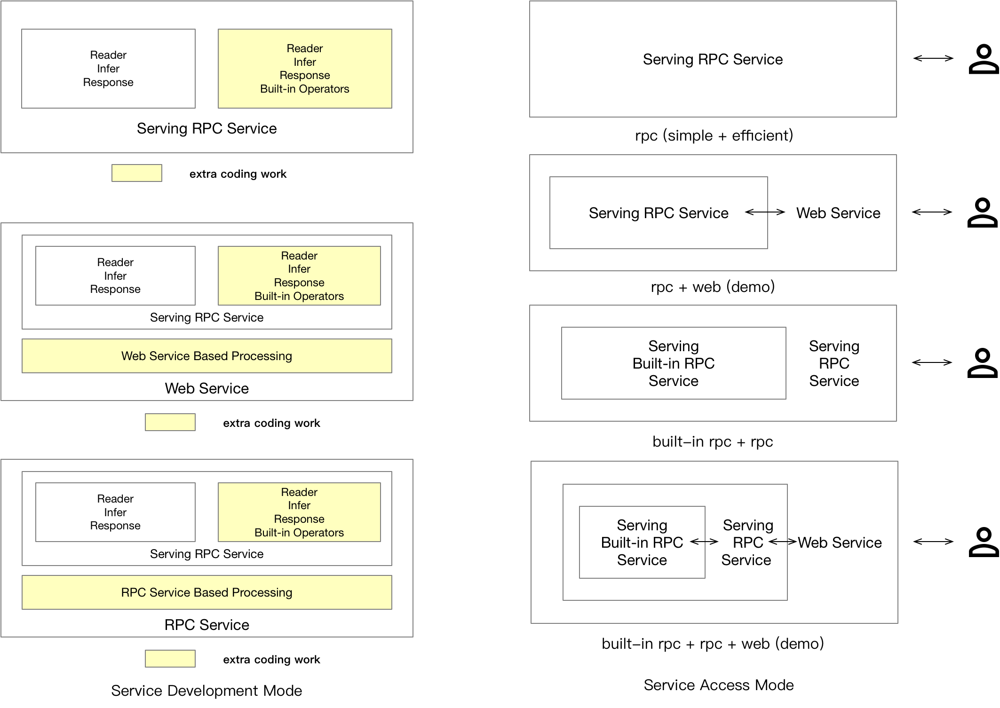

# Paddle Serving Design Doc

([简体中文](./Serving_Design_CN.md)|English)

## 1. Design Objectives

Paddle Serving is the official open source online deployment framework. The long term goal of Paddle Serving is to provide professional, reliable and easy-to-use online service to the last mile of AI application. Online deployment of deep learning models will be a user-facing application in the future. Any AI developer will face the problem of deploying an online service for his or her trained model.

- Industrial Oriented: To meet industrial deployment requirements, Paddle Serving supports lots of large-scale deployment functions: 1) Model management, model hot loading, model encryption and decryption. 2）Support cross-platform, multiple hardware deployment. 3) Distributed Sparse Embedding Indexing. 4) online A/B test
  
- High Performance: Thinking about improving the performance of model inference from the two dimensions of low latency and high throughput. 1) High-performance prediction engine Paddle Inference  is integrated. 2) Nvidia Tensor RT is supported. 3) High-performance network framework brpc is Integrated. 4) Asynchronous Pipeline mode greatly improves throughput.

- Easy-To-Use: For algorithmic developers to quickly deploy their models online, Paddle Serving designs APIs that can be used with Paddle's training process seamlessly, most Paddle models can be deployed as a service with one line command. More than 20 common model cases and documents.

- Extensibility: Paddle Serving supports C++, Python, Golang, Java four client SDK, and will support more clients with different languages. It is very easy to extend Paddle Serving to support other machine learning inference library, although currently Paddle inference library is the only official supported inference backend.

----

## 2. Preliminary Design
Any excellent software product must start from user needs, have clear positioning and good preliminary designs. Same goes for Paddle Serving, which aims to provide professional, reliable and easy-to-use online service to the last mile of AI application. By investigating the usage scenarios of a large number of users, and abstracting these scenarios, for example, online services focus on high concurrency and low response time; offline services focus on high batch throughput and high resource utilization; Algorithm developers are good at using Python for model training and inference.

### 2.1 Design selection

In order to meet the needs of users in different scenarios, Paddle Serving's product positioning adopts lower-dimensional features, such as response time, throughput, development efficiency, etc., to achieve target selection and technology selection.

| Response time | throughput | development efficiency | Resource utilization | selection | Applications|
|-----|------|-----|-----|------|------|
| Low | Highest | Low | Highest |C++ Serving | High-performance，recall and ranking services of large-scale online recommendation systems|
| Higest | Higher | Higher | Higher |Python Pipeline Serving| High-throughput, high-efficiency, asynchronous mode, fitting for single operator multi-model combination scenarios|
| Higer | Low | Higher| Low |Python webservice| High-throughput，Low-traffic services or projects that require rapid iteration, model effect verification|

Performance index description：
1. Response time (ms): Average response time of a single request, calculate the response time of 50, 90, 95, 99 quantiles, the lower the better.
2. Throughput(QPS/TPS): The efficiency of service processing requests, the number of requests processed per unit time, the higher the better.
3. Development efficiency: Using different development languages ​​to complete the same work takes different time, including the efficiency of development, debugging, and maintenance, the higher the better.
4. Resource utilization: Deploy a service to resource utilization (CPU/GPU), low resource utilization is a waste of resources, the higher the better.

Paddle Serving provides RPC and HTTP protocol for users. For HTTP service, we recommend users with median or small traffic services to use, and the latency is not a strict requirement. For RPC protocol, we recommend high traffic services and low latency required services to use. For users who use distributed sparse parameter indexing built-in service, it is not necessary to care about the underlying details of communication. The following figure gives out several scenarios that user may want to use Paddle Serving. 

<p align="center">
    <br>

    <br>
<p>

For servable models saved from Paddle Serving IO API, users do not need to do extra coding work to startup a service, but may need some coding work on the client side. For development of Web Service plugin, a user needs to provide implementation of Web Service's preprocessing and postprocessing work if needed to get a HTTP service.

### 2.2 Industrial Features

Paddle Serving takes into account a series of issues such as different operating systems, different development languages, multiple hardware devices, cross-deep learning platform model conversion, distributed sparse parameter indexing, and cloud deployment by different teams in industrial-level scenarios.

> Cross-platform operation

Cross-platform is not dependent on the operating system, nor on the hardware environment. Applications developed under one operating system can still run under another operating system. Therefore, the design should consider not only the development language and the cross-platform components, but also the interpretation differences of the compilers on different systems.

Docker is an open source application container engine that allows developers to package their applications and dependencies into a portable container, and then publish it to any popular Linux machine or Windows machine. We have packaged a variety of Docker images for the Paddle Serving framework. Refer to the image list《[Docker Images](Docker_Images_EN.md)》, Select mirrors according to user's usage. We provide Docker usage documentation《[How to run PaddleServing in Docker](Install_EN.md)》.Currently, the Python webservice mode can be deployed and run on the native Linux and Windows dual systems.《[Paddle Serving for Windows Users](Windows_Tutorial_EN.md)》

> Support multiple development languages client ​​SDKs

Paddle Serving provides 3 development language client SDKs, including Python, C++, Java, we hope that interested open source developers can help submit PR.

+ Python, Refer to the client example under python/examples or 4.2 web service example.
+ C++, Refer to《[从零开始写一个预测服务](C++_Serving/Creat_C++Serving_CN.md)》
+ Java, Refer to《[Paddle Serving Client Java SDK](Java_SDK_EN.md)》


> Support multiple hardware devices

The inference framework of the well-known deep learning platform only supports CPU and GPU inference on the X86 platform. With the rapid increase in the complexity of AI algorithms, the computing power of chips has greatly increased, which has promoted the accelerated implementation of IoT applications and deployment on a variety of hardware.Paddle Serving integrates high-performance inference engine Paddle Inference and mobile terminal inference engine Paddle Lite, Provide inference services on multiple hardware devices. At present, in addition to X86 CPU and GPU, Paddle Serving has implemented the deployment of inference services on ARM CPU and Kunlun XPU. In the future, more hardware will be added to Paddle Serving.

> Model conversion across deep learning platforms

Models trained on other deep learning platforms can be passed《[PaddlePaddle/X2Paddle工具](https://github.com/PaddlePaddle/X2Paddle)》.We convert multiple mainstream CV models to Paddle models. TensorFlow, Caffe, ONNX, PyTorch model conversion is tested.《[AIStudio教程-Paddle Serving服务化部署框架](https://www.paddlepaddle.org.cn/tutorials/projectdetail/1555945)》

Because it is impossible to directly view the feed and fetch parameter information in the model file, it is not convenient for users to assemble the parameters. Therefore, Paddle Serving developed a tool to convert the Paddle model into Serving format and generate a prototxt file containing feed and fetch parameter information. The following figure is the generated prototxt file of the uci_housing example. For more conversion methods, refer to the document《[How to save a servable model of Paddle Serving?](Save_EN.md)》.
```
feed_var {
  name: "x"
  alias_name: "x"
  is_lod_tensor: false
  feed_type: 1
  shape: 13
}
fetch_var {
  name: "fc_0.tmp_1"
  alias_name: "price"
  is_lod_tensor: false
  fetch_type: 1
  shape: 1
}
```

> Distributed Sparse Parameter Indexing

Distributed Sparse Parameter Indexing is commonly seen in advertising and recommendation scenarios, and is often used coupled with distributed training. The figure below explains a commonly seen architecture for online recommendation. When the recommendation service receives a request from a user, the system will automatically collects training log for the offline distributed online training. Mean while, the request is sent to Paddle Serving Server. For sparse features, distributed sparse parameter index service is called so that sparse parameters can be looked up. The dense input features together with the looked up sparse model parameters are fed into the Paddle Inference Node of the DAG in Paddle Serving Server. Then the score can be responsed through RPC to product service for item ranking.

<p align="center">
    <br>

    <br>
<p>

Why do we need to support distributed sparse parameter indexing in Paddle Serving? 1) In some recommendation scenarios, the number of features can be up to hundreds of billions that a single node can not hold the parameters within random access memory. 2) Paddle Serving supports distributed sparse parameter indexing that can couple with paddle inference. Users do not need to do extra work to have a low latency inference engine with hundreds of billions of parameters.

----

## 3. C++ Serving design

C++ Serving aims to achieve high-performance reasoning services with high concurrency and low latency. Its network framework and core execution engine are written based on C/C++, and provide powerful industrial-grade application capabilities, including model management, model security, and A/B Testing

### 3.1 Network Communication Mechanism
Paddle Serving adopts [brpc](https://github.com/apache/incubator-brpc) as underlying communication layer. brpc is an open-source RPC communication library with high concurrency and low latency advantages compared with other open source RPC library. Millions of instances and thousands of services are using brpc within Baidu.

### 3.2 Core Execution Engine
The core execution engine of Paddle Serving is a Directed acyclic graph(DAG). In the DAG, each node represents a phase of inference service, such as paddle inference prediction, data preprocessing and data postprocessing. DAG can fully parallelize the computation efficiency and can fully utilize the computation resources. For example, when a user has input data that needs to be feed into two models, and combine the scores of the two models, the computation of model scoring is parallelized through DAG.

<p align="center">
    <br>

    <br>
<p>

### 3.3  Model Management and Hot Reloading     
C++ Serving supports model management functions, including management of multiple models and multiple model versions.In order to ensure the availability of services, the model needs to be hot loaded without service interruption. Paddle Serving supports this feature and provides a tool for monitoring output models to update local models. Please refer to [Hot loading in Paddle Serving](C++_Serving/Hot_Loading_EN.md) for specific examples.

### 3.4 MOEDL ENCRYPTION INFERENCE
Paddle Serving uses a symmetric encryption algorithm to encrypt the model, and decrypts it in memory during the service loading model. At present, providing basic model security capabilities does not guarantee absolute model security. Users can improve them according to our design to achieve a higher level of security. Documentation reference《[MOEDL ENCRYPTION INFERENCE](C++_Serving/Encryption_EN.md)》

### 3.5 A/B Test

After sufficient offline evaluation of the model, online A/B test is usually needed to decide whether to enable the service on a large scale. The following figure shows the basic structure of A/B test with Paddle Serving. After the client is configured with the corresponding configuration, the traffic will be automatically distributed to different servers to achieve A/B test. Please refer to [ABTEST in Paddle Serving](C++_Serving/ABTest_EN.md) for specific examples.

<p align="center">
    <br>

    <br>
<p>

### 3.6 Micro service plugin
The underlying communication of Paddle Serving is implemented with C++ as well as the core framework, it is hard for users who do not familiar with C++ to implement new Paddle Serving Server Operators. Another approach is to use the light-weighted Web Service in Paddle Serving Server that can be viewed as a plugin. A user can implement complex data preprocessing and postprocessing logics to build a complex AI service. If access of the AI service has a large volumn, it is worth to implement the service with high performance Paddle Serving Server operators. The relationship between Web Service and RPC Service can be referenced in `User Type`.

----

## 4. Python Webservice Design

### 4.1 Network Communication Mechanism
There are many open source frameworks for web services. Paddle Serving currently integrates the Flask framework, but this part is not visible to users. In the future, a better-performing web framework may be provided as the underlying HTTP service integration engine.

### 4.2 Web Service Development

`WebService` is a Base Class, providing inheritable interfaces such `preprocess` and `postprocess` for users to implement. In the inherited class of `WebService` class, users can define any functions they want and the startup function interface is the same as RPC service.

``` python
from paddle_serving_server.web_service import WebService
from imdb_reader import IMDBDataset
import sys


class IMDBService(WebService):
    def prepare_dict(self, args={}):
        if len(args) == 0:
            exit(-1)
        self.dataset = IMDBDataset()
        self.dataset.load_resource(args["dict_file_path"])

    def preprocess(self, feed={}, fetch=[]):
        if "words" not in feed:
            exit(-1)
        res_feed = {}
        res_feed["words"] = self.dataset.get_words_only(feed["words"])[0]
        return res_feed, fetch


imdb_service = IMDBService(name="imdb")
imdb_service.load_model_config(sys.argv[1])
imdb_service.prepare_server(
    workdir=sys.argv[2], port=int(sys.argv[3]), device="cpu")
imdb_service.prepare_dict({"dict_file_path": sys.argv[4]})
imdb_service.run_server()
```

----

## 5. Python Pipeline Serving Design
The end-to-end deep learning model is currently unable to solve all problems. The use of multiple deep learning models together is still a conventional means to solve real-world problems.
the end-to-end deep learning model can not solve all the problems at present. Usually, it is necessary to use multiple deep learning models to solve practical problems.

### 5.1 Network Communication Mechanism
The network framework of Pipeline Serving uses gRPC and gPRC gateway. The gRPC service receives the RPC request, and the gPRC gateway receives the RESTful API request and forwards the request to the gRPC Service through the reverse proxy server. Therefore, the network layer of Pipeline Serving receives both RPC and RESTful API.
<center>

</center>

### 5.2 Core Design And Use Cases

The core design of Pipeline Serving is a graph execution engine, and the basic processing units are OP and Channel. A set of directed acyclic graphs can be realized through combination. Reference for design and use documents《[Pipeline Serving](Python_Pipeline/Pipeline_Design_EN.md)》

<center>

</center>

