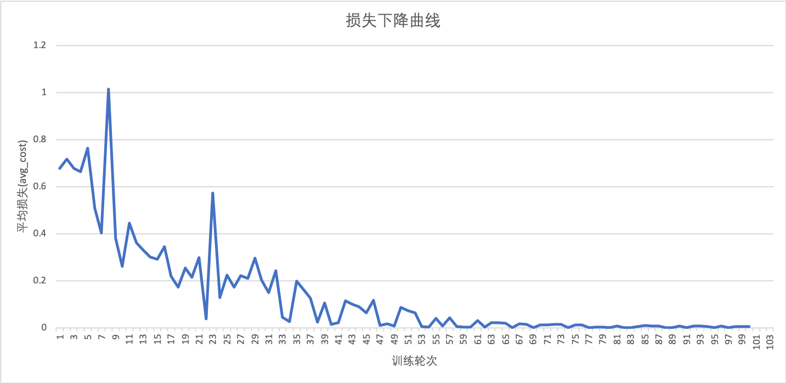

# 端到端完成从训练到部署全流程

(简体中文|[English](./TRAIN_TO_SERVICE.md))

Paddle Serving是Paddle的高性能在线预测服务框架，可以灵活支持大多数模型的部署。本文中将以IMDB评论情感分析任务为例通过9步展示从模型的训练到部署预测服务的全流程。

## Step1：准备环境

Paddle Serving可以部署在Linux环境上，目前server端支持在Centos7上部署，推荐使用[Docker部署](RUN_IN_DOCKER_CN.md)。rpc client端可以在Centos7和Ubuntu18上部署，在其他系统上或者不希望安装serving模块的环境中仍然可以通过http服务来访问server端的预测服务。

可以根据需求和机器环境来选择安装cpu或gpu版本的server模块，在client端机器上安装client模块。使用http请求的方式来访问server时，client端机器不需要安装client模块。

```shell
pip install paddle_serving_server #cpu版本server端
pip install paddle_serving_server_gpu #gpu版本server端
pip install paddle_serving_client #client端
```

简单准备后，我们将以IMDB评论情感分析任务为例，展示从模型训练到部署预测服务的流程。示例中的所有代码都可以在Paddle Serving代码库的[IMDB示例](https://github.com/PaddlePaddle/Serving/tree/develop/python/examples/imdb)中找到，示例中使用的数据和词典文件可以通过执行IMDB示例代码中的get_data.sh脚本得到。

## Step2：确定任务和原始数据格式

IMDB评论情感分析任务是对电影评论的内容进行二分类，判断该评论是属于正面评论还是负面评论。

首先我们来看一下原始的数据：

```
saw a trailer for this on another video, and decided to rent when it came out. boy, was i disappointed! the story is extremely boring, the acting (aside from christopher walken) is bad, and i couldn't care less about the characters, aside from really wanting to see nora's husband get thrashed. christopher walken's role is such a throw-away, what a tease! | 0
```

这是一条英文评论样本，样本中使用|作为分隔符，分隔符之前为评论的内容，分隔符之后是样本的标签，0代表负样本，即负面评论，1代表正样本，即正面评论。

## Step3：定义Reader，划分训练集、测试集

对于原始文本我们需要将它转化为神经网络可以使用的数字id。imdb_reader.py脚本中定义了文本id化的方法，通过词典文件imdb.vocab将单词映射为整形数。

<details>
  <summary>imdb_reader.py</summary>

```python
import sys
import os
import paddle
import re
import paddle.fluid.incubate.data_generator as dg


class IMDBDataset(dg.MultiSlotDataGenerator):
    def load_resource(self, dictfile):
        self._vocab = {}
        wid = 0
        with open(dictfile) as f:
            for line in f:
                self._vocab[line.strip()] = wid
                wid += 1
        self._unk_id = len(self._vocab)
        self._pattern = re.compile(r'(;|,|\.|\?|!|\s|\(|\))')
        self.return_value = ("words", [1, 2, 3, 4, 5, 6]), ("label", [0])

    def get_words_only(self, line):
        sent = line.lower().replace("<br />", " ").strip()
        words = [x for x in self._pattern.split(sent) if x and x != " "]
        feas = [
            self._vocab[x] if x in self._vocab else self._unk_id for x in words
        ]
        return feas

    def get_words_and_label(self, line):
        send = '|'.join(line.split('|')[:-1]).lower().replace("<br />",
                                                              " ").strip()
        label = [int(line.split('|')[-1])]

        words = [x for x in self._pattern.split(send) if x and x != " "]
        feas = [
            self._vocab[x] if x in self._vocab else self._unk_id for x in words
        ]
        return feas, label

    def infer_reader(self, infer_filelist, batch, buf_size):
        def local_iter():
            for fname in infer_filelist:
                with open(fname, "r") as fin:
                    for line in fin:
                        feas, label = self.get_words_and_label(line)
                        yield feas, label

        import paddle
        batch_iter = paddle.batch(
            paddle.reader.shuffle(
                local_iter, buf_size=buf_size),
            batch_size=batch)
        return batch_iter

    def generate_sample(self, line):
        def memory_iter():
            for i in range(1000):
                yield self.return_value

        def data_iter():
            feas, label = self.get_words_and_label(line)
            yield ("words", feas), ("label", label)

        return data_iter
```
</details>

映射之后的样本类似于以下的格式：

```
257 142 52 898 7 0 12899 1083 824 122 89527 134 6 65 47 48 904 89527 13 0 87 170 8 248 9 15 4 25 1365 4360 89527 702 89527 1 89527 240 3 28 89527 19 7 0 216 219 614 89527 0 84 89527 225 3 0 15 67 2356 89527 0 498 117 2 314 282 7 38 1097 89527 1 0 174 181 38 11 71 198 44 1 3110 89527 454 89527 34 37 89527 0 15 5912 80 2 9856 7748 89527 8 421 80 9 15 14 55 2218 12 4 45 6 58 25 89527 154 119 224 41 0 151 89527 871 89527 505 89527 501 89527 29 2 773 211 89527 54 307 90 0 893 89527 9 407 4 25 2 614 15 46 89527 89527 71 8 1356 35 89527 12 0 89527 89527 89 527 577 374 3 39091 22950 1 3771 48900 95 371 156 313 89527 37 154 296 4 25 2 217 169 3 2759 7 0 15 89527 0 714 580 11 2094 559 34 0 84 539 89527 1 0 330 355 3 0 15 15607 935 80 0 5369 3 0 622 89527 2 15 36 9 2291 2 7599 6968 2449 89527 1 454 37 256 2 211 113 0 480 218 1152 700 4 1684 1253 352 10 2449 89527 39 4 1819 129 1 316 462 29 0 12957 3 6 28 89527 13 0 457 8952 7 225 89527 8 2389 0 1514 89527 1
```

这样神经网络就可以将转化后的文本信息作为特征值进行训练。

## Step4：定义CNN网络进行训练并保存

接下来我们使用[CNN模型](https://www.paddlepaddle.org.cn/documentation/docs/zh/user_guides/nlp_case/understand_sentiment/README.cn.html#cnn)来进行训练。在nets.py脚本中定义网络结构。

<details>
  <summary>nets.py</summary>

```python
import sys
import time
import numpy as np

import paddle
import paddle.fluid as fluid

def cnn_net(data,
            label,
            dict_dim,
            emb_dim=128,
            hid_dim=128,
            hid_dim2=96,
            class_dim=2,
            win_size=3):
    """ conv net. """
    emb = fluid.layers.embedding(
        input=data, size=[dict_dim, emb_dim], is_sparse=True)

    conv_3 = fluid.nets.sequence_conv_pool(
        input=emb,
        num_filters=hid_dim,
        filter_size=win_size,
        act="tanh",
        pool_type="max")

    fc_1 = fluid.layers.fc(input=[conv_3], size=hid_dim2)

    prediction = fluid.layers.fc(input=[fc_1], size=class_dim, act="softmax")
    cost = fluid.layers.cross_entropy(input=prediction, label=label)
    avg_cost = fluid.layers.mean(x=cost)
    acc = fluid.layers.accuracy(input=prediction, label=label)

    return avg_cost, acc, prediction
```

</details>

使用训练样本进行训练，训练脚本为local_train.py。在训练结束后使用paddle_serving_client.io.save_model函数来保存部署预测服务使用的模型文件和配置文件。

<details>
  <summary>local_train.py</summary>

```python
import os
import sys
import paddle
import logging
import paddle.fluid as fluid

logging.basicConfig(format='%(asctime)s - %(levelname)s - %(message)s')
logger = logging.getLogger("fluid")
logger.setLevel(logging.INFO)

# 加载词典文件
def load_vocab(filename):
    vocab = {}
    with open(filename) as f:
        wid = 0
        for line in f:
            vocab[line.strip()] = wid
            wid += 1
    vocab["<unk>"] = len(vocab)
    return vocab


if __name__ == "__main__":
    from nets import cnn_net
    model_name = "imdb_cnn"
    vocab = load_vocab('imdb.vocab')
    dict_dim = len(vocab)
    
    #定义模型输入
    data = fluid.layers.data(
        name="words", shape=[1], dtype="int64", lod_level=1)
    label = fluid.layers.data(name="label", shape=[1], dtype="int64")
    #定义dataset，train_data为训练数据目录
    dataset = fluid.DatasetFactory().create_dataset()
    filelist = ["train_data/%s" % x for x in os.listdir("train_data")]
    dataset.set_use_var([data, label])
    pipe_command = "python imdb_reader.py"
    dataset.set_pipe_command(pipe_command)
    dataset.set_batch_size(4)
    dataset.set_filelist(filelist)
    dataset.set_thread(10)
    #定义模型
    avg_cost, acc, prediction = cnn_net(data, label, dict_dim)
    optimizer = fluid.optimizer.SGD(learning_rate=0.001)
    optimizer.minimize(avg_cost)
    #执行训练
    exe = fluid.Executor(fluid.CPUPlace())
    exe.run(fluid.default_startup_program())
    epochs = 100
		
    import paddle_serving_client.io as serving_io

    for i in range(epochs):
        exe.train_from_dataset(
            program=fluid.default_main_program(), dataset=dataset, debug=False)
        logger.info("TRAIN --> pass: {}".format(i))
        if i == 64:
            #在训练结束时使用PaddleServing中的模型保存接口保存出Serving所需的模型和配置文件
            serving_io.save_model("{}_model".format(model_name),
                                  "{}_client_conf".format(model_name),
                                  {"words": data}, {"prediction": prediction},
                                  fluid.default_main_program())
```

</details>

由上图可以看出模型的损失在第65轮之后开始收敛，我们在第65轮训练完成后保存模型和配置文件。保存的文件分为imdb_cnn_client_conf和imdb_cnn_model文件夹，前者包含client端的配置文件，后者包含server端的配置文件和保存的模型文件。
save_model函数的参数列表如下：

| 参数                 | 含义                                                         |
| -------------------- | ------------------------------------------------------------ |
| server_model_folder  | 保存server端配置文件和模型文件的目录                         |
| client_config_folder | 保存client端配置文件的目录                                   |
| feed_var_dict        | 用于预测的模型的输入，dict类型，key可以自定义，value为模型中的input variable，每个key对应一个variable，使用预测服务时，输入数据使用key作为输入的名称 |
| fetch_var_dict       | 用于预测的模型的输出，dict类型，key可以自定义，value为模型中的input variable，每个key对应一个variable，使用预测服务时，通过key来获取返回数据 |
| main_program         | 模型的program                                                |

## Step5：部署RPC预测服务

Paddle Serving框架支持两种预测服务方式，一种是通过RPC进行通信，一种是通过HTTP进行通信，下面将先介绍RPC预测服务的部署和使用方法，在Step8开始介绍HTTP预测服务的部署和使用。

```shell
python -m paddle_serving_server.serve --model imdb_cnn_model/ --port 9292 #cpu预测服务
python -m paddle_serving_server_gpu.serve --model imdb_cnn_model/ --port 9292 --gpu_ids 0 #gpu预测服务
```

命令中参数--model 指定在之前保存的server端的模型和配置文件目录，--port指定预测服务的端口，当使用gpu版本部署gpu预测服务时可以使用--gpu_ids指定使用的gpu 。

执行完以上命令之一，就完成了IMDB 情感分析任务的RPC预测服务部署。

## Step6:复用Reader，定义远程RPC客户端
下面我们通过Python代码来访问RPC预测服务，脚本为test_client.py

<details>
  <summary>test_client.py</summary>

```python
from paddle_serving_client import Client
from imdb_reader import IMDBDataset
import sys

client = Client()
client.load_client_config(sys.argv[1])
client.connect(["127.0.0.1:9292"])

#在这里复用了数据预处理部分的代码将原始文本转换成数字id
imdb_dataset = IMDBDataset()
imdb_dataset.load_resource(sys.argv[2])

for line in sys.stdin:
    word_ids, label = imdb_dataset.get_words_and_label(line)
    feed = {"words": word_ids}
    fetch = ["acc", "cost", "prediction"]
    fetch_map = client.predict(feed=feed, fetch=fetch)
    print("{} {}".format(fetch_map["prediction"][1], label[0]))
```

</details>

脚本从标准输入接收数据，并打印出样本预测为1的概率与真实的label。

## Step7：调用RPC服务，测试模型效果

以上一步实现的客户端为例运行预测服务，使用方式如下：

```shell
cat test_data/part-0 | python test_client.py imdb_lstm_client_conf/serving_client_conf.prototxt imdb.vocab
```

使用test_data/part-0文件中的2084个样本进行测试测试，模型预测的准确率为88.19%。

**注意**：每次模型训练的效果可能略有不同，使用训练出的模型预测的准确率会与示例中接近但有可能不完全一致。

## Step8：部署HTTP预测服务

使用HTTP预测服务时，client端不需要安装Paddle Serving的任何模块，仅需要能发送HTTP请求即可。当然HTTP的通信方式会相较于RPC的通信方式在通信阶段消耗更多的时间。

对于IMDB情感分析任务原始文本在预测之前需要进行预处理，在RPC预测服务中我们将预处理放在client的脚本中，而在HTTP预测服务中我们将预处理放在server端。Paddle Serving的HTTP预测服务框架为这种情况准备了数据预处理和后处理的接口，我们只要根据任务需要重写即可。

Serving提供了示例代码，通过执行[IMDB示例](https://github.com/PaddlePaddle/Serving/tree/develop/python/examples/imdb)中的imdb_web_service_demo.sh脚本来获取。

下面我们来看一下启动HTTP预测服务的脚本text_classify_service.py。

<details>
  <summary>text_clssify_service.py</summary>

```python
from paddle_serving_server.web_service import WebService
from imdb_reader import IMDBDataset
import sys

#继承框架中的WebService类
class IMDBService(WebService):
    def prepare_dict(self, args={}):
        if len(args) == 0:
            exit(-1)
        self.dataset = IMDBDataset()
        self.dataset.load_resource(args["dict_file_path"])
        
		#重写preprocess方法来实现数据预处理，这里也复用了训练时使用的reader脚本
    def preprocess(self, feed={}, fetch=[]):
        if "words" not in feed:
            exit(-1)
        res_feed = {}
        res_feed["words"] = self.dataset.get_words_only(feed["words"])[0]
        return res_feed, fetch

#这里需要使用name参数指定预测服务的名称，
imdb_service = IMDBService(name="imdb")
imdb_service.load_model_config(sys.argv[1])
imdb_service.prepare_server(
    workdir=sys.argv[2], port=int(sys.argv[3]), device="cpu")
imdb_service.prepare_dict({"dict_file_path": sys.argv[4]})
imdb_service.run_server()
```
</details>

启动命令

```shell
python text_classify_service.py imdb_cnn_model/ workdir/ 9292 imdb.vocab
```

以上命令中参数1为保存的server端模型和配置文件，参数2为工作目录会保存一些预测服务工作时的配置文件，该目录可以不存在但需要指定名称，预测服务会自行创建，参数3为端口号，参数4为词典文件。

## Step9：明文数据调用预测服务
启动完HTTP预测服务，即可通过一行命令进行预测：

```
curl -H "Content-Type:application/json" -X POST -d '{"feed":[{"words": "i am very sad | 0"}], "fetch":["prediction"]}' http://127.0.0.1:9292/imdb/prediction
```
预测流程正常时，会返回预测概率，示例如下。

```
{"result":{"prediction":[[0.4389057457447052,0.561094343662262]]}}
```

**注意**：每次模型训练的效果可能略有不同，使用训练出的模型预测概率数值可能与示例不一致。
