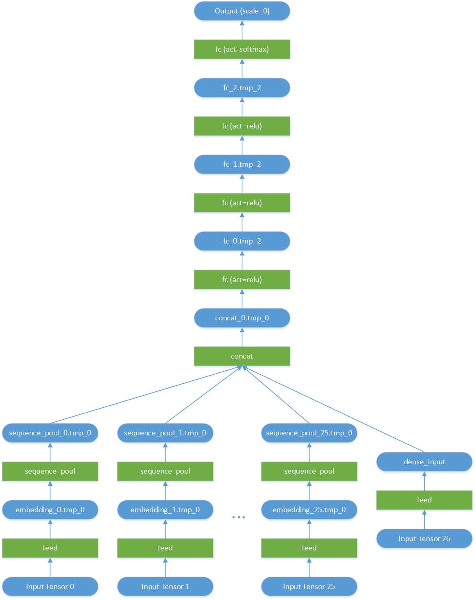

# CTR预估模型

## 1. 背景

在搜索、推荐、在线广告等业务场景中，embedding参数的规模常常非常庞大，达到数百GB甚至T级别；训练如此规模的模型需要用到多机分布式训练能力，将参数分片更新和保存；另一方面，训练好的模型，要应用于在线业务，也难以单机加载。Paddle Serving提供大规模稀疏参数读写服务，用户可以方便地将超大规模的稀疏参数以kv形式托管到参数服务，在线预测只需将所需要的参数子集从参数服务读取回来，再执行后续的预测流程。

我们以CTR预估模型为例，演示Paddle Serving中如何使用大规模稀疏参数服务。关于模型细节请参考[原始模型](https://github.com/PaddlePaddle/models/tree/v1.5/PaddleRec/ctr)

根据[对数据集的描述](https://www.kaggle.com/c/criteo-display-ad-challenge/data)，该模型原始输入为13维integer features和26维categorical features。在我们的模型中，13维integer feature作为dense feature整体feed到一个data layer，而26维categorical features各自作为一个feature分别feed到一个data layer。除此之外，为计算auc指标，还将label作为一个feature输入。

若按缺省训练参数，本模型的embedding dim为100w，size为10，也就是参数矩阵为1000000 x 10的float型矩阵，实际占用内存共1000000 x 10 x sizeof(float) = 39MB；**实际场景中，embedding参数要大的多；因此该demo仅为演示使用**。


## 2. 模型裁剪

在写本文档时([v1.5](https://github.com/PaddlePaddle/models/tree/v1.5))，训练脚本用PaddlePaddle py_reader加速样例读取速度，program中带有py_reader相关OP，且训练过程中只保存了模型参数，没有保存program，保存的参数没法直接用预测库加载；另外原始网络中最终输出的tensor是auc和batch_auc，而实际模型用于预测时只需要每个样例的predict，需要改掉模型的输出tensor为predict。再有，为了演示稀疏参数服务的使用，我们要有意将embedding layer包含的lookup_table OP从预测program中拿掉，以embedding layer的output variable作为网络的输入，然后再添加对应的feed OP，使得我们能够在预测时从稀疏参数服务获取到embedding向量后，将数据直接feed到各个embedding的output variable。

基于以上几方面考虑，我们需要对原始program进行裁剪。大致过程为：

1) 去掉py_reader相关代码，改为用fluid自带的reader和DataFeed
2) 修改原始网络配置，将predict变量作为fetch target
3) 修改原始网络配置，将26个稀疏参数的embedding layer的output作为feed target，以与后续稀疏参数服务配合使用
4) 修改后的网络，本地train 1个batch后，调用`fluid.io.save_inference_model()`，获得裁剪后的模型program
5) 裁剪后的program，用python再次处理，去掉embedding layer的lookup_table OP。这是因为，当前Paddle Fluid在第4步`save_inference_model()`时没有裁剪干净，还保留了embedding的lookup_table OP；如果这些OP不去除掉，那么embedding的output variable就会有2个输入OP：一个是feed OP（我们要添加的），一个是lookup_table；而lookup_table又没有输入，它的输出会与feed OP的输出互相覆盖，导致错乱。另外网络中还保留了SparseFeatFactors这个variable(全局共享的embedding矩阵对应的变量)，这个variable也要去掉，否则网络加载时还会尝试从磁盘读取embedding参数，就失去了我们这个demo的意义。
6) 第4步拿到的program，与分布式训练保存的模型参数（除embedding之外）保存到一起，形成完整的预测模型

第1) - 第5)步裁剪完毕后的模型网络配置如下：




整个裁剪过程具体说明如下：

### 2.1 网络配置中去除py_reader

Inference program调用ctr_dnn_model()函数时添加`user_py_reader=False`参数。这会在ctr_dnn_model定义中将py_reader相关的代码去掉

修改前：
```python
def train():
    args = parse_args()

    if not os.path.isdir(args.model_output_dir):
        os.mkdir(args.model_output_dir)

    loss, auc_var, batch_auc_var, py_reader, _ = ctr_dnn_model(args.embedding_size, args.sparse_feature_dim)
    ...
```

修改后：
```python
def train():
    args = parse_args()

    if not os.path.isdir(args.model_output_dir):
        os.mkdir(args.model_output_dir)

    loss, auc_var, batch_auc_var, py_reader, _ = ctr_dnn_model(args.embedding_size, args.sparse_feature_dim, use_py_reader=False)
    ...
```


### 2.2 网络配置中修改feed targets和fetch targets

如第2节开头所述，为了使program适合于演示稀疏参数的使用，我们要裁剪program，将`ctr_dnn_model`中feed variable list和fetch variable分别改掉：

1) Inference program中26维稀疏特征的输入改为每个特征的embedding layer的output variable
2) fetch targets中返回的是predict，取代auc_var和batch_auc_var

截至写本文时，原始的网络配置 (network_conf.py中)`ctr_dnn_model`定义如下：

```python
def ctr_dnn_model(embedding_size, sparse_feature_dim, use_py_reader=True):

    def embedding_layer(input):
        emb = fluid.layers.embedding(
            input=input,
            is_sparse=True,
            # you need to patch https://github.com/PaddlePaddle/Paddle/pull/14190
            # if you want to set is_distributed to True
            is_distributed=False,
            size=[sparse_feature_dim, embedding_size],
            param_attr=fluid.ParamAttr(name="SparseFeatFactors",
                                       initializer=fluid.initializer.Uniform()))
        return fluid.layers.sequence_pool(input=emb, pool_type='average')    # 需修改1

    dense_input = fluid.layers.data(
        name="dense_input", shape=[dense_feature_dim], dtype='float32')

    sparse_input_ids = [
        fluid.layers.data(name="C" + str(i), shape=[1], lod_level=1, dtype='int64')
        for i in range(1, 27)]

    label = fluid.layers.data(name='label', shape=[1], dtype='int64')

    words = [dense_input] + sparse_input_ids + [label]

    py_reader = None
    if use_py_reader:
        py_reader = fluid.layers.create_py_reader_by_data(capacity=64,
                                                          feed_list=words,
                                                          name='py_reader',
                                                          use_double_buffer=True)
        words = fluid.layers.read_file(py_reader)

    sparse_embed_seq = list(map(embedding_layer, words[1:-1]))              # 需修改2
    concated = fluid.layers.concat(sparse_embed_seq + words[0:1], axis=1)

    fc1 = fluid.layers.fc(input=concated, size=400, act='relu',
                          param_attr=fluid.ParamAttr(initializer=fluid.initializer.Normal(
                              scale=1 / math.sqrt(concated.shape[1]))))
    fc2 = fluid.layers.fc(input=fc1, size=400, act='relu',
                          param_attr=fluid.ParamAttr(initializer=fluid.initializer.Normal(
                              scale=1 / math.sqrt(fc1.shape[1]))))
    fc3 = fluid.layers.fc(input=fc2, size=400, act='relu',
                          param_attr=fluid.ParamAttr(initializer=fluid.initializer.Normal(
                              scale=1 / math.sqrt(fc2.shape[1]))))
    predict = fluid.layers.fc(input=fc3, size=2, act='softmax',
                              param_attr=fluid.ParamAttr(initializer=fluid.initializer.Normal(
                                  scale=1 / math.sqrt(fc3.shape[1]))))

    cost = fluid.layers.cross_entropy(input=predict, label=words[-1])
    avg_cost = fluid.layers.reduce_sum(cost)
    accuracy = fluid.layers.accuracy(input=predict, label=words[-1])
    auc_var, batch_auc_var, auc_states = \
        fluid.layers.auc(input=predict, label=words[-1], num_thresholds=2 ** 12, slide_steps=20)

    return avg_cost, auc_var, batch_auc_var, py_reader, words              # 需修改3
```

修改后

```python
def ctr_dnn_model(embedding_size, sparse_feature_dim, use_py_reader=True):
    def embedding_layer(input):
        emb = fluid.layers.embedding(
            input=input,
            is_sparse=True,
            # you need to patch https://github.com/PaddlePaddle/Paddle/pull/14190
            # if you want to set is_distributed to True
            is_distributed=False,
            size=[sparse_feature_dim, embedding_size],
            param_attr=fluid.ParamAttr(name="SparseFeatFactors",
                                       initializer=fluid.initializer.Uniform()))
        seq = fluid.layers.sequence_pool(input=emb, pool_type='average')
        return emb, seq                                                   # 对应上文修改处1
    dense_input = fluid.layers.data(
        name="dense_input", shape=[dense_feature_dim], dtype='float32')
    sparse_input_ids = [
        fluid.layers.data(name="C" + str(i), shape=[1], lod_level=1, dtype='int64')
        for i in range(1, 27)]
    label = fluid.layers.data(name='label', shape=[1], dtype='int64')
    words = [dense_input] + sparse_input_ids + [label]
    sparse_embed_and_seq = list(map(embedding_layer, words[1:-1]))
    
    emb_list = [x[0] for x in sparse_embed_and_seq]                       # 对应上文修改处2
    sparse_embed_seq = [x[1] for x in sparse_embed_and_seq]
    
    concated = fluid.layers.concat(sparse_embed_seq + words[0:1], axis=1)
    
    train_feed_vars = words                                              # 对应上文修改处2
    inference_feed_vars = emb_list + words[0:1]
    
    fc1 = fluid.layers.fc(input=concated, size=400, act='relu',
                          param_attr=fluid.ParamAttr(initializer=fluid.initializer.Normal(
                              scale=1 / math.sqrt(concated.shape[1]))))
    fc2 = fluid.layers.fc(input=fc1, size=400, act='relu',
                          param_attr=fluid.ParamAttr(initializer=fluid.initializer.Normal(
                              scale=1 / math.sqrt(fc1.shape[1]))))
    fc3 = fluid.layers.fc(input=fc2, size=400, act='relu',
                          param_attr=fluid.ParamAttr(initializer=fluid.initializer.Normal(
                              scale=1 / math.sqrt(fc2.shape[1]))))
    predict = fluid.layers.fc(input=fc3, size=2, act='softmax',
                              param_attr=fluid.ParamAttr(initializer=fluid.initializer.Normal(
                                  scale=1 / math.sqrt(fc3.shape[1]))))
    cost = fluid.layers.cross_entropy(input=predict, label=words[-1])
    avg_cost = fluid.layers.reduce_sum(cost)
    accuracy = fluid.layers.accuracy(input=predict, label=words[-1])
    auc_var, batch_auc_var, auc_states = \
        fluid.layers.auc(input=predict, label=words[-1], num_thresholds=2 ** 12, slide_steps=20)
    fetch_vars = [predict]
    
    # 对应上文修改处3
    return avg_cost, auc_var, batch_auc_var, train_feed_vars, inference_feed_vars, fetch_vars
```

说明：

1) 修改处1，我们将embedding layer的输出变量返回
2) 修改处2，我们将embedding layer的输出变量保存到`emb_list`，后者进一步保存到`inference_feed_vars`，用来将来在`save_inference_model()`时指定feed variable list。
3) 修改处3，我们将`words`变量作为训练时的feed variable list (`train_feed_vars`)，将embedding layer的output variable作为infer时的feed variable list (`inference_feed_vars`)，将`predict`作为fetch target (`fetch_vars`)，分别返回。`inference_feed_vars`和`fetch_vars`用于`fluid.io.save_inference_model()`时指定feed variable list和fetch target list


### 2.3 fluid.io.save_inference_model()保存裁剪后的program

`fluid.io.save_inference_model()`不仅保存模型参数，还能够根据feed variable list和fetch target list参数，对program进行裁剪，形成适合inference用的program。大致原理是，根据前向网络配置，从fetch target list开始，反向查找其所依赖的OP列表，并将每个OP的输入加入目标variable list，再次递归地反向找到所有依赖OP和variable list。

在2.2节中我们已经拿到所需的`inference_feed_vars`和`fetch_vars`，接下来只要在训练过程中每次保存模型参数时改为调用`fluid.io.save_inference_model()`：

修改前：

```python
def train_loop(args, train_program, py_reader, loss, auc_var, batch_auc_var,
               trainer_num, trainer_id):
    
...省略
    for pass_id in range(args.num_passes):
        pass_start = time.time()
        batch_id = 0
        py_reader.start()

        try:
            while True:
                loss_val, auc_val, batch_auc_val = pe.run(fetch_list=[loss.name, auc_var.name, batch_auc_var.name])
                loss_val = np.mean(loss_val)
                auc_val = np.mean(auc_val)
                batch_auc_val = np.mean(batch_auc_val)

                logger.info("TRAIN --> pass: {} batch: {} loss: {} auc: {}, batch_auc: {}"
                      .format(pass_id, batch_id, loss_val/args.batch_size, auc_val, batch_auc_val))
                if batch_id % 1000 == 0 and batch_id != 0:
                    model_dir = args.model_output_dir + '/batch-' + str(batch_id)
                    if args.trainer_id == 0:
                        fluid.io.save_persistables(executor=exe, dirname=model_dir,
                                                   main_program=fluid.default_main_program())
                batch_id += 1
        except fluid.core.EOFException:
            py_reader.reset()
        print("pass_id: %d, pass_time_cost: %f" % (pass_id, time.time() - pass_start))
...省略
```

修改后

```python
def train_loop(args,
               train_program,
               train_feed_vars,
               inference_feed_vars,  # 裁剪program用的feed variable list
               fetch_vars,           # 裁剪program用的fetch variable list
               loss,
               auc_var,
               batch_auc_var,
               trainer_num,
               trainer_id):
    # 因为已经将py_reader去掉，这里用fluid自带的DataFeeder
    dataset = reader.CriteoDataset(args.sparse_feature_dim)
    train_reader = paddle.batch(
        paddle.reader.shuffle(
            dataset.train([args.train_data_path], trainer_num, trainer_id),
            buf_size=args.batch_size * 100),
        batch_size=args.batch_size)
    
    inference_feed_var_names = [var.name for var in inference_feed_vars]
    
    place = fluid.CPUPlace()
    exe = fluid.Executor(place)
    exe.run(fluid.default_startup_program())
    total_time = 0
    pass_id = 0
    batch_id = 0

    feed_var_names = [var.name for var in feed_vars]
    feeder = fluid.DataFeeder(feed_var_names, place)

    for data in train_reader():
        loss_val, auc_val, batch_auc_val = exe.run(fluid.default_main_program(),
                                            feed = feeder.feed(data),
                                            fetch_list=[loss.name, auc_var.name, batch_auc_var.name])
        fluid.io.save_inference_model(model_dir,
                                      inference_feed_var_names,
                                      fetch_vars,
                                      exe,
                                      fluid.default_main_program())
        break # 我们只要裁剪后的program，不需要模型参数，因此只train一个batch就停止了
    loss_val = np.mean(loss_val)
    auc_val = np.mean(auc_val)
    batch_auc_val = np.mean(batch_auc_val)
    logger.info("TRAIN --> pass: {} batch: {} loss: {} auc: {}, batch_auc: {}"
                      .format(pass_id, batch_id, loss_val/args.batch_size, auc_val, batch_auc_val))
```

### 2.4 用python再次处理inference program，去除lookup_table OP和SparseFeatFactors变量

这一步是因为`fluid.io.save_inference_model()`裁剪出的program没有将lookup_table OP去除。未来如果`save_inference_model`接口完善，本节可跳过

主要代码：

```python
def prune_program():
    args = parse_args()
    
    # 从磁盘打开网络配置文件并反序列化成protobuf message
    model_dir = args.model_output_dir + "/inference_only"
    model_file = model_dir + "/__model__"
    with open(model_file, "rb") as f:
        protostr = f.read()
    f.close()
    proto = framework_pb2.ProgramDesc.FromString(six.binary_type(protostr))
    
    # 去除lookup_table OP
    block = proto.blocks[0]
    kept_ops = [op for op in block.ops if op.type != "lookup_table"]
    del block.ops[:]
    block.ops.extend(kept_ops)
    
    # 去除SparseFeatFactors var
    kept_vars = [var for var in block.vars if var.name != "SparseFeatFactors"]
    del block.vars[:]
    block.vars.extend(kept_vars)
    
    # 写回磁盘文件
    with open(model_file + ".pruned", "wb") as f:
        f.write(proto.SerializePartialToString())
    f.close()
    with open(model_file + ".prototxt.pruned", "w") as f:
        f.write(text_format.MessageToString(proto))
    f.close()
```

### 2.5 裁剪过程串到一起

我们提供了完整的裁剪CTR预估模型的脚本文件save_program.py，同[CTR分布式训练和Serving流程化部署](https://github.com/PaddlePaddle/Serving/blob/master/doc/DEPLOY.md)一起发布，可以在trainer和pserver容器的训练脚本目录下找到，也可以在[这里](https://github.com/PaddlePaddle/Serving/tree/master/doc/resource)下载。

## 3. 整个预测计算流程

Client端：
1) Dense feature: 从dataset每条样例读取13个integer features，形成1个dense feature
2) Sparse feature: 从dataset每条样例读取26个categorical feature，分别经过hash(str(feature_index) + feature_string)签名，得到每个feature的id，形成26个sparse feature

Serving端:
1) Dense feature: dense feature共13个float型数字，一起feed到网络dense_input这个variable对应的LodTensor
2) Sparse feature: 26个sparse feature id，分别访问kv服务获取对应的embedding向量，feed到对应的26个embedding layer的output variable。在我们裁剪出来的网络中，这些variable分别对应的变量名为embedding_0.tmp_0, embedding_1.tmp_0, ... embedding_25.tmp_0
3) 执行预测，获取预测结果。
