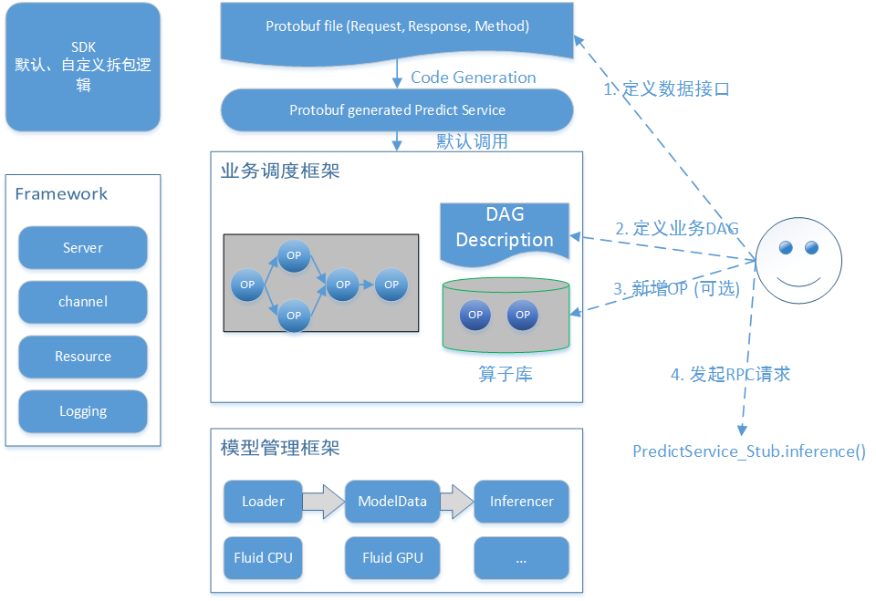
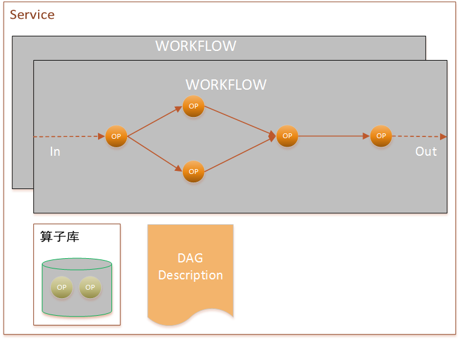
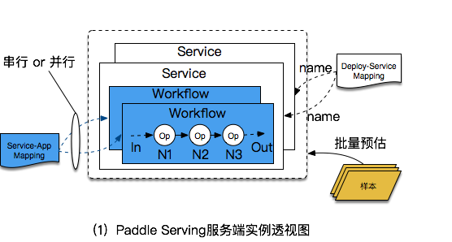

# Paddle Serving Design

([简体中文](./DESIGN_CN.md)|English)

## 1. Background

PaddlePaddle is the Baidu's open source machine learning framework, which supports a wide range of customized development of deep learning models; Paddle serving is the online prediction framework of Paddle, which seamlessly connects with Paddle model training, and provides cloud services for machine learning prediction. This article will describe the Paddle Serving design from the bottom up, from the model, service, and access levels.

1. The model is the core of Paddle Serving prediction, including the management of model data and inference calculations;
2. Prediction framework encapsulation model for inference calculations, providing external RPC interface to connect different upstream
3. The prediction service SDK provides a set of access frameworks

The result is a complete serving solution.

## 2. Terms explanation

- **baidu-rpc**: Baidu's official open source RPC framework, supports multiple common communication protocols, and provides a custom interface experience based on protobuf
- **Variant**: Paddle Serving architecture is an abstraction of a minimal prediction cluster, which is characterized by all internal instances (replicas) being completely homogeneous and logically corresponding to a fixed version of a model
- **Endpoint**: Multiple Variants form an Endpoint. Logically, Endpoint represents a model, and Variants within the Endpoint represent different versions.
- **OP**: PaddlePaddle is used to encapsulate a numerical calculation operator, Paddle Serving is used to represent a basic business operation operator, and the core interface is inference. OP configures its dependent upstream OP to connect multiple OPs into a workflow
- **Channel**: An abstraction of all request-level intermediate data of the OP; data exchange between OPs through Channels
- **Bus**: manages all channels in a thread, and schedules the access relationship between the two sets of OP and Channel according to the DAG dependency graph between DAGs
- **Stage**: Workflow according to the topology diagram described by DAG, a collection of OPs that belong to the same link and can be executed in parallel
- **Node**: An OP operator instance composed of an OP operator class combined with parameter configuration, which is also an execution unit in Workflow
- **Workflow**: executes the inference interface of each OP in order according to the topology described by DAG
- **DAG/Workflow**: consists of several interdependent Nodes. Each Node can obtain the Request object through a specific interface. The node Op obtains the output object of its pre-op through the dependency relationship. The output of the last Node is the Response object by default.
- **Service**: encapsulates a pv request, can configure several Workflows, reuse the current PV's Request object with each other, and then execute each in parallel/serial execution, and finally write the Response to the corresponding output slot; a Paddle-serving process Multiple sets of Service interfaces can be configured. The upstream determines the Service interface currently accessed based on the ServiceName.

## 3. Python Interface Design

### 3.1 Core Targets:

A set of Paddle Serving dynamic library, support the remote estimation service of the common model saved by Paddle, and call the various underlying functions of PaddleServing through the Python Interface.

### 3.2 General Model:

Models that can be predicted using the Paddle Inference Library, models saved during training, including Feed Variable and Fetch Variable

### 3.3 Overall design:

- The user starts the Client and Server through the Python Client. The Python API has a function to check whether the interconnection and the models to be accessed match.
- The Python API calls the pybind corresponding to the client and server functions implemented by Paddle Serving, and the information transmitted through RPC is implemented through RPC.
- The Client Python API currently has two simple functions, load_inference_conf and predict, which are used to perform loading of the model to be predicted and prediction, respectively.
- The Server Python API is mainly responsible for loading the inference model and generating various configurations required by Paddle Serving, including engines, workflow, resources, etc.

### 3.4 Server Inferface


### 3.5 Client Interface


### 3.6 Client io used during Training

PaddleServing is designed to saves the model interface that can be used during the training process, which is basically the same as the Paddle save inference model interface, feed_var_dict and fetch_var_dict
You can alias the input and output variables. The configuration that needs to be read when the serving starts is saved in the client and server storage directories.

``` python
def save_model(server_model_folder,
               client_config_folder,
               feed_var_dict,
               fetch_var_dict,
               main_program=None)
```

## 4. Paddle Serving Underlying Framework



**Model Management Framework**: Connects model files of multiple machine learning platforms and provides a unified inference interface
**Business Scheduling Framework**: Abstracts the calculation logic of various different inference models, provides a general DAG scheduling framework, and connects different operators through DAG diagrams to complete a prediction service together. This abstract model allows users to conveniently implement their own calculation logic, and at the same time facilitates operator sharing. (Users build their own forecasting services. A large part of their work is to build DAGs and provide operators.)
**Predict Service**: Encapsulation of the externally provided prediction service interface. Define communication fields with the client through protobuf.

### 4.1 Model Management Framework

The model management framework is responsible for managing the models trained by the machine learning framework. It can be abstracted into three levels: model loading, model data, and model reasoning.

#### Model Loading

Load model from disk to memory, support multi-version, hot-load, incremental update, etc.

#### Model data

Model data structure in memory, integrated fluid inference lib

#### inferencer

it provided united inference interface for upper layers

```C++
class FluidFamilyCore {
  virtual bool Run(const void* in_data, void* out_data);
  virtual int create(const std::string& data_path);
  virtual int clone(void* origin_core);
};
```

### 4.2 Business Scheduling Framework

#### 4.2.1 Inference Service

With reference to the abstract idea of model calculation of the TensorFlow framework, the business logic is abstracted into a DAG diagram, driven by configuration, generating a workflow, and skipping C ++ code compilation. Each specific step of the service corresponds to a specific OP. The OP can configure the upstream OP that it depends on. Unified message passing between OPs is achieved by the thread-level bus and channel mechanisms. For example, the service process of a simple prediction service can be abstracted into 3 steps including reading request data-> calling the prediction interface-> writing back the prediction result, and correspondingly implemented to 3 OP: ReaderOp-> ClassifyOp-> WriteOp



Regarding the dependencies between OPs, and the establishment of workflows through OPs, you can refer to [从零开始写一个预测服务](CREATING.md) (simplified Chinese Version)

Server instance perspective




#### 4.2.2 Paddle Serving Multi-Service Mechanism


Paddle Serving instances can load multiple models at the same time, and each model uses a Service (and its configured workflow) to undertake services. You can refer to [service configuration file in Demo example](../../tools/cpp_examples/demo-serving/conf/service.prototxt) to learn how to configure multiple services for the serving instance

#### 4.2.3 Hierarchical relationship of business scheduling

From the client's perspective, a Paddle Serving service can be divided into three levels: Service, Endpoint, and Variant from top to bottom.


One Service corresponds to one inference model, and there is one endpoint under the model. Different versions of the model are implemented through multiple variant concepts under endpoint:
The same model prediction service can configure multiple variants, and each variant has its own downstream IP list. The client code can configure relative weights for each variant to achieve the relationship of adjusting the traffic ratio (refer to the description of variant_weight_list in [Client Configuration](../CLIENT_CONFIGURE.md) section 3.2).


## 5. User Interface

Under the premise of meeting certain interface specifications, the service framework does not make any restrictions on user data fields to meet different business interfaces of various forecast services. Baidu-rpc inherits the interface of Protobuf serice, and the user describes the Request and Response business interfaces according to the Protobuf syntax specification. Paddle Serving is built on the Baidu-rpc framework and supports this feature by default.

No matter how the communication protocol changes, the framework only needs to ensure that the communication protocol between the client and server and the format of the business data are synchronized to ensure normal communication. This information can be broken down as follows:

-Protocol: Header information agreed in advance between Server and Client to ensure mutual recognition of data format. Paddle Serving uses Protobuf as the basic communication format
-Data: Used to describe the interface of Request and Response, such as the sample data to be predicted, and the score returned by the prediction. include:
   -Data fields: Field definitions included in the two data structures of Request and Return.
   -Description interface: similar to the protocol interface, it supports Protobuf by default

### 5.1 Data Compression Method

Baidu-rpc has built-in data compression methods such as snappy, gzip, zlib, which can be configured in the configuration file (refer to [Client Configuration](../CLIENT_CONFIGURE.md) Section 3.1 for an introduction to compress_type)

### 5.2 C ++ SDK API Interface

```C++
class PredictorApi {
 public:
  int create(const char* path, const char* file);
  int thrd_initialize();
  int thrd_clear();
  int thrd_finalize();
  void destroy();

  Predictor* fetch_predictor(std::string ep_name);
  int free_predictor(Predictor* predictor);
};

class Predictor {
 public:
  // synchronize interface
  virtual int inference(google::protobuf::Message* req,
                        google::protobuf::Message* res) = 0;

  // asynchronize interface
  virtual int inference(google::protobuf::Message* req,
                        google::protobuf::Message* res,
                        DoneType done,
                        brpc::CallId* cid = NULL) = 0;

  // synchronize interface
  virtual int debug(google::protobuf::Message* req,
                    google::protobuf::Message* res,
                    butil::IOBufBuilder* debug_os) = 0;
};

```

### 5.3 Inferfaces related to Op

```C++
class Op {
  // ------Getters for Channel/Data/Message of dependent OP-----

  // Get the Channel object of dependent OP
  Channel* mutable_depend_channel(const std::string& op);

  // Get the Channel object of dependent OP
  const Channel* get_depend_channel(const std::string& op) const;

  template <typename T>
  T* mutable_depend_argument(const std::string& op);

  template <typename T>
  const T* get_depend_argument(const std::string& op) const;

  // -----Getters for Channel/Data/Message of current OP----

  // Get pointer to the progobuf message of current OP
  google::protobuf::Message* mutable_message();

  // Get pointer to the protobuf message of current OP
  const google::protobuf::Message* get_message() const;

  // Get the template class data object of current OP
  template <typename T>
  T* mutable_data();

  // Get the template class data object of current OP
  template <typename T>
  const T* get_data() const;

  // ---------------- Other base class members ----------------

  int init(Bus* bus,
           Dag* dag,
           uint32_t id,
           const std::string& name,
           const std::string& type,
           void* conf);

  int deinit();


  int process(bool debug);

  // Get the input object
  const google::protobuf::Message* get_request_message();

  const std::string& type() const;

  uint32_t id() const;

  // ------------------ OP Interface -------------------

  // Get the derived Channel object of current OP
  virtual Channel* mutable_channel() = 0;

  // Get the derived Channel object of current OP
  virtual const Channel* get_channel() const = 0;

  // Release the derived Channel object of current OP
  virtual int release_channel() = 0;

  // Inference interface
  virtual int inference() = 0;

  // ------------------ Conf Interface -------------------
  virtual void* create_config(const configure::DAGNode& conf) { return NULL; }

  virtual void delete_config(void* conf) {}

  virtual void set_config(void* conf) { return; }

  // ------------------ Metric Interface -------------------
  virtual void regist_metric() { return; }
};

```


### 5.4 Interfaces related to framework

Service

```C++
class InferService {
 public:
  static const char* tag() { return "service"; }
  int init(const configure::InferService& conf);
  int deinit() { return 0; }
  int reload();
  const std::string& name() const;
  const std::string& full_name() const { return _infer_service_format; }

  // Execute each workflow serially
  virtual int inference(const google::protobuf::Message* request,
                        google::protobuf::Message* response,
                        butil::IOBufBuilder* debug_os = NULL);

  int debug(const google::protobuf::Message* request,
            google::protobuf::Message* response,
            butil::IOBufBuilder* debug_os);

};

class ParallelInferService : public InferService {
 public:
  // Execute workflows in parallel
  int inference(const google::protobuf::Message* request,
                google::protobuf::Message* response,
                butil::IOBufBuilder* debug_os) {
    return 0;
  }
};
```
ServerManager

```C++
class ServerManager {
 public:
  typedef google::protobuf::Service Service;
  ServerManager();

  static ServerManager& instance() {
    static ServerManager server;
    return server;
  }
  static bool reload_starting() { return _s_reload_starting; }
  static void stop_reloader() { _s_reload_starting = false; }
  int add_service_by_format(const std::string& format);
  int start_and_wait();
};
```

DAG

```C++
class Dag {
 public:
  EdgeMode parse_mode(std::string& mode);  // NOLINT

  int init(const char* path, const char* file, const std::string& name);

  int init(const configure::Workflow& conf, const std::string& name);

  int deinit();

  uint32_t nodes_size();

  const DagNode* node_by_id(uint32_t id);

  const DagNode* node_by_id(uint32_t id) const;

  const DagNode* node_by_name(std::string& name);  // NOLINT

  const DagNode* node_by_name(const std::string& name) const;

  uint32_t stage_size();

  const DagStage* stage_by_index(uint32_t index);

  const std::string& name() const { return _dag_name; }

  const std::string& full_name() const { return _dag_name; }

  void regist_metric(const std::string& service_name);
};
```

Workflow

```C++
class Workflow {
 public:
  Workflow() {}
  static const char* tag() { return "workflow"; }

  // Each workflow object corresponds to an independent
  // configure file, so you can share the object between
  // different apps.
  int init(const configure::Workflow& conf);

  DagView* fetch_dag_view(const std::string& service_name);

  int deinit() { return 0; }

  void return_dag_view(DagView* view);

  int reload();

  const std::string& name() { return _name; }

  const std::string& full_name() { return _name; }
};
```
