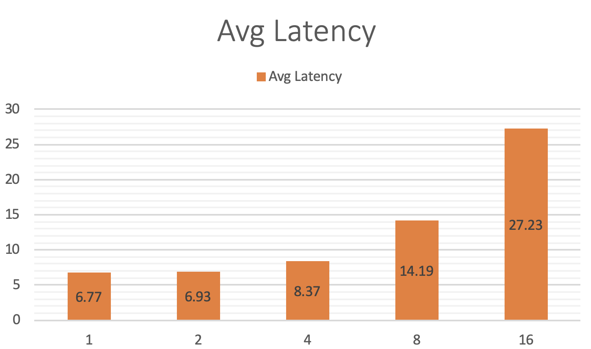
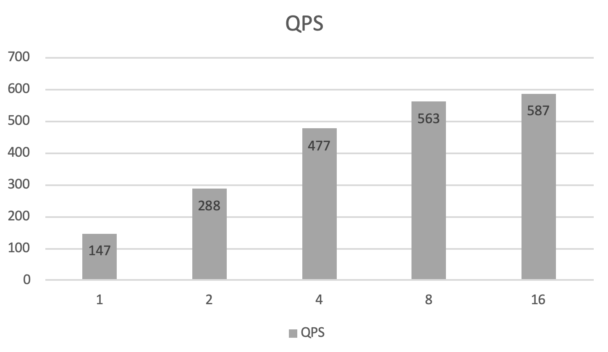

## Criteo CTR with Sparse Parameter Indexing Service

([简体中文](./README_CN.md)|English)

### Get Sample Dataset

go to directory `examples/C++/PaddleRec/criteo_ctr_with_cube`
```
sh get_data.sh
```

### Download Model and Sparse Parameter Sequence Files
```
wget https://paddle-serving.bj.bcebos.com/unittest/ctr_cube_unittest.tar.gz
tar xf ctr_cube_unittest.tar.gz
mv models/ctr_client_conf ./
mv models/ctr_serving_model_kv ./
mv models/data ./cube/
```
the model will be in ./ctr_server_model_kv and ./ctr_client_config.

### Start Sparse Parameter Indexing Service
```
wget https://paddle-serving.bj.bcebos.com/others/cube_app.tar.gz
tar xf cube_app.tar.gz
mv cube_app/cube* ./cube/
sh cube_prepare.sh &
```

Here, the sparse parameter is loaded by cube sparse parameter indexing service Cube.

### Start RPC Predictor, the number of serving thread is 4（configurable in test_server.py）

```
python3 test_server.py ctr_serving_model_kv 
```

### Run Prediction

```
python3 test_client.py ctr_client_conf/serving_client_conf.prototxt ./raw_data
```

### Benchmark

CPU ：Intel(R) Xeon(R) CPU 6148 @ 2.40GHz 

Model ：[Criteo CTR](./network_conf.py)

server core/thread num ： 4/8

Run
```
bash benchmark.sh
```
1000 batches will be sent by every client

| client  thread num | prepro | client infer | op0    | op1   | op2    | postpro | avg_latency | qps   |
| ------------------ | ------ | ------------ | ------ | ----- | ------ | ------- | ----- | ----- |
| 1                  | 0.035  | 1.596        | 0.021  | 0.518 | 0.0024 | 0.0025  | 6.774 | 147.7 |
| 2                  | 0.034  | 1.780        | 0.027  | 0.463 | 0.0020 | 0.0023  | 6.931 | 288.3 |
| 4                  | 0.038  | 2.954        | 0.025  | 0.455 | 0.0019 | 0.0027  | 8.378 | 477.5 |
| 8                  | 0.044  | 8.230        | 0.028  | 0.464 | 0.0023 | 0.0034  | 14.191 | 563.8 |
| 16                 | 0.048  | 21.037       | 0.028  | 0.455 | 0.0025 | 0.0041  | 27.236 | 587.5 |

the average latency of threads



The QPS is 


