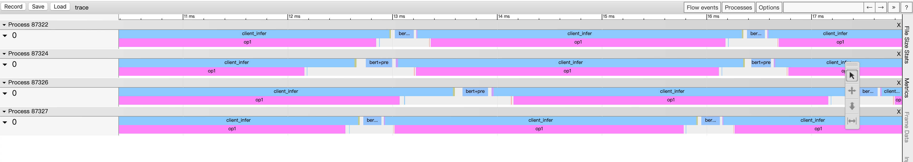

## Timeline工具使用

(简体中文|[English](./README.md))

serving框架中内置了预测服务中各阶段时间打点的功能，在client端通过环境变量来控制是否开启，开启后会将打点信息输出到屏幕。
```
export FLAGS_profile_client=1 #开启client端各阶段时间打点
export FLAGS_profile_server=1 #开启server端各阶段时间打点
```
开启该功能后，client端在预测的过程中会将对应的日志信息打印到标准输出。

为了更直观地展现各阶段的耗时，提供脚本对日志文件做进一步的分析处理。

使用时先将client的输出保存到文件，以profile为例。
```
python3 show_profile.py profile ${thread_num}
```
这里thread_num参数为client运行时的进程数，脚本将按照这个参数来计算各阶段的平均耗时。

脚本将计算各阶段的耗时，并除以线程数做平均，打印到标准输出。

```
python3 timeline_trace.py profile trace
```
脚本将日志中的时间打点信息转换成json格式保存到trace文件，trace文件可以通过chrome浏览器的tracing功能进行可视化。

具体操作：打开chrome浏览器，在地址栏输入chrome://tracing/，跳转至tracing页面，点击load按钮，打开保存的trace文件，即可将预测服务的各阶段时间信息可视化。

效果如下图，图中展示了使用[bert示例](../C++/PaddleNLP/bert)的GPU预测服务，server端开启4卡预测，client端启动4进程，batch size为1时的各阶段timeline，其中bert_pre代表client端的数据预处理阶段，client_infer代表client完成预测请求的发送和接收结果的阶段，图中的process代表的是client的进程号，每个进进程的第二行展示的是server各个op的timeline。


