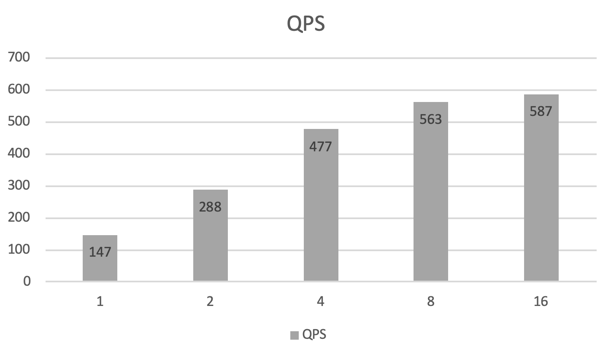

## 带稀疏参数服务器的CTR预测服务

### 获取样例数据
```
sh get_data.sh
```

### 保存模型和配置文件
```
python local_train.py
```
执行脚本后会在当前目录生成ctr_server_model和ctr_client_config文件夹,以及ctr_server_model_kv, ctr_client_conf_kv。

### 启动稀疏参数服务器
```
cp ../../../build_server/core/predictor/seq_generator seq_generator
cp ../../../build_server/output/bin/cube* ./cube/
cp ../../../build_server/core/cube/cube-api/cube-cli ./cube/
sh cube_prepare.sh &
```

### 启动RPC预测服务

```
python test_server.py ctr_serving_model_kv 
```

### 执行预测

```
python test_client.py ctr_client_conf/serving_client_conf.prototxt ./raw_data
```

### Benchmark

设备 ：Intel(R) Xeon(R) CPU E5-2640 v3 @ 2.60GHz 

模型 ：[Criteo CTR](https://github.com/PaddlePaddle/Serving/blob/develop/python/examples/ctr_criteo_with_cube/network_conf.py)

server thread num ： 16

执行
```
bash benchmark.sh
```
客户端每个线程会发送1000个batch

| client  thread num | prepro | client infer | op0    | op1   | op2    | postpro | avg_cost | qps   |
| ------------------ | ------ | ------------ | ------ | ----- | ------ | ------- | ----- | ----- |
| 1                  | 0.027  | 1.582        | 0.019  | 0.856 | 0.0024 | 0.0019  | 5.984 | 167.4 |
| 2                  | 0.028  | 1.674        | 0.021  | 0.870 | 0.0020 | 0.0021  | 6.305 | 311.7 |
| 4                  | 0.031  | 1.810        | 0.021  | 0.878 | 0.0039 | 0.0023  | 6.597 | 608.3 |
| 8                  | 0.043  | 3.185        | 0.023  | 0.929 | 0.0026 | 0.0029  | 9.312 | 806.5 |
| 16                 | 0.055  | 11.641       | 0.028  | 1.244 | 0.0042 | 0.0039  | 18.993 | 862.0 |

平均每个线程耗时图如下


每个线程QPS耗时如下


