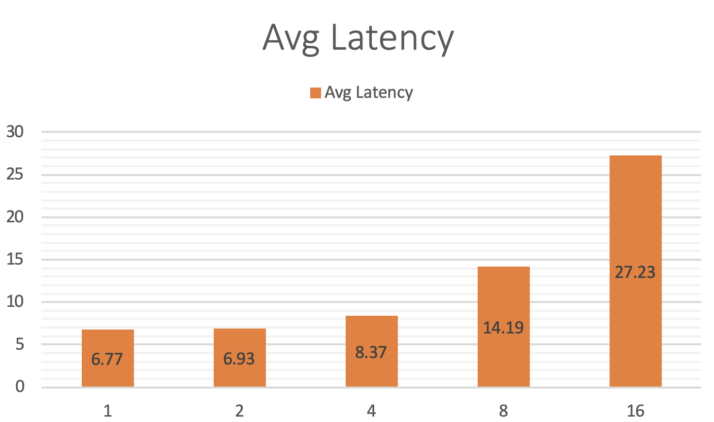

## 带稀疏参数索引服务的CTR预测服务
(简体中文|[English](./README.md))

### 获取样例数据
进入目录 `python/examples/criteo_ctr_with_cube`
```
sh get_data.sh
```

### 下载模型和稀疏参数序列文件
```
wget https://paddle-serving.bj.bcebos.com/unittest/ctr_cube_unittest.tar.gz
tar xf ctr_cube_unittest.tar.gz
mv models/ctr_client_conf ./
mv models/ctr_serving_model_kv ./
mv models/data ./cube/
```
执行脚本后会在当前目录有ctr_server_model_kv和ctr_client_config文件夹。

### 启动稀疏参数索引服务
```
wget https://paddle-serving.bj.bcebos.com/others/cube_app.tar.gz
tar xf cube_app.tar.gz
mv cube_app/cube* ./cube/
sh cube_prepare.sh &
```

此处，模型当中的稀疏参数会被存放在稀疏参数索引服务Cube当中。

### 启动RPC预测服务，服务端线程数为4（可在test_server.py配置）

```
python test_server.py ctr_serving_model_kv 
```

### 执行预测

```
python test_client.py ctr_client_conf/serving_client_conf.prototxt ./raw_data
```

### Benchmark

设备 ：Intel(R) Xeon(R) CPU 6148 @ 2.40GHz 

模型 ：[Criteo CTR](https://github.com/PaddlePaddle/Serving/blob/develop/python/examples/criteo_ctr_with_cube/network_conf.py)

server core/thread num ： 4/8

执行
```
bash benchmark.sh
```
客户端每个线程会发送1000个batch

| client  thread num | prepro | client infer | op0    | op1   | op2    | postpro | avg_latency | qps   |
| ------------------ | ------ | ------------ | ------ | ----- | ------ | ------- | ----- | ----- |
| 1                  | 0.035  | 1.596        | 0.021  | 0.518 | 0.0024 | 0.0025  | 6.774 | 147.7 |
| 2                  | 0.034  | 1.780        | 0.027  | 0.463 | 0.0020 | 0.0023  | 6.931 | 288.3 |
| 4                  | 0.038  | 2.954        | 0.025  | 0.455 | 0.0019 | 0.0027  | 8.378 | 477.5 |
| 8                  | 0.044  | 8.230        | 0.028  | 0.464 | 0.0023 | 0.0034  | 14.191 | 563.8 |
| 16                 | 0.048  | 21.037       | 0.028  | 0.455 | 0.0025 | 0.0041  | 27.236 | 587.5 |

平均每个线程耗时图如下



每个线程QPS耗时如下


