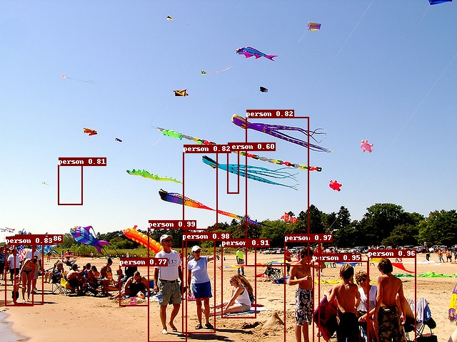

# 使用Paddle Serving部署Faster RCNN模型

(简体中文|[English](./README.md))

## 获得Faster RCNN模型
```
wget https://paddle-serving.bj.bcebos.com/pddet_demo/faster_rcnn_model.tar.gz
wget https://paddle-serving.bj.bcebos.com/pddet_demo/infer_cfg.yml
```
如果你想要更多的检测模型，请参考[Paddle检测模型库](https://github.com/PaddlePaddle/PaddleDetection/blob/release/0.2/docs/MODEL_ZOO_cn.md)

### 启动服务
```
tar xf faster_rcnn_model.tar.gz
mv faster_rcnn_model/pddet* ./
GLOG_v=2 python -m paddle_serving_server_gpu.serve --model pddet_serving_model --port 9494 --gpu_ids 0
```

### 执行预测
```
python test_client.py pddet_client_conf/serving_client_conf.prototxt infer_cfg.yml 000000570688.jpg
```

## 3. 结果分析
<p align="center">
    <br>

    <br>
<p>
这是输入图片
  
<p align="center">
    <br>

    <br>
<p>
这是实现添加了bbox之后的图片，可以看到客户端已经为图片做好了后处理，此外在output/bbox.json也有各个框的编号和坐标信息。
