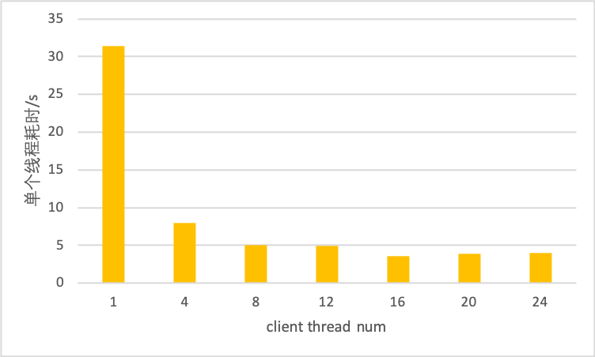

## IMDB评论情绪预测服务

(简体中文|[English](./README.md))

### 获取模型文件和样例数据

```
sh get_data.sh
```
脚本会下载和解压出cnn、lstm和bow三种模型的配置文文件以及test_data和train_data。

### 启动RPC预测服务

```
python -m paddle_serving_server.serve --model imdb_cnn_model/ --port 9292
```
### 执行预测
```
head test_data/part-0 | python test_client.py imdb_cnn_client_conf/serving_client_conf.prototxt imdb.vocab
```
预测test_data/part-0的前十个样例。

### 启动HTTP预测服务
```
python text_classify_service.py imdb_cnn_model/ workdir/ 9292 imdb.vocab
```
### 执行预测

```
curl -H "Content-Type:application/json" -X POST -d '{"words": "i am very sad | 0", "fetch":["prediction"]}' http://127.0.0.1:9292/imdb/prediction
```

### Benchmark

设备 ：Intel(R) Xeon(R)  Gold 6271 CPU @ 2.60GHz * 48

模型 ：[CNN](https://github.com/PaddlePaddle/Serving/blob/develop/python/examples/imdb/nets.py)

server thread num ： 16

测试中，client共发送25000条测试样本，图中数据为单个线程的耗时，时间单位为秒。可以看出，client端多线程的预测速度相比单线程有明显提升，在16线程时预测速度是单线程的8.7倍。

| client  thread num | prepro | client infer | op0    | op1   | op2    | postpro | total |
| ------------------ | ------ | ------------ | ------ | ----- | ------ | ------- | ----- |
| 1                  | 1.09   | 28.79        | 0.094  | 20.59 | 0.047  | 0.034   | 31.41 |
| 4                  | 0.22   | 7.41         | 0.023  | 5.01  | 0.011  | 0.0098  | 8.01  |
| 8                  | 0.11   | 4.7          | 0.012  | 2.61  | 0.0062 | 0.0049  | 5.01  |
| 12                 | 0.081  | 4.69         | 0.0078 | 1.72  | 0.0042 | 0.0035  | 4.91  |
| 16                 | 0.058  | 3.46         | 0.0061 | 1.32  | 0.0033 | 0.003   | 3.63  |
| 20                 | 0.049  | 3.77         | 0.0047 | 1.03  | 0.0025 | 0.0022  | 3.91  |
| 24                 | 0.041  | 3.86         | 0.0039 | 0.85  | 0.002  | 0.0017  | 3.98  |

预测总耗时变化规律如下：


