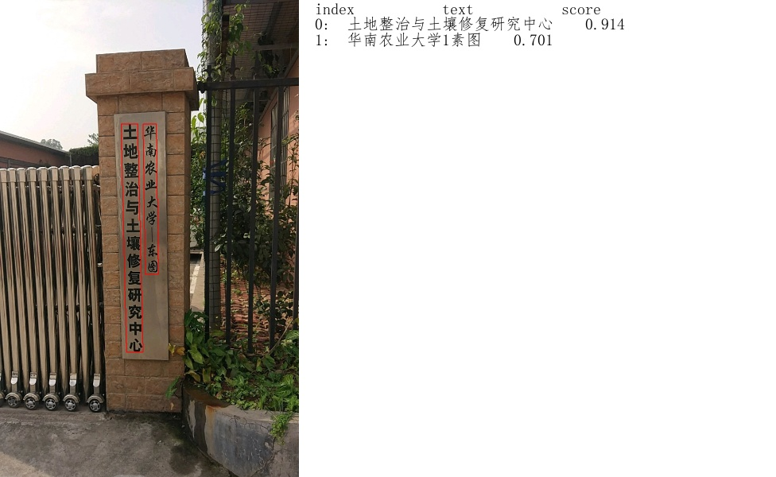

# OCR 

## Get Model
```
sh get_data.sh
```

## RPC Service

### Start Service

```
python -m paddle_serving_server_gpu.serve --model ocr_det_model --port 9292 --gpu_id 0
python -m paddle_serving_server_gpu.serve --model ocr_rec_model --port 9293 --gpu_id 1

```

### Client Prediction

```
python test_ocr_rec_client.py
```

This is the one of picture

<p align = "center">
    <br>

    <br>
<p>
